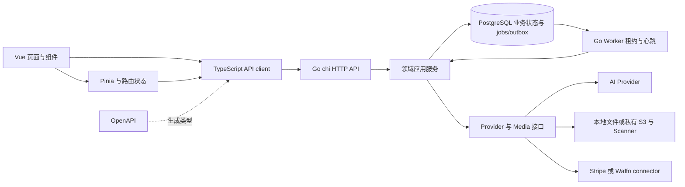

# HCAI-Chat 架构审查与渐进重构

审查日期：2026-09-08。对象是当前工作区，包括审查开始前已有的未提交修改和新增文件，不只是 HEAD。未修改迁移来源项目。

## 2026-09-12 修复进展

已落地：数据库集成测试在显式配置数据库时失败闭合、CORS 预检允许 PUT、请求观测不再在请求路径执行无限历史清理、观测保留清理改为有界批次、Worker 默认使用有界并发、pgcrypto 明确安装到 `public`、生成失败证据的持久化补偿 Job、API/Worker 共享支付装配，以及 Admin 多个目录共享游标分页 composable。前端 lint 警告已清零；审计补偿查询增加了独立索引。相关 Go/前端测试已通过；剩余的 Admin 模板物理拆分和审计链锁竞争仍需负载数据后迭代。

本次完成入口和模块梳理、关键生成/支付/队列/请求路径审查、真实数据库测试，以及一批保持行为的前端重构。不是逐行安全审计，也没有进行生产负载测试。下文区分已复现问题、静态代码发现和待压测的容量风险。

## 按优先级排序的问题

### 1. P1：数据库测试可在实际未执行时呈现全绿

- 证据：[creation 测试辅助函数](../internal/creation/service_test.go)、[jobs 测试辅助函数](../internal/platform/jobs/repository_test.go)、[迁移测试](../internal/platform/database/migrate_test.go)。例如 `creation/service_test.go:665` 开始，连接失败和 Ping 失败都调用 `t.Skipf`，显式设置 `TEST_DATABASE_URL` 也没有切换为失败。
- 实测：默认 `go test -json -count=1 ./...` 中 127 个测试通过、137 个测试跳过，命令仍返回成功。这里统计的是带 Test 字段的事件，不包含没有测试的包。
- 影响：数据库不可用或 CI 配置错误时，支付、授权、队列和迁移的回归可以绕过验收。测试辅助函数在多个包复制，修正跳过策略容易遗漏。
- 建议：统一 `internal/testutil` 的隔离 schema 生命周期；显式要求数据库的任务连接失败应直接失败；CI 必须检查数据库集成测试确实执行。迁移失败时也应通过提前注册的 `t.Cleanup` 回收 schema。
- 状态：已修复；显式配置数据库时连接失败会使测试失败，并新增统一测试辅助与集成测试入口。

### 2. P1：所有异步任务共用串行执行通道

- 证据：`internal/platform/jobs/worker.go:37` 每 750ms 领取一个任务，`:59` 同步执行 handler；`cmd/worker/main.go:89` 起把生成、扫描、验证码、通知、支付事件、退款和数据权利任务注册在同一个 Worker。
- 触发：一个视频或图像生成正在等待上游时，同一 Worker 无法处理后续验证码和支付任务。若只有一个 Worker，长任务直接阻塞其他业务；增加同构 Worker 后，所有槽位仍可能被生成任务占满。
- 影响：跨业务队头阻塞；即使任务很快，单 Worker 领取频率也约为每秒 1.33 个。心跳 goroutine 只负责续租，不提供任务并行。
- 建议：增加有界并发和按任务类别的保留容量，领取 SQL 同时支持允许的 kind；保留 lease token、续租、恢复和幂等约束。用假慢 Provider 验证验证码/支付任务延迟，不应直接启动无界 goroutine。
- 状态：已修复基础调度风险；Worker 使用有界并发，任务租约与恢复约束保留。按任务类别容量隔离仍需基准数据。

### 3. P2：跨域预检未允许 PUT

- 证据：`internal/platform/httputil/middleware.go:46` 的 `Access-Control-Allow-Methods` 没有 PUT；`internal/transport/httpapi/server.go:179`、`:270` 等实际注册了通知偏好、系统设置等 PUT 路由。
- 触发：浏览器从允许的独立 Web origin 直接访问 API 并发送 PUT；预检返回的允许方法不包含 PUT，浏览器阻止实际请求。
- 影响：跨域部署下部分写操作不可用。当前 Vite 同源代理路径通常不会暴露该问题。
- 建议：补齐预检方法，并测试允许/不允许 origin 以及 PUT 预检响应。这属于行为修复，应独立于等价重构提交。
- 状态：已修复并通过 HTTP 层测试；CORS 预检已允许 PUT。

### 4. P2：每个 API 请求同步写观测记录并清理七天前的全部记录

- 证据：`internal/platform/httputil/middleware.go:73` 起在 defer 中同步调用 observer，超时上限 750ms；`internal/observability/repository.go:25` 的同一 SQL 包含 INSERT 和不限批量的 DELETE。
- 影响：连接池和数据库拥堵时，观测操作延长 handler 生命周期；小响应还可能等待 handler 返回才完全发出。高请求量重复执行历史清理，过期数据积压时产生额外锁竞争和写放大。
- 额外盲区：记录的 duration 在 observer 执行前就已计算，不包括这部分耗时。当前已有 occurred_at 索引，问题不是简单的缺索引。
- 建议：把清理移到有批次上限的定时任务；观测使用有界队列和批量写入，明确拥堵时丢弃策略与计数；保留内存指标，并分别观测业务耗时和采集耗时。
- 状态：已修复请求路径上的无限清理；保留清理改为有界批次，队列化采集仍需容量数据。

### 5. P2：生成失败的通知和审计可能永久缺失

- 证据：`internal/creation/service.go:831` 先提交失败状态与余额释放，`:839` 再开证据事务；Begin、审计、通知及 `:856` 的 Commit 错误都没有形成可恢复工作。
- 触发：生成最后一次尝试失败后，第二个事务遇到连接或提交故障。Job 随后进入失败终态，缺失证据没有单独的重试任务。
- 影响：余额可以正确退回，但用户看不到失败通知，审计记录不完整。成功路径的业务结果、通知和 Webhook 在同一事务中，失败路径的可靠性语义与之不同。
- 建议：在业务终态事务中记录轻量 outbox，独立消费并以 generation ID 去重。保留“证据失败不阻止退回余额”的现有意图，用故障注入证明恢复后最终生成一次通知和审计。
- 状态：已修复；失败证据通过补偿 Job 重试，仍需故障注入测试覆盖外部故障窗口。

### 6. P2：空数据库加隔离 search_path 时，迁移的扩展 schema 假设不一致

- 证据：`internal/platform/database/migrations/0001_core.up.sql:1` 使用未限定 schema 的 `CREATE EXTENSION IF NOT EXISTS pgcrypto`；`0014_data_export_binary_artifact.up.sql:17` 调用 `public.digest`。
- 实测：在新 PostgreSQL 17.10 实例上运行隔离 schema 集成测试，pgcrypto 被创建到首个测试 schema，随后迁移报 `function public.digest(bytea, unknown) does not exist`。`IF NOT EXISTS ... WITH SCHEMA public` 也不会移动已存在的扩展。
- 本次验证环境处理：仅在临时数据库执行 `ALTER EXTENSION pgcrypto SET SCHEMA public` 后重跑；未更改用户数据库和迁移文件。
- 建议：明确扩展安装属于数据库 bootstrap 的责任，测试 bootstrap 同样执行并验证 schema；新增空数据库、自定义 search_path、已有扩展三类迁移测试。对已有部署用新增迁移或显式部署步骤修复，不静默重写已应用历史。
- 状态：已修复迁移中的 pgcrypto public schema 假设，并通过数据库集成测试验证。

### 7. P2：模块划分存在，但装配和业务文件过度集中

- 证据：`web/src/pages/AdminPage.vue` 3,474 行，`WorkspacePage.vue` 1,515 行；`internal/payments/workflow.go` 1,978 行，`internal/creation/service.go` 1,636 行，`internal/admin/service.go` 1,126 行。
- 具体重复：`cmd/worker/main.go` 与 `internal/transport/httpapi/server.go` 都装配 Stripe/Waffo HTTP client、runtime catalog 和 ServiceConfig；新增 provider 配置需要同步修改两处。AdminPage 同时拥有多个目录的筛选、分页、加载状态和命令弹窗。
- 影响：装配参数容易漂移；页面和应用服务混合多种变化原因，审查、回归和并行修改成本升高。文件长度本身不证明功能错误，也不能据此断言首屏加载了所有数据，Admin 已按 tab 加载、路由也已懒加载。
- 建议：提取支付 runtime/service 装配工厂；Admin 按业务 tab 拆组件与 composable；服务按命令、查询、结算分文件，保留事务在应用服务层的所有权。避免为每张表增加空泛 Repository 接口。
- 状态：支付 runtime 装配工厂和 Admin 分页/目录组件已分批实施；Admin 内容和媒体目录也已拆出；设置、Provider、治理与支付区域仍可继续物理拆分。

### 8. P2：全局审计链可能成为跨业务写入瓶颈

- 证据：`internal/platform/database/migrations/0025_audit_observability.up.sql:74` 的 trigger 对唯一 `audit_chain_state` 行执行 `FOR UPDATE`，锁持有到调用方事务结束。
- 影响：不同用户、不同业务的审计写入共享同一行锁。当前应用服务直接在业务事务中写审计，后续 SQL 和事务持续时间会放大串行等待。
- 建议：先测锁等待和事务时长，将审计写入尽量放在事务尾部。只有证据证明需要时才讨论分区链/分域链，并为全序与完整性语义记录 ADR，不能随意异步化强审计。
- 状态：保留为待压测容量风险；当前未改变全序和防篡改语义。

### 9. P2：28 处相同查询参数构造重复，且相邻接口有不同语义

- 证据：重构前 `web/src/api/client.ts` 有 28 个完全等价的 `Object.entries(query)` 构造块，只过滤 undefined 和空字符串；另有任务接口过滤 false、产品接口使用 truthy 过滤、搜索接口特定数组与空 q 处理。
- 影响：修复或扩展容易漏改；盲目统一所有查询会改变 `0`、false、空搜索词及字段顺序的行为。
- 已实施：仅把等价的 28 处提取到私有 `queryParameters`，保留路径、类型和 request 层；相较本次修改前净减少 76 行。特殊接口继续使用原逻辑。
- 验证：58 个新增请求契约测试先在旧实现通过，再在新实现通过；不是只测一个未被调用的 helper。

### 10. P3：说明文档与实际业务状态漂移，lint 警告削弱信噪比

- 证据：README 仍描述 Chat 产生文本 Asset、生成使用 Local Test USD；当前 `creation/service.go:932` 明确把 Chat 保存为会话文本，不生成 Asset，提交和结算已接入 points。
- 实测：前端 lint 警告已清零，类型检查和前端测试持续通过；复审后新增目录组件格式也已纳入 lint 修复。
- 影响：新工程师容易按过时文档建立错误预期；海量低风险警告掩盖新增问题。
- 建议：README 的当前行为从运行路径重新整理，规划与已实现状态明确分开；先建立 lint 警告基线并阻止新增，再分目录清理，避免混入行为重构。

## 架构总结

这是模块化单体加独立异步 Worker，不是微服务集合。API 与 Worker 复用 Go 领域包、数据库表和事务约定；新增 Node Waffo connector 是隔离支付 SDK/私钥的外部适配进程。



| 组件 | 职责与边界 |
| --- | --- |
| `cmd/api`、`internal/transport/httpapi` | 配置加载、HTTP 路由、身份/权限、请求解析与错误映射、OpenAPI；Server 同时承担依赖装配 |
| `identity`、`authchallenges`、`emailactions` | 用户、会话、验证码和邮件动作；前端 session store 缓存会话，服务端仍负责授权 |
| `creation`、`assets`、`community`、`discovery` | 生成、归属与版本、发布与互动、公开检索；创建结果和公共发布是不同状态 |
| `billing`、`payments`、`marketplace`、`tasks` | points/内部账本、外部支付、产品许可与权益、需求交付与结算；交易不等同于客户端跳转成功 |
| `admin`、`risk`、`systemsettings` | 运营控制、风险证据、业务能力开关；大量控制通过数据库与事务落地 |
| `developer`、`webhooks`、`notifications` | API key、事件订阅、持久化投递和用户通知 |
| `support`、`datarights` | 支持工单、版权与数据导出/删除生命周期 |
| `platform/database/jobs/media/providers` | pgx 连接池、嵌入 SQL 迁移、持久化任务、媒体存储与上游适配 |
| `web` | Vue 3 + TypeScript + Pinia + vue-i18n，懒加载路由、领域组件与 UI 组件；API 类型由 OpenAPI 生成，调用函数手写 |

模块内的 Service/Repository 往往直接执行 SQL，并通过 `*Tx` 辅助函数共享跨域事务。这是当前实现的真实边界，不是严格的 ORM/Repository/Service 三层。单体事务对生成计费和交易一致性有实际价值，现阶段没有依据要求整体拆成微服务。

### 主要数据流

1. **生成**：页面选择模型、参数与素材 → 带 Cookie 和幂等键调用 API → `SubmitCommand` 校验权限、开关和模型能力、预留 points，在同一事务写 generation、job、command 和审计 → Worker 用 `FOR UPDATE SKIP LOCKED` 领取租约并续租 → 在结果事务外调用 Provider → Chat 保存会话文本；其他模式写媒体后，在结果事务内生成 Asset、扣实际 points、更新状态、写通知和 Webhook → 页面读取状态/结果。数据库状态与媒体对象不在同一事务，代码有失败清理，但这并不意味着跨系统 exactly-once。
2. **上传与发布**：multipart 上传 → 校验字节与格式 → 写媒体和待扫描 Asset、扫描 Job → Worker 扫描 → clean 后才可读/使用 → community 发布形成公开作品/帖子及相关版本和溯源记录。私人库存与公共发现是不同读取模型。
3. **交易**：公开产品/需求 → 登录用户提交带幂等键的 checkout → 数据库先记录 payment intent → 事务外调用支付 runtime 获取 hosted URL → 签名 Webhook 进入持久事件与 Job → Worker 执行业务结算、权益授予或退款。Stripe 由 Go adapter 调用，Waffo 经私有 Node connector；返回 URL 本身不证明付款完成。

值得保留的设计：事务内持久化 Job/outbox、版本化证据、owner 范围查询、租约 token 与恢复、显式 Provider 边界、OpenAPI 类型生成及大量真实数据库测试。

## 重构计划

每阶段独立提交，先定义可观察契约，再调整结构。下面除阶段 1 外都是后续工作，不表示本次已实现。

| 阶段 | 改动 | 验收标准 |
| --- | --- | --- |
| 1，已完成 | 提取 28 处相同查询参数构造，补请求级特征测试 | 同一组 58 测试在前后实现通过；URL、参数顺序/编码、Cookie、响应与错误保持一致；类型检查通过 |
| 2 | 统一测试数据库 bootstrap/cleanup，显式集成模式禁止跳过；补齐 PUT 预检 | 全新数据库和非 public search_path 迁移可验证；故意错误的 DB URL 导致验收失败；跨域 PUT 预检测试通过 |
| 3 | Worker 有界并发与类别隔离；观测清理移出请求路径；失败证据改为补偿 Job | 慢生成不占用全部通知/支付容量；续租/失租/停机恢复测试保持通过；重复处理只结算一次；失败证据最终恢复一次；记录锁等待与 p95/p99 |
| 4 | 支付装配工厂；Admin 按业务 tab 拆分；creation/payments 按查询、命令、结算拆分 | API/Worker 配置矩阵相同；原有 URL、筛选、权限与订单/交付状态测试通过；不引入新的跨域反向依赖 |
| 5 | 根据负载证据优化审计链与搜索；修正文档、逐目录清 lint | 压测提供变化前后延迟/锁等待数据；审计完整性验证不回退；新增 lint 警告为零 |

## 改进后的代码

实际修改见 [API client](../web/src/api/client.ts)，统一逻辑保留为文件私有函数，未增加新依赖和公开抽象：

```ts
function queryParameters(query: Record<string, unknown>): URLSearchParams {
  const params = new URLSearchParams()
  Object.entries(query).forEach(([key, value]) => {
    if (value !== undefined && value !== '') params.set(key, String(value))
  })
  return params
}
```

28 个调用点都调用此函数，保留原来的 response 泛型和 URL 拼接。过滤条件、`String(value)`、遍历顺序和 `URLSearchParams` 编码器均与原实现一致；`listTasks`、`listProducts`、搜索与显式字段分页没有被套用这一规则。已对本次修改前的工作区快照做文本级核对，client 的差异仅为这一提取。

## 测试与验证证据

新增 [query-contract.test.ts](../web/src/api/query-contract.test.ts)，通过公开 `api` 方法 mock fetch 捕获请求，覆盖所有 28 个迁移调用点。测试包含默认 URL、分页游标里的 Unicode/空格/加号/斜线、空值省略、保留零值、不修改被冻结输入、路径 ID 编码、特殊接口语义与结构化错误证据。

| 验证 | 结果 |
| --- | --- |
| 重构前的前端全量基线 | 10 个文件、26 个测试通过 |
| 新增契约测试，旧 client 实现 | 58 个测试通过 |
| 重构后前端全量 | 11 个文件、84 个测试通过 |
| `npm --prefix web run typecheck` | 通过 |
| `npm --prefix web run lint` | 退出码 0；0 错误、0 条警告（2026-09-12 复审后重新验证） |
| 默认数据库环境下 Go 全量 | 命令成功，但 127 通过、137 跳过，不能视为完整验证 |
| 隔离 PostgreSQL 17.10，pgcrypto 位于 public，`go test -json -count=1 ./...` | 268 个测试通过、0 失败、0 跳过，禁用缓存 |
| `go vet ./...` | 通过 |

数据库测试使用临时实例、独立端口 55439 和各测试自己的 schema；实例验证结束后关闭，没有对应用数据库迁移、插入 demo 数据或调用付费 Provider。初次空库扩展失败和修正环境后的测试成功分别作为问题证据与验证结果，不混为一次全绿。

可复跑前端验证：

```sh
npm --prefix web run test
npm --prefix web run typecheck
npm --prefix web run lint
```

Go 集成验证需要专用 PostgreSQL、创建 schema 的权限及 public.pgcrypto，设置 `TEST_DATABASE_URL` 后运行 `go test -json -count=1 ./...`，检查带 Test 字段的 fail/skip 事件，不能只看进程退出码。

本轮未运行浏览器 E2E、生产压测、真实支付或付费 AI 验收。测试为本批重构提供有限且具体的行为等价证据，不能证明所有业务无缺陷。其他已发现问题仍按上述阶段处理。
