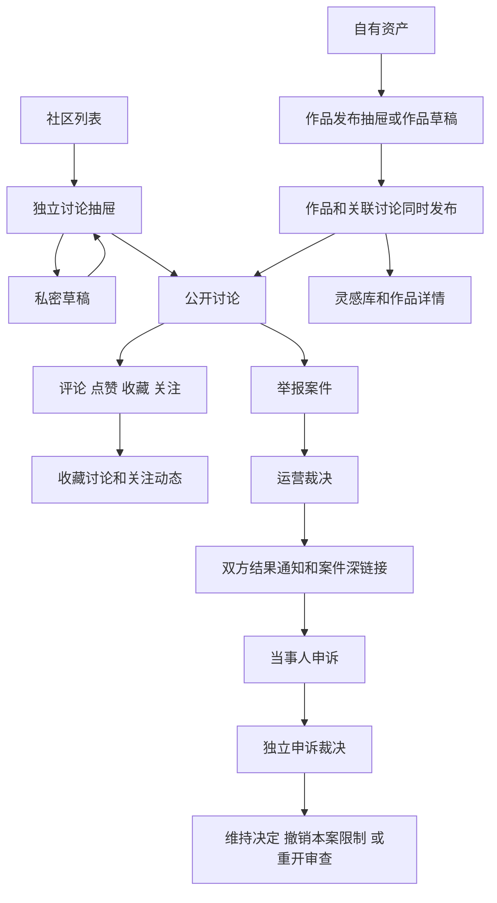
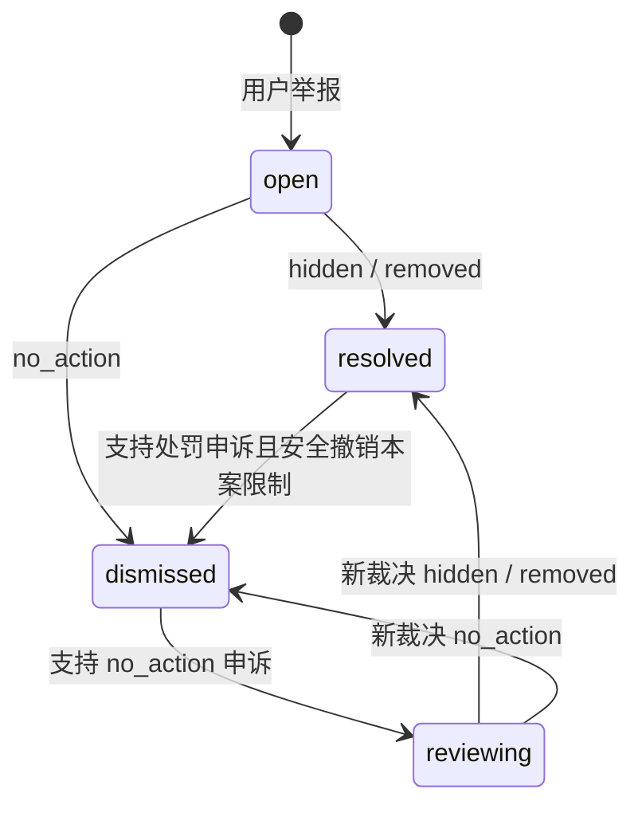

# 社区全链路说明与验收记录

更新日期：2026-09-18。基线：当前工作区代码及迁移 `0073_community_hardening`，包含尚未提交的修改。本文覆盖社区用户流程、作品关联、治理、通知、权限、数据处理及异常分支；不把产品规划或历史 ADR 当作已验证功能。

## 1. 功能边界

社区以 `posts` 为讨论主体，存在两条发布链路：

| 内容 | 创建入口 | 数据关系 | 发布后的入口 |
| --- | --- | --- | --- |
| 独立讨论 | 社区「发布帖子」 | `posts.work_id=NULL`；支持私密草稿、编辑、删除 | 社区列表、讨论详情 |
| 作品关联讨论 | 资产发布抽屉、作品草稿 | 同事务创建或发布 `works` 和 `posts`，作品关联 `assets` | 作品详情、灵感库、社区讨论 |

访客可以浏览公开讨论及评论。写入使用正式登录会话和权限，不使用演示身份切换。独立讨论不要求媒体、提示词或 AI 披露；作品发布要求自有且允许发布的资产、扫描通过及 AI 披露。

发布成功直接进入 `published`，没有预先人工审核的必经流程。社区不处理任务资金、商品付款或私密支持工单。社区版权举报与支持中心版权投诉是两条不同的案件流程。



## 2. 页面与入口

| 路由或入口 | 用途 |
| --- | --- |
| `/community` | 全部讨论，默认最新；搜索、分类、列表/网格切换、加载更多 |
| `?sort=discussed` | 按评论数、点赞数、时间排序，排序在本次分页会话中固定 |
| `?q=:text&category=:code` | 筛选关键词和社区分类，可与视图、排序组合 |
| `?view=mine` | 本人仍然公开可见的讨论，包括关联作品讨论 |
| `?view=saved` | 本人收藏且仍可见的讨论，包含独立帖和作品关联帖 |
| `?view=following` | 本人关注作者的公开讨论 |
| `?view=drafts` | 本人独立讨论草稿，不包含作品草稿 |
| `?edit=:postId` | 恢复本人的独立讨论编辑器；服务端验证归属 |
| `/community/posts/:id` | 完整正文、作者、关联作品、评论、互动和举报 |
| 社区操作 → 我的举报与申诉 | 当前用户作为举报人或作者参与的案件历史 |
| `/community/reports/:reportId` | 精确定位本人相关案件，供通知跳转；第三方不能读取 |
| `/creators/:handle` | 作者主页及关注入口 |
| `/workspace/assets?publish=:assetId` | 资产发布抽屉；作品草稿通过 `draftId` 恢复 |
| `/publish?assetId=:id` | 兼容入口，重定向到资产发布抽屉 |
| `/works/:id`、`/discover` | 作品详情与灵感库 |
| `/workspace/assets?view=saved` | 收藏作品，只展示收藏记录中有关联作品且仍可见的部分 |
| `/notifications` | 评论、关注、治理结果提醒 |
| `/admin?tab=governance` | 举报与申诉队列、筛选、裁决 |
| `/admin?tab=content` | 直接管理作品状态，同时处理关联帖子 |
| `/admin?tab=risk&resourceType=post&resourceId=:id` | 举报产生的风险信号；风险结案不等于内容治理结案 |
| `/support` | 私密支持及版权投诉 |

社区继续复用 `PageHeader`、`UiFilterBar`、`UiFilterSearch`、`UiTabs`、`UiSelect`、`CategoryBrowser`、`UiLayoutSwitcher`、`UiCatalog`、`UiContentCard`、`UiCardContent`、`UiCardTag`、`UiAvatar`、`UiEmptyState`、`UiActionBanner` 和共享抽屉/表单控件。页面自身保留业务布局样式；未修改侧边栏动画。

## 3. 权限及平台开关

| 行为 | 服务端要求 | 资源约束 |
| --- | --- | --- |
| 公开列表、详情、评论 | 无需登录 | 必须满足公共可见性规则 |
| 我的、收藏、关注、草稿视图 | 有效登录 | 绑定当前用户，不能通过参数读取他人私有视图 |
| 创建独立讨论/草稿、编辑与发布讨论 | `community:publish` | 编辑限本人独立帖，要求预期版本 |
| 发布作品、保存/更新/发布/丢弃作品草稿 | `community:publish` | 资产及草稿归属校验；发布额外检查扫描及来源 |
| 读取本人讨论、删除本人独立讨论 | 有效登录 | 删除要求预期版本；撤销发布权限仍允许本人删除 |
| 评论、点赞、收藏、关注 | `community:interact` | 目标可见；不能关注自己 |
| 举报、本人案件、申诉 | `community:report` | 不能举报自己；仅当事人可访问案件或申诉 |
| 后台举报/申诉决定 | `admin:governance` | 原因、明确确认、预期版本 |
| 后台直接内容修改 | `admin:content` | 原因、明确确认、预期版本；不能绕过有效案件限制恢复公开 |

`GET /community/capabilities` 返回 `canPublish/canSaveDraft/canInteract/canReport/publishingEnabled`。界面据此显示发布入口、禁用不可用操作。服务端仍是最终权限边界，能力响应不是授权凭证。

关闭 `publishing_enabled`：新发布和已发布讨论编辑返回 503，私密草稿仍可保存；阅读、评论、收藏、关注、举报继续按各自权限处理。它不是社区总开关。撤销发布权限后，发布和草稿写入均返回 403。

## 4. 浏览与公共可见性

### 4.1 统一规则

公共 SQL 投影 `community_visible_posts` 要求：

1. 帖子为 `published`，且没有作者主动撤回标记 `owner_removed`。
2. 帖子作者为 `active`。
3. 如果有关联作品，作品也必须为 `published`，且关联资产扫描为 `clean`。

列表、详情、评论读取以及评论/点赞/收藏/举报写入共用这一规则；资产页收藏作品也遵循该投影。评论列表和评论计数额外排除非 active 评论作者。

不可见帖子详情返回 404，评论列表为空，新增互动或举报返回 404。管理员在公共接口也没有绕过可见性的特权；后台和本人草稿/编辑读取使用独立授权入口。

### 4.2 搜索、排序与分页

- 关键词覆盖帖子/作品标题、正文、作者显示名和 handle，最长 120 个 Unicode 码点。
- `latest` 按发布时间（草稿用创建时间）和 ID 倒序；`discussed` 先按可见评论数、点赞数，再按时间和 ID。
- 默认每页 20，允许 1–50。结果包含 `items/total/categoryCounts/nextCursor`，总数不是「当前已加载数量」。
- 首屏在 repeatable-read 事务中创建排序快照，固定命中记录和顺序；快照有效期 30 分钟。
- 游标绑定当前用户、视图、搜索、分类和排序；换用户/条件使用旧游标或快照过期返回 422。界面遇到失效的后续页会重新载入首屏。
- 每一页重新检查当前可见性，因此审核下架和作者删除不会因快照继续泄漏。新内容、点赞/评论造成的新排名需要刷新首屏；标题修改后仍可能属于已有快照，这是固定结果集的语义。
- 分类计数与本页总数在同一数据库快照中计算。分类计数覆盖当前搜索和视图，结果总数再应用选中分类。
- 发帖、发布草稿、编辑或删除后重新请求列表，遵循当前筛选条件，不再把新帖直接插入不匹配的列表。

## 5. 发布、草稿与作者维护

### 5.1 独立讨论

1. 登录并打开共享发帖抽屉，加载社区分类和有效能力。
2. 编辑标题、正文和分类。可以保存未完成的私密草稿，也可以校验通过后发布。
3. 保存草稿后进入「草稿」；恢复时读取 owner-only 接口。草稿不进入公开列表、收藏或关注流。
4. 草稿发布后进入「我的讨论」。公开详情中的作者编辑入口继续使用相同抽屉。
5. 修改使用 `expectedVersion`。旧版本返回 409，不覆盖他人的最新状态；公开帖不能退回草稿。
6. 作者删除需要勾选确认并提交当前版本。服务端标记 removed + owner_removed、清空正文、写审计；这属于作者撤回，不是物理删除治理证据。
7. 被治理隐藏/移除的独立帖不能通过普通编辑重新发布，但作者可从本人案件的编辑入口主动删除。作品关联帖通过作品流程管理，独立帖接口拒绝修改其正文/生命周期。

删除后，公共详情和互动不可用，收藏/关注流不再展示；既有通知保留历史记录，其原内容链接可能返回不可见状态。案件记录和审计继续保留，申诉不能撤销作者删除。

### 5.2 作品发布与作品草稿

- 资产必须属于当前用户。购买所得资产及 `task-contract` 合同资产不能作为自有原创再次发布。
- 私密作品草稿允许未完成字段和未通过扫描的资产；正式发布时重新校验字段、扫描 clean、来源及发布开关。
- 发布通过同一事务维护 `works/posts`，成功后跳转作品详情；社区出现作品关联讨论。
- 同一资产已有公开作品时禁止重复发布；作品草稿有唯一性和版本保护。
- 作品正文为空时可以使用摘要作为讨论正文。作品提示词规则仍由作品模块负责，社区不会直接公开私密提示词。
- 发布会产生 `work.published` Webhook 事件，是否实际投递取决于开发者访问及订阅配置；不是向所有关注者群发消息。

### 5.3 统一长度与分类错误

所有社区文本长度以 Unicode 码点计数（Go rune、前端 `Array.from`、PostgreSQL `char_length`）。组合 emoji 可能包含多个码点，不按屏幕显示的一个图形计数。提交前去除边缘空白。

| 字段 | 发布/提交限制 | 草稿限制 |
| --- | --- | --- |
| 标题 | 3–120 | 0–120 |
| 独立讨论正文 | 2–2000 | 0–2000 |
| 作品摘要 | 0–500 | 0–500 |
| 作品关联讨论正文 | 0–2000 | 0–2000 |
| 提示词 | 0–2000 | 0–2000 |
| AI 披露 | 10–500 | 0–500 |
| 评论 | 2–1000 | 浏览器临时保存，不代表已提交 |
| 举报说明、申诉原因 | 10–1000 | 不提供服务端草稿 |
| 后台内容/举报/申诉决定原因 | 10–2000 | 必须明确确认 |

分类来自 `task_types(scope=community)`。指定不存在或跨作用域分类返回 422；省略时取当前默认排序首项；没有可用分类时也返回 422。更新作品草稿时省略分类保留原分类。服务端锁定选中分类直到事务完成，分类管理负责引用迁移。抽屉提供刷新分类操作，保留已写标题及正文供重新选择后提交。

### 5.4 网络重试

独立发帖/创建讨论草稿、发评论要求 `Idempotency-Key`（8–200 字节）。键按用户和操作隔离，请求体摘要包含目标帖子。相同键与相同内容重放返回原资源，不重复创建；同键不同内容返回 409；并发相同请求通过事务锁串行化。

前端复用任务模块的幂等请求工具，只在 sessionStorage 留下不透明键和请求摘要，不保存请求正文；不确定的失败保留键供重试，明确成功或确定失败清理键。编辑/删除使用版本保护；作品发布使用已有事务和资产唯一约束，不能误称所有写操作都有同样的幂等键协议。

## 6. 互动与个人视图

| 操作 | 保存位置 | 返回路径/通知 |
| --- | --- | --- |
| 评论 | `comments`，按时间正序分页 | 新评论追加到详情；通知作者，本人自评不通知自己 |
| 点赞 | `post_reactions(kind=like)` | 更新计数和本人选中状态；无点赞提醒 |
| 收藏 | `post_reactions(kind=bookmark)` | 社区「收藏讨论」；其中作品关联项也进入工作台「收藏作品」 |
| 关注 | `user_follows` | 「关注动态」查看公开讨论；被关注人收到关注提醒 |

点赞/收藏/关注采用 PUT 期望状态，不是不可控 toggle。重复设为相同状态不会重复关系；取消不会删除内容。当前评论为平铺列表，不存在楼中楼、提及提醒、作者评论编辑/删除或关注者新帖群发。

评论临时草稿按用户与帖子保存在 sessionStorage。访客转登录会迁移当前访客草稿；退出/切换账号清除上一用户内容，旧版仅按帖子保存的键也清理。它不跨设备同步；讨论服务端草稿与这种未提交评论不是同一类数据。

## 7. 举报、申诉与运营裁决

### 7.1 用户举报与最小化披露

用户在可见的他人帖子上选择类别并提交 10–1000 码点说明。支持垃圾内容、骚扰、版权、性内容、暴力、误导披露、其他。同一举报人对同一资源存在 open/reviewing 案件时，重复举报返回 409。

举报事务创建案件、治理事件和风险信号。举报不会自动隐藏内容。案件可以由举报人或内容作者读取，但返回的数据按角色裁剪：

- 举报人保留本人提交的身份及说明。
- 内容作者可见类别、案件状态、决定与决定原因；不返回举报人的身份及原始说明（当前兼容字段为零 UUID 和空字符串）。
- 每人只获得本人在当前裁决轮次的申诉，不获得另一方的私有申诉说明。
- 双方独立申诉不会复制案件列表记录；非当事人获取精确案件返回 404。

运营决定原因会向双方展示，运营不得将举报人私有身份或证据直接复制进决定原因。

### 7.2 状态流转



每个裁决轮次，举报人和作者各可提出一次申诉，状态从 pending 变为 upheld 或 denied。新一轮举报裁决推进 decision_version，双方可以就新决定重新申诉。旧轮次申诉不能逆转新轮次决定。

后台举报处理、申诉处理、直接内容状态修改都要求 `reason + confirm=true + expectedVersion`。同事务写入操作者、请求 ID、原因、前后状态及版本审计；治理事件有数据库触发器阻止 UPDATE/DELETE。后台未填原因、未确认或旧版本不会产生部分修改。

### 7.3 恢复规则与冲突

- 每个案件对实际资源建立独立限制记录（hold），记录资源基础状态及应用版本。
- 举报作品关联帖会限制帖子及作品；直接处理作品会联动其关联帖子。
- 多个案件重叠时，removed 优先于 hidden；撤销某个案件只释放它的限制，其他案件继续生效。
- 最后一个限制解除时才考虑恢复基础状态；不能越过作者主动删除、作者停用或资产扫描不安全。
- 期间发生新的直接内容决定或其他资源变更时，版本不匹配返回 409，事务整体回滚；不能根据旧状态自动复活内容。
- 两个当事人对同一处罚先后申诉时，后处理的申诉依据提交时保存的裁决结果，不把先前撤销处罚误当成最初的 no_action。
- no_action 的申诉被支持后，案件重新进入 reviewing，清空终局决定字段，由运营重新决定是否处罚，而不是只修改申诉标签。
- 无版本化限制证据的历史案件不自动恢复，返回 409，需要专门核实；迁移不会伪造历史恢复证据。

**操作边界：**恢复冲突必须由运营查看当前资源状态、后续裁决和审计后处理，不能反复提交同一个旧版本或通过修改数据库绕过保护。支持申诉并不保证内容立即公开，其他有效限制仍可能存在。

## 8. 通知、数据与保留

| 通知类型 | 收件人 | 目标 |
| --- | --- | --- |
| `community.comment` | 帖子作者，排除自评 | `/community/posts/:id` |
| `community.follow` | 被关注者 | 关注者的 `/creators/:handle` |
| `community.moderation` 举报决定 | 举报人与作者 | `/community/reports/:id` |
| `community.moderation` 申诉决定 | 举报人与作者 | 同一案件深链接 |

通知使用共享持久化投递、偏好和来源键防重。社区通知为站内消息；配置 SMTP 不等于这些消息已经发送邮件。通知跳转需通过内部路径白名单，打开链接时再次校验当前登录和资源权限。

| 数据 | 用途与保留边界 |
| --- | --- |
| `posts/works/assets/comments` | 内容、状态、媒体和版本；作者撤回采用受控状态变更 |
| `post_reactions/user_follows` | 收藏、点赞、关注，个人视图复用同一套关系 |
| `content_reports/moderation_appeals` | 案件、裁决轮次、当事人申诉及真实原因 |
| `governance_events/audit_events` | 追加治理和操作证据，不随作者撤回删除 |
| `content_moderation_resources/holds` | 各资源恢复基线、已应用版本和各案独立限制 |
| `community_commands` | 不透明幂等键、请求摘要、原资源 ID，不保存请求原文 |
| `community_feed_snapshots/items` | 分页排序 ID 快照；30 分钟过期，新首屏请求清理过期记录 |
| `risk_signals` | 举报产生的独立风险记录 |
| 通知、投递作业、Webhook 表 | 提醒和作品发布下游集成 |

账户导出包括本人帖子、评论、互动和关注等。账户删除撤销会话，删除点赞/收藏及双向关注，移除通知，清理作品提示词和内容正文，将帖子/作品/评论移除，并设置帖子 owner_removed。新增幂等记录和本人分页快照也清理。治理与合规证据按现有保留策略处理，不承诺所有关联记录物理消失。管理员 suspended 与用户申请数据删除不同；两者的公开内容均不会越过 active 作者检查。

## 9. API 清单

所有路径加 `/api/v1`；以 OpenAPI 为字段类型及响应结构的契约来源。

| 方法及路径 | 主要约束 |
| --- | --- |
| `GET /task-types?scope=community` | 社区分类 |
| `GET /community/capabilities` | 有效权限及发布开关 |
| `GET /community/posts` | q/category/sort/view/limit/cursor；兼容 mine |
| `POST /community/posts` | title/body/category/draft；Idempotency-Key |
| `GET /community/posts/:id` | 公共详情及本人互动状态 |
| `GET /community/posts/:id/owned` | 本人私密草稿/内容读取 |
| `PATCH /community/posts/:id` | 独立帖字段、draft、expectedVersion |
| `DELETE /community/posts/:id` | 请求体 expectedVersion；204 |
| `GET /community/posts/:id/comments` | 默认 20，最多 50，时间正序游标 |
| `POST /community/posts/:id/comments` | body；Idempotency-Key |
| `PUT /community/posts/:id/reactions/:kind` | like/bookmark + active |
| `PUT /community/authors/:id/follow` | active |
| `POST /community/posts/:id/reports` | category/details |
| `GET /community/reports/mine` | 本人相关案件分页 |
| `GET /community/reports/:id` | 本人相关单案及本人当前轮次申诉 |
| `POST /community/reports/:id/appeals` | reason |
| `POST /publications` | 自有资产的作品及关联讨论发布 |
| `GET /content-drafts`、`GET /content-drafts/:id` | 本人作品草稿分页/详情 |
| `POST /content-drafts`、`PATCH /content-drafts/:id` | 作品草稿；更新要求 expectedVersion |
| `DELETE /content-drafts/:id` | expectedVersion |
| `POST /content-drafts/:id/publish` | expectedVersion；重新校验资产和字段 |
| `GET /admin/governance/reports` | q/type/category/status/limit/cursor |
| `POST /admin/governance/reports/:id/resolve` | outcome/reason/confirm/expectedVersion |
| `GET /admin/governance/appeals` | q/type/status/limit/cursor |
| `POST /admin/governance/appeals/:id/resolve` | decision/reason/confirm/expectedVersion |
| `PATCH /admin/content/:workId` | status/reason/confirm/expectedVersion |

错误：401 未登录；403 权限或资源归属不符；404 不存在/不可见/非本人资源；409 版本、状态、重复案件、重复申诉或幂等负载冲突；422 字段、分类、幂等键或游标不合法；503 发布暂停。owner-only 讨论和精确案件使用 404 隐藏第三方资源存在性。

## 10. 原审查 C01–C13 对照

| 编号 | 原问题 | 当前实现与验收证据 |
| --- | --- | --- |
| C01 | 原因/确认/版本/审计不完整 | 三条治理写入口统一控制；`hardening_test.go` 验证缺字段、旧版本、统一审计及治理事件不可变 |
| C02 | 列表/详情/互动可见性不同 | 共用 SQL 投影；覆盖隐藏作品、review/rejected 扫描、作者停用及禁止互动 |
| C03 | 双方申诉相互覆盖、隐私泄漏 | 当前用户和当前轮次申诉投影、作者最小化视图、第三方 404、双方独立申诉 |
| C04 | 旧状态恢复可复活不应公开内容 | 每案限制和资源版本；重叠案件、后续内容决定、作者删除反例 |
| C05 | 发帖/评论重试重复 | 用户/操作/负载绑定幂等键；并发同键返回同资源，不同负载冲突 |
| C06 | 中文/emoji 长度口径不同 | Go/TS/Postgres 统一码点；最大长度及越界 HTTP/单元用例 |
| C07 | 失效分类返回服务器错误 | 分类锁与预校验 → 422；抽屉刷新分类保留文稿 |
| C08 | 收藏讨论及关注无回访入口 | saved/following 视图、全量计数、分页和专属空状态，复用关系表 |
| C09 | 独立帖无作者生命周期 | 私密草稿、恢复、发布、编辑、删除，归属和预期版本保护；空草稿可删除 |
| C10 | 评论草稿跨账号暴露 | 用户+帖子隔离；访客迁移、切换/退出清理、不可用存储降级测试 |
| C11 | 通知不能定位案件、no_action 申诉无后续 | 案件深链接、双方结果通知、no_action 支持申诉后重开 reviewing，新轮次可再申诉 |
| C12 | 热议分页不稳定、统计过时 | 30 分钟排序快照、用户/筛选绑定、事务内计数、写后重载；排名变化无重复漏项 |
| C13 | 发布权限和开关不一致 | publish 权限覆盖独立帖/作品/草稿，能力接口；撤权、暂停发布仍可草稿/互动 HTTP 用例 |

C01–C13 已完成本轮实现和对应验收；具体测试范围见第 11 节。表格不意味着新增楼中楼、群发邮件、自动裁决或生产容量承诺。

## 11. 验证与运行记录

本轮验证使用隔离数据库及确定性测试用户，不向开发库写入示例讨论，不发送真实社区邮件或支付请求。

已通过后端整包回归：

```bash
HCAI_REQUIRE_INTEGRATION_TESTS=1 go test ./internal/community ./internal/admin ./internal/transport/httpapi ./internal/assets ./internal/notifications ./internal/datarights -count=1
```

后端重点用例位于 `internal/community/hardening_test.go` 和 `internal/transport/httpapi/community_hardening_test.go`；既有治理、草稿、分类、收藏、通知及数据权利测试也参与回归。

前端重点用例为 `communityDrafts.test.ts`、`unicodeText.test.ts`、`taskCommands.test.ts`、`messages.test.ts`。浏览器覆盖独立讨论生命周期、收藏与关注、账号切换草稿隔离、举报→裁决→申诉→恢复、案件第二页、移动端溢出和发布入口。

本轮已通过：

- 后端上述 6 个模块整包测试；后续治理通知轮次、评论资源治理及新 HTTP 权限用例的针对性回归也通过。
- 前端全部 **16 个测试文件、101 项单元测试**；ESLint、Vue/TypeScript 检查及生产构建通过。
- 核心浏览器集 **9 项通过**：`community-post-publishing`、`community-governance`、`community-hardening`。
- 关联浏览器集 **7 项通过**：`admin-content-media`、`asset-publish-drawer`、`content-drafts-asset-versions`、`community-hardening`。其中 3 项与核心集重叠，共覆盖 **13 个不同浏览器场景**。
- 最后针对移动端选中标签自动保持可见又运行 `community-hardening`，**3 项通过**。
- 390px 移动端截图检查，修复个人视图标签文字挤压及筛选器宽度问题；桌面讨论详情和移动端个人列表截图保存在本地 `web/test-results/`（后续测试可能覆盖）。
- 本地迁移 0073 已应用，API/Worker 已重启；`/health`、`/ready`、5173 代理的社区能力和列表接口、社区页面均返回 200。开发库社区列表仍为 0 条，未灌入测试数据。
- 文档 23 个本地链接均存在，`git diff --check` 通过。

浏览器命令：

```bash
npm --prefix web run test:e2e -- community-post-publishing.spec.ts community-governance.spec.ts community-hardening.spec.ts --project=chromium
npm --prefix web run test:e2e -- community-hardening.spec.ts admin-content-media.spec.ts asset-publish-drawer.spec.ts content-drafts-asset-versions.spec.ts --project=chromium
```

验证边界：本轮不包含真实 SMTP 社区通知（尚非该模块能力）、外部媒体供应商、生产流量容量或多浏览器兼容性验收。旧案件缺少版本化恢复证据时仍按第 7.3 节拒绝自动恢复；这不是允许绕过保护的遗留入口。

## 12. 源码索引与维护

| 文件 | 职责 |
| --- | --- |
| [CommunityPage.vue](../web/src/pages/CommunityPage.vue) | 列表、个人视图、计数、案件和编辑入口 |
| [CommunityPostPage.vue](../web/src/pages/CommunityPostPage.vue) | 详情、共享安全 Markdown 渲染、互动、临时评论草稿 |
| [CommunityPostDrawer.vue](../web/src/components/domain/CommunityPostDrawer.vue) | 独立帖创建、草稿、恢复、编辑与删除 |
| [AssetPublishDrawer.vue](../web/src/components/domain/AssetPublishDrawer.vue) | 作品及关联帖子发布、作品草稿 |
| [repository.go](../internal/community/repository.go)、[post_lifecycle.go](../internal/community/post_lifecycle.go) | 发布及作者生命周期 |
| [policy.go](../internal/community/policy.go)、[commands.go](../internal/community/commands.go)、[feed.go](../internal/community/feed.go) | 分类/可见性、幂等、快照分页 |
| [interactions.go](../internal/community/interactions.go) | 评论、反应、关注、举报、本人案件及申诉 |
| [governance.go](../internal/admin/governance.go)、[content_policy.go](../internal/admin/content_policy.go) | 运营裁决及限制恢复 |
| [admin/service.go](../internal/admin/service.go) | 直接内容治理入口 |
| [httpapi/community.go](../internal/transport/httpapi/community.go)、[vertical.go](../internal/transport/httpapi/vertical.go) | 权限、能力、请求解析及错误映射 |
| [assets/service.go](../internal/assets/service.go) | 收藏作品公共可见性 |
| [notifications/repository.go](../internal/notifications/repository.go) | 通知持久化与目标白名单 |
| [datarights/service.go](../internal/datarights/service.go) | 账户导出及删除 |
| [0073 迁移](../internal/platform/database/migrations/0073_community_hardening.up.sql) | 版本、投影、幂等、快照、不可变证据和限制表 |
| [openapi.yaml](../internal/transport/httpapi/openapi.yaml) | HTTP 契约，生成 web API 类型 |

相关设计：[ADR 0006](adr/0006-community-governance-lifecycle.md)、[ADR 0010](adr/0010-content-drafts-and-asset-version-families.md)、[内容分类](content-categories.md)。变更状态、权限、通知或恢复规则时，同步更新本文、OpenAPI 和相应反例测试。
