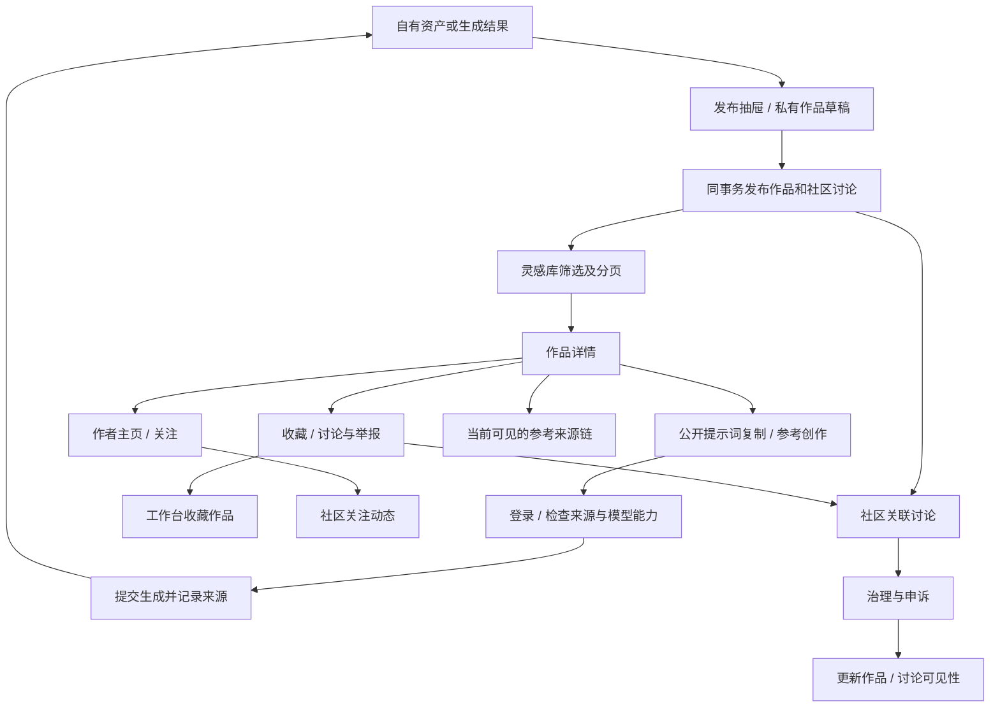

# 灵感库全链路说明与验收记录

更新日期：2026-09-18。基线：当前工作区代码，包含此前社区修复及尚未提交的修改。

本文描述灵感库的实际实现及 I01–I10 修复结果。产品边界、接口、权限和回归证据均以本文件及源码为准；历史视觉方案见 [改版记录](discover-library-redesign.md)。

## 1. 模块定位和产品边界

灵感库是公开作品入口，主体为 `works`，媒体来自 `assets`，讨论和互动复用社区，不建立第二套收藏系统。

| 对象 | 用途 | 与灵感库关系 |
| --- | --- | --- |
| works | 标题、摘要、提示词、披露、发布状态 | 列表、作品详情和创作参考 |
| assets | 媒体、扫描、归属、存储、许可 | 作品预览及生成来源 |
| posts | 讨论、评论、点赞、收藏和举报 | 作品发布同事务生成关联讨论 |
| users / user_follows | 公开身份和关注关系 | 作者主页、社区关注动态 |
| generations | 生成记录、来源和输出资产 | `source_work_id` 记录参考关系 |
| products / licenses / entitlements | 商品和购买许可 | 独立市场流程，不与公开提示词自动互通 |

本轮明确的产品规则：

- 新发布及新保存草稿只支持 **公开／私密提示词**。不提供未实现的部分公开或付费解锁选项。
- 历史 partial/purchased 记录保留并可筛选，但文案明确其历史状态和当前不可展示／解锁；不会投影私密正文。历史 partial 草稿编辑时默认改选私密并提示，用户可明确选择公开后保存。
- 操作统一为 **参考创作**。仅预填公开提示词、记录来源；不自动复制模型、seed、工作流、参数或原媒体，不承诺复刻效果或授予原作使用权。
- 所有 active 用户可通过 handle 访问公开身份页，包括仅发讨论、仅被关注或尚无作品的人；没有公开作品时展示空状态，不因没有商品而返回 404。邮箱、私密资产、账户设置不在此投影内。
- 公开来源链仅包含仍可见的作品。遇到隐藏／移除作品、停用作者或不安全媒体即停止，不跨越隐藏节点查找更早来源，不返回其标题、提示词或媒体。



## 2. 页面、入口和返回路径

| 路径或入口 | 实际行为 |
| --- | --- |
| `/discover` | 访客可访问，最新发布作品 |
| `?q=:text&kind=:kind&promptVisibility=:state` | URL 保存筛选，刷新及返回恢复 |
| 列表／网格 | 页面本地状态，刷新回到默认列表 |
| `/works/:id` | 预览、提示词、作者、授权代码、参考创作、收藏、讨论与举报、来源链 |
| 详情返回灵感库 | sessionStorage 保存列表 URL，恢复筛选；不缓存此前加载的所有页 |
| `/creators/:handle` | 公开身份、关注、作品和商品目录 |
| `?worksPage=:n&productsPage=:n` | 作者目录独立分页；URL 支持刷新及浏览器返回 |
| `/search?q=:text&types=work` | 独立的全站相关性搜索，不决定灵感库排序 |
| `/create/:mode?sourceWorkId=:id` | 图片→image、视频→video、音频→music、文本→chat |
| `/workspace/assets?publish=:assetId` | 自有资产发布或保存草稿 |
| `/workspace/assets?view=saved` | 通过作品页或关联讨论收藏的作品 |
| `/community/posts/:postId` | 评论、点赞、举报和完整讨论 |
| `/community?view=saved`、`?view=following` | 收藏讨论及关注作者的讨论流 |
| `/market/assets/:productId` | 商品和许可购买，不自动从 workId 推断 |
| `/admin?tab=content`、`?tab=media` | 内容治理和媒体扫描管理 |

顶部「开始创作」仍进入图片创作。底部共享横幅提供任务广场、社区和资源市场入口。

## 3. 浏览、筛选、计数和分页

### 3.1 筛选规范

| 参数 | 服务端规则 |
| --- | --- |
| q | trim 后 0–120 个 Unicode 码点；标题、摘要、作者显示名/handle、模型和授权代码的 ILIKE 字面子串搜索 |
| kind | 空或 image/video/audio/document；非法枚举 422 |
| promptVisibility | 空或 public/private/partial/purchased；后两者仅保留历史记录筛选；非法枚举 422 |
| limit | 缺省 12，1–24；显式 0、负数、非整数、超限返回 422 |
| cursor | 服务端生成的不透明版本化游标；非法、旧格式或不同筛选游标返回 400 |

搜索中的 `%`、`_` 和反斜杠按字面匹配，不作为用户提供的 SQL 通配符。前端与服务端按 Unicode 码点校验长度，中文和 emoji 不再使用字节数或 HTML UTF-16 maxlength 限制。

媒体类型在前端定义，不依赖后台 `task_types(scope=community/market)`；新增类型需要同步契约。搜索表单提交写入 URL，下拉选择即提交；桌面大于 1320px 显示共享分类侧栏，较窄视口使用下拉框。

### 3.2 一致性和分页边界

- 固定按 published_at、ID 倒序；没有灵感库相关性排序选项。
- 游标包含版本、发布时间、ID 和规范化筛选范围；相同时间的记录按 ID 继续，不跨筛选复用。
- **不再接受仅时间或旧时间+ID 游标**，因为无法保证筛选绑定和相同时间边界。旧客户端遇到 400 应刷新首屏。
- 每次请求的 items、categoryCounts、total 在同一个只读 REPEATABLE READ 事务内读取。
- categoryCounts 匹配 q 和 promptVisibility，不受 kind 或当前游标影响；total 为当前 kind 在内的全部匹配数量，不是已加载数组长度。
- 页面显示 total，加载更多不会把已加载条数误当成全量；按 ID 去重追加结果。
- 后续页仍读取当时可见数据，整个浏览会话不是持久快照。并发发布内容通常在刷新首屏后出现，下架项在后续请求停止返回。
- 请求版本保护结果及 loading/loadingMore 清理。换筛选重置分页状态，旧请求完成不能覆盖新结果或解除新分页按钮的锁定。
- 首屏失败显示重试；下一页失败保留原结果并在分页处重试。空库与无匹配分别使用共享空状态和开始创作／清除筛选操作。

### 3.3 全站搜索

`/search` 保留独立相关性策略及排名解释；q 需 2–120 个码点，page 为 1–100、limit 为 1–24，非法值返回 422。LIKE 同样转义通配符，精准匹配仍使用原查询文本。作品候选复用 public_works。作者搜索仍以有公开作品／商品的内容创作者为候选；直接作者主页不要求有作品或商品。

## 4. 作品详情、提示词和授权

| 状态 | 详情投影 | 展示与复制 |
| --- | --- | --- |
| public 且非空 | 返回 prompt | 显示、复制；长文本可展开；参考创作可预填 |
| public 且空 | 没有可用内容 | 明确「尚未提供提示词」，不误报私密 |
| private | 不返回 prompt | 明确未公开，没有复制按钮 |
| partial | 不返回 prompt | 历史部分公开记录，当前没有公开片段；不截取私密正文伪造公开内容 |
| purchased | 不返回 prompt | 历史付费记录，明确暂不提供购买或解锁，不展示虚假购买入口 |

列表和作者目录不投影提示词正文。作品发布仅 public/private，数据库保留 legacy 值供已有数据读取。历史草稿在重新保存前可选择公开或私密；不能原样提交不支持的 partial/purchased。

媒体由 AssetMedia 展示：图片、视频、音频、文本；文本按纯文本渲染。卡片与详情的播放控件按用途区分，媒体出错有不可用提示。

授权使用资产 license_code 及共享 licenseLabel，详情披露原始授权代码。此处没有完整的结构化许可条款，也没有 work → 商品的隐式对应。公开展示、复制提示词和参考创作都不等于商业许可；实际许可仍应查看相应商品或权利文件。

## 5. 参考创作 → 生成 → 发布

1. 所有媒体卡片与作品详情都提供「参考创作」，按媒体类型进入创作模式，附上 sourceWorkId。
2. 创作页读取作品详情，加载中或读取失败禁止提交；失败提供重试及「移除来源并继续」。没有成功解析来源时不能悄悄发出无来源生成。
3. 成功后显示来源标签；仅在请求等待期间用户未改写输入时预填公开提示词。私密／历史不可用提示词保持用户输入，不读取私密正文。
4. 监听只依赖 sourceWorkId 和明确重试次数；增加 conversationId 等 URL 参数不会清空来源或再次覆盖输入。
5. 未登录展示共享登录/注册引导，returnTo 保留完整来源 URL。可用模型、供应商、平台生成开关、额度及参数仍由创作模块校验。
6. 新建生成和用户手动重试都用 public_works 复查来源资格。不存在、隐藏、移除、停用作者、不安全媒体来源不能用于新命令。已接受命令的幂等重放不会创建新任务。
7. `source_work_id` 仅保存参考关系，不使供应商自动读取原媒体或私密提示词。参考媒体通过 sourceAssetId/sourceAssetIDs 的独立归属、扫描和权益检查。
8. 成功生成产生本人资产；发布检查 community:publish、发布开关、归属及合法来源、扫描 clean、标题和 AI 披露。作品和社区讨论在同一事务发布。
9. 进入新作品详情，可查看可见的参考来源链；灵感库和社区读取到新内容。不会自动出售、购买、通知原作者或授予原作许可。

## 6. 收藏、讨论、作者与关注

### 6.1 作品互动

作品详情通过 public 可见的关联讨论返回 postId，按当前会话返回 viewerBookmarked；访客不会读到其他人的收藏状态。

`作品详情收藏 → PUT 社区 bookmark → post_reactions → 工作台收藏作品`。

- 访客点击收藏进入登录并保留作品返回地址。
- 登录用户按 community:interact 能力启用操作，服务端再次执行权限、可见性校验。
- 取消收藏、刷新恢复复用现有社区命令，不新增收藏表，不复制资产或生成购买权益。
- 「讨论与举报」直接进入关联讨论，复用评论、点赞、举报、申诉和现有登录返回逻辑。
- 讨论不可见时不返回 postId，也不展示无效互动入口；已收藏但当前不可见的作品不出现在工作台收藏列表。

### 6.2 作者目录

所有 active 用户可访问公开身份页；停用／删除用户 404。本人显示账户入口，访客关注带 returnTo 登录，已登录非本人按 community:interact 启用关注。

- worksPage 和 productsPage 独立，默认 1；limit 默认 12、1–24。
- worksTotal/productsTotal 是全量可见数量，与当前两页和公开身份在同一只读事务读取。
- 页面有上一页／下一页，支持 URL 恢复，超过 24 件不再截断。
- 作品复用 public_works；商品要求 active、资产 clean、许可证 active，目录及计数使用相同条件。
- 关注复用 user_follows 及社区关注动态，不创建灵感库专属关注流。

## 7. 公开可见性、媒体授权和治理

迁移 0074 建立 public_works：**work published + author active + asset clean + 存在的 origin asset clean**。

此规则由灵感库列表、分类计数、详情、作者作品、全站搜索作品、社区关联作品、公共媒体作品分支、新生成及手动重试的来源检查、公开来源链复用。

媒体 `/api/v1/assets/:id/content` 除公共作品分支外，仍保留本人、有效购买权益、符合条件的任务参与人以及站点图标等独立资格。下架一个作品不等于撤销所有合法媒体访问；站点图标是独立的公开配置。资产及来源资产扫描必须 clean。

内容通过存储抽象读取，支持单区间 Range 206，无效区间 416、缺文件 404；使用 private/max-age=60 缓存。因此新请求受最新可见性约束，已下载或缓存的文件不可能被追溯抹除。

社区举报不自动下架，运营裁决和恢复按现有案件与 hold 规则联动作品／帖子。申诉不能越过其他有效限制、后续裁决、作者删除或扫描不通过。后台直接修改仍需原因、确认、预期版本。详见 [社区全链路](community-flows.md)。

## 8. 来源链、事件、通知和数据处理

作品详情通过 `generations.output_asset_id → source_work_id` 递归读取参考作品，按最近来源到更早来源排列。仅返回 id、标题和公开作者信息；不返回来源的提示词、媒体或生成参数。每一层都复查 public_works，遇到不可见节点停止；路径去重防止循环。无可见来源时不提供隐藏内容的提示性信息。

新增 generations 输出资产索引支持来源链查询。这里展示的是参考记录，不是授权证明，也不是反向「所有衍生作品」目录。

| 数据／事件 | 行为 |
| --- | --- |
| works、assets、posts.work_id | 作品、媒体和讨论关联 |
| generations.source_work_id | 参考关系，资产来源和公开可见链路 |
| post_reactions、user_follows | 收藏和关注，沿用社区 |
| work.published webhook | 按开发者配置投递，不是关注者群发 |
| 站内通知 | 关注、评论、治理沿用社区；浏览、复制、收藏、参考创作不新增邮件 |
| SMTP | 发件配置不代表已存在作品订阅邮件 |
| 账户删除 | 数据权利流程撤销会话、清理互动/关注、移除作品与帖子并清理正文，必要合规证据按既有策略保留 |
| 停用账户 | 与删除不同；public_works 立即排除该作者，独立合法媒体访问仍按自身授权规则判断 |

## 9. API 与共享组件

路径统一加 `/api/v1`。

| 方法／路径 | 用途与关键约束 |
| --- | --- |
| GET /works | items/nextCursor/categoryCounts/total；筛选 422，游标 400 |
| GET /works/:id | 公开作品、public prompt、可见 postId、本人收藏、可见 sources；不可见 404 |
| GET /creators/:handle | active 身份，两组独立分页和总数；无效分页 422、非 active 404 |
| GET /search | 公共候选与相关性排序；码点长度和页码校验 |
| GET /assets/:id/content | 公共／授权内容，200/206/403/404/416 |
| GET /creation/capabilities | 当前创作模式、模型和供应商能力 |
| POST /generations；POST /generations/:id/retry | 来源资格、能力和计费校验 |
| GET /generations/:id | 本人生成结果和发布入口 |
| GET /community/capabilities | 发布、互动等权限 |
| POST /publications | 发布资产为作品和讨论，仅 public/private |
| GET/POST /content-drafts；GET/PATCH/DELETE /content-drafts/:id | 本人作品草稿、版本保护和公开/私密设置 |
| POST /content-drafts/:id/publish | 草稿正式发布，复查当前输入和权限 |
| PUT /community/posts/:id/reactions/bookmark | 期望收藏状态，沿用社区可见性与互动权限 |
| GET /assets/saved-works | 本人可见收藏作品，默认 20、1–50，按收藏时间和帖子 ID 分页 |
| PUT /community/authors/:id/follow | 关注期望状态，不能关注本人 |
| 社区举报、申诉和后台治理 API | 沿用社区文档及契约 |

页面继续使用 PageHeader、UiFilterBar、UiFilterSearch、UiSelect、CategoryBrowser、UiLayoutSwitcher、UiCatalog、UiContentCard、UiCardContent、UiCardTag、UiCardActions、UiEmptyState、UiActionBanner、DetailToolbar、AssetMedia、UiCopyButton、UiCollapsible、UiButton。不修改侧边栏动画，不另造筛选／收藏组件。

## 10. I01–I10 修复映射（全部完成）

| 编号 | 修复 | 验收证据 |
| --- | --- | --- |
| I01 | public_works 统一公开资格，保留独立合法媒体访问 | HTTP 测试停用/删除作者、隐藏作品、不安全媒体、直接媒体、社区/收藏，以及本人访问例外 |
| I02 | 来源未解析禁止提交；显式重试/移除；新建和手动重试复查来源；修复 conversationId 更新导致来源重载 | 后端不存在/不可见来源测试；浏览器失败、重试、等待期间改写、完整生成来源断言 |
| I03 | 新写入仅 public/private；保留历史状态并明确不支持；公开为空不误报私密 | HTTP 非公开提示词不泄漏、拒绝 unsupported 发布/草稿；浏览器四种状态与复制按钮 |
| I04 | 安全 postId/viewerBookmarked 投影，收藏和讨论与举报入口 | HTTP 收藏身份隔离与不可见过滤；浏览器登录返回、收藏/取消、刷新和讨论入口 |
| I05 | total 全量数量；items/counts/total 同一只读快照 | 多页总数断言、并发上下架一致性测试、浏览器总数不随已加载长度变化 |
| I06 | 版本化游标绑定筛选，拒绝旧游标；分页请求版本保护清理状态 | 同时间分页无重复/漏项、跨筛选拒绝；浏览器旧分页完成不能解除新分页锁定 |
| I07 | Unicode 码点、枚举/数字校验、字面搜索和错误契约 | 中文/emoji 120/121 边界、非法枚举/limit/page、百分号/下划线字面搜索 |
| I08 | active 身份页不依赖作品数量；作品/商品独立分页、全量数和许可一致性；关注能力禁用 | 空作品作者、27 件作品/26 商品全量遍历、退休许可过滤；浏览器页码和刷新恢复 |
| I09 | 所有媒体统一参考创作及模式映射；说明预填/媒体/授权边界，沿用模型能力禁用 | 四媒体入口浏览器断言、无公开提示词说明、现有创作能力与真实本地生成回归 |
| I10 | 可见参考链、隐藏节点截断、循环保护、公开身份投影与索引 | 多层/循环/隐藏/移除/停用/扫描测试；生成再发布后显示原作链接 |

修复范围采用第 1 节明确的支持边界，没有新建付费提示词产品，也没有反向衍生目录。若后续要支持这两类产品，应新增数据、授权和商业契约，不能复用历史标签当作已实现。

## 11. 验证记录

本轮测试使用隔离数据库及本地测试供应商；没有向开发库添加演示账户，没有调用外部付费模型，没有发送真实邮件或支付。

```bash
HCAI_REQUIRE_INTEGRATION_TESTS=1 go test ./internal/discovery ./internal/transport/httpapi ./internal/community ./internal/creation ./internal/assets -run 'Test(Inspiration|Rollout|Discover|Discovery|SavedWorks|PersistedContentDraft|CommunityPostDetail|AllLocalCreation)' -count=1
npm --prefix web run test:e2e -- inspiration-hardening.spec.ts discover-library.spec.ts discovery-creator.spec.ts remix-publish.spec.ts content-details.spec.ts asset-publish-drawer.spec.ts content-drafts-asset-versions.spec.ts --project=chromium
go build ./cmd/api ./cmd/worker ./cmd/migrate
npm --prefix web run build
npm --prefix web run test
npm --prefix web run lint
git diff --check
```

最终验证结果：

- 新增 5 项 Inspiration HTTP 集成测试通过，覆盖公开边界、交互隔离、来源、Unicode、分页、并发计数和循环链。
- 上述后端针对性命令通过；另运行 discovery/community/creation/assets 四个包的完整测试，全部通过。
- Chromium **21 项浏览器回归通过**，包括发布抽屉与选项、资产版本/草稿恢复、手机详情与复制、筛选恢复、作者关注与响应式布局、收藏/登录返回、失败来源/重试/用户改写、四种提示词状态、四媒体参考入口、旧分页竞态、作者分页以及本地生成再发布来源链。
- 前端 **16 个测试文件、102 项单元测试通过**；Go 构建、前端生产构建、类型检查、lint、git diff --check 通过。作品详情截图已人工检查。
- 最后补充的搜索非法页码在实际开发服务用无登录浏览器检查：page=0/page=invalid 均返回 422 并显示错误，不静默回到第一页。
- 本地开发库应用 0074，API/worker 已重启；8080 健康检查正常，5173 代理返回含 total 的作品接口，空库页面正常。开发库 fixture 账户数量为 0。

测试仅向隔离库写入测试内容；部分浏览器异常场景使用网络拦截。测试范围不等于全仓或真实外部供应商验收；生产压力、第三方付费供应商、未来的提示词商业化不在此修复内。

## 12. 源码与关联文档

| 文件 | 主要内容 |
| --- | --- |
| [0074 迁移](../internal/platform/database/migrations/0074_public_work_visibility.up.sql) | 公共作品规则、社区复用、来源索引 |
| [发现仓储](../internal/discovery/repository.go) | 列表/计数事务、详情/互动/来源、作者分页、搜索 |
| [筛选和游标](../internal/discovery/filters.go) | 字面搜索、Unicode、枚举、游标范围 |
| [HTTP](../internal/transport/httpapi/vertical.go) | 参数解析、错误、会话投影 |
| [创作服务](../internal/creation/service.go) | 提交及重试来源资格 |
| [资产服务](../internal/assets/service.go) | 公共媒体和收藏 |
| [社区仓储](../internal/community/repository.go) | 发布/草稿支持范围及原子发布 |
| [灵感库](../web/src/pages/DiscoverPage.vue) | 数量、分页竞态、四媒体动作 |
| [作品详情](../web/src/pages/WorkPage.vue) | 提示词状态、收藏、讨论及参考链 |
| [作者主页](../web/src/pages/CreatorPage.vue) | 分页、总数和关注能力 |
| [创作工作台](../web/src/components/create/MultimodalCreationStudio.vue) | 来源加载、阻止提交、重试/移除及监听 |
| [发布抽屉](../web/src/components/domain/AssetPublishDrawer.vue) | 提示词选项和历史草稿提示 |
| [OpenAPI](../internal/transport/httpapi/openapi.yaml) | 请求和响应契约 |
| [后端新增回归](../internal/transport/httpapi/inspiration_hardening_test.go) | I01–I10 边界验证 |
| [浏览器新增回归](../web/e2e/inspiration-hardening.spec.ts) | 互动、来源、竞态和分页 |
| [真实本地生成闭环](../web/e2e/remix-publish.spec.ts) | 参考作品→生成→发布→来源展示→社区 |

关联：[社区全链路](community-flows.md)、[任务广场全链路](task-marketplace-flows.md)、[发现排序 ADR 0015](adr/0015-evaluated-discovery-candidates-and-staged-rollout.md)。
