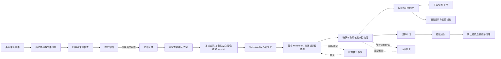

# 资源市场全部链路交接文档

> 快速交接入口：[资源市场全链路地图](resource-marketplace-flow-map.md)。先看链路地图，再按需要进入本页和专题文档。

> 当前业务与验收状态统一以[资源市场完整链路](resource-marketplace-complete-flow.md)为准。源码已包含 0166 银行执行／通知、0167 银行任务受控恢复、0168 来源／自动结算停止保护及 0169 执行锁与续租分离；0166 支付全包已通过，但不覆盖这些后续增量。当前源码测试与待办见统一文档第 11–12 节。本页保留分阶段规则，旧的“未接通／尚未实现”和测试结果仅适用于对应历史版本。

更新时间：2026-09-23

**最新复核（2026-09-23）：** 当前工作区重新执行的
`TEST_DATABASE_URL=... HCAI_REQUIRE_INTEGRATION_TESTS=1 go test -race ./internal/payments -count=1 -timeout 25m`
本轮之后一次当前工作树的 `go test -race ./internal/payments -count=1 -timeout 25m` 在 `TestRecoveredPaidCheckoutCrossSourceAgreement/true` 的 `paymentTestPool` 迁移等待处触发 25 分钟上限，1500.057 秒后以退出码 1 结束；未取得支付包全量通过结果。较早的 `TestProductRefundCheckAuthenticatedHTTP` 超时及退款子集通过仍是各自执行的历史证据，不覆盖本轮全包终态，也不据此确定死锁根因。本文中 0172 的 `595 个主测试／2084 项结果` 是历史冻结源码快照，不能替代当前工作树复核。定向 HTTP、清理恢复和争议保护测试仍按各自命令记录；真实 Provider、银行、对象存储、扫描器、SMTP、多实例 worker 和生产验收仍待完成。详细范围见[审查记录 11.218](resource-marketplace-flows.md#11218-目标1源码基线与文档状态复核)。

**目标 1 状态补充（2026-09-23）：** 本轮 payments Race 全包 `go test -race ./internal/payments -count=1 -timeout 25m` 已终止，退出码 1，耗时 1500.057 秒；Go 测试超时栈停在 `TestRecoveredPaidCheckoutCrossSourceAgreement/true` 的 `paymentTestPool` 迁移等待。该结果不是通过，也没有单凭栈把原因定性为业务死锁。全仓 `go test ./... -count=1` 本轮未重跑，2026-09-23 既有失败记录仍是多个包超时并含断言失败。当前分层证据见[统一基线和证据矩阵](resource-marketplace-complete-flow.md#01-目标-1-当前基线拒付来源撤回与验证边界2026-09-23)及[审查记录 11.218](resource-marketplace-flows.md#11218-目标1源码基线与文档状态复核)。0175–0177 的迁移、管理服务和管理 HTTP 已存在；旧文“尚无 API”仅代表对应历史阶段。部署和真实 Provider 结论均未由隔离测试推断。

## 当前复核摘要（2026-09-23）

这份文档是资源市场的全链路交接入口。阅读时把能力分成四种状态：

| 状态 | 含义 |
| --- | --- |
| 源码已接线 | 当前工作区有路由、服务或 worker 入口；不表示运行环境已升级 |
| 隔离验证通过 | 使用隔离数据库、模拟 Provider 或模拟 API 的专项测试通过；不表示真实通道可用 |
| 待部署 | 迁移、API、worker、前端或告警脚本尚未在运行环境协调升级 |
| 待真实验收 | 仍需真实 Stripe/Waffo、对象存储、扫描、SMTP、多实例、容量或银行联合验证 |

### 全链路状态矩阵

| 业务链路 | 当前交接结果 | 不能据此推断 |
| --- | --- | --- |
| 卖家准备来源资产、创建商品、提交审核、上架/暂停 | 草稿、文件成员、样片、价格、许可、版本审核和公开资格已有服务入口 | 草稿保存或审核通过不等于商品已完成真实媒体验收 |
| 买家发现、详情、许可确认、登录返回 | 公共目录、详情、作者目录、搜索和登录返回使用同一商品资格边界 | 页面可见不等于原件可读；登录返回不等于已购买 |
| Checkout、支付证据、订单、履约 | 原订单、报价快照、支付意图、回调/查询证据、独立交付副本和权益有持久边界 | Checkout URL、浏览器回跳、Webhook 入队或通知送达不等于收款确认 |
| 已购内容、单文件/ZIP 下载、许可内参考创作 | 已购权益、交付副本、扫描和每次读取授权分开校验 | 知道资产 ID 或拥有公开样片不等于拥有交付权限 |
| 退款、补偿退款、撤权和清理 | 原通道退款、未知结果核对、重复/迟到回执及交付失败分支已有专项代码 | 退款申请、工单关闭或本地状态变化不等于 Provider 已退款 |
| 销售、自动结算、卖家提现、银行结果 | 资金分账户、预留、财务复核、来源划转、银行命令、结果投影、通知和导出已有源码及专项验证 | 成交、结算投影、来源成功或本地 `paid` 不等于卖家银行到账 |
| Stripe 拒付 | 0173/0174 有事件证据绑定、稳定排序与结算保护源码；0175–0177 迁移、拒付管理服务、`admin:finance` 保护的目录/详情/操作 HTTP handler 和三条路由已存在；本轮 admin 与 payments 拒付定向测试通过 | 拒付运营 OpenAPI 与 web client/page 入口缺失；未部署。举证与裁决后的完整账本/追偿、渠道费用、退款撤权协同、并发专项及真实 Stripe 验收仍未完成 |
| 支持、通知、导出、注销和留存 | 关联入口、本人数据边界、必要财务/交付留存及部分导出已有规则 | 通知、支持工单或注销请求不能改变付款、权益和未决资金结果 |
| 发布与生产验收 | 文档、迁移和隔离回归记录齐全 | 运行数据库、真实 Provider、SMTP、存储、扫描、多实例、容量和回滚尚未由本文件宣称完成 |

### 本轮争议保护复核（2026-09-23）

本轮重新检查了 0173 的状态转换边界并修正了一个资金保护缺口：已经绑定的拒付记录在后续事件暂时无法匹配时继续使用数据库中的绑定和当前状态，不会因为新事件进入 `requires_review` 而解除原有保护；绑定的 `requires_review` 仍会保持 `dispute_hold` 或 `recovery_required`。0174 增加 `latest_event_id`，按发生时间和 Provider 事件 UUID 稳定处理乱序事件；重复 Provider 事件完整 no-op，迟到事件写入 `applied=false` 证据且不覆盖当前投影。`won` 只有在没有其他未解决拒付时才可能释放未出款结算，且不会重新打开已经进入追偿的结算。数据库转账触发器和开放拒付索引均按 `action_status <> 'won'` 判断未解决状态。

`0175_product_dispute_operations`、0176 理由约束和 0177 证据引用约束当前均有迁移文件；管理服务和 `GET /admin/product-disputes`、`GET /admin/product-disputes/{disputeID}`、`POST /admin/product-disputes/{disputeID}/operations` 路由已接线并要求 `admin:finance`。拒付运营的定向领域测试已通过，空 schema 迁移测试也通过。当前 `openapi.yaml` 不含这三条商品拒付管理 API，`web/src/api/client.ts`、路由及页面中也没有拒付运营入口；本次未执行专门的拒付 HTTP 权限／并发回归，也未在运行数据库部署。不得把代码存在或隔离迁移验证描述成生产可用。

本轮已通过：拒付状态转换与稳定排序专项、`go test ./internal/payments -run '^$' -count=0`、`go test ./internal/platform/database -run TestMigrateEmptySchema -count=1`、`go vet ./internal/payments` 和 `git diff --check`。当前 `go test ./internal/payments -count=1 -timeout 5m` 未通过：5 分钟内出现既有资金夹具 SQL 语法错误、导出断言差异和长时间 Checkout 检查超时；这不构成拒付专项失败，也不能视为当前支付全包通过。没有执行真实 Stripe、生产迁移或外部资金操作。举证材料、运营裁决、胜诉/败诉账本、渠道费用、退款/撤权协同、并发专项和真实 Stripe 联合验收仍是开放项。

### 一笔交易必须贯穿的标识

排查或验收时至少同时记录 `productId`、商品内容版本、`offerVersion`、`orderId`、`paymentId`、Provider payment/charge ID、交付资产 ID、作业 ID 和审计事件 ID。任何一步只凭页面文案、客户端参数、通知或队列状态判断成功，都不能作为资金、权益或交付完成证据。

拒付例外：Stripe dispute 通常不携带本地 `hcai_payment_id`。必须先用 Provider、live mode、PaymentIntent、Charge、金额和币种严格寻找唯一商品付款；无法唯一绑定时只保存 Provider 证据并进入 `requires_review`，不得冻结错误交易、授予权益或改写账本。

0164 当前增量：资金已按原通道、商户、店铺、端点、环境与币种分账户；资金 API 和申请页同步，不再提供跨账户总金额。未知证据保留待核对且暂停新资金执行，详见[完整链路 7.9](resource-marketplace-complete-flow.md#79-按原支付身份隔离资金0164)及[审查 11.199](resource-marketplace-flows.md#11199-卖家资金账户隔离与页面接线0164)。0166–0172 又补齐银行命令执行／只读恢复、来源返还财务 API／共享页面与账本收尾、卖家安全状态、站内通知、白名单导出和监控；部分或矛盾证据裁决、外部银行对账及真实通道验收仍未闭环。

最新交付入口：[资源市场完整链路](resource-marketplace-complete-flow.md)。2026-09-22 交付复核发现的支付测试编译阻塞已修复；随后补齐提现创建资格复核、两笔等额结算分页与选择、并发回滚验证，见[审查记录 11.190](resource-marketplace-flows.md#11190-提现创建资格复核与等额结算验证)。11.190 的完整支付包在当时达到 15 分钟总时限。当前 0164 资金扩大回归已通过（122 个主测试／306 项结果），该基线完整支付包随后在旧迁移回填测试失败，修复前终态见 11.200，迁移夹具修复及新全包状态见 11.201；生产联合验收、外部银行对账和真实到账证明仍未闭环。本文所列此前专项通过记录只对应其记录版本。

后续 0160 已接入独立财务决定和未派发申请的驳回释放，运营页面 `/admin/payouts/:id?` 已提供分页、复核确认与安全重试，详见[完整链路 7.5](resource-marketplace-complete-flow.md#75-财务复核与未派发驳回0160)。0161 的卖家对外说明、本人申请详情和站内通知已接线，详见[完整链路 7.6](resource-marketplace-complete-flow.md#76-卖家复核结果与站内通知0161)；0162 来源准入已有财务 HTTP／页面显式确认入口，0166–0172 的银行操作、来源返还、投影、通知、导出和告警已有源码及隔离专项。批准、来源划转、银行操作和来源返还仍分别受当前资格与证据约束，均不等于银行到账；真实联合验收待完成。最新说明、通知隐私及资金导出专项验证见[11.193](resource-marketplace-flows.md#11193-卖家复核说明与通知隐私隔离)和[11.194](resource-marketplace-flows.md#11194-卖家资金与提现数据导出)，不等于当前支付全包或生产验收通过。
适用范围：当前工作区源码、迁移文件和隔离测试记录。本文不代表运行环境已经升级，也不代表真实支付、存储、扫描或生产容量验收已经完成。

2026-09-23 的全仓 `go test ./... -count=1` 未通过：多个隔离 PostgreSQL 包在 10 分钟测试超时，另有数据权利导出、财务权限 gate、媒体告警、任务支付和 HTTP 合同断言失败。该结果与 0172 固定源码支付包的 595／2084 冻结回归分开记录，不能将支付包通过扩展为全仓通过。

本次交付包含卖家资金定向集成回归、Stripe 银行出款适配器与只读核对的模拟 HTTP Race 回归，以及支付包长回归记录，但未执行真实交易、生产迁移或外部支付验收。0151–0172 的账本、模式、分配释放、来源划转、银行命令、来源返还和证据保护已有定向隔离验证。公开申请仍先停留在待审和预留；银行／返还 worker、结果投影、通知、导出和告警已注册或接线，但不等于银行到账、生产对账或部署完成。

文档维护规则：本页集中说明当前链路与限制，业务交接文档按角色展开，审查记录保留各阶段证据。历史章节中的“本次”“尚未实现”以该章节记录的阶段为准；判断当前能力时应同时核对本页及对应源码。本次复核修正了业务文档中的资金账本章节引用，以及 Waffo 查询恢复和结算概述的旧表述。

本文是资源市场的单页交接入口，回答四个问题：用户和运营从哪里进入、每一步写入哪些业务证据、异常如何停留和恢复、哪些能力仍不能对外承诺。详细历史记录见[资源市场全链路说明与审查记录](resource-marketplace-flows.md)，业务阅读版本见[资源市场业务与交接](resource-marketplace-journeys.md)，技术基线见[当前基线](resource-marketplace-current-flow.md)，迁移关系见[MIGRATION_MATRIX.md](MIGRATION_MATRIX.md)。

简明阅读入口：[资源市场完整链路](resource-marketplace-complete-flow.md)。该文档按角色和用户实际操作重新排序，适合交接、验收和新成员快速了解当前边界；本页保留详细规则、历史证据和源码索引。

最新同步：0159 新增本人提现申请的银行归属核验、不可变目标绑定及来源一致性保护，见 [4.8](#48-提现申请的银行目标绑定0159)；0158 的读取期限和告警记录仍见[11.186](resource-marketplace-flows.md#11186-来源读取绝对截止时间与缺口告警)。银行绑定、来源核对都不等于银行出款；生产数据库和运行服务尚未升级。

当前工作区还包含目录与指定结算申请增量，见 [4.9](#49-提现目录与显式结算申请开发中)。后端契约及定向回归记录于[11.188](resource-marketplace-flows.md#11188-提现目录契约与文档交付核对)；`/workspace/payouts` 已接入申请、银行选择和取消，见[11.189](resource-marketplace-flows.md#11189-卖家提现申请页面与会话内重试)。独立审批已接线，审批后的准入与独立操作入口已通过隔离专项，真实联合验收待完成，完整银行出款仍未接通。

阅读顺序：[角色与入口](#2-业务边界和角色) → [交易主流程](#3-端到端主链路) → [销售与结算](#4-卖家销售与结算) → [异常恢复](#5-异常和运营恢复) → [跨模块交接](#61-跨模块交接) → [验收与发布](#7-验收部署和回滚)。本文整理现有实现；测试结果按各次审查记录分别列出，不能将定向选择集通过理解为全包或真实环境验收通过。

## 1. 当前结论

资源市场的买家购买、卖家发布审核、独立交付、订单查询、退款和交付修复已经有源码入口及隔离测试。卖家销售页已经可以读取逐笔成交和结算投影；0143–0149 为结算快照、一次性派发、转账核对、订单／支付绑定、收款开户命令恢复、新收款目标身份绑定及任务付款身份快照提供了保护，相关定向 Race、领域、HTTP 和模拟 UI 选择集已通过。计费 Checkout 的原请求／商户快照、发送前派发登记、Waffo 未知结果拒绝重发和套餐编辑版本锁也已在当前源码中复核，证据见[11.163](resource-marketplace-flows.md#11163-当前计费派发与套餐并发复核)。本轮最新连接器测试为 38 项通过，支付侧 Waffo／商品 Checkout 定向选择集已通过，查询恢复的数据库迁移隔离测试和支付选择集也已通过，详见[11.179](resource-marketplace-flows.md#11179-waffo-商品-checkout-查询证据接线与定向回归)。

以下内容仍不能标记为生产完成：

- 历史收款目标的原商户／环境核对；开户命令已经有有限窗口的持久恢复，但超出窗口或历史身份不明的记录仍需人工核对；0149 只为迁移后新建任务付款写入不可变身份快照，迁移前任务付款仍需人工核对；
- 卖家提现的部分或矛盾证据裁决、外部银行对账、转账撤回后的复杂运营处置和自动追偿；财务 API／共享页面、独立卖家资金账本、追偿冻结、模式分支、分配释放、并发互斥、银行命令／只读恢复、来源返还收尾、卖家安全投影、通知、导出和监控已有源码，但这些能力仍需真实通道和完整财务流程验收；
- Waffo 查询恢复仍未完成生产验收：0150 已将已付款查询证据、无 URL 的商品 Checkout、证据视图、冲突视图、候选和派发约束接入 `waffo_pancake`，并通过隔离迁移与定向支付回归。仍需真实商户凭据、GraphQL schema、查询授权、金额／时间语义、多实例重启和端到端资金验收；未配置真实查询时仍 fail-closed；
- 历史交付证据恢复、未知对象盘点、备份与长期留存策略；
- 真实 Stripe/Waffo、SMTP、对象存储、媒体扫描、多实例和容量联合验收；
- 运行数据库迁移、API/worker 协调发布、告警接收和回滚演练。

“页面显示成功”“Checkout URL 已生成”“通知已发送”或“worker 已入队”都不是付款、交付或卖家到账的独立证明。

### 1.1 按链路查阅

| 要了解的链路 | 阅读位置 | 终点与异常出口 |
| --- | --- | --- |
| 准备原件、发布、审核、上架与暂停 | [3.1](#31-发布商品) | 当前版本批准且满足公开资格；驳回后修改重提 |
| 搜索、分类、排序、分页与详情 | [3.2](#32-发现详情和许可) | 查看商品、样片及许可；区分无结果与加载失败 |
| 登录、许可确认、下单与外部支付 | [3.3](#33-创建-checkout)、[3.4](#34-收款履约和交付) | 原订单获得可信付款证据；未知结果进入核对 |
| 订单、已购内容、下载与创作复用 | [3.5](#35-买家订单已购内容和下载) | 本人有效权益下读取冻结内容；每次访问重新鉴权 |
| 关闭未付款订单、退款与售后 | [3.6](#36-退款和售后) | 确认退款后撤权；未知资金结果继续保留证据 |
| 卖家销售、收款账户与结算 | [第 4 节](#4-卖家销售与结算) | 成交与转账分开记录；提现及追偿仍未闭环 |
| 财务核对、交付修复与异常恢复 | [第 5 节](#5-异常和运营恢复) | 保留失败记录并复核实际资金或文件结果 |
| 数据状态、异步任务与其他模块 | [第 6 节](#6-数据对象和异步任务)、[6.1](#61-跨模块交接) | 通知、支持、导出及注销不改变原交易权限边界 |
| 测试、上线与待完成事项 | [第 7 节](#7-验收部署和回滚)、[7.5](#75-待闭环事项与交接要求) | 区分源码实现、隔离验证和真实环境验收 |

此前核对涵盖 Waffo 查询恢复的连接器、worker、证据消费和迁移约束；0150 已在工作区接入，隔离迁移测试、Waffo／商品 Checkout 定向选择集和 `go vet` 的历史通过记录见 [7.0.1](#701-waffo-商品-checkout-查询恢复边界) 及[11.179](resource-marketplace-flows.md#11179-waffo-商品-checkout-查询证据接线与定向回归)。早期核对保留在[11.176](resource-marketplace-flows.md#11176-文档交付时的-waffo-查询恢复链路核对)至[11.178](resource-marketplace-flows.md#11178-资源市场全链路文档与当前源码同步)。本次重新核对前端入口、HTTP 注册、发布操作及当前卖家资金实现，未重跑上述测试。

### 1.2 三条业务旅程

| 旅程 | 完整操作顺序 | 完成判定 |
| --- | --- | --- |
| 买家 | 找资源 → 查看详情、样片和许可 → 登录 → 确认当前报价与许可 → 外部付款 → 返回原订单 → 等待服务端确认 → 已购内容 → 下载或许可内复用 → 必要时申请退款／支持 | 付款、订单、权益和交付一致；售后另以原通道退款证据判定 |
| 卖家 | 准备自有来源资产与样片 → 创建商品草稿 → 配置文件、价格和许可 → 提交审核 → 按驳回原因修改重提 → 上架 → 查看销售 → 查看逐笔结算 → 创建提现申请并绑定银行 → 查看复核、银行结果和来源返还状态 → 必要时暂停或编辑重审 | 商品可售、站内资金状态、银行结果和实际到账分别判断；部分返还、矛盾证据和外部对账进入财务核对 |
| 运营 | 查看当前待审版本 → 核验来源／文件／许可 → 批准或驳回 → 跟进交易异常 → 核对原通道资金证据 → 修复交付或处理退款 → 检查撤权、追偿与留存 | 审核决定、资金结果、文件结果和审计可关联；任务入队不等于处理完成 |

资源市场不承担委托任务的接单／验收，也不直接执行购买的工作流。与任务广场、社区、灵感库的关系见 [6.1](#61-跨模块交接)。

## 2. 业务边界和角色

资源市场销售带许可的数字商品，当前目录支持提示词、工作流、素材和作品授权等商品类型，价格和结算币种以当前实现支持的 USD 为准。社区帖子、灵感库作品和委托任务是不同业务对象；公开作品不会自动变成可购买商品，购买商品也不会自动授予其他业务对象的权限。

| 角色 | 主要入口 | 可以完成的事情 | 明确不能推断的事情 |
| --- | --- | --- | --- |
| 访客 | `/market`、商品详情 | 浏览公开商品、筛选、查看样片和许可摘要 | 不能读取私密原件、订单或交付文件 |
| 买家 | `/market/assets/:id`、`/workspace/orders`、`/workspace/purchases` | 接受当前报价与许可、付款、查看订单、下载有效交付、申请退款 | 浏览器回跳不等于已付款；申请退款不等于退款已到账 |
| 卖家 | `/workspace/products/:id?`、`/workspace/sales/:id?`、`/workspace/payouts/:id?` | 创建草稿、管理文件、提交审核、查看本人成交、结算投影、提现复核及安全来源返还状态 | 成交金额、来源返还观察或内部账本收尾均不等于银行到账 |
| 审核运营 | `/admin/products/:id?` | 查看受保护内容、批准、驳回、封禁或允许重提 | 审核通过不替代支付、交付和扫描证据 |
| 财务／支持运营 | `/api/v1/admin/payments/*`、交付修复入口 | 核对支付和退款、恢复交付证据、处理审计和告警 | 不能用内部订单状态伪造外部资金结果 |

### 2.1 页面操作与返回路径

| 操作 | 页面路径 | 后续去向 |
| --- | --- | --- |
| 找资源 | `/market`，或从 `/creators/:handle`、全站搜索进入 | `/market/assets/:id` 查看同一商品 |
| 登录后购买 | 商品详情 → `/auth` → 原商品详情 | 当前账户重新确认报价与许可后才创建 Checkout |
| 查看原交易 | `/workspace/orders?orderId=...` | 查询指定本人订单；不依赖它是否在列表第一页 |
| 获取交付 | `/workspace/orders` → `/workspace/assets/:assetId`，或 `/workspace/purchases` → 资产详情 | 下载、许可内参考创作，或返回原订单 |
| 发布与修改 | `/workspace/products/new`、`/workspace/products/:id` | 保存草稿、提交审核、暂停销售；驳回后修改重提 |
| 审核 | `/admin/products/:id?` | 按当前版本批准、驳回、封禁或允许重提 |
| 查看成交 | `/workspace/sales/:id?` | 本人销售、合同、事件及结算快照 |
| 接入收款账户 | `/settings?section=payouts` | Stripe 托管开户／补全资料，返回本站后读取服务端资格 |
| 修复交付 | `/admin/deliveries/:id?` | 盘点缺口、核验原字节、提交修复、检查恢复结果 |

前端路由及交互依据：[路由注册](../web/src/router/index.ts)、[市场页面](../web/src/pages/MarketplacePage.vue)、[工作台页面](../web/src/pages/WorkspacePage.vue)。退出或切换账户后，旧账户的许可确认、分页、订单和迟到响应不能沿用到新账户。

## 3. 端到端主链路

销售与结算处理不以买家点击下载为前提；执行时仍需检查付款、履约、退款、等待期及收款资格。

### 3.1 发布商品

1. 卖家通过 `POST /api/v1/seller/products` 创建草稿，保存标题、描述、商品类型、价格、币种、许可和文件清单。
2. 文件上传必须绑定当前账户、版本和幂等命令；来源、扫描、存储对象和文件成员都要可追踪。
3. 商品通过 `PUT /api/v1/seller/products/{productID}` 编辑，提交使用 `POST /api/v1/seller/products/{productID}/submit`。
4. 审核运营通过 `GET /api/v1/admin/products`、详情和受保护内容接口读取待审版本，再用 `approve`、`reject`、`block` 或 `reopen` 动作写入决定。
5. 只有当前批准版本满足公开资格时才进入 `GET /api/v1/products` 的公共投影。商品下架或新版本不会改写已经成交的订单合同和交付快照。

卖家另可通过 `GET /api/v1/seller/licenses` 读取许可选项，通过 `POST /api/v1/seller/products/{productID}/pause` 暂停销售。审核动作只允许内容运营执行；修改、提交与审核都必须对应当前版本，冲突后重新读取，不能用旧页面覆盖新版本。独立样片接口 `PUT /api/v1/products/{productID}/preview` 仅适用于符合条件的非审核管理商品，不能绕过审核版本流程。

### 3.2 发现、详情和许可

- `GET /api/v1/products` 支持关键词、分类、类型、许可、排序和游标分页；服务端负责公开资格和在售状态过滤。
- `GET /api/v1/products/{productID}` 返回公开描述、公开样片、当前报价版本、许可摘要和购买资格，不返回私密原件或交付根目录。
- 样片通过独立公开读取边界提供。受审核管理的商品必须走草稿和审核版本；样片不能越过原件访问控制。
- 买家确认的报价版本、商品版本、许可条款和退款窗口会冻结到订单合同中。

页面当前提供关键词 `q`、分类 `category`、排序 `sort`，以及列表／网格显示切换；排序支持最新、价格升序和价格降序。类型与许可是目录 API 的额外能力，不代表页面已有对应独立控件；价格区间筛选尚未提供。`total` 是当前条件的总数，`categoryCounts` 保留其他筛选并忽略当前分类，`nextCursor` 用于加载下一页。更换筛选、排序或账户时重置游标；请求失败与没有匹配结果分别处理。依据：[目录查询](../internal/marketplace/catalog.go)。

### 3.3 创建 Checkout

1. 登录买家调用 `POST /api/v1/products/{productID}/checkout`，提交许可确认、报价版本和请求幂等键。
2. 服务端在事务内锁定商品和报价，检查买家、商品、金额、币种、已有权益、活动 Checkout、扫描状态和交付准备。
3. 同一幂等键只能对应同一请求；已有 Checkout 会返回原记录或明确冲突，不会盲目再创建外部会话。
4. 服务端先写入订单、付款意图、原始请求／商户身份快照、订单事件和交付准备，再创建 Provider Checkout。
5. Provider 返回的 Checkout URL 只用于跳转；付款完成必须依赖签名回调或已接通的认证查询链路。Stripe 与 Waffo 的查询实现、配置和验收边界不同；Waffo 接线情况见 [7.0.1](#701-waffo-商品-checkout-查询恢复边界)。

页面分支同样属于购买链路：访客先登录并返回原详情；已经拥有有效资产时进入该资产；未接受许可或支付未启用时不能提交购买。弹窗被拦截时显示错误；报价变化、Checkout 关闭或过期时重新读取商品；交付准备失败或付款需核对时提供订单入口。支付取消返回原订单，并不据此宣布外部付款失败。实现依据：[MarketplacePage.vue](../web/src/pages/MarketplacePage.vue)。

### 3.4 收款、履约和交付

付款回调入口：

- `POST /api/v1/payments/webhooks/stripe`
- `POST /api/v1/payments/webhooks/waffo`

回调处理必须同时验证签名、原商户、环境模式、用途 `product`、订单／付款／商品绑定、买家、金额、币种、Checkout 身份和事件去重键。合格结果写入付款事件，再由 worker 推进订单履约。

独立副本在派发 Checkout 前准备；付款确认后的履约顺序是：

1. 读取并锁定订单合同和当前付款证据；
2. 核验此前冻结的交付快照及独立副本，包括商品版本、全部文件成员、来源扫描、许可和存储证据；
3. 创建买家权益和已购资产投影；
4. 订单进入 `fulfilled` 后，下载接口再次检查买家、权益、扫描和文件完整性；
5. 商品后续编辑、下架或卖家账户变化不能替换已成交快照。

交付准备失败时，不创建部分权益；订单进入需要核对或补偿退款的路径。文件复制与 bundle 构建属于交易准备／履约服务调用，人工修复走管理员接口；扫描和交付清理另有 worker 任务，不能将全部文件操作视为已经具备独立后台重试。依据：[支付履约](../internal/payments/workflow.go)、[交付快照](../internal/productdelivery/snapshot.go)、[修复服务](../internal/productdelivery/repair.go)、[worker 注册](../cmd/worker/main.go)。

### 3.5 买家订单、已购内容和下载

- `GET /api/v1/orders`：只返回当前买家的订单分页。
- `GET /api/v1/orders/{orderID}`：返回本人订单、付款、合同、交付和退款投影；其他账户不会因为知道订单 ID 而读取。
- 工作台的订单、已购目录和资产详情是不同视图，共用同一权限边界，不会因入口切换扩大读取范围。
- 下载只允许有效权益、合格扫描和仍可读取的交付文件；公开样片与购买交付使用不同的存储授权。

| 交付形式 | 买家获得什么 | 使用边界 |
| --- | --- | --- |
| 单文件 | 冻结成交内容的独立副本 | 合格媒体可按许可和模型能力进入参考创作；购买工作流不等于提供工作流执行器 |
| 多文件 ZIP | 2–20 个真实来源文件的固定 ZIP，整包不超过 100 MiB；支持整包及授权逐文件下载 | 按整包与各成员摘要验证；ZIP 及独立成员当前没有在线参考创作入口 |

文件清单不能只靠商品说明文字声明；卖家修改目录后不能替换旧订单的文件。ZIP 格式、成员命名、扫描、修复和下载限制见[多文件交付专题](resource-marketplace-bundles.md)。普通退款尚待确认时，原有效权益继续受当前权限检查；退款确认后撤销后续访问，但不能收回已经下载到站外的文件。

### 3.6 退款和售后

1. 买家调用 `POST /api/v1/orders/{orderID}/refund`，必须通过订单归属、退款窗口、当前状态和请求幂等校验。
2. 服务端写入退款操作、付款状态和订单事件，再向原 Provider 发起退款；原 Checkout 的商户和付款身份继续用于路由和核验。
3. 处理中或未知结果不能直接撤权，也不能按失败重发另一笔退款。认证查询、Webhook、尝试记录和失败原因都要保留。
4. 只有确认退款成功并与原付款绑定后，才撤销权益并推进清理；法律保留、交付修复、财务核对或其他有效证据存在时，文件不能提前删除。
5. `POST /api/v1/orders/{orderID}/close-checkout` 只关闭满足条件且尚未完成外部付款的 Checkout，不得用它抹除已存在的支付证据。

## 4. 卖家销售与结算

销售接口：

- `GET /api/v1/seller/sales`
- `GET /api/v1/seller/sales/{orderID}`
- `GET /api/v1/seller/sales/{orderID}/events`
- `GET /api/v1/seller/funds`
- `POST /api/v1/seller/payout-requests`
- `DELETE /api/v1/seller/payout-requests/{requestID}`

销售页面可以展示冻结成交金额、费用、净额、等待期、结算状态、转账时间和待追偿金额的安全投影；不返回收款目标、内部核对证据或可用于绕过权限的通道标识。销售额不是可提现余额。

当前结算保护：

| 迁移／代码 | 保护内容 | 当前证据 |
| --- | --- | --- |
| 0143 | 结算设置、结算记录、派发批次、批次项、派发记录和不可变事件 | 隔离数据库与结算领域测试 |
| 0144 | 经济快照、等待期、转账凭证、reservation、事件去重和历史批次保护 | 结算 worker 定向 Race |
| 0145 | Stripe 原商户认证转账查询、不可变核对记录和周期恢复任务 | Stripe 查询与结算 Race |
| 0146 | `payment_intents(id, order_id)` 复合唯一约束及 `product_settlements(payment_id, order_id)` 复合外键，禁止跨订单错绑 | 绑定回归、数据库迁移 Race、销售领域／HTTP 专项 |
| 0147 | 收款开户命令的原身份、原邮箱、固定幂等键和完成状态持久化；响应丢失或本地保存失败时允许同一身份在 23 小时内恢复 | 开户恢复、证据不可变、HTTP 状态投影和迁移回退专项 |
| 0148 | 新收款目标绑定原商户、环境、端点和协议版本；开户链接、账户回调及商品结算复核同一身份 | [收款目标绑定记录](resource-marketplace-flows.md#11170-收款目标身份绑定与任务转账边界0148)；历史目标仍需核对 |
| 0149（共享支付边界） | 新任务付款保存不可变 Provider 身份；任务转账／退款缺失或错配时停止外发 | [任务身份错配回归](resource-marketplace-flows.md#11171-任务付款身份错配阻断回归0149)；不代表商品结算新增功能或历史任务已恢复 |

派发和恢复都会检查以下字段完全一致：付款用途、订单 ID、买家、商品、卖家、Provider、正式／测试模式、金额和币种。错绑返回核对错误，不发送转账，也不记录恢复成功。空的 Provider 查询结果不能证明转账失败；确认退款后的追偿义务不会因为找回转账凭证而清零。

仍未闭环的结算能力是提现申请、账务对账、人工冲突处置、转账撤回、自动追偿和债务收集。部署前必须先确定费率、等待期、责任归属和运营处置政策。

### 4.1 收款账户接入

1. 卖家在 `/settings?section=payouts` 通过 `GET /api/v1/account/payouts` 查看本人收款账户和可用能力。
2. 符合当前配置与状态时，调用 `POST /api/v1/account/payouts/onboarding`，创建或复用 Stripe Connect 账户，并进入短时、一次性的托管资料填写链接。
3. 返回本站只表示离开托管页面；服务端保存的账户状态、`chargesEnabled`、`payoutsEnabled` 和待补资料决定资格，不能把返回参数当作已验证证明。
4. 商品结算派发前再次读取已验证且收款／打款能力启用的目标；未满足条件时不能认为卖家可收款。

当前接入仅实现 Stripe；`GetPayoutStatus` 的可用性还依赖商品 Provider 为 Stripe 及任务支付通道可用。这里是收款目标接入，不是提现申请。实现依据：[账户页面](../web/src/pages/AccountPage.vue)、[收款服务](../internal/payments/onboarding.go)。

开户和生成入驻链接各自取得账户生命周期锁，重新确认用户仍为 `active`，再锁定当前收款记录；停用／注销提交后不能沿用旧页面继续操作。开户记录先独立提交，后续链接失败不会丢失已有账户。并发状态变更、等待后重读及单连接池回归见[11.168](resource-marketplace-flows.md#11168-收款开户与账户生命周期串行化)。已在停用前生成的外部链接不属于本站可撤回的会话，本保护不承诺使其立即失效。

创建账户前通过 Stripe `GET /v1/balance` 认证当前凭据的测试／正式环境；Account 对象本身没有 `livemode`，不能用缺失字段的默认值判断。开户响应必须匹配 `account`、`express`、请求用户元数据及完整能力布尔字段。开户响应和账户回调共用审核要求投影：`requirements` 可为空，但缺失、`null` 或未完整返回三个要求列表都视为尚未核清，不能使账户变为 `verified`。接口回归与来源依据见[11.167](resource-marketplace-flows.md#11167-stripe-开户环境与账户证据契约修正)。

`account.updated` 按 Provider 事件时间推进账户能力。较旧事件保留证据并标记忽略，不覆盖较新决定；同一秒的事件无法证明先后，因此合并时保留所有能力限制，直至更晚的合格事件恢复。重复处理不改写终态，管理员禁用优先于通道批准。乱序、同秒冲突、并发重试及商品结算拦截已通过隔离回归，见[11.166](resource-marketplace-flows.md#11166-收款账户乱序回调与结算资格保护)。

0148 已为新建 `payment_destinations` 持久保存原商户、可选店铺、正式／测试模式、端点、API 版本和请求版本；开户、Account Link、签名 `account.updated` 和商品结算会复核绑定。历史未知目标不会按当前配置自动回填，仍需运营核对和人工恢复。任务广场的 `payment.transfer_task` 在 0149 后会校验任务付款创建时的 Provider 商户、店铺、正式／测试模式、端点、API 版本和请求版本，并同时校验收款目标绑定；缺失或错配进入 `recovery_required`，不会自动转账。迁移前没有快照的任务付款仍需人工核对。

0147 已把第一次外部开户前的命令登记到 `payout_account_commands`：冻结原始收款邮箱、Stripe 商户／正式或测试环境身份、请求版本和按用户固定的 `connect-account-<userID>` 幂等键。远端响应丢失、本地收款目标写入失败或进程在两阶段之间退出时，命令保留，服务可以在原登记仍未完成且小于 23 小时时使用同一身份、同一邮箱和同一幂等键恢复；完成后命令和目标一起保存，后续请求不会再次开户。没有收款目标时，状态读取根据预留时间、完成标记和环境投影 `creation_pending` 或 `recovery_required`；它不认证完整商户身份。实际开户动作会再次校验原商户、环境、端点、API 版本、请求版本与时间窗口，不匹配返回 409 `payment_reconciliation_required`。该恢复窗口是保守边界，不是对历史未知远端对象的自动认领；超期记录需要人工认证和核对。实现依据：[开户命令](../internal/payments/onboarding_commands.go)、[本地开户事务](../internal/payments/onboarding.go)、[迁移 0147](../internal/platform/database/migrations/0147_payout_account_commands.up.sql)。

### 4.2 转账凭证校验

`CreateTransfer` 和 `LookupProductTransfer` 现共用响应校验：转账 ID、对象类型、原 charge、收款目标、金额、币种、转账组、付款元数据、环境模式、创建时间和撤回字段都必须满足原请求。必填字段缺失或为 `null` 不能依赖零值通过检查。

创建接口只将未撤回的有效响应作为成功；幂等重放如果返回已部分或全部撤回的转账，也必须保留待核对状态。查询接口可保留有效撤回记录作为核对证据，不能把它当作正常结算成功。商品派发收到异常响应后进入 `recovery_required`，不盲重发、不发成功通知；后来确认退款时仍保留可能已经转出的净额追偿义务。

本轮先复现原实现接受 23 种异常响应，再通过适配器与数据库级结算回归。证据与范围见[11.165](resource-marketplace-flows.md#11165-stripe-创建转账响应与核对证据统一校验)；实现见[创建转账](../internal/payments/provider_stripe.go)、[认证查询转账](../internal/payments/provider_stripe_transfers.go)。这项修复不代表转账撤回、自动追偿或银行到账已经实现。

### 4.3 独立卖家资金账本与提现申请（0151）

0151 新增独立的 `seller_ledger_entries`、`seller_payout_requests`、`seller_recovery_obligations` 和 `seller_funds_reconciliations`。收入以结算快照记账，退款后记录追偿负债；这套资金投影与买家的钱包／创作额度不是同一账户。

| 操作 | 当前行为 | 限制 |
| --- | --- | --- |
| 查看资金 | `GET /api/v1/seller/funds` 返回按原金融身份拆分的 USD 资金账户、待核对记录数和计算时间 | 0164 已隔离通道／商户／环境，账面可分配数值仍不证明银行余额或当前申请资格 |
| 创建申请 | `POST /api/v1/seller/payout-requests`，正文 `settlementId`、`amountCents`，请求头 `Idempotency-Key` 为 8–160 字符；付款／订单及卖家锁内复核原付款、收款资格和资金并写入预留 | 当前成功仅到 `under_review`；同键同结算及金额复用原申请，改变任一项冲突；0152/0153 要求单笔完整结算并保留分配证据 |
| 取消申请 | `DELETE /api/v1/seller/payout-requests/{requestID}` 校验本人归属，允许取消 `requested`／`under_review`，保留分配证据并释放活动预留 | 重复取消返回原取消状态；已有转账证据或进入处理／核对状态后不允许卖家取消；释放后的结算可重新分配 |
| 未知结果 | 预留汇总包含 `reconciliation_required`，不会仅因进入待核对状态释放该预留 | 这项保护不代表已有 provider 提现派发和查询恢复 |
| 追偿 | 资金汇总同时冻结 `open` 与 `reconciliation_required` 负债；创建申请发现未清偿负债时拒绝 | 这只保护本地资金预留，不代表已自动收回外部转账或完成运营处置 |

当前前端已增加 `/workspace/payouts`，从销售记录页进入，提供申请、银行选择、历史和取消，详见 4.9；成交与逐笔结算仍在销售记录页展示。财务复核、来源准入、银行操作、来源返还状态投影、站内通知和本人导出已有源码入口；部分或矛盾证据裁决、外部对账和真实通道仍未形成完整用户旅程。依据：[资金服务](../internal/payments/seller_funds.go)、[HTTP 处理](../internal/transport/httpapi/seller_funds.go)、[迁移 0151](../internal/platform/database/migrations/0151_seller_funds_ledger.up.sql)。

### 4.4 提现模式与分配保护（0152–0153）

当前工作区的 [0152 迁移](../internal/platform/database/migrations/0152_seller_payout_mode.up.sql) 增加 `automatic`／`seller_payout` 模式、申请分配表和转账表；[0153](../internal/platform/database/migrations/0153_seller_payout_allocation_release.up.sql) 增加取消后的活动分配释放和资金证据保护；[0155](../internal/platform/database/migrations/0155_seller_payout_transfer_evidence.up.sql) 冻结提现派发的原商户身份、派发键、结果证据和终态转换。它们已经有定向集成回归，但仍不能作为开启真实提现的配置指引。

- 默认 `automatic` 沿用逐笔商品结算；创建提现申请在余额／负债校验之后检查模式，模式不符返回 `seller_payout_unavailable`。
- `seller_payout` 分支在等待期后将结算标为 `available`，并在手动可用前校验原付款身份、卖家资金、币种和零净额边界；已 `available` 的结算幂等返回，不重复生成事件。
- 申请金额仍必须恰好等于一笔完整可用结算；不支持任意部分金额或多笔合并。活动分配按结算 ID 唯一，取消会保留不可变历史并释放活动分配，因此通过校验后可以重新申请。
- 模式切换、自动结算、手动预留、退款和卖家提现申请使用卖家级 advisory lock；存在活动预留、转账证据或未决追偿时会阻断冲突操作。
- 回退脚本会在存在资金证据时拒绝破坏性删除；0153 的保护触发器禁止删除或篡改分配证据。转账表存在仍不等于 provider 派发、恢复或银行提现已经实现。

上述规则已在 [资金服务](../internal/payments/seller_funds.go)、[结算 worker](../internal/payments/product_settlement.go)、0152/0153/0155 迁移和定向测试中复核。当前剩余边界是 provider 提现派发、转账撤回、自动追偿、人工对账和真实环境验收；不能通过手动切换模式把这些未完成的外部链路当作银行到账能力。0155 升级遇到已有 `seller_payout_transfers` 时会 fail closed，需先完成资金核对。

### 4.5 Stripe 银行出款适配器与业务操作边界（0166）

| 能力 | 当前行为 | 业务边界 |
| --- | --- | --- |
| `ReadPayoutReadiness` | 认证原商户与凭据环境；读取目标账户、指定银行和可用 USD | 要求账户允许出款且采用手动出款计划；可用余额只是观察，不是来源证明或余额预留 |
| `CreatePayout` | 固定请求 ID、原身份、Connect 账户、银行 ID、金额、币种、幂等键和预留时间；创建前重复资格检查 | 仅在原预留起 23 小时内发送；不选择默认银行，不调整账户计划，不负责向 Connect 账户注资 |
| `ReadPayout` | 按固定 `po_` 单号、原商户和 Connect 账户只读核对 | 允许超出创建窗口后继续核对；银行后来停用不阻断历史结果读取 |
| `LookupPayout` | 按预留时间窗分页读取，每页最多 100 条、最多 10 页，匹配原请求元数据并校验完整结果 | 返回 `found/not_found/ambiguous/incomplete`；后页失败保留此前观察，任何空结果都不能授权重发 |

创建与查询结果必须匹配银行目标、金额、币种、环境、请求 ID、创建时间，以及手动、标准、银行出款属性。`pending/in_transit/paid/failed/canceled` 是外部观察；适配器不直接改变本地提现申请。传输禁止重定向、限制响应体和超时，并禁用 Go transport 对该 POST 请求体的自动重放。Provider 能力声明还必须具备实际 `SellerPayoutRuntime` 接口，不能只凭名称为 Stripe 就宣称支持银行提现。

源码：[适配器与查询](../internal/payments/provider_stripe_payouts.go)、[资格检查](../internal/payments/provider_stripe_payout_readiness.go)、[接口与能力](../internal/payments/provider.go)。回归：[身份／结果／分页／传输](../internal/payments/provider_stripe_payouts_test.go)、[账户／银行／余额资格](../internal/payments/provider_stripe_payout_readiness_test.go)。

**尚缺的业务编排与验收：** 财务操作入口的完整联合回归、部分或矛盾证据裁决、银行退回后的余额归属策略、撤回及追偿的运营处置、外部对账和真实通道验收。卖家申请页和独立财务审批页已经接入；0159 已保存申请级银行目标，0166 已提供银行命令、首次执行与只读恢复的服务边界，接线边界见 4.8。来源划转处理器已有实现，接线边界见 4.6。`seller_payout_transfers` 存放的是来源划转证据，不能把 `po_` 写入 `provider_transfer_id` 当作 `tr_`，也不能在银行出款失败后直接释放已经划出的原始结算金额。0164 已接入不同 provider／商户／正式测试模式的隔离核算，分账户对账导出与未知证据人工处置仍待补齐。

### 4.6 提现来源划转与只读恢复（0156）

`payment.fund_seller_payout` 已在 worker 注册，处理平台向原 Connect 账户的一笔来源划转。当前内部排队函数已由 0162 准入服务调用，财务 HTTP／页面提供显式确认入口；`CreateSellerPayoutRequest` 仍仅创建 `under_review` 申请，不会因卖家提交申请自动触发真实划转。

1. `seller_payout_funding_dispatches` 将转账、唯一任务、原商品付款、冻结 `ch_` 和 `transfer-{paymentId}` 幂等键绑定。派发必须匹配原商户及环境、订单、卖家、金额、币种和活动分配。
2. 首次执行在网络请求前持久提交 `started_at` 和处理中状态。仅该次执行可以调用 `CreateTransfer`，发送前再核对账户、收款目标、模式、负债及当前退款资格。
3. 后续执行先登记 `seller_payout_funding_reads`，再认证原身份并只读查询。发送前崩溃、响应丢失、空结果、后页失败或超过创建窗口都不授权重发。
4. 查询保留部分观察；已完成的证据不可修改或删除。不同单号、已撤回、多个候选或时间不符等结果需要核对，后来的干净结果不能直接抹去冲突。
5. 来源成功保留父申请及资金预留；0156 拒绝新增或更新申请为 `succeeded`，防止把 `tr_` 当成银行到账。退款与划转按原付款和卖家锁串行，已划出资金产生追偿义务。

最新定向 Race 验证通过（108.469 秒），包含当前 16 个来源划转主测试、卖家资金空库迁移回退再升级、共享 Stripe POST 和实际复用连接防重放测试。覆盖成功保留预留、未知结果恢复、崩溃后不重发、冲突证据、资格变化、退款并发、持久任务重试、派发证据绑定及迁移保护。使用隔离 PostgreSQL 和模拟 provider，不是银行端到端验证；完整命令与结果见 11.183。首轮 7 项、64.092 秒的历史结果保留在 11.182。

后续修复已补齐历史成功申请的迁移预检和并发未完成读取的 `skipped` 收尾，保留正常的部分查询恢复；共享 Stripe POST 也禁止空请求体的底层重放。该阶段验证见[11.183](resource-marketplace-flows.md#11183-来源划转并发收尾历史状态预检与传输重放保护)。源码：[来源划转](../internal/payments/seller_payout_funding.go)、[迁移](../internal/platform/database/migrations/0156_seller_payout_funding.up.sql)、[定向测试](../internal/payments/seller_payout_funding_test.go)。

### 4.7 原任务停止后的来源核对（0157）

worker 在启动时及每分钟执行 `seller_funding_reconciliation`，每轮最多扫描 100 条，限时 10 秒。候选必须已有不可变的首次 `started_at`，来源转账仍为 `processing/reconciliation_required`，原任务已 `failed/cancelled/succeeded`，且没有排队或运行中的恢复任务。距最近派发、任务更新或已完成读取至少 5 分钟后，才创建新的 `payment.check_seller_payout_funding`。

新任务通过不可变的 `seller_payout_funding_checks` 绑定原转账，保留原任务、最大尝试次数、失败原因和每次尝试；任务、绑定和调度审计在同一事务提交。多实例调度锁定原付款并重新检查资格，忙记录使用 `SKIP LOCKED` 跳过。处理器只查询原身份，即使第一次在提交派发登记后、发送前崩溃，也不能补发资金。

空查询、身份不符、冲突和撤回结果继续保留资金预留。来源确认不完成银行提现。没有首次派发登记的停止任务不由本扫描接管；独立审批后的内部来源准入已有实现，其操作入口隔离专项通过、真实联合验收待完成，银行出款和人工冲突处置仍未接通。心跳只证明扫描执行，不证明未知来源已经核对完成。

来源监控现复用全局支付指标：`seller_funding_unresolved` 从原始 `reserved_at` 计算未完成来源年龄；`seller_funding_check_due` 计算到期未排队的只读核对。问题指标分别报告派发绑定缺失、原任务停止且无活动恢复、历史读取要求复核。包括未开始就停止的任务；重试不能刷新原资金年龄，也不能抹掉历史冲突。模式来自不可变的来源转账，父付款退款或修改模式不隐藏原来源。来源成功仅清除其积压，银行预留不释放。未完成来源活动中的异常时钟另进入 `invalid_timestamp`，防止异常活动时间使核对永不到期。

API 与告警脚本须一起发布，来源两类年龄阈值默认均为 900 秒；缺失指标会报错。来源监控的初始实现和验证见[11.185](resource-marketplace-flows.md#11185-来源划转积压与异常监控)，阈值及操作规则见[部署监控](../deploy/OBSERVABILITY.md#product-payments-refunds-and-settlements)。

0158 为新读取保留不可变的绝对截止时间：登记后的连接和取锁等待、身份核对、远端查询共用 20 秒，结果持久化最多再用 5 秒。进程恢复不能重新计算一段查询时间，迟到成功不能推进来源成功。`seller_funding_read_unrecorded` 对超出保存窗口仍无结果的来源计数；历史未完成读取没有可证明的截止时间，迁移保留空值并立即提示缺口，不补造时间。后续排队不清除缺口；确认来源终态后按已有规则将遗留读取记为 `skipped`，保留原记录。0158 遇到任何有截止时间的读取即拒绝回退；部署需要先停止并排空旧 worker，再协调迁移、API、worker 和告警脚本。验证见[11.186](resource-marketplace-flows.md#11186-来源读取绝对截止时间与缺口告警)。

0157 回退遇到恢复绑定即拒绝，不允许删除核对历史以强行回退。API、worker 与告警脚本需要和迁移一起部署。源码和验证见[11.184](resource-marketplace-flows.md#11184-停止任务的来源划转只读恢复与文档交接)。

### 4.8 提现申请的银行目标绑定（0159）

已增加 `GET/PUT /api/v1/seller/payout-requests/{requestID}/bank-destination`。PUT 正文仅接受 `bankDestinationId`，操作者取当前登录用户，不接受客户端传入卖家、Connect 账户、商户身份、金额或币种。银行列表和前端选择器已有后续增量（见 4.9）；独立审批已接线，来源排队和银行出款仍未接通。

1. 在原付款／订单、卖家及提现申请锁下，检查本人活动账户、申请仍待审、唯一原结算分配、原付款身份、收款账户、模式、负债和未开始来源划转；释放数据库事务后访问 Stripe。
2. 查询认证的原平台商户／环境，核对指定 Connect 账户启用出款且为手动计划，再从原平台的账户专属银行接口核验银行 ID、账户归属、USD 和允许状态。不自动选择默认银行、不修改远端配置、不读取完整银行号码。此阶段不要求 Connect 余额已到账，实际 `CreatePayout` 仍独立检查余额与最新资格。
3. 远端读取后重新获取同序锁并核验当前状态；取消、退款、停用账户、模式／收款身份变化或新增追偿负债会阻止新绑定。核验与保存共用 20 秒调用预算，拒绝迟到或过时观察。
4. `seller_payout_bank_targets` 将本人选择冻结到申请、卖家、原结算、原付款、原身份、Connect 账户、银行、金额、币种和观察时间。记录与 `payout.bank_bound` 审计事件同事务提交，失败一起回滚；不保存原始 provider 回包、完整银行号码或密钥。
5. 同一申请重放同一银行返回原记录，不重新查询；换银行返回 `409 seller_payout_bank_conflict`。需要换银行时，只能按既有规则取消尚未开始的申请后新建；取消保留旧银行证据。GET 返回历史选择，不表示银行当前仍可出款。其他用户或尚无选择返回 404。
6. 数据库禁止修改／删除银行绑定，禁止有银行记录时回退 0159。来源转账插入在原资金互斥之后再次匹配已冻结的身份、Connect 账户、结算、金额和币种。历史未绑定请求不补造银行目标，旧来源核对仍保留；这不是对无目标申请开放审批。

API 先部署 0159 后启用。迁移与应用发布仍需按既有资金协议协调；不能将 PUT 成功当作提现批准、来源成功或银行到账。源码：[绑定服务](../internal/payments/seller_payout_bank.go)、[HTTP](../internal/transport/httpapi/seller_payout_bank.go)、[银行核验](../internal/payments/provider_stripe_payout_readiness.go)、[0159](../internal/platform/database/migrations/0159_seller_payout_bank_targets.up.sql)、[定向验证](resource-marketplace-flows.md#11187-提现银行目标核验与不可变绑定)。

### 4.9 提现目录与显式结算申请（开发中）

当前路由新增 `GET /seller/payout-options`、`GET /seller/payout-requests` 和 `GET /seller/payout-requests/{requestID}/banks`，统一前缀为 `/api/v1`。前两者是本人分页目录，后者按申请绑定的原付款身份只读查询银行名与尾号等选择信息。公开 POST 申请现在要求 `settlementId` 和 `amountCents`，同一幂等键不能改选另一笔等额结算。

创建服务也已移除仅按金额自动匹配结算的入口。列表读取过滤原付款／订单、原始请求身份、商户／店铺／环境、收款能力、待核对与历史派发；创建事务在锁内复用银行绑定的本地资格检查，失败回滚全部申请证据。隔离数据库的两笔等额成交、多页读取和并发同键选择回归已补齐；真实通道与页面连续验收仍待完成，详见 11.190。

OpenAPI 已补齐三个目录及 POST 必填的 `settlementId`，前端 `/workspace/payouts` 已接入明确选择结算、申请、银行选择、历史与取消，复用共享页头、选择器和卡片组件。未知申请结果保留原金额与请求键；银行保存未知时重试原选择，访问拒绝或会话变化清除私密视图。银行列表不发送资金；当前申请仍停留在预留待审，不能承诺银行到账。详细步骤、分页边界、验证范围和待验收项统一见[完整链路 7.4](resource-marketplace-complete-flow.md#74-提现目录与申请的当前接线)。

依据：[路由](../internal/transport/httpapi/server.go)、[HTTP](../internal/transport/httpapi/seller_funds.go)、[目录服务](../internal/payments/seller_payout_catalog.go)、[银行目录](../internal/payments/seller_payout_banks.go)、[页面](../web/src/pages/SellerPayoutsPage.vue)。页面与模拟 API 验证不等于实际部署或真实资金验收。

### 4.10 财务复核与卖家通知

`/admin/payouts/:id?` 读取独立复核版本并提交批准或驳回。0161 为新决定增加独立的 `sellerMessage`，与私密 `reason` 分开填写、校验及保存。卖家申请列表和 `GET /api/v1/seller/payout-requests/{requestID}` 仅投影最新复核的版本、决定、对外说明和时间，不暴露审核人员、内部备注或复核命令键。

`marketplace.payout_reviewed` 站内通知与决定同事务创建，按复核 ID 去重并遵守通知偏好，指向 `/workspace/payouts/{requestID}`。该页面分别展示当前资金状态和历史决定；旧批准不覆盖当前取消状态。通知正文不含自由输入的说明，也没有接入邮件发送。历史空说明不回填内部备注，不补发通知。

完整步骤、权限、迁移顺序及待验收边界见[完整链路 7.5](resource-marketplace-complete-flow.md#75-财务复核与未派发驳回0160)和[7.6](resource-marketplace-complete-flow.md#76-卖家复核结果与站内通知0161)。说明与通知专项验证见 11.193，运行环境尚未应用 0161。

卖家数据导出已新增结算、账本、追偿义务、提现申请、分配释放、银行目标、复核历史、申请事件、来源划转状态及 0162 来源准入记录共 10 个数组；0171／0172 再增加来源返还命令、读取、结果和收尾四个白名单数组。全部按本人归属和字段白名单投影，不公开内部备注、审核人员、命令键及原始通道 evidence，历史空说明不回填。此前 9 个数组的字段、隐私与导出恢复测试见[11.194](resource-marketplace-flows.md#11194-卖家资金与提现数据导出)；返还字段和安全边界见[完整链路 7.22](resource-marketplace-complete-flow.md#722-卖家来源返还状态通知和数据导出)。0163 已补齐新绑定的名称／尾号最小快照及共享展示，旧记录不回填；详见[完整链路 7.8](resource-marketplace-complete-flow.md#78-银行名称与尾号的冻结展示0163)。完整外部银行对账、部分返还及矛盾证据裁决仍待接入。

### 4.11 来源准入的当前边界（0162）

内部 `AdmitSellerPayoutFunding` 消费最新批准记录，重新检查当前财务权限、原付款、结算、银行及退款／追偿资格，原子写入来源预留、准入、唯一任务、事件和审计。批准接口不会自动调用它；财务 HTTP／页面提供显式确认入口。worker 首次开始及发送前复核准入，已开始的历史来源仍可只读核对；无准入的未开始任务不得发送资金。

当前源码增加第 10 类卖家导出 `sellerPayoutFundingAdmissions`，只显示本人准入关联和时间，不公开内部原因、操作者或命令键。新协议、历史缺口监控及剩余工作见[完整链路 7.7](resource-marketplace-complete-flow.md#77-审批后来源准入0162内部服务)。后续准入专项、并发与隐私补充及告警整组已通过；更广资金回归在独立数据库重跑已通过，支付整包尚待最终结果；另有前端、模拟 API 浏览器及真实 API／worker 配合本地模拟支付的联合验证，见[11.197](resource-marketplace-flows.md#11197-来源准入扩大回归与市场联合验证)。

### 4.12 来源返还后的卖家状态、通知与导出（0171–0172）

来源返还的 provider 原始证据和内部财务裁决不会直接暴露给卖家。提现列表和详情仅投影安全的 `sourceReturn`：`status`、`requiresReview`、`observedAt`、`closedAt` 和对外 `resolution`。没有历史记录时省略该字段，不从当前查询补造状态；`closed` 表示内部账本收尾完成，不表示外部 provider 记录被删除或银行已到账。

可信返还观察、有效履约分支收尾和退款债务收尾分别产生幂等的站内通知，通知只链接本人提现详情。关闭通知偏好不会隐藏详情；通知失败与资金投影一同回滚，重复观察不会重复通知。数据权利导出增加 `sellerSourceReversalCommands`、`sellerSourceReversalReads`、`sellerSourceReversalResults` 和 `sellerSourceReversalClosures` 四个白名单段，只保留业务 ID、状态、时间、金额／结算关联和安全结果，不导出 provider payload、provider reversal ID、操作者、内部原因、命令键或原始证据。

监控记录 `seller_reversal_unresolved`、`seller_reversal_closure_due` backlog，以及 review、未记录读取和停止任务 problem；告警只提示处置，不自动释放预留。当前仍缺部分返还和矛盾证据裁决、过期／未启动命令处置、外部银行对账和真实通道验收；财务撤回 HTTP／页面调用方已经接线，但只保存受审计命令或消费已验证证据。详细字段、源码入口和测试边界见[完整链路 7.22](resource-marketplace-complete-flow.md#722-卖家来源返还状态通知和数据导出)。

## 5. 异常和运营恢复

银行出款适配器和银行命令／只读恢复的边界见[4.5](#45-stripe-银行出款适配器与业务操作边界0166)。已有商品结算的转账核对不等于银行出款核对。

| 异常 | 系统应保留的证据 | 处理原则 |
| --- | --- | --- |
| Checkout 创建超时或响应丢失 | 原始请求、商户身份、派发记录、付款版本 | 查询原会话或进入核对，不用新幂等键盲重试 |
| Webhook 重复、缺失或身份冲突 | 原始事件、签名结果、去重键、冲突原因 | 事件幂等；冲突进入财务核对，不按浏览器参数履约 |
| 付款已确认但交付失败 | 付款、订单合同、交付快照和失败作业 | 不发放部分权益，修复或补偿退款 |
| 退款未知、部分或重复 | 原退款操作、Provider 观察、查询执行和尝试 | 保留权益与资金限制，等待认证结果或人工处置 |
| 结算转账结果未知 | 派发 reservation、原批次、核对任务和 Provider 结果 | 原商户认证查询；空结果不重发，冲突不自动覆盖 |
| 收款开户响应丢失或本地提交不明 | `payout_account_commands` 原身份、原邮箱、固定幂等键、时间窗口和远端目标（若已知） | 23 小时内仅按原命令恢复；超期、身份变化或历史目标不明进入人工核对，不创建第二个账户 |
| 文件或交付证据缺口 | 订单、合同、资产摘要、存储观察和修复历史 | 通过管理员交付修复入口续作，不伪造来源或字节 |

管理员支付和恢复入口包括：

- `GET /api/v1/admin/payments`
- `GET /api/v1/admin/payments/webhook-quarantines`
- `POST /api/v1/admin/payments/webhook-quarantines/{id}/recheck`
- `POST /api/v1/admin/payments/{paymentID}/recover`
- `POST /api/v1/admin/payments/events/{eventID}/replay`
- `GET/POST /api/v1/admin/payments/{paymentID}/refund-checks`
- `GET /api/v1/admin/payments/{paymentID}/refund-history`

交付证据盘点和修复入口包括：

- `GET /api/v1/admin/product-deliveries/evidence-gaps`
- `GET /api/v1/admin/product-deliveries/{orderID}`
- `POST /api/v1/admin/product-deliveries/{orderID}/repair`
- `POST /api/v1/admin/product-deliveries/{orderID}/repair-upload`
- `PUT /api/v1/admin/product-deliveries/{orderID}/repairs/{repairID}/content`
- `POST /api/v1/admin/product-deliveries/{orderID}/repairs/{repairID}/resume`

所有恢复、重放和人工调整都需要角色校验、事务内复核、幂等请求键和审计记录。

## 6. 数据对象和异步任务

| 对象 | 作用 | 关键不变量 |
| --- | --- | --- |
| `products`、商品版本、文件清单 | 商品内容、报价和发布状态 | 当前公开投影只能来自合格版本 |
| `orders`、订单事件、合同快照 | 买家交易和不可变成交条款 | 历史成交不被新商品版本覆盖 |
| `payment_intents`、Checkout 请求和回调事件 | Provider 付款证据 | 订单、用途、买家、商品、金额和商户一致 |
| `entitlements`、交付快照、买家资产 | 权益和可下载内容 | 只有可信付款和完整交付才授予 |
| 退款尝试、核对记录、修复记录 | 售后与运营证据 | 后续空结果不能抹掉既有正向证据 |
| `product_settlements`、派发批次、核对记录 | 卖家结算投影和资金恢复 | 订单／付款复合绑定，证据不可变 |
| `jobs`、通知和审计事件 | 异步推进、告警和追踪 | 入队不等于成功，重试必须幂等 |

主要 worker 任务：

- `payment.process_event`：消费已入库的付款证据，复核业务绑定、去重并推进履约；Webhook 签名在回调入口校验，认证查询使用独立证据来源；
- `payment.locate_product_checkout`：按原 provider 定位响应丢失的会话；Waffo 查询使用只读 lookup 契约，真实商户配置和资金验收仍受 7.0.1 的边界约束；
- `payment.check_product_checkout`：核对已知会话的付款或过期结果；0150 已补齐 Waffo 查询证据、事件和候选／派发持久化约束，隔离定向回归已通过，但真实商户授权、重启恢复和端到端资金验收仍未完成；
- `payment.refund_product`、退款核对任务：发起和确认原付款退款；
- `payment.settle_product`：满足条件后进行一次性卖家结算派发；
- `payment.check_product_settlement`：认证查询未知转账并保存不可变结果；
- `payment.fund_seller_payout`：处理已持久绑定的来源划转，首次尝试后只读恢复；公开申请不会自动排队，成功不代表银行到账；
- `payment.execute_seller_bank_payout`、`payment.check_seller_bank_payout`：按原银行命令首次执行或只读恢复，保存 paid／failed／returned 等观察，不重复外发；
- `payment.reverse_seller_source`、`payment.check_seller_source_reversal`：按财务准入执行来源返还及只读恢复；返还观察不直接释放本地预留；
- `notification.deliver`：按通知偏好投递提现复核、银行结果及来源返还状态通知；投递不改变资金事实；
- `product.delivery_cleanup`：按订单和留存条件清理交付副本；扫描使用共用资产扫描任务。交付快照和 bundle 构建属于交易服务调用，管理员修复走修复接口，不能统称为独立后台任务。

任务名称依据：[支付任务常量](../internal/payments/workflow.go)、[Checkout 核对](../internal/payments/product_checkout_checks.go)、[结算核对](../internal/payments/product_settlement_checks.go)。

### 状态阅读速查

商品、审核、订单、支付和结算各有状态，不应合并成一个“交易成功”标志。以下为业务阅读索引，不是完整的数据库枚举或允许任意跳转的状态机。

| 对象／字段 | 主要状态 | 含义及下一步 |
| --- | --- | --- |
| 商品 `status` | `draft`、`active`、`paused` | 草稿、在售、暂停；公开读取仍需通过当前版本、审核和来源资格检查 |
| 审核 `review_status` | `draft` → `pending` → `approved`／`rejected`；另有 `blocked` | 修改后重新提交当前版本；封禁后须经允许重提，不能靠旧批准记录上架 |
| 订单 `status` | `payment_pending` → `payment_paid` → `fulfilled` | 等待付款、已确认付款、完成履约；确认付款与可下载交付分开判断 |
| 订单异常／售后 | `payment_failed`、`cancelled`、`refund_requested`、`refunded` | 失败或关闭仍须保留迟到资金证据；申请退款与确认退款不是同一状态 |
| 结算 `status` | `pending_hold`、`available`、`transfer_pending`、`transferred` | 等待期、可处理、派发中、已有转账凭证；资格仍在执行时重查，不能等同银行到账 |
| 结算异常／退款 | `refund_hold`、`recovery_required`、`provider_unsupported`、`cancelled` | 暂停、核对／追偿、通道不支持或取消；空查询不能解除未决资金义务 |

历史迁移保留的 `test_*` 订单状态用于兼容历史证据，不是当前真实支付的成功标准，也不意味着存在可用的演示登录入口。状态依据：[订单约束](../internal/platform/database/migrations/0038_payment_workflows.up.sql)、[发布动作](../internal/marketplace/publication.go)、[结算约束](../internal/platform/database/migrations/0143_product_seller_settlements.up.sql)及后续完整性迁移。

### 6.1 跨模块交接

| 关联模块 | 入口与交接对象 | 需要保持的边界 |
| --- | --- | --- |
| 注册登录 | 访客浏览商品后登录，返回 `/market/assets/:id` 继续确认报价和许可 | 登录不自动下单；切换账户后清理旧订单、许可确认和待返回的支付上下文 |
| 作者主页、全站搜索 | 从商品公开投影进入资源市场详情 | 这些入口不扩大商品可见性，也不暴露交付原件 |
| 社区、灵感库 | 帖子和作品提供发现入口，商品使用独立的 `productId` 与发布审核流程 | 帖子、公开作品、商品是不同对象；不能把浏览权限视为商业许可 |
| 已购内容与资产 | `/workspace/purchases` 查询 `GET /api/v1/assets?source=purchase`；资产详情通过 `/workspace/assets/:id` 读取交付及许可 | 下载走 `GET /api/v1/assets/{assetID}/content` 的当前权限检查；卖家来源文件与买家交付副本分别管理 |
| AI 创作 | 从合资格已购资产进入 `/create/:mode?`，使用许可允许的参考素材 | 重新检查资产、权益和允许用途；购买不自动授予转售、公开原件或无限制衍生授权 |
| 通知 | `/notifications` 中的审核、交易和售后提醒关联相应对象 | 通知、邮件送达或已读不改变订单、付款、退款和权益状态 |
| 支持与版权投诉 | `/support/:caseId?` 接收订单、交付及版权问题，按角色转交审核或财务处理 | 工单关闭不等于退款完成，支持入口不能绕过资金核对或许可校验 |
| 数据导出与注销 | `POST /api/v1/account/data-rights` 创建申请，`GET /api/v1/account/data-rights/{requestID}/export` 读取本人导出 | 只导出本人有权读取的交易证据；注销受有效权益、未决资金及法律保留约束，不承诺同步删除外部支付记录 |

跨模块展开说明见[业务交接第 7 节](resource-marketplace-journeys.md#7-与其他模块的交接)，具体 API 以[服务端路由](../internal/transport/httpapi/server.go)为准。

## 7. 验收、部署和回滚

### 7.0 Waffo 用途边界（必须单独验收）

Waffo 当前连接器契约要求每次 Checkout 都提供已配置且格式有效的商品 ID。资源市场的商品购买路径会把 `ProductIDOnetime` 写入请求，并在创建前保存原商户、环境和请求快照，因此该路径可以按商品 Checkout 契约继续验收。对应实现位于 [`BeginProductCheckout`](../internal/payments/workflow.go)、[`WaffoRuntime.CreateCheckout`](../internal/payments/provider_waffo.go) 和连接器契约 [`checkout-contract.mjs`](../services/waffo-connector/checkout-contract.mjs)。任务资助、钱包充值和套餐购买属于共享支付模块，不能仅凭资源市场商品 Checkout 的通过结果推断可用：

| 用途 | 当前传递情况 | 结论 |
| --- | --- | --- |
| `product` | 商品 Checkout 传递 `ProductIDOnetime`，连接器校验用途、金额、币种、买家、回跳地址及商户身份 | 资源商品路径已有隔离验证；真实 Waffo 商户验收仍待完成 |
| `subscription` | 计费派发按订阅配置传递 `ProductIDSubscription` | 需单独验证套餐版本、回调和重复续费 |
| `wallet_topup` | 共享计费派发使用一次性商品配置 | 需单独验证充值配置和履约，不属于资源商品交易完成证明 |
| `task` | `BeginTaskCheckout` 会先要求 `Checkout + Refund + Transfer + ConnectedAccounts` 全部能力；Waffo 当前只声明 Checkout/Refund，因此任务资助在进入外部 Checkout 前返回 `payment_provider_unsupported`。即使后续补齐能力，`createTaskProviderCheckout` 还必须传递有效的 `CheckoutRequest.ProductID`，否则 Waffo 运行时会拒绝请求 | 当前应视为 Waffo 任务资助阻断项；需先实现并验收转账、收款开户、商品映射和任务支付回归后，才能声明支持 |

该限制不改变资源商品订单、权益和交付的状态机，但会影响“任务广场与资源市场共用支付通道”的联合发布。修复任务用途前，不应通过默认值伪造商品 ID，也不应把任务支付失败降级为成功；应在任务支付文档和发布检查中保留此阻断项。

### 7.0.1 Waffo 商品 Checkout 查询恢复边界

商品 Checkout 的未知结果恢复按原 `payment_intent.provider` 选择 runtime，不再把查询逻辑固定到 Stripe。Waffo runtime 通过连接器的 `POST /checkout/lookup` 执行只读查询；连接器只接受部署注入的 `WAFFO_CHECKOUT_LOOKUP_QUERY`，并拒绝空 query、mutation、超长 query 和非规范响应。

当前连接器按原订单外部号筛选候选，再核对买家身份、店铺、金额、币种和付款状态；正式／测试模式来自连接器配置。单条合格记录返回 `found`，没有匹配订单返回 `not_found`，多条候选返回 `ambiguous`，单条记录缺字段或校验失败返回 `incomplete`。查询本身不创建 Checkout。0150 已允许合格的 Waffo 已付款查询证据进入持久化和候选／派发视图，但仍必须经过 worker 的完整绑定校验和后续支付事件消费；不能把连接器返回 `found` 单独当作付款恢复成功，也不能以查无记录为依据再次派发付款。

| 阶段 | 当前源码限制 | 对业务的影响 |
| --- | --- | --- |
| 保存已支付会话 | 0150 将商品 `waffo_pancake` 纳入无 URL 的 `checkout_open` 例外，并以延迟触发器要求不可变的 `found` 查询回执、原请求、订单、金额、币种、模式和核对作业一致 | 隔离迁移验证已通过；真实数据库升级、并发写入和真实商户结果仍待验收 |
| 后续核对与证据消费 | 0150 的会话证据、已付款观察、冲突、候选和派发视图同时覆盖 Stripe/Waffo；Go 按 provider 校验绑定，Waffo 不伪造 Stripe charge | 定向 Waffo／商品 Checkout 回归已通过；真实重启、重复、乱序、并发和完整交付仍待验证 |
| 付款事件入库和处理 | 查询事件约束允许 Waffo `checkout.observed`，要求商品用途、已付款状态、Provider Payment ID、Waffo 合同版本和 `checkout.order` 对象；事件消费核对 lookup 回执、核对作业、订单绑定及摘要 | 隔离迁移和定向回归已通过；真实事件签名、商户授权和生产事件积压仍待验收 |
| 自动补建核对任务 | `ReconcileProductCheckouts` 按原 provider 读取能力，候选和历史关闭订单恢复视图覆盖 Waffo，并保留已关闭订单的退款历史保护 | 源码与选择集已验证；重启、漏队列、历史真实数据和资金对账仍待验证 |
| 不完整候选 | 共享结果校验允许第 1–10 页的 `incomplete`，不再只接受第 10 页 | 本次支付定向选择集已覆盖该边界、证据持久化和重试；真实商户分页语义仍待验收 |
| 历史查询窗口 | worker 检查“原请求至当前时间加两侧各 5 分钟”是否超过 24 小时；runtime 也拒绝零起始时间、无效区间及超过 24 小时窗口 | 隔离回归已覆盖阻断；不提供超期历史定位能力，真实商户时间语义仍待验收 |

上表区分源码已接线、隔离验证和仍需真实环境验收的边界。0150 已补齐 Waffo 查询证据迁移，0151 又增加卖家资金账本和提现预留；这些迁移文件已在工作区，但运行数据库尚未升级。历史发现见[11.176](resource-marketplace-flows.md#11176-文档交付时的-waffo-查询恢复链路核对)，差异记录见[11.177](resource-marketplace-flows.md#11177-资源市场文档交付与在研查询改动复核)和[11.178](resource-marketplace-flows.md#11178-资源市场全链路文档与当前源码同步)，本次验证见[11.179](resource-marketplace-flows.md#11179-waffo-商品-checkout-查询证据接线与定向回归)及[11.180](resource-marketplace-flows.md#11180-独立卖家资金账本与提现预留0151)。

**当前代码边界与启用条件：** 连接器会在每一页传递 `storeId`、`orderExternalId`、`createdAfter`、`createdBefore`、`cursor` 和精确的 `lookupContractVersion`，并要求 `pageInfo.hasNextPage` 与必要的 `endCursor`。查询最多扫描 10 页、1000 条记录，单页最多 100 条；记录必须明确提供整数 `amountCents`、`createdAt` 和 `expiresAt`，再绑定本地订单、买家、店铺、金额、币种和已支付状态。缺合同版本、页信息、时间、金额或分页边界均 fail-closed。`WAFFO_CHECKOUT_LOOKUP_QUERY` 仍必须在真实 test/prod merchant 的 introspection schema、授权、分页、金额／时间语义和端到端验收完成前保持为空。该接口也不提供退款主动查询或历史缺失身份的恢复。

`WAFFO_CHECKOUT_LOOKUP_QUERY` 必须先用真实 test/prod merchant 的 introspection schema 审核字段、授权、分页和历史可见性，再在部署配置中启用。SDK 示例、连接器离线测试或本地模拟响应都不能证明真实商户查询可用。对应代码和离线契约见[Waffo runtime](../internal/payments/provider_waffo.go)、[查询恢复 worker](../internal/payments/product_checkout_lookup.go)、[查询契约](../services/waffo-connector/checkout-lookup-contract.mjs)及[连接器路由](../services/waffo-connector/server.mjs)。

### 7.1 已有隔离验证

支付包长回归记录见[11.181](resource-marketplace-flows.md#11181-stripe-银行出款适配器边界与支付回归)：银行出款适配器 Race、全仓 Go 构建和支付静态检查通过。支付包 30 分钟基线在 248 个主测试通过后触及总时限；185 项补跑最终为 184 通过、1 项旧错误预期失败（1164.555 秒）。该断言已修正，并连同相邻商品／计费回调 Race 选择集通过（36.201 秒）。新增认证超时用例另由适配器 Race 覆盖，合计覆盖当时 434 个主测试的名字，但属于不同构建、不同选择集，不能写成当前源码一次完整全包通过。此前失败的开户并发用例在该基线中通过；以下旧记录保留当时的结果。后续来源划转、迁移顺序修复与 Stripe 防重放的最新定向结果见[11.183](resource-marketplace-flows.md#11183-来源划转并发收尾历史状态预检与传输重放保护)，同样不能代替全包验收。

以下保留此前各阶段的运行记录，其中“本次”“本轮”指该条记录产生时的代码和测试选择集，不指当前工作区全量通过。新增的卖家资金定向回归单独列出，不能替代支付包全量或生产验收。

2026-09-22 卖家资金定向集成回归：`HCAI_REQUIRE_INTEGRATION_TESTS=1 go test ./internal/payments -run '^TestSellerFunds' -count=1 -timeout 10m -v` 通过，9 个主测试及其子测试全部通过（约 33 秒）。覆盖自动结算与提现申请并发、幂等和取消、未决追偿冻结、0152/0153 分配释放与资金证据保护、退款串行化、空 schema 迁移回退、模式切换、手动可用校验及并发预留。使用隔离数据库和模拟支付身份，不代表真实 provider 派发、银行到账或生产部署。

2026-09-22 此前文档交付收尾记录：接续运行的 `go test ./internal/payments ./internal/platform/database/...` 中，数据库包通过（18.693 秒）；支付包报告 `TestPayoutOnboardingSerializesSuspensionWithLink` 在 12.21 秒后发生 `context deadline exceeded`。支付包尚未结束时主动中断，最终耗时 541.585 秒、退出码 1。因此没有取得支付全包通过结果，收款开户并发测试超时的根因仍待排查。本次仅核对源码和文档，没有重跑该命令；7.0.1 中的在研代码不能沿用此前专项通过结论。

此前检查了四份资源市场文档的 1351 个本地链接及其 Markdown 锚点，并检查代码围栏闭合与尾随空白，均通过。下列测试结果为此前记录，不代表本次重新执行。

已有审查记录包含以下定向证据，具体执行阶段与限制见[详细记录](resource-marketplace-flows.md#11-本次验证与后续验收)：

- `HCAI_REQUIRE_INTEGRATION_TESTS=1 go test -race ./internal/payments -run 'ProductSettlement|Settlement' -count=1 -timeout 20m` 通过；
- `HCAI_REQUIRE_INTEGRATION_TESTS=1 go test -race ./internal/marketplace -run '^TestSellerSales' -count=1 -timeout 20m` 通过；
- `HCAI_REQUIRE_INTEGRATION_TESTS=1 go test -race ./internal/transport/httpapi -run '^TestSellerSales' -count=1 -timeout 20m` 通过；
- `HCAI_REQUIRE_INTEGRATION_TESTS=1 go test -race ./internal/platform/database -count=1 -timeout 20m` 通过；
- `go vet ./internal/payments ./internal/marketplace ./internal/platform/database` 通过；
- `go test -p 2 ./... -run '^$' -count=1` 全仓 Go 编译通过；
- `npm run typecheck`、`npm run lint -- --no-warn-ignored` 和 `npm run test:ui -- seller-settlement.ui.spec.ts` 已通过，UI 定向场景为 8/8。
- `npm test`（`services/waffo-connector`）已通过，38 项，无失败、跳过或取消，约 20.40 秒；`go test ./internal/payments -run 'Waffo\|ProductCheckout.*Waffo\|ProductSettlement.*Waffo' -count=1 -timeout 20m` 已通过，约 98.707 秒；`go vet ./internal/payments` 已通过。连接器 Checkout 输入边界、Go `liveMode` 必填回包校验和商品 Checkout 查询恢复边界见[11.174](resource-marketplace-flows.md#11174-waffo-checkout-输入与回包边界复核)及[11.175](resource-marketplace-flows.md#11175-waffo-商品-checkout-查询恢复边界复核)。

本次收尾验证：`HCAI_REQUIRE_INTEGRATION_TESTS=1 go test ./internal/payments -run 'Waffo|ProductCheckout' -count=1 -timeout 20m` 通过（约 458.729 秒）；`go test ./internal/platform/database -run TestMigrateEmptySchema -count=1 -timeout 10m` 通过，确认 0150 可在空 schema 隔离环境应用；`go vet ./internal/payments` 与 `git diff --check` 通过。该选择集覆盖 Waffo runtime、商品 Checkout 查询、证据持久化／核对、退款保护及并发边界，不包含真实商户、真实支付、生产数据库或部署验收。

这些结果使用隔离数据库、模拟 Provider 或模拟 UI；不能替代真实通道、真实存储和生产部署验收。

此前的一次 `internal/payments` Race 运行在测试 schema 清理期间等待，随后被终止，未取得全包通过结果。单独的核对用例及计费、套餐选择集通过，不足以推断等待根因或覆盖所有支付回调；具体命令和夹具修正见[11.163](resource-marketplace-flows.md#11163-当前计费派发与套餐并发复核)。

接续测试已补跑 Stripe/Waffo 计费回调、外部计费履约、充值配置与卖家注销交付留存选择集，Race 通过（47.176 秒）。这是相邻计费与留存的补充证据，不是商品交易全量回归，也不替代上述全包等待问题；失败原因、夹具修正及准确命令见[11.164](resource-marketplace-flows.md#11164-计费回调与完整履约选择集补验)。

此前文档核对时接续观察的命令为 `HCAI_REQUIRE_INTEGRATION_TESTS=1 go test -race ./internal/payments -count=1 -timeout 20m -v`。该次运行中 `TestProductCheckoutReconciliationEligibility` 已通过（2.84 秒）；交付文档前主动停止了尚未结束的全包测试，终端结果为 `signal: interrupt`、退出码 1、耗时 474.707 秒。该结果既不是全包通过，也不是已定位的业务断言失败；此前清理等待的根因仍未确定。

最新转账响应加固验证：适配器／查询 Race 通过（1.088 秒），商品结算／Stripe 转账选择集 Race 通过（163.015 秒），共享调用方的任务资金分配回归通过（5.830 秒），相关 `go vet` 及全仓 Go 编译通过。数据库级回归使用隔离 schema 和本地模拟 Stripe HTTP 响应，验证异常结果、一次派发、通知和退款后追偿状态；没有调用真实支付通道。准确命令与新增测试见[11.165](resource-marketplace-flows.md#11165-stripe-创建转账响应与核对证据统一校验)。

本次交接收尾复核：`go test ./internal/tasks ./internal/payments -run 'Task|ProviderFunded' -count=1 -timeout 10m` 通过，`internal/tasks` 38.401 秒、`internal/payments` 14.614 秒；`go vet ./internal/tasks ./internal/payments` 通过，`git diff --check` 通过。该选择集覆盖任务资金身份错配阻断及支付包中名称匹配的任务／ProviderFunded 回归，不是两个包的全量测试，也没有调用真实支付、退款、邮件或生产数据库。字段级任务回归的具体范围见[11.171](resource-marketplace-flows.md#11171-任务付款身份错配阻断回归0149)，收尾记录见[11.172](resource-marketplace-flows.md#11172-资源市场交接收尾复核)。

### 7.2 发布顺序

1. 备份并检查运行数据库的迁移前置条件，按顺序评估 0141–0153 的锁等待、容量、历史错绑、未知收款目标、旧任务付款身份、开户恢复记录、Waffo 查询回执和卖家资金回填完整性。当前应用依赖 0152 的 `payout_mode` 及 0153 的活动分配／证据保护，不能与仅到 0151 的数据库配对发布；先在隔离环境应用并验证迁移，再确定一致的应用／迁移发布版本。
2. 先升级数据库，再协调发布 API、worker、前端和告警脚本；旧 API／worker 必须在 0150 后排空或升级，不能绕过开户命令登记、收款目标身份校验、任务付款身份校验、结算身份校验、Waffo 查询证据校验和恢复状态投影。
3. 在 Stripe/Waffo 沙箱执行 Checkout、签名 Webhook、支付返回、退款、重复事件、未知结果和交付修复。
4. 用生产同配置的 SMTP、对象存储、扫描器、代理和多实例 worker 验证真实链路。
5. 观察支付、退款、交付、结算、清理、队列积压和存储容量指标后再启用正式支付开关。

### 7.3 回滚规则

迁移写入支付绑定、交付快照、退款证据、结算凭证或不可变事件后，不能直接执行破坏性 down migration。应先停止新 Checkout，保留原始证据，使用前向兼容修复或运营恢复；0146 遇到历史订单／支付错绑时必须显式失败并进入核对，不能自动改写财务数据。

### 7.4 各阶段的完成判定

| 阶段 | 可以判定完成的依据 | 验收时必须同时检查 |
| --- | --- | --- |
| 上架 | 当前版本获批且满足公开资格 | 驳回、封禁、旧版本审核及不合格来源不能公开 |
| 下单 | 原订单、合同、支付意图及派发证据一致 | 重复点击、报价变更、响应丢失和账户切换不会另造交易 |
| 付款 | 服务端接受与原交易匹配的可信通道证据 | 伪造返回参数、错误商户／金额、重复或乱序事件不能错误履约 |
| 交付 | 独立副本完整、订单履约、权益生效且买家能授权读取 | 单文件和 ZIP 分别验证；其他账户、损坏副本或扫描不合格均被拒绝 |
| 退款 | 原通道确认退款且本地撤权一致 | 未知结果不当作失败重发；重复结果不重复撤权或退款 |
| 结算转账 | 原通道凭证与原批次、订单、金额及目标匹配 | 空查询、身份冲突与退款后追偿仍保留待处理状态；转账不等于银行到账 |
| 修复与清理 | 修复字节匹配冻结摘要，或有条件允许的物理删除已被核验 | 不能用作业入队、扫描通过或数据库标记替代实际文件结果 |

完整验收应使用独立买家、卖家和受限运营身份，分别走单文件、ZIP、退款和异常恢复；按订单编号关联请求、合同、支付事件、作业、权益、交付与审计。上述表格是验收要求，不表示本次文档整理已执行这些交易。

### 7.5 待闭环事项与交接要求

| 范围 | 当前缺口 | 完成时需要提供的证据 |
| --- | --- | --- |
| 收款账户身份 | 0148 已绑定新建目标；历史目标没有可信身份来源；0149 已绑定迁移后任务付款，但旧付款没有可信快照 | 开户、回调、管理员修改、商品结算和任务转账统一检查身份；历史不明记录拒绝自动推断，提供错配和人工恢复证据 |
| 开户结果未知 | 0147 已覆盖首次外部开户的响应丢失、本地保存失败和进程退出，但只允许原命令在 23 小时内恢复 | 证明同一身份、邮箱和幂等键只对应一个远端账户；补齐超期人工核对、旧版本排空和真实 Stripe 端到端记录 |
| 支付包完整回归 | 此前完整 Race 运行被中止；后续非 Race 全包记录出现开户生命周期用例超时，整包未通过 | 定位等待和超时原因，针对当前代码取得完整终端结果；专项通过不能替代整包结果 |
| 卖家资金闭环 | 0151–0172 已有账本、追偿冻结、模式分支、单笔分配、取消后重申请、并发互斥、来源划转、银行命令／只读恢复、来源返还收尾、财务 HTTP 调用方、卖家安全投影、通知、导出和告警；真实联合回归、部分／矛盾证据裁决、外部对账、撤回后的运营处置及自动追偿仍未完成 | 单一资金出口、并发预留／退款／结算互斥、未知负债冻结、活动分配释放、原通道证据、卖家隐私隔离及真实环境验收；最新剩余项见完整链路 7.22 和审查 11.217 |
| Waffo 恢复 | 0150 已接通 Waffo 查询证据、无 URL 会话、事件消费、候选和派发约束；定向隔离回归已通过，见 7.0.1 和 11.179 | 在真实商户 schema、授权和原交易绑定记录下验证唯一权益、完整交付、重复／并发及重启恢复；退款查询及超期历史恢复另行实现 |
| Stripe 商品拒付 | 0173/0174 不可变事件证据、唯一商品付款绑定、结算保护与稳定乱序处理存在；0175–0177 迁移、管理服务和 `admin:finance` 保护的目录/详情/操作 HTTP handler 与路由存在。定向 admin 领域测试和空 schema 迁移测试通过 | OpenAPI、web client/管理页面入口、拒付专门 HTTP 权限/并发回归、运行库部署、举证与裁决后账本/追偿、渠道费用、退款撤权协同及真实 Stripe 验收仍缺；支持工单和普通退款不能代替拒付处理 |
| 历史内容与存储 | 历史交付证据、未知对象、备份和长期留存尚未完整核验 | 历史盘点、原字节恢复、权限与保留检查、实际下载及清理证据 |
| 部署与运行 | 真实通道、SMTP、存储、扫描、多实例、容量、告警及回滚待联合验收 | 环境与版本记录、完整业务追踪、告警实际送达和回滚演练结果 |

以上是后续实现与验收清单，不是本文整理时已经完成的修复。收款身份和开户未知结果应优先处理，再推进整包回归及真实环境验收。

## 8. 代码和文档索引

### 8.1 文档阅读入口

| 文档 | 用途 |
| --- | --- |
| 本文 | 从角色、入口到交易、异常和验收的完整链路总览 |
| [业务与交接](resource-marketplace-journeys.md) | 买家、卖家、审核及运营逐步操作与完成判定 |
| [当前技术基线](resource-marketplace-current-flow.md) | 接口、实现边界、迁移和部署交接 |
| [详细业务规则](resource-marketplace-guide.md) | 许可、资金、文件和账户之间的规则展开 |
| [全链路说明与审查记录](resource-marketplace-flows.md) | M01–M14、历次问题、修复过程、测试范围及剩余事项 |
| [多文件商品交付](resource-marketplace-bundles.md) | 文件清单、ZIP、逐文件下载、校验、修复和留存 |

审查记录保留历史失败与后续修复，不应将历史阶段的“未实现”直接当作当前结论。当前完成边界以本文第 1 节、第 7.5 节及对应最新专项记录共同核对。

### 8.2 资产准备与接口补充

以下与前文发布、交易、售后及财务接口共同构成市场链路；路径均使用 `/api/v1` 前缀。

| 环节 | 接口 | 页面如何使用 |
| --- | --- | --- |
| 准备来源资产 | `POST /assets/uploads`、`POST /assets/{assetID}/versions` | 在资产工作台上传或维护版本；上传成功不等于已通过扫描或允许销售 |
| 选择原件／样片 | `GET /assets?purpose=product_source`、`GET /assets?purpose=product_preview` | 卖家编辑器分别读取候选并分页；原件和样片不能混为公开内容 |
| 查看本人资产 | `GET /assets/{assetID}`、`GET /assets/{assetID}/usages` | 查看资产详情、来源及使用关系 |
| 已购目录与下载 | `GET /assets?source=purchase`、`GET /assets/{assetID}/content` | 从订单或已购目录进入；服务端每次检查实际读取权限 |
| 收款资格 | `GET /account/payouts`、`POST /account/payouts/onboarding` | 设置页查询资格或发起托管开户；返回本站后重新读取状态 |

卖家编辑器选取已有资产，上传入口跳往资产工作台。多文件模式保存真实 `assetId` 与文件名，首个来源与主资产保持一致；公开样片单独选择。依据：[卖家页面](../web/src/pages/SellerProductsPage.vue)、[路由注册](../internal/transport/httpapi/server.go)。请求字段与错误响应参考 [OpenAPI](../internal/transport/httpapi/openapi.yaml) 及对应 HTTP 实现；在研接口发生差异时不能仅凭生成类型认定前端已接通。

### 8.3 源码入口

| 区域 | 入口 |
| --- | --- |
| HTTP 注册 | `internal/transport/httpapi/server.go` |
| 公共目录、Checkout、订单、退款 | `internal/transport/httpapi/marketplace.go` |
| 卖家发布和审核 | `internal/transport/httpapi/product_publication.go`、`internal/marketplace/publication.go` |
| 卖家销售 | `internal/transport/httpapi/seller_sales.go`、`internal/marketplace/sales.go` |
| 卖家资金与在研提现 | `internal/transport/httpapi/seller_funds.go`、`internal/payments/seller_funds.go`、迁移 `0151`／`0152` |
| 支付、Webhook、退款和履约 | `internal/payments/workflow.go` 及 `internal/payments/product_*` |
| 交付和修复 | `internal/productdelivery`、`internal/transport/httpapi/product_delivery_*` |
| 结算和转账核对 | `internal/payments/product_settlement.go`、`product_settlement_checks.go`、`provider_stripe_transfers.go` |
| Waffo 商品 Checkout 查询恢复 | `internal/payments/product_checkout_lookup.go`、`internal/payments/provider_waffo.go`、`services/waffo-connector/checkout-lookup-contract.mjs`、`services/waffo-connector/server.mjs` |
| 收款开户与恢复 | `internal/payments/onboarding.go`、`onboarding_commands.go`、`destination_identity.go`、`internal/platform/database/migrations/0147_payout_account_commands.up.sql`、`0148_payout_destination_identity_binding.up.sql` |
| 前端页面 | `web/src/pages/MarketplacePage.vue`、`SellerProductsPage.vue`、`SellerSalesPage.vue`、`WorkspacePage.vue` |

本文件只描述当前源码和已记录证据。任何将“待验收”改成“已完成”的变更，都必须同时附上真实环境、对象编号、时间、迁移版本、Provider 结果和可审计日志。
