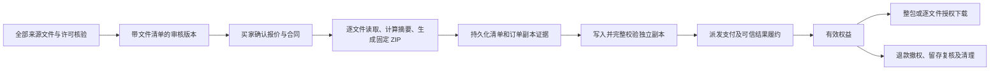

# 多文件商品交付实现说明

更新日期：2026-09-21。基线：当前工作区代码，包含尚未提交的修改。

业务阅读入口：[资源市场业务与交接](resource-marketplace-journeys.md)。本专题只说明多文件交付；市场共用计费依赖的后续验证与缺口见 [当前交接 9.3](resource-marketplace-journeys.md#93-计费派发的源码与专项证据0137)，不将充值／套餐测试作为 ZIP 商品交易的新增验收证据。

本次交付另核对了在研的 0138 套餐合同改动，相关支付／计费／HTTP 专项已通过，历史失败及剩余范围见 [源码差异与验证限制](resource-marketplace-journeys.md#94-本次交付的源码差异与验证限制0138)。下述 ZIP 专项结果保留其原验证范围，不代表最新工作区全量回归通过。

**当前状态：真实清单、固定 ZIP、合同、独立交付、留存和修复已接入；0115 进一步接通多文件提交、批准、公开购买与数据库协议保护（第 10 节）。隔离测试已从真实发布走通模拟通道付款、交付、退款和清理。真实应用浏览器中的模拟支付完整交易及已成交留存专项已通过（第 11 节）。运行环境未迁移，真实通道及生产存储验收仍未完成。** 总体范围见 [资源市场全链路说明](resource-marketplace-flows.md)。第 6–9 节保留各阶段边界；当前结果以第 10–11 节为准。

## 1. 交付方案

多文件商品以真实来源文件清单作为发布依据。订单交付保存一个独立、不可变的 ZIP 副本，既可整包下载，也可在授权后逐文件下载。使用单个独立对象，使订单原有的整包校验、修复、退款撤权及物理清理机制能够延续。

不能用 `includedFiles` 文案代替真实文件。所有成员必须与原件资格、审核版本和成交合同关联；付款后不能根据今天的商品目录重新解释旧清单。原有单文件合同与独立副本保持其格式，不回填新文件证据。

上图对应当前实现链路。0113 接入完整合同及独立快照，第 9 节接通授权交付，第 10 节接通公开购买。第 11 节补充真实应用浏览器中的完整模拟付款／退款及已成交留存验收；不能替代真实商户验收。

## 2. 已实现的版本 1 格式

| 项目 | 约束 |
| --- | --- |
| 业务成员数量 | 2–20；另含一份自动生成的清单 |
| 整包上限 | 100 MiB，包含所有文件、ZIP 头、目录和清单；文件大小之和不能替代最终包大小检查 |
| 压缩方法 | ZIP STORE，不压缩，不启用 ZIP64、加密、分卷或目录条目 |
| 顺序 | 按冻结的来源列表顺序写入，清单最后写入 |
| 名称 | UTF-8、NFC、1–200 字节的单个文件名；拒绝路径、控制字符、双向格式控制、Windows 设备名、尾点／空白等 |
| 名称冲突 | NFKC 与大小写折叠后不能重复，包含跨平台兼容名称；保留 `HCAI-MANIFEST.json` |
| 类型 | 明确且规范的 MIME；兼容上传检测记录的 `text/plain; charset=utf-8`，其他参数仍拒绝。本层不代替媒体扫描或业务来源资格检查 |
| 完整性 | 每个文件保存名称、MIME、字节数和 SHA-256；整包另有 SHA-256 和字节数 |
| 隐私 | 下载清单不包含 backend、key、用户身份或其他私有存储定位 |
| 重建稳定性 | 显式固定 ZIP 头字段、1980-01-01 时间、普通文件权限、UTF-8 标记、CRC32 数据描述符及中央目录；不依赖 zip.Writer 的默认值 |

`BundleManifest.version=1` 固定该编码。后续格式变更应使用新版本，不能改变原成交副本摘要后声称只是重新打包。版本 1 黄金样本为 717 字节，SHA-256 为 `dd791d392952c7bea383e15ce8725c11fb4c1d2ea5b12cfe1dcd73cc32b00487`；样本内容及独立标准读取验证见对应测试。

来源位置在内部 `BundleSource` 中传入，不能直接作为公有接口结构返回。重复的精确 backend/key 被拒绝；跨配置别名、内容相同但位置不同及真正的权利归属，仍依赖发布／存储层规则。

## 3. 暂存、验证和读取

`BuildBundle` 使用共享 `Catalog.StageWrite`，先预留整包上限对应的容量，再调用生产函数读取源文件。每次只打开一个来源；读取结束或失败关闭来源。源响应必须具有正数大小，实际正文与声明不符、关闭失败、取消或超限均不能生成成功结果。全过程不需要完整文件内存缓冲，也不启动后台生产 goroutine。

`StageWrite` 的写入上限包含超限检测字节，写入错误具有粘性；生产函数忽略错误不能将截断结果变成有效文件。生产函数 panic 时释放文件及共享额度，然后继续传播原 panic；它不把程序错误伪装成成功。原有 `Stage`／`OpenVerified` 也复用写入校验和异常释放路径。

`OpenBundleFile` 执行：

1. 校验可信清单、文件索引及请求范围。
2. 将整个独立副本暂存，核对冻结的整包大小和摘要。
3. 在调用 ZIP 解析器前检查结束记录：成员数量、目录大小及位置必须有界，禁止伪造巨大目录触发无界分配。
4. 校验 ZIP 成员数、顺序、名称、STORE 方法、标记、普通文件类型、压缩／展开大小及无额外注释／字段。
5. 完整读取每个成员，验证 CRC32、字节数及 SHA-256，并校验内部清单与可信清单一致。
6. 返回所选文件或 Range 的只读切片。响应体关闭时才释放整包暂存额度。

不向文件系统解压 ZIP 条目，不跟随包内路径或链接。请求一个文件的片段仍会检查其他成员；不能通过小 Range 绕过整包完整性保护。验证后替换存储中的原对象，不会改变已打开响应的字节。

**这些函数不负责用户鉴权、购买权益、退款状态或扫描资格。调用方必须在接入时完成这些检查。** 底层可以处理已批准的 ZIP 容器，不代表可以信任任意用户上传的压缩包或执行其中的代码。

## 4. 必须继续接通的业务环节

| 环节 | 接入与验收要求 |
| --- | --- |
| 发布清单 | 0112 已接入有序、去重的真实 assetId／名称；保存时逐个核验卖家独立自有来源，拒绝购买／任务等不合格来源。0115 已接通提交／上架 |
| 审核与公开展示 | 所有成员参与私有版本及 0113 完整报价版本；审核员可逐文件读取。下单的全体来源锁定已接入第 9 节；0115 已接通完整审核批准、公开投影和隔离购买链路；生产验收仍待完成 |
| 样片与公开边界 | 任一成员及其历史定位都必须纳入原件保护；不能经作品、站点图标、样片、别名或修复备份绕过收费交付 |
| 成交证据 | 0113 已冻结全部来源投影，并在独立对象写入前提交逐文件及整包摘要；0115 已接入公开购买路径 |
| 复制与恢复 | 0113 接入首次准备和中断恢复；0114 接入运营按全部冻结原件重建、私有完整 ZIP 备份及原字节上传恢复。任一成员／整包摘要不符即拒绝写入，已就绪包不自动重建 |
| 付款履约 | 第 9 节已接入全部冻结来源扫描和整包验证，失败进入补偿退款、不授予部分权益；0115 已覆盖模拟通道签名付款／退款链路；真实通道仍待验收 |
| 买家资产 | 已按 document／application/zip 呈现，展示安全逐文件清单；无虚假首成员来源及图片尺寸。整包禁止作为模型参考输入；独立成员的在线复用尚无业务入口 |
| 逐文件 HTTP | 已接入本人已购资产与 fileIndex，校验有效权益、全部来源扫描、当前状态及范围，文件验证前后复核权限。强制 attachment、private/no-store 和安全文件名；拒绝额外参数与存储 key |
| 退款与清理 | 0114 已将全体成员、冻结位置、当前／原归属及别名接入法律保留、账户清理和结束保留调度；整包及修复位置沿用删除后缺失核验。0115 已覆盖公开购买、退款撤权和副本清理；全部账户注销／保留组合及真实存储仍待联合验收 |
| 数据导出 | 0113 已将本人订单的安全文件清单、格式及逐文件摘要接入分块导出；白名单排除私有来源定位和文件正文 |
| 兼容与部署 | 旧合同不变；新格式需要应用、数据库、worker 和前端协调。旧 worker 不得把多文件合同按首文件单独履约；新增格式必须具备明确的拒绝旧协议保护 |

0115 将这些基础接入实际公开销售，并添加协议及资产约束，见第 10 节。逐文件在线复用若新增独立资产入口，也须单独接入合同许可、来源和 worker 撤权复核，不能借直接下载入口绕过这些要求。

## 5. 当前验证范围

内部测试覆盖固定编码黄金样本、标准 ZIP 读取、20 文件上限、中文文件名、规范化／大小写碰撞、保留名、路径和控制字符拒绝、大小不符、来源关闭失败、取消、panic、98 MiB＋2 MiB 原件因 ZIP 开销超限而拒绝、全部成员摘要与 CRC 校验、恶意目录／压缩／链接／加密元数据拒绝、Range 与存储替换，以及响应关闭前持有额度。

这些是本地编码／存储及共享交易回归，不是多文件商品端到端验收，也不证明媒体播放、真实对象存储或生产商户行为。具体命令和结果记录于 [审查记录 11.68](resource-marketplace-flows.md#1168-多文件封装基础与共享暂存回归)。

源码：[封装与读取](../internal/productdelivery/bundle.go)、[封装回归](../internal/productdelivery/bundle_test.go)、[共享暂存](../internal/platform/media/verified.go)、[生产函数异常测试](../internal/platform/media/stage_write_test.go)。

## 6. 真实文件草稿与核验（0112）

`ProductDraft.files` 是 2–20 个 `{assetId, name}` 的有序列表；空数组表示单文件。非空时，`assetId` 必须等于首个成员，`includedFiles` 必须恰好等于所有成员名称。旧版描述性文件列表不会自动转换为来源证据。名称校验直接复用 ZIP 封装规则，来源 ID 不得重复，样片不能使用任一成员。

卖家可在 `/workspace/products` 添加、移除、上移文件并保存；刷新后恢复顺序。服务按 UUID 顺序锁定全部来源及样片，再在新语句快照核对候选资格。所有成员均推进资产行版本，使较早的并发公开发布／样片选择不能沿用旧资格。第二个或后续来源的扫描、存储定位等元数据变化会改变整个草稿的版本；过期修改、核验链接被拒绝。

数据库 `product_listing_files` 保存位置、来源 ID 与名称。延迟约束检查 2–20 数量、连续位置、首原件／展示清单一致及样片分离；拒绝多文件记录被旧进程写成 active。`public_products` 同时排除多文件草稿。现有单文件的报价、编辑及内容版本计算保持原字节口径。

全体成员及相同存储位置的资产进入 `product_delivery_roots`，沿用作品、任务、样片、站点图标和匿名读取的隔离规则；成员也不能被选作另一交付的独立修复备份。未来成交后仍需为全部来源的历史定位、权益和法律保留接入持久化依据，本阶段草稿保护不能替代这些义务。

审核员通过现有 `GET /admin/products/{id}/content` 加 `kind=source&fileIndex=0&version=...` 逐一读取。多文件必须显式索引，预览禁止索引，未知参数／重复参数及越界返回 422；旧版本返回 409。HTTP 与服务权限、归属和扫描检查继续生效，响应为 attachment、private/no-store，访问审计保存准确的成员索引及 ID。此接口属于运营核验，不授予买家交付权限。

旧客户端编辑已有多文件草稿时若漏传 `files`，服务拒绝请求。明确传 `files: []` 并提供一致的单文件字段，才可转换回单文件。个人数据导出的当前商品和不可变发布历史均加入有序 ID／名称白名单，不导出来源存储定位；其他用户不能取得这些草稿。

**发布边界：** 提交或批准多文件返回 `503 product_bundle_not_ready`，界面明确提示只能保存草稿。checkout 拒绝创建订单／付款或调用 Provider。后续接成交与交付时才能移除对应应用、数据库及公开视图保护。

0112 仅在隔离测试 schema 应用。API、执行个人导出的 worker、数据库和前端需配套升级；一旦有文件记录或包含文件清单的不可变命令历史，down 迁移拒绝删除证据。未迁移运行库或重启实际服务。验证范围见 [审查记录 11.69](resource-marketplace-flows.md#1169-真实多文件草稿原件隔离与逐文件核验)。

## 7. 冻结合同与独立 ZIP 快照（0113）

`product_offers.contract.delivery` 对真实多文件商品新增 `format=zip-v1` 和有序 `files`。每个成员冻结 ID、位置、名称及内部来源元数据，任一成员来源变更都会改变报价版本。单文件合同不新增字段，原报价、编辑和内容版本保持不变。

`product_delivery_snapshots` 新增 `format` 和不可变 `file_manifest`。ZIP 快照保存整包 SHA-256／大小和安全逐文件清单；单文件继续使用原字段，清单为 NULL。ZIP 的单原件 `source_backend/source_key` 为 NULL，避免旧读取代码把首个成员视为整包。延迟约束要求多文件合同、必须具有独立快照的订单及完整 ZIP 清单同事务存在，成员数量／顺序／ID／名称／类型匹配且来源去重。缺副本、截断清单、删除 delivery 字段及单文件降级均不能提交。已有多文件合同或快照后，down 拒绝丢弃证据。

内部 `ReserveTx` 从完整冻结合同暂存生成固定 ZIP，保存原字节依据和预留目标后提交，**不在事务提交前写独立对象**。`Ensure` 只为 prepared 状态按冻结位置重建，核对全部成员和整包摘要才写入预留位置。当前商品清单或来源资产位置改变不改变订单；原冻结位置字节改变则拒绝。写入响应或 ready 提交丢失时，验证已存在的目标即可恢复，即使原件已经移走。ready 文件丢失或损坏不会悄悄重建或覆盖。

`Snapshot.OpenFile` 在内部复用全包和全成员验证后提供指定成员／Range，不提供用户鉴权。合同成员 ID 和历史位置别名持续进入收费原件隔离与修复备份排除，即使卖家后来把草稿改成单文件。个人导出只提供本人订单的安全合同成员和摘要字段，单文件导出结构不变。

**0113 阶段边界及后续进展：** 本阶段尚未接通全体来源下单锁定、付款履约和买家授权。运营整包重建与全来源留存在后续 0114 接入（第 8 节）；下单锁定、全部成员扫描、ZIP 买家资产及逐文件 HTTP 已在第 9 节接入，内部已接受的订单可完整履约。多文件发布与公开购买门禁仍保持，完整审核／公开投影和真实购买／退款联合验收尚待完成。

源码：[0113 迁移](../internal/platform/database/migrations/0113_product_bundle_snapshots.up.sql)、[保留证据的回退](../internal/platform/database/migrations/0113_product_bundle_snapshots.down.sql)、[冻结来源与预留](../internal/productdelivery/bundle_snapshot.go)、[快照恢复与读取](../internal/productdelivery/snapshot.go)、[隔离集成回归](../internal/payments/product_bundle_snapshot_test.go)。验证见 [审查记录 11.70](resource-marketplace-flows.md#1170-多文件合同与独立-zip-快照0113)。0113 只在隔离测试 schema 执行，运行库未升级。

## 8. 全部来源留存与整包修复（0114）

`product_order_media_sources` 统一投影单文件和 ZIP 的订单来源：成员位置、原件／根资产 ID、冻结存储位置和来源类型。多文件保留合同内的原所有者；旧单文件没有这项证据，返回 NULL，不用当前所有者伪造历史归属。`product_order_media_subjects` 汇总买家、合同卖家、已知原所有者、当前原件所有者及历史位置别名所有者，供法律保留和共用锁使用。

账户清理按相关付款、全部关联账户、来源／副本的既有顺序执行。未准备完成的订单义务保留每个冻结原件；独立副本就绪后，仍有义务的成员元数据保持可判定，原件正文可在无保留及其他引用时清除。法律保留覆盖成员及历史定位，不因第二个文件移动或改属而遗漏。保留结束后的分批调度能找到全部相关原件所有者，重新执行清理；物理清理仍需核验主存储位置缺失。

`original_media_cleanup_locations` 同时使用完整来源投影，供删除回执校验和遗漏清理扫描使用。只剩第二个文件的历史位置未清理时，也可独立发现、派发并保存真实删除证据；不能仅扩大删除范围而漏掉完成回执的校验依据。

运营修复有三种明确来源：`bundle` 从全部冻结原件重建，`stored` 使用运营本人合格的完整 ZIP 备份，`upload` 上传原字节 ZIP。`bundle` 不保存虚假的单原件 key，数据库要求关联 ZIP 快照。重建必须匹配全体成员及整包摘要，损坏原副本保持原位，新位置另存不可变修复记录。写入成功但提交中断时，续作验证已写目标后完成，不要求仍能取得原件。权限在等待付款／账户／副本锁后再次检查，避免继续使用等待前已被撤销的权限。

现有修复接口和共享管理页面继续承载这些操作，`pendingSource` 新增 `bundle`；所有方式仍要求媒体运营权限、当前版本、必要交付义务及原字节证据。法律保留本身不授予修复、下载或购买权益。

**部署边界：** 0114 需要配套 API、账户清理／法律保留 worker 和生成的接口类型；不能混跑仍按首原件清理的旧 worker。已有多文件合同或重建记录时，down 拒绝缩减保护范围。运行库未迁移，未重启实际服务。0114 阶段尚未接入的 checkout 来源锁、内部付款履约及买家授权，后续进展见第 9 节；完整多文件上架／公开购买联合验收和生产存储／历史对象验收仍未完成。

源码：[0114 迁移](../internal/platform/database/migrations/0114_product_bundle_lifecycle.up.sql)、[回退保护](../internal/platform/database/migrations/0114_product_bundle_lifecycle.down.sql)、[账户媒体留存](../internal/datarights/media_retention.go)、[结束保留调度](../internal/datarights/hold_cleanup.go)、[整包修复](../internal/productdelivery/repair.go)、[整包清理](../internal/productdelivery/cleanup.go)、[隔离生命周期回归](../internal/payments/product_bundle_lifecycle_test.go)。验证见 [审查记录 11.71](resource-marketplace-flows.md#1171-多文件全部来源留存与整包修复0114)。

## 9. 完整来源锁定、ZIP 履约和买家下载

新订单先处理已有付款重试，再按账户 → 商品 → UUID 排序的全部来源／根资产／样片 → 许可获取锁；等待结束后以新语句读取来源资格、公开状态和报价版本。若等待中旧资产的根来源变成尚未锁定的另一资产，拒绝旧报价，不乱序追加锁。已有付款仍按接受时的合同重试，避免在拿到来源锁后反向等待付款锁。此路径对当前单文件交易也生效。

内部已接受的 ZIP 订单履约从 `product_order_media_sources` 锁定并检查所有来源／根资产扫描。整包缺失、损坏或任一来源不合格时进入 `source_unavailable` 补偿，不只发首文件。成功生成 `document`／`application/zip` 买家资产，大小来自快照，图片宽高和单一 origin 均为空，完整来源仍保存在合同中。重复付款确认不受后来扫描变化影响，也不重复发权益。

`GET /assets/{assetId}/content` 提供整包；增加唯一的 `fileIndex=0..19` 参数可读取接受清单的一个成员。索引必须为规范十进制，拒绝重复、额外或解析失败的参数；单文件／原件不能使用该参数。只接受买家自身匹配订单的有效权益、active 账户、fulfilled／refund_requested 订单、clean 买家资产和全部接受来源，以及 ready 快照。解析后的所有成员仍需完整校验，不能通过小 Range 绕过其他文件损坏。

文件包与成员始终 attachment、private/no-store，使用安全文件名、各自 MIME／长度／ETag。构造读取句柄、读取开始和验证完成后都会检查权益；已发出的句柄不能绕过随后退款或隔离。该保护不声称能追回已经向客户端发出的字节。

已购详情的 `provenance.purchase.delivery` 投影格式、整包大小／摘要和有序安全文件清单，不含来源 ID、账户或存储定位。页面用共享列表、卡片操作和按钮提供整包／逐文件下载；退款后保留可核对的清单，隐藏下载动作。共享 `AssetMedia` 接收 MIME 并显示包图标，不自动下载 ZIP 或把它解码为文字；文档预览也拒绝二进制响应。生成提交、重试和 worker 的共同资格规则拒绝整包参考，底层派发另检查格式，防止伪装成首个图片或文本。

本阶段没有新增迁移，但依赖 0114 的完整来源投影；API、worker、前端和接口类型需配套。仍需完成审核批准／公开目录的全体资格、旧进程协议保护及完整公开购买、留存／退款／修复联合验收，之后才能解除多文件上架门禁。测试从隔离的已接受合同或交付夹具开始，浏览器用受控资产响应检查展示，不是完整支付端到端证据。

源码：[下单锁定](../internal/payments/product_checkout.go)、[履约](../internal/payments/workflow.go)、[共同来源扫描检查](../internal/productdelivery/source_safety.go)、[授权下载](../internal/assets/service.go)、[HTTP](../internal/transport/httpapi/vertical.go)、[媒体展示](../web/src/components/domain/AssetMedia.vue)、[买家工作台](../web/src/pages/WorkspacePage.vue)。测试和实际命令见 [审查记录 11.72](resource-marketplace-flows.md#1172-完整来源锁定zip-履约与买家授权下载)。

## 10. 多文件公开销售与部署协议（0115）

卖家可提交完整多文件草稿，审核员通过后进入公开市场；既有暂停、驳回、封禁及重新提交规则不变。全部成员参与内容／报价版本，并在保存、提交、批准、下单时检查独立来源资格。公开视图要求有当前完整批准，逐个检查来源；没有样片的 ZIP 商品显示为 document，不伪装首成员图片。现有公开 `assetId` 保留首原件标识兼容，新增成员 ID／存储位置不进入公开商品响应；知道 ID 不授予原件读取权限。

0115 的延迟约束保持文件数量、顺序、首原件、展示名称和样片分离，并要求 active 商品具有当前完整批准。购买资产必须为 document／application/zip，大小匹配快照，没有图片宽高和单一 origin；资产的已接受来源身份、权益的买家／商品／订单／资产／许可身份不能被改绑。新增有效权益需匹配完整 ready 交付。普通扫描、退款和注销元数据变更继续可执行。

新版连接在每次连接／重连时声明 `app.product_bundle_protocol=zip-v1`。数据库对多文件清单、提交／批准、合同、包资产、权益和 worker 执行转换检查此能力；旧 worker 不能领取、续租或完成运行作业。该标识是部署兼容协议，不是用户鉴权，也不能阻止仍在服务的旧 API 执行只读查询或撤回已发往外部的请求。

因此必须先停止旧 API 接收流量、停止周期派发并排空旧 worker，再迁移和整体切换。迁移锁定作业表并拒绝任何 running 作业，不能靠直接改状态伪造排空。已有多文件提交／批准历史或已接受合同后，down 拒绝丢弃保护。详见 [部署步骤](../deploy/README.md#bundle-publication-cutover-0115)。本轮只迁移隔离 schema，未修改运行库、重启实际服务或操作真实资金。

新增联合测试由真实商品草稿开始，经服务提交／批准、公开投影、下单、模拟通道签名付款处理、整包／成员下载、签名退款撤权和物理副本清理。订单接受后修改清单不能改变交付；原件仍属于卖家时不会被退款清理误删。旧协议领取／写入、错误首文件资产、来源身份降级、空库 up/down、带历史拒绝回退均有专项测试。浏览器覆盖 390／1308 的多文件发布、逐文件核验、暂停及已有买家文件展示；后者仍采用展示响应夹具，不将这些片段表述为一次浏览器完整付款验收。

源码：[0115](../internal/platform/database/migrations/0115_product_bundle_publication.up.sql)、[回退保护](../internal/platform/database/migrations/0115_product_bundle_publication.down.sql)、[连接协议](../internal/platform/database/database.go)、[公开交易联合测试](../internal/payments/product_bundle_publication_test.go)、[协议及格式回归](../internal/payments/product_bundle_protocol_test.go)。结果见 [11.73](resource-marketplace-flows.md#1173-多文件公开发布交易联合回归与旧进程保护0115)。

## 11. 浏览器交易与上传文本兼容

新增 [独立支付浏览器旅程](../web/e2e/product-bundle.payment.spec.ts)，从真实文本上传开始，经草稿、审核、购买、实际 HTTP 回调入队和 worker 履约，验证 ZIP／成员下载摘要、中文文件名、退款前后权限及重复回调。应用接口没有响应替身；只有外部支付和收银台被模拟，未产生真实扣款。普通展示夹具与这条交易证据分别保留。

完整旅程发现实际上传使用 `text/plain; charset=utf-8`，原打包校验禁止所有参数而导致结账失败。现仅补入上传管线已支持的这一规范值，保持合同及下载清单中的原始 MIME，其他参数、控制字符和不规范值仍拒绝。相同合同重建能得到相同 ZIP 摘要；已有不带参数的版本 1 格式固定摘要测试仍通过。此修复不新增迁移，需要更新 API／worker；不能让旧二进制执行已接受 UTF-8 文本包的读取或修复。

[已成交留存专项](../internal/payments/product_bundle_purchase_retention_test.go)覆盖卖家注销、买家继续下载、买家法律保留、退款、保留解除后恢复清理及两份原件回执。退款清理使用业务实际入队作业，并确认预先取得的读取句柄也不能在撤权后使用。

执行入口为 `make e2e-payments`，共享隔离 schema 的浏览器套件必须顺序执行。详细结果、CI 范围和未完成边界见 [11.74](resource-marketplace-flows.md#1174-完整浏览器交易utf-8-原件兼容与已成交保留)。
