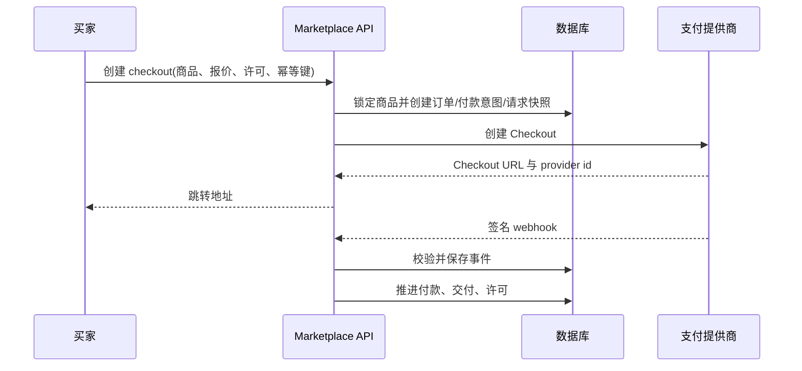

# 资源市场全链路当前基线

> 当前业务与验收状态统一以[资源市场完整链路](resource-marketplace-complete-flow.md)为准。源码已包含 0166 银行执行／通知、0167 银行任务受控恢复、0168 来源／自动结算停止保护及 0169 执行锁与续租分离；0166 支付全包已通过，但不覆盖这些后续增量。当前源码测试与待办见统一文档第 11–12 节。本页保留分阶段规则，旧的“未接通／尚未实现”和测试结果仅适用于对应历史版本。

更新时间：2026-09-23

目标 1 最新源码与测试状态见[完整链路 0.1](resource-marketplace-complete-flow.md#01-目标-1-当前基线拒付来源撤回与验证边界2026-09-23)及[审查记录 11.218](resource-marketplace-flows.md#11218-目标1源码基线与文档状态复核)。本页早期阶段说明保留其历史适用范围；不要用旧支付包快照替代当前工作区全包结果。

历史源码边界（0165 阶段）：0165 银行出款持久命令与本人导出已通过隔离专项；最终 Race 32 个主测试／55 项通过，包含支付迁移、并发、回滚、权限和隐私验证。仍无银行命令 HTTP／派发 worker／到账账本接线，不能开启真实提现。此前启动的支付全包不包含该增量。当前完整业务入口及未完成项以[完整链路 7.11](resource-marketplace-complete-flow.md#711-银行出款持久命令0165隔离专项通过)和[验证记录 11.203](resource-marketplace-flows.md#11203-银行出款持久命令与本人导出0165)为准，以下保留各阶段基线。

本次交付校准：财务来源准入已有 HTTP／页面入口，但新增入口已通过隔离 HTTP、领域、客户端与模拟 API 浏览器专项，真实联合验收待完成；0164 旧全包失败所涉及的两处回填夹具已修正，迁移专项通过，新全包尚待结果。当前业务状态与失败证据统一见[完整链路 7.10、11、12 节](resource-marketplace-complete-flow.md)和[审查 11.201](resource-marketplace-flows.md#11201-来源划转入口验证与迁移回归修复)。
适用范围：当前工作区源码与隔离测试，不代表已经部署到生产环境。

最新业务交付入口：[资源市场完整链路](resource-marketplace-complete-flow.md)。本文保留分阶段技术基线；后续 0160 财务复核、0161 卖家结果与通知、0162 内部来源准入、0163 银行最小快照、0164 资金账户隔离的当前接线及未完成边界，统一见该文档第 7.5–7.10、12 节。历史“待实现”描述应按其阶段理解。

文档交付补充：0152 提现模式与 0153 申请分配释放、资金证据保护已接入当前源码，并通过卖家资金定向集成回归。其单笔金额限制、外部派发和人工处置边界见[统一交接文档 4.4](resource-marketplace-all-flows.md#44-提现模式与分配保护01520153)。本文不把这些本地账本与预留状态描述为银行到账。

本文是资源市场的业务交接手册。它把浏览、发布、审核、支付、交付、订单、退款和运营恢复串成一条可追踪的链路；历史修复记录和逐项审查证据仍保留在[资源市场全链路说明与审查记录](resource-marketplace-flows.md)、[资源市场全链路总览](resource-marketplace-guide.md)、[资源市场业务旅程](resource-marketplace-journeys.md)和[资源市场交易包](resource-marketplace-bundles.md)。迁移覆盖关系见[MIGRATION_MATRIX.md](MIGRATION_MATRIX.md)。

统一业务入口为 [资源市场完整链路](resource-marketplace-complete-flow.md)、[资源市场全部链路交接文档](resource-marketplace-all-flows.md) 和 [资源市场全链路文档：业务与交接](resource-marketplace-journeys.md)。本文用于技术基线查询，历史专项通过数字不代表当前工作区全量验证；结算实现边界见业务交接第 5.1 节，0145 转账核对、0146 订单／支付绑定保护及 0148 收款目标身份绑定见第 5.3 节和第 4.5 节，本次核对范围见第 12 节。

## 1. 状态定义和边界

文中使用以下状态：

| 状态 | 含义 |
| --- | --- |
| 已接入 | 当前源码包含该链路，且有对应的页面、HTTP 入口或服务实现。 |
| 专项通过 | 对应隔离测试或前端测试通过；只证明该测试范围，不证明生产环境。 |
| 待部署 | 代码或迁移在工作区存在，运行中的数据库、worker 或前端实例尚未确认升级。 |
| 待验收 | 需要真实支付、真实存储、真实扫描、真实邮件、生产代理或多实例条件才能确认。 |
| 未闭环 | 功能边界仍缺少实现，不能按“可用”向业务承诺。 |

当前不能宣称资源市场已完整生产可用。卖家逐笔结算只读投影及 0151–0153 卖家资金定向集成专项已通过；provider 派发、人工资金处置、转账撤回、自动追偿、历史交付迁移、完整支付对账和真实外部服务验收仍有边界。

## 2. 角色、权限和页面入口

### 2.1 角色

| 角色 | 主要职责 | 关键权限边界 |
| --- | --- | --- |
| 买家 | 浏览商品、确认许可、支付、下载、退款 | 只能读取自己的订单、交付快照、许可和退款记录；支付成功必须有可信付款证据。 |
| 卖家 | 创建商品、上传文件、提交审核、查看销售 | 只能修改自己的草稿和商品；发布后的商品修改受版本、状态和审核规则约束。 |
| 审核运营 | 查看待审商品、批准或拒绝、处理私密原件 | 审核操作在事务内复核角色、商品版本和文件成员权限。 |
| 财务运营 | 付款恢复、退款核对、支付事件复核 | 所有恢复、重放和手工调整保留操作者、请求键和审计记录。 |
| 支持人员 | 处理订单、交付、账户问题 | 通过支持和运营入口处理，不直接绕过买家许可或支付状态。 |

### 2.2 前端页面

| 页面 | 路由 | 用途 |
| --- | --- | --- |
| 商品目录 | `/market` | 公开商品列表、分类、搜索、分页和价格展示。 |
| 商品详情 | `/market/assets/:id` | 商品说明、预览、许可、文件摘要和购买入口。 |
| 卖家商品 | `/workspace/products/:id?` | 草稿创建、编辑、文件清单、提交审核和上下架。 |
| 卖家销售 | `/workspace/sales/:id?` | 销售订单、交付状态、退款与事件时间线。 |
| 订单与已购内容 | `/workspace/orders`、`/workspace/purchases`、`/workspace/assets/:id` | 分别查看买家订单、已购目录和具体交付资产的许可与下载。 |
| 管理审核 | `/admin/products/:id?` | 审核商品、查看私密内容、记录决定。 |
| 交付修复 | `/admin/deliveries/:id?` | 证据缺口、修复上传、续接和结果核对。 |

页面只负责呈现和发起命令；商品状态、金额、许可、文件成员和权限以服务端事务结果为准。

### 2.3 页面到 API 的真实入口

以下路径以 `internal/transport/httpapi/server.go` 的 `/api/v1` 路由注册为准。页面路由和 API 路由不是一一同名：例如 `/workspace/orders` 与 `/workspace/purchases` 由同一个工作台页面按 section 展示，已购目录查询 `GET /assets?source=purchase`，资源市场购买使用 `/products/{productID}/checkout`。

| 链路 | API | 作用 |
| --- | --- | --- |
| 公共目录 | `GET /products`、`GET /products/{productID}` | 公开商品分页、分类筛选、详情、报价和样片投影。 |
| 公开样片维护 | `PUT /products/{productID}/preview` | 合资格卖家维护独立公开样片；受审核管理的商品通过草稿和审核流程修改。 |
| 商品购买 | `POST /products/{productID}/checkout` | 买家确认报价与许可后创建 Checkout。 |
| 买家订单 | `GET /orders`、`GET /orders/{orderID}`、`POST /orders/{orderID}/refund`、`POST /orders/{orderID}/close-checkout` | 读取订单、申请退款、处理新协议且尚未派发的 Checkout 关闭。 |
| 卖家商品 | `GET/POST /seller/products`、`GET/PUT /seller/products/{productID}`、`POST /seller/products/{productID}/{action}` | 创建草稿、编辑、提交审核、暂停、重新提交及其他商品状态命令。 |
| 卖家销售 | `GET /seller/sales`、`GET /seller/sales/{orderID}`、`GET /seller/sales/{orderID}/events` | 查看本人成交、条款和订单状态变化；这不是结算余额或完整支付事件接口。 |
| 发布许可选项 | `GET /seller/licenses` | 返回发布商品时可选择的许可，不是已售授权或买家权益目录。 |
| 管理审核 | `GET /admin/products`、`GET /admin/products/{productID}`、`GET /admin/products/{productID}/content`、`POST /admin/products/{productID}/{action}` | 审核商品和私密来源文件，批准、驳回、封禁或允许重提。 |
| 支付回调 | `POST /payments/webhooks/stripe`、`POST /payments/webhooks/waffo` | 验签、绑定原始商户与订单、保存事件并推进异步履约。 |
| 交付修复 | `GET /admin/product-deliveries/evidence-gaps`、`GET /admin/product-deliveries/{orderID}`、`POST /admin/product-deliveries/{orderID}/repair`、`POST /admin/product-deliveries/{orderID}/repair-upload`、`PUT /admin/product-deliveries/{orderID}/repairs/{repairID}/content`、`POST /admin/product-deliveries/{orderID}/repairs/{repairID}/resume` | 盘点交付证据缺口、恢复冻结字节、上传受控备份和续作修复。 |

### 2.4 交易主状态与完成判定

资源市场的交易结果由订单、支付、权益和交付四组证据共同决定。页面成功提示、Checkout URL、通知投递或 worker 入队都不能单独代表交易完成。

| 阶段 | 可对外承诺的完成条件 | 未满足时的处理 |
| --- | --- | --- |
| 商品可售 | 审核管理的商品当前版本已批准，且满足来源、账号、在售及许可资格；公开样片可选，所选样片须独立满足公开读取条件 | 不符合公开资格时不进入公共目录；缺少样片不允许以收费原件替代预览。 |
| Checkout 已创建 | 订单、付款意图、报价/许可合同、原始请求幂等键和交付准备记录已持久化 | 返回可重试或待核对状态；不能盲目再次创建外部会话。 |
| 已付款 | Provider 签名事件或已认证查询同时匹配原商户、订单、金额、币种、用途和 Checkout 身份 | 进入支付核对；不按浏览器返回参数发放权益。 |
| 已交付 | 订单完成、有效权益、独立交付快照、文件摘要/字节数和买家资产全部存在且一致 | 不创建部分权益；按补偿退款或运营恢复处理。 |
| 已退款 | 外部退款结果已确认并与原付款绑定 | 普通退款确认前保留已授予的有效权益；未履约的补偿退款不授予权益。确认后撤销后续使用权限，文件清理另按留存条件执行。 |

## 3. 买家链路

### 3.1 浏览、搜索和筛选

1. 市场页面访问 `GET /api/v1/products`，使用关键词 `q`、分类 `category`、排序 `sort` 和翻页游标 `cursor`；接口另支持 `type`、`license`、`limit`。价格升降序是排序方式，目前没有价格区间筛选参数。
2. 服务端只返回满足公开资格且仍在售的商品；审核管理的商品必须批准当前版本。视图仍保留无发布记录、无多文件清单的历史单文件分支，不应把兼容分支当作新商品的发布入口。
3. 列表中的价格、币种、版本和样片来自商品报价快照；客户端不自行计算应付金额。
4. 分页游标只由服务端生成。切换筛选条件时必须丢弃旧游标，避免旧响应覆盖新结果。

### 3.2 详情、样片和许可确认

1. 前端访问 `GET /api/v1/products/{productID}`。
2. 服务端返回公开描述、公开样片、当前报价版本、许可摘要和可购买状态。
3. 私密原件、交付根目录和订单文件不通过公开详情接口暴露。
4. 买家在结算前确认许可条款；确认内容、报价版本和商品版本会进入订单合同。

### 3.3 下单、Checkout 和支付

1. 前端调用 `POST /api/v1/products/{productID}/checkout`，必须提供许可确认、报价版本和请求幂等键。
2. 服务端锁定商品、读取报价和公开资格，创建订单、付款意图、Checkout 请求和交付准备记录。
3. 交付准备失败、商品版本变化、Checkout 已关闭或需要核对时，接口返回可识别的冲突码；客户端应回到订单或详情页，不重复创建未知支付。
4. 支付提供商返回 Checkout URL 后，浏览器跳转到提供商页面。应用不把前端返回参数当作付款成功凭证。

### 3.4 支付返回和异步回调

- Stripe：`POST /api/v1/payments/webhooks/stripe`
- Waffo：`POST /api/v1/payments/webhooks/waffo`
- 浏览器支付返回只用于定位订单并读取服务端状态。
- Webhook 必须验证签名、商户身份、金额、币种、用途、订单锚点、Checkout 会话和事件去重键。
- 独立的 `payment_intent.succeeded` 没有不可变 Checkout 锚点时不能推进资源市场订单。
- 失败事件保留为失败尝试；后续可信成功事件仍可推进，不因早期失败永久锁死订单。

### 3.5 订单、许可和下载

1. 买家访问 `GET /api/v1/orders` 或 `GET /api/v1/orders/{orderID}`。
2. 付款确认后，服务端生成交付快照和许可；快照记录商品、文件成员、版本、来源资产和授权条款。
3. 下载入口只对订单买家、有效许可和仍可交付的文件开放。
4. 订单和已购资产互相提供入口，但不会因为页面入口切换而扩大权限。
5. 下载经过代理背压、媒体响应预算和存储权限检查；公开样片与私密原件使用不同的读取边界。

### 3.6 退款

1. 买家在退款窗口内调用 `POST /api/v1/orders/{orderID}/refund`，提交原因和请求幂等键。
2. 服务端先验证订单归属、退款窗口、当前状态和历史退款证据。
3. 退款请求必须经过支付提供商；只有服务端核实的退款成功证据才推进撤权。证据可以来自合格的签名事件或已接入的认证查询核对结果，不限于 Webhook；普通退款待确认时保留原有效权益。
4. Stripe/Waffo 的退款成功、失败、处理中和未知结果分别保留事件与尝试记录。
5. 退款确认后撤销许可，并按资金、法律保留、媒体清理和交付证据决定是否清理文件。

## 4. 卖家链路

### 4.1 创建草稿和文件清单

1. 卖家通过 `POST /api/v1/seller/products` 创建草稿。
2. 草稿保存标题、描述、类型、价格、币种、许可和文件清单；文件上传采用写入日志和幂等命令。
3. 上传完成前不能提交审核。媒体扫描、来源证据和文件成员必须可追踪。
4. 审核管理的商品通过草稿编辑设置样片，并随当前版本提交审核；独立 `PUT /api/v1/products/{productID}/preview` 仅适用于符合条件的非审核管理商品。样片不能越过公开预览边界暴露交付根目录。

### 4.2 编辑、提交和审核

1. 卖家通过 `GET /api/v1/seller/products/{productID}` 读取草稿，使用 `PUT` 保存编辑。
2. `POST /api/v1/seller/products/{productID}/submit` 创建提交快照；幂等重试必须使用同一快照摘要。
3. 审核员通过 `GET /api/v1/admin/products` 和 `GET /api/v1/admin/products/{productID}` 读取待审商品。
4. 审核决定通过 `POST /api/v1/admin/products/{productID}/approve` 或拒绝动作写入，并锁定商品版本和审核者权限。
5. 通过后商品才进入公开目录；拒绝后卖家可编辑并重新提交，旧决定保留在事件历史中。

### 4.3 上下架和版本变化

- 卖家动作接口：`POST /api/v1/seller/products/{productID}/{action}`。
- 已有订单使用订单合同和交付快照，不会因商品下架或新报价覆盖历史权利。
- 报价或文件变化会增加版本；买家在新 Checkout 中必须重新确认当前报价和许可。

### 4.4 销售查询和结算边界

- `GET /api/v1/seller/sales`
- `GET /api/v1/seller/sales/{orderID}`
- `GET /api/v1/seller/sales/{orderID}/events`

销售查询展示成交金额、订单／付款状态、冻结许可及订单事件。列表和详情可附带匹配的逐笔结算快照，包含总额、费率、手续费、净额、待追偿金额、可结算时间及转账记录时间；不返回收款目标、通道转账编号或内部核对证据。缺失或绑定冲突不以估算值代替，并通过 `needsReview` 提示核查。0151 的 `GetSellerFunds` 对应 `GET /api/v1/seller/funds`，从独立不可变账本计算余额；`CreateSellerPayoutRequest` 对应 `POST /api/v1/seller/payout-requests`，只创建待人工核对的幂等预留。`GET /api/v1/seller/licenses` 是发布许可选项接口，不是销售查询。provider 派发、人工资金处置、自动追偿和完整结算对账仍需独立完成并验收。

当前已有 `product_settlement.go`、0143/0144 结算表及 `payment.settle_product` worker 接线，履约和退款会触及该模型。0144 已保护经济快照、转账凭证、持久化 reservation、稳定事件去重和历史批次回填；worker 已覆盖原商户、资金视图、收款目标和退款竞态复核。默认 0 bps／7 天不等于已确认商业政策，也未确认运行环境已应用这些迁移。

新增的 0145、`product_settlement_checks.go` 和 `provider_stripe_transfers.go` 已接入原 Stripe 商户认证查询及 `payment.check_product_settlement` 周期核对；0146 以复合外键固定结算的订单／支付配对。代码只查询已有转账；唯一匹配且未撤回时才尝试恢复凭证，确认退款后的追偿义务仍保留，空结果不能重新派发。首轮发现的批次问题已通过共享校验修复，发送前及正常／恢复完成路径均检查并锁定原批次，且要求订单、买家、商品、卖家、通道、模式、金额和币种一致；修正后的结算与 Stripe 查询 Race 选择集通过，见 [11.160](resource-marketplace-flows.md#11160-原打款批次一致性修复与专项结果)及[绑定专项](resource-marketplace-flows.md#11162-结算订单支付交叉绑定保护0146)。卖家只读结算投影与页面已接线；合法交易夹具下的领域 Race、真实 HTTP 会话和模拟 UI 增量专项均通过。提现、人工恢复、撤回和自动追偿仍未闭环，详见 [业务交接第 5.3 节](resource-marketplace-journeys.md#53-stripe-未知转账核对0145)和[第 5.4 节](resource-marketplace-journeys.md#54-卖家逐笔结算查询)。

### 4.5 收款开户命令恢复（0147）

卖家通过 `/settings?section=payouts` 读取 `GET /api/v1/account/payouts` 并调用 `POST /api/v1/account/payouts/onboarding`。首次创建前，`payout_account_commands` 持久冻结原商户身份／环境、原邮箱、命令版本、幂等键和预留时间；创建结果与收款目标原子保存，托管入驻链接另行生成。

响应丢失或本地保存失败时，23 小时内重新认证同一身份后使用原请求恢复。超期、原身份或版本不符返回 409 `payment_reconciliation_required`，不新建命令绕过未知结果。读取可投影 `creation_pending`／`recovery_required`，操作仍需重新认证。0148 已为新建收款目标持久保存原商户、环境、端点和协议版本，并在开户链接、账户回调及商品结算时复核；0149 为迁移后新建任务付款保存不可变的 Provider 身份快照，任务转账和任务退款会在调用 Provider 前复核该快照及收款目标绑定；历史未知目标和迁移前任务付款仍需人工核对。

实现入口：[开户命令](../internal/payments/onboarding_commands.go)、[开户流程](../internal/payments/onboarding.go)、[0147 迁移](../internal/platform/database/migrations/0147_payout_account_commands.up.sql)、[0148 迁移](../internal/platform/database/migrations/0148_payout_destination_identity_binding.up.sql)、[0149 迁移](../internal/platform/database/migrations/0149_task_payment_identity_binding.up.sql)、[身份绑定校验](../internal/payments/destination_identity.go)、[任务付款身份校验](../internal/payments/task_payment_identity.go)；隔离专项记录见 [11.169](resource-marketplace-flows.md#11169-收款开户命令持久恢复与原请求冻结0147) 和 [11.170](resource-marketplace-flows.md#11170-收款目标身份绑定与任务转账边界0148)。

## 5. 审核、交付与存储

### 5.1 审核运营

审核事务同时检查操作者角色、商品版本、文件成员和私密原件权限。审核拒绝或权限变化不能留下可继续读取的私密下载链接。

### 5.2 交付快照

交付快照是付款与文件之间的不可变合同边界，至少包含：订单、商品和报价版本、许可、文件成员、来源资产、存储位置证据、生成时间和当前交付状态。商品后续编辑不能改写已付款订单的快照。

### 5.3 交付修复

管理员入口：

- `GET /api/v1/admin/product-deliveries/evidence-gaps`
- `GET /api/v1/admin/product-deliveries/{orderID}`
- `POST /api/v1/admin/product-deliveries/{orderID}/repair`
- `POST /api/v1/admin/product-deliveries/{orderID}/repair-upload`
- `PUT /api/v1/admin/product-deliveries/{orderID}/repairs/{repairID}/content`
- `POST /api/v1/admin/product-deliveries/{orderID}/repairs/{repairID}/resume`

修复过程会重新检查权限、订单和文件证据；慢速扫描完成后不能直接沿用过期授权。未知存储状态不能被当作“文件已删除”的证明，必须保留证据缺口并进入恢复队列。

### 5.4 存储、扫描和清理

- 公开样片、卖家原件、交付副本和退款后待清理文件使用不同的生命周期边界。
- 扫描、生成、上传写入和媒体清理由 worker 处理，并使用租约、重试和幂等键。
- 法律保留、活跃许可、付款核对、退款观察或交付修复存在时，清理任务必须停止或延期。
- 历史交付迁移、未知历史对象盘点和生产容量/留存策略仍待真实环境验收。

## 6. 支付、退款和恢复

### 6.1 Stripe 与 Waffo

两个提供商都必须经过统一的资源市场付款工作流。当前代码包含 Checkout 创建、Webhook 验证、支付查询、退款发起和部分恢复逻辑。Waffo 与 Stripe 的计费绑定迁移（0141、0142）仅覆盖相应请求绑定和事件约束，不等于所有资金异常已经闭环。

Waffo 商品查询已增加 `/checkout/lookup` 接口，查询 worker 按原付款的 provider 选择 runtime。它依赖连接器配置 `WAFFO_CHECKOUT_LOOKUP_QUERY`，空配置拒绝执行；查询契约强制时间窗口、响应合同版本、分页完整性、显式分金额和创建／过期时间，并对候选逐字段绑定。0150 已将 `waffo_pancake` 接入商品查询证据、无 URL 的 `checkout_open` 例外、会话／冲突／候选／派发视图和查询事件约束；延迟触发器还会核对查询回执、原请求、订单、买家、商品、金额、币种、模式和核对作业。Waffo `liveMode` 回包字段、runtime 可用性优先级和第 1–10 页 `incomplete`／24 小时窗口边界已通过定向回归。仍不能仅配置真实 query 即启用：真实商户 schema、授权、金额／时间语义、多实例重启、真实资金对账和端到端交付尚未验收。完整限制见[全部链路 7.0.1](resource-marketplace-all-flows.md#701-waffo-商品-checkout-查询恢复边界)和[当前差异记录](resource-marketplace-flows.md#11179-waffo-商品-checkout-查询证据接线与定向回归)。该接线也不代表 Waffo 退款查询或计费查询已经实现。

### 6.2 支付证据和对账

付款查询会保存原始观察、商户身份、金额、币种、订单关联和查询执行记录。发生超时、取消、共享冲突、未知结果或身份缺失时，订单进入需要核对状态，不能自动当作失败并重试付款。

管理员相关入口：

- `GET /api/v1/admin/payments`
- `GET /api/v1/admin/payments/webhook-quarantines`
- `POST /api/v1/admin/payments/webhook-quarantines/{id}/recheck`
- `POST /api/v1/admin/payments/{paymentID}/recover`
- `POST /api/v1/admin/payments/events/{eventID}/replay`
- `GET/POST /api/v1/admin/payments/{paymentID}/refund-checks`
- `GET /api/v1/admin/payments/{paymentID}/refund-history`

### 6.3 历史订单

历史订单只有在具备原始付款身份、完整交易查询和不可冲突的退款证据时才能恢复或退款。缺少原始支付身份、外部资金状态不明或存在并发证据冲突时，必须保持限制并交给财务运营；不能凭内部订单状态直接发起外部退款。

## 7. 通知、数据导出和权限

- 支付、审核、交付、退款和恢复事件进入通知或审计入口；通知不能替代订单和支付状态读取。
- 买家数据导出必须按当前身份和订单权限过滤，不能因为导出任务重试而扩大文件范围。
- 删除账户、法律保留、交付清理和退款清理由数据权利及媒体清理任务衔接，保留必要的财务和审计记录。
- 运营恢复、事件重放、手工财务调整和交付修复均需要有效角色、事务内复核、操作者审计和幂等请求键。

## 8. API 与代码索引

主要 HTTP 注册在 `internal/transport/httpapi/server.go`；资源市场实现分布如下：

| 代码区域 | 责任 |
| --- | --- |
| `internal/transport/httpapi/marketplace.go` | 商品目录、详情、Checkout、订单、退款和关闭 Checkout。 |
| `internal/transport/httpapi/product_publication.go` | 卖家商品草稿、编辑、提交和管理员审核。 |
| `internal/transport/httpapi/seller_sales.go` | 卖家销售、订单详情、事件和许可查询。 |
| `internal/transport/httpapi/product_delivery_repair.go` | 交付修复命令。 |
| `internal/transport/httpapi/product_delivery_inventory.go` | 交付证据缺口和运营盘点。 |
| `internal/marketplace` | 商品、报价、分类、订单、销售和许可领域规则。 |
| `internal/payments` | Checkout、Webhook、支付证据、退款、恢复、对账和提供商适配。 |
| `internal/productdelivery` | 交付快照、bundle、上传、修复、下载和清理。 |
| `internal/platform/jobs` | 异步任务、租约、重试和恢复。 |
| `web/src/pages/MarketplacePage.vue` | 买家目录与商品详情。 |
| `web/src/pages/SellerProductsPage.vue` | 卖家商品和管理员审核界面。 |
| `web/src/pages/SellerSalesPage.vue` | 卖家销售界面。 |
| `web/src/pages/DeliveryRepairPage.vue` | 管理员交付证据盘点、修复上传和续作。 |
| `web/src/pages/WorkspacePage.vue` | 订单、已购资产和交付入口。 |
| `web/src/router/index.ts` | 资源市场页面路由。 |

核心持久化对象包括 `products`、商品文件和版本、`orders`、`payment_intents`、`entitlements`、交付快照、Checkout 请求、Webhook 事件、退款尝试/核对、交付修复、任务和审计事件。具体字段和迁移以 `internal/platform/database/migrations` 为准，不应从旧文档中的字段表反推当前结构。

## 9. 异步任务和失败处理

资源市场不能只按同步 HTTP 成功判断完成。以下工作由 worker 或运营队列继续推进：

| 阶段 | 任务职责 | 失败后的原则 |
| --- | --- | --- |
| 付款事件 | 验签、去重、推进订单 | 事件留存；未知支付不自动重试外部扣款。 |
| 付款核对 | 查询 Checkout/付款/退款状态 | 保存查询执行和部分证据；冲突进入运营复核。 |
| 结算与转账核对 | `payment.settle_product` 一次性派发；`payment.check_product_settlement` 查询缺失结果 | 隔离专项通过，真实通道待验收；空结果不重发，退款债务不清零。 |
| 交付 | 创建快照、复制文件、生成 bundle | 使用租约和幂等键；不删除仍被许可或核对需要的文件。 |
| 扫描 | 文件安全和来源检查 | 失败保持不可公开或待审核状态。 |
| 退款清理 | 撤销许可和清理副本 | 先确认资金和保留边界，再清理；未知存储状态不能当作删除证明。 |
| 修复 | 补齐缺失交付或证据 | 重新鉴权，写入后再次核对结果。 |

## 10. 当前验证证据

以下保留此前各阶段的验证信息，不代表新增 0145–0147 代码后的全量结果；0147 专项范围另见第 4.5 节：

- 前端：`cd web && npm test -- --exclude='e2e/**'`，27 个测试文件、211 项通过。
- 后端静态检查：`go vet ./internal/marketplace ./internal/payments ./internal/productdelivery ./internal/transport/httpapi ./internal/platform/database` 通过。
- 最新结算绑定专项 `HCAI_REQUIRE_INTEGRATION_TESTS=1 go test -race ./internal/payments -run 'ProductSettlement|Settlement'` 通过（164.290 秒；隔离 schema 和模拟通道），另有数据库迁移 Race 14.816 秒；这仍是选择集，不代表资源市场全量或生产验收。
- 结算相关的 payments、notifications 和 worker 定向选择集通过；worker 包本次无测试用例。上述结果只覆盖选择集，不代表资源市场全量或生产验收。
- 资源市场相关 Go 专项测试曾因 PostgreSQL 隔离迁移报 `out of shared memory (SQLSTATE 53200)` 中止；该历史结果不能写成业务断言失败，也不能写成专项全通过。
- 此前启动的 `cmd/worker`、数据权利、资产、任务和媒体专项进程已经结束，但本轮没有捕获可审计的最终输出；需重新执行并记录终态后才能作为交付证据。

最近一次 `go test ./internal/payments ./cmd/worker` 的支付包约 10 分钟后超时，末尾涉及 `TestProductCleanupRecoveryRetentionGuards`，期间出现数据库连接数不足 `SQLSTATE 53300`；worker 为缓存通过。该运行不构成支付包或结算专项通过证据，也不能将环境资源错误概括为所有业务逻辑失败。本文收尾未重新执行这些测试。

此前 `go test ./internal/payments ./cmd/worker ./internal/observability -run '^$' -count=1` 的三个包均显示 `[no tests to run]`，仅证明该阶段编译完成。结算核对首轮失败见 [11.159](resource-marketplace-flows.md#11159-转账核对首轮业务验证与未修复问题)；修正后结算及 Stripe 查询 Race 选择集已通过，135.369 秒，范围见 [11.160](resource-marketplace-flows.md#11160-原打款批次一致性修复与专项结果)。运行环境迁移和真实通道验收未执行。

历史测试只覆盖各自执行时的源码和隔离环境。运行中的数据库、服务、worker、前端实例尚未因本文自动升级。

## 11. 生产验收清单

上线前必须逐项提供证据：

1. 固定可发布迁移集合并验证顺序、锁等待、回滚和容量，包含相关的 0141 Waffo billing binding、0142 Stripe billing binding、0143/0144 结算、0145 核对、0146 订单／支付绑定、0147 开户命令登记、0148 收款目标身份绑定、0149 任务付款身份绑定及 0150 Waffo 商品 Checkout 查询证据迁移。0146 遇到历史错绑、0148 遇到历史无身份绑定目标、0149 遇到历史无任务付款快照、0150 遇到不完整查询回执或历史无原订单绑定时都必须显式停机核对，不能自动改写财务证据或从当前配置推断历史身份。隔离迁移专项不能替代真实部署验收；证据保护和核对调度要求 API、worker 和数据库协调发布，不能因文件存在直接作为上线版本。
2. 使用 Stripe/Waffo 沙箱完成真实商品 Checkout、签名 Webhook、支付返回、退款和重复事件测试。
3. 使用生产同配置的对象存储、媒体扫描、代理和 worker 验证上传、下载、交付修复、清理和恢复。
4. 验证真实邮件/通知服务只发送必要通知，不在日志、导出或错误响应中泄露凭据和支付敏感信息。
5. 验证多实例下会话、Webhook、worker 租约、幂等键和分页一致性。
6. 为卖家结算、手续费、提现、退款追偿定义账务模型、对账和运营处置流程。
7. 盘点历史商品、订单、交付根目录和未知对象，完成迁移或明确不可恢复边界。
8. 建立支付、交付、退款、清理、队列积压和存储容量告警，并演练回滚与恢复。

## 12. 上线顺序和回滚要求

建议顺序：先备份并检查迁移前置条件，暂停新开户和 Checkout、排空旧 API 写入及相关 worker，再按顺序升级数据库结构，随后部署配套 API、worker 和前端，最后执行沙箱验收并按结果启用入口。迁移集合包含 0147 开户命令登记和 0148 收款目标身份绑定，不能让旧程序绕过登记或身份校验继续开户、生成链接或结算；存在命令或身份绑定证据时对应 down migration 拒绝执行。任一阶段发现支付身份、金额、许可、交付快照或存储证据不一致，应关闭新 Checkout、保留已有订单和事件证据，禁止直接删除数据；恢复动作必须通过运营接口和审计记录完成。

回滚只能回滚尚未产生业务数据的应用版本。已经写入付款绑定、交付快照、退款证据或不可变事件的迁移，不得在存在数据后强制执行 down migration；应采用前向兼容修复或人工恢复流程。

## 13. 本次文档核对记录

本次整理对照了以下当前工作区入口：

- 页面路由：`web/src/router/index.ts`、`MarketplacePage.vue`、`SellerProductsPage.vue`、`SellerSalesPage.vue`、`WorkspacePage.vue`、`DeliveryRepairPage.vue`。
- API 注册：`internal/transport/httpapi/server.go` 中的公共商品、Checkout、订单、卖家、审核、Webhook 和交付修复路由。
- 领域实现：`internal/marketplace`、`internal/payments`、`internal/productdelivery`、`internal/platform/jobs`。
- 交接文档：[业务与交接](resource-marketplace-journeys.md)、[全链路总览](resource-marketplace-guide.md)、[详细审查记录](resource-marketplace-flows.md)、[多文件商品专题](resource-marketplace-bundles.md)。

本次新增统一链路交接文档，并校准迁移清单、0146 绑定保护和当前完成边界；没有修改业务代码、数据库、支付配置或运行环境。文档中的“已接入”和既有测试数字沿用各专项记录；需要重新执行的测试、真实支付、真实存储和生产多实例验收仍按第 10、11、12 节执行，不能由本次文档更新替代。
