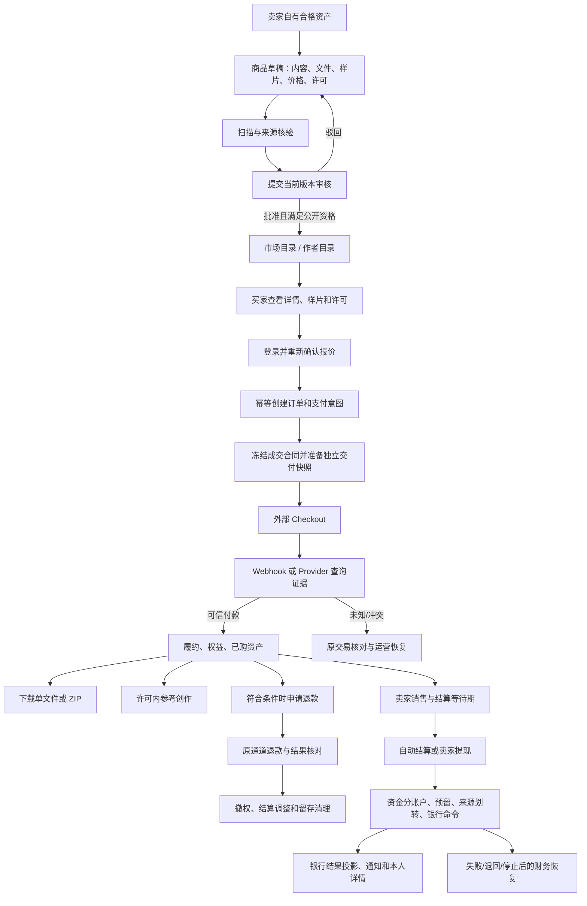

# 资源市场全链路地图

更新时间：2026-09-23

适用范围：当前工作区的资源市场源码、数据库迁移、前端路由和已记录的隔离测试。

**最新复核（2026-09-23）：** 当前源码的 marketplace Race（156.893 秒），payments 的拒付、Checkout、交付、多文件、来源撤回、销售及结算 Race 选择集（1348.682 秒），marketplace 非 Race 包（163.092 秒）、资源市场／支付相关 HTTP 选择集（211.618 秒），以及 jobs／productdelivery Race 定向回归已有通过记录。目标 1 本轮启动的 `go test -race ./internal/payments -count=1 -timeout 25m` 已在 1500.057 秒以退出码 1 终止，`panic: test timed out after 25m0s`，栈停在 `TestRecoveredPaidCheckoutCrossSourceAgreement/true` 的 `paymentTestPool` 迁移等待；这是定位证据，不是通过，也不单凭栈认定业务死锁。全仓 `go test ./...` 本轮未重跑，现有失败记录仍未解决。历史冻结快照和各项定向专项不能合并解释为当前源码全包通过；部署及真实 Provider、银行、对象存储、扫描器、SMTP、多实例 worker 和生产验收均未由本次复核证明。

**当前拒付边界：** 0173–0177 的迁移、拒付管理服务及 `admin:finance` 保护的目录/详情/操作 HTTP handler 与三条路由均存在；admin 领域定向测试和空 schema 迁移测试通过。拒付运营 OpenAPI 契约与 web client/管理页面入口未找到，专门 HTTP 权限/并发回归未执行；运行数据库未部署，真实 Stripe 未验收。不得把管理 HTTP 源码存在推断为完整运营闭环。证据矩阵见[完整链路 0.1](resource-marketplace-complete-flow.md#01-目标-1-当前基线拒付来源撤回与验证边界2026-09-23)及[审查记录 11.218](resource-marketplace-flows.md#11218-目标1源码基线与文档状态复核)。

本文是资源市场的交接入口。它回答四件事：用户从哪里进入、每一步产生什么业务证据、异常从哪里恢复、哪些能力还不能对外承诺。详细的支付、退款、来源返还和多文件交付规则继续分别维护在[资源市场完整链路](resource-marketplace-complete-flow.md)、[当前基线](resource-marketplace-current-flow.md)、[多文件商品交付](resource-marketplace-bundles.md)和[来源资金撤回](resource-marketplace-source-reversal.md)。

## 1. 状态口径

文档中的“已接线”只表示当前源码存在入口；它不表示线上数据库已经迁移或真实 Provider 已验收。

| 状态 | 含义 |
| --- | --- |
| 源码已接线 | 路由、服务、数据表或 worker 已存在 |
| 隔离验证通过 | 使用隔离数据库、模拟 Provider 或测试 API 的专项通过 |
| 待部署 | 需要迁移、API、worker、前端、配置或告警协调发布 |
| 待真实验收 | 需要真实支付、对象存储、扫描、SMTP、多实例、容量或银行联合验证 |

当前不能把“页面成功”“Checkout URL 已生成”“Webhook 已入队”“通知已发送”当作付款、交付、退款或银行到账证明。每个业务结果都必须回到服务端保存的证据。

## 2. 业务边界和角色

资源市场出售带许可的数字商品，当前目录覆盖提示词、工作流、素材和作品授权等商品类型，商品价格和结算币种按当前实现以 USD 为准。公开作品、社区帖子、委托任务和商品是不同对象：发布作品不会自动上架商品，收藏作品不会取得购买权益，购买商品也不会获得任务接单权限。

| 角色 | 入口 | 可以做什么 | 不能据此推断什么 |
| --- | --- | --- | --- |
| 访客 | `/market`、`/market/assets/:id` | 浏览公开商品、分类、排序、样片、价格和许可摘要 | 不能读取私密原件、订单或交付文件 |
| 买家 | `/market/assets/:id`、`/workspace/orders`、`/workspace/purchases` | 接受当前报价和许可、发起付款、查看订单、下载有效交付、申请退款 | 回跳页面不等于付款成功；退款申请不等于退款到账 |
| 卖家 | `/workspace/products/:id?`、`/workspace/sales/:id?`、`/workspace/payouts/:id?` | 创建商品、管理文件和样片、提交审核、查看销售和结算、申请提现 | 成交额、结算投影或来源返还不等于银行到账 |
| 内容运营 | `/admin/products/:id?` | 查看受保护版本、批准、驳回、封禁或允许重提 | 审核通过不替代付款、扫描和交付证据 |
| 媒体运营 | `/admin/deliveries/:id?` | 检查交付快照、恢复缺失交付、记录修复结果 | 修复入队不等于文件已经可下载 |
| 财务运营 | `/admin/payouts/:id?` 及支付管理入口 | 复核提现、确认来源划转和银行操作、核对支付/退款 | 批准不等于派发；Provider 成功响应仍需证据绑定 |

## 3. 端到端主链路

一笔交易排查时至少同时记录：`productId`、商品内容版本、`offerVersion`、`orderId`、`paymentId`、Provider payment/charge ID、交付资产 ID、作业 ID 和审计事件 ID。拒付或 Provider 无本地 ID 时，必须用 Provider、环境、PaymentIntent/Charge、金额和币种唯一绑定；无法唯一绑定则只保存证据并进入人工复核。

## 4. 卖家发布和审核

1. 卖家准备自有原件。资产必须属于本人，媒体扫描为 `clean`，来源和许可满足发布规则。
2. 创建商品草稿，填写标题、说明、类型、分类、USD 价格、许可、兼容性、AI 披露和包含文件。
3. 对多文件商品保存 2–20 个真实来源文件，并生成独立的样片和交付快照；样片不能替代收费原件。
4. 保存当前版本后提交审核。提交绑定内容版本，审核员读取受保护内容前后都要复核权限和版本。
5. 运营批准、驳回或封禁。只有批准版本、账户状态、媒体扫描、治理状态和许可都满足公开资格时才出现在目录。
6. 驳回后卖家修改并重提；已上架内容需先暂停或撤回再编辑。历史订单使用冻结合同，不因新版本修改而改变。

主要商品状态包括 `draft`、`pending`、`active`、`paused`、`rejected`、`blocked` 和 `removed`。商品状态、审核状态和公开资格是三个不同判断，不能把其中一个字段当作全部完成条件。

## 5. 买家购买、履约和售后

### 5.1 发现和详情

`GET /api/v1/products` 返回商品、总数、分类计数和不透明游标；搜索、类型、分类、许可和排序必须绑定到游标。商品详情只公开合格商品的可见字段、样片、卖家公开身份、报价、许可和 AI 披露。样片与收费原件分开授权。

### 5.2 下单和支付

买家在详情页接受当前许可后，客户端携带当前 `offerVersion` 发起 `POST /api/v1/products/:productID/checkout`。服务端重新检查商品状态、卖家/买家关系、许可、价格、币种、已有权益、支付开关和幂等键，再创建订单、支付意图、冻结合同和交付准备记录。

浏览器回跳只把用户带回原订单或商品页面。真正的付款结果来自签名 Webhook、Provider 认证查询或受控的人工核对。未知结果保留原交易，不能通过新建订单绕过核对。

### 5.3 交付、下载和复用

可信付款后，系统从冻结合同生成买家独立交付资产和权益。买家访问 `/workspace/purchases` 或订单详情时，仍需逐次检查当前用户、订单状态、权益、交付快照、媒体扫描和许可。卖家后续编辑不能替换已成交内容。

单文件和 ZIP 成员下载均通过资产内容权限校验；ZIP 不自动获得在线工作流执行权。许可允许时，已购资产可以进入参考创作，但生成提交时仍重新检查权益、用途和创作能力。

### 5.4 关闭和退款

付款页取消不等于订单关闭。买家只能对服务端确认仍可关闭的 Checkout 调用 `POST /api/v1/orders/:orderID/close-checkout`。退款调用 `POST /api/v1/orders/:orderID/refund`，必须提供有效原因、当前版本和请求键，并通过退款窗口、订单状态、原通道和已有退款检查。

退款申请后，权益在原通道确认退款前不能提前撤销；确认退款后才推进撤权、结算调整和条件清理。Provider 结果未知、迟到、重复或冲突时保留不可变证据，禁止重复退款或误撤权。

## 6. 卖家销售、结算和提现

1. `GET /api/v1/seller/sales` 只返回当前卖家的销售投影，不返回买家私密信息、Provider 凭证、源文件位置或退款理由。
2. 销售记录冻结商品标题、金额、币种、许可和订单关系；结算投影必须同时匹配卖家、买家、商品、支付意图、Provider、环境、金额和币种。
3. 自动结算或卖家提现前，系统按可用时间、退款/拒付、追偿、账户资格和财务 hold 计算可操作金额。销售额不等于可提现余额。
4. 卖家提现先选择完整结算并预留资金，再绑定不可变银行目标；财务复核、来源划转和银行出款是三个独立决定。
5. 银行命令持久化后由 worker 执行或恢复。只有可信 `paid` 结果同时满足扣账和证据绑定，才向卖家投影为成功；失败、退回、未知和停止任务进入恢复或人工核对。
6. 来源资金撤回的财务 GET/POST、共享页面、返还后的账本收尾、卖家安全状态、站内通知和白名单导出已有源码接线；部分/矛盾证据裁决、过期或未启动命令处置、外部银行对账和真实通道验收仍需单独完成。

## 7. 运营和异常恢复

| 现象 | 正确处理 |
| --- | --- |
| 报价或许可版本变化 | 重新读取商品并要求买家重新确认，不复用旧报价 |
| Checkout 创建失败或页面中断 | 打开原订单检查，不直接创建第二笔交易 |
| Webhook 缺失、重复或乱序 | 按 Provider 事件和本地支付身份幂等处理，未知结果进入查询 |
| 已付款但交付缺失 | 保留付款和订单证据，进入交付修复；不能先授予未经验证的文件 |
| 退款结果未知 | 保存原退款意图和查询证据，禁止重复派发 |
| Provider 拒付 | 0173/0174 保存事件并严格绑定原付款；0175–0177 管理迁移、服务和财务授权 HTTP 路由已存在。OpenAPI/管理前端入口缺失；举证/裁决后账本闭环及专项 HTTP 回归仍待完成 |
| 销售/结算关系不匹配 | 标记 `needsReview`，停止资金操作并由财务核对 |
| 银行成功后退回或停止 | 保留银行结果，按预留、追偿和来源返还规则恢复 |
| 账户停用或注销 | 撤销会话和交互权限；未决付款、退款、交付和财务证据按留存规则处理 |

恢复操作必须引用原订单、支付、退款、结算或作业记录，并写入操作者、原因、预期版本和审计事件。任何恢复接口都不能只凭页面状态改写外部资金结果。

## 8. 页面和 API 入口

### 8.1 前端页面

| 目的 | 页面 |
| --- | --- |
| 市场目录和商品详情 | `/market`、`/market/assets/:id` |
| 卖家商品 | `/workspace/products/:id?` |
| 卖家销售 | `/workspace/sales/:id?` |
| 卖家提现 | `/workspace/payouts/:id?` |
| 买家订单和已购内容 | `/workspace/orders`、`/workspace/purchases`、`/workspace/assets/:assetId` |
| 商品审核 | `/admin/products/:id?` |
| 交付修复 | `/admin/deliveries/:id?` |
| 财务复核 | `/admin/payouts/:id?` |
| 支持、通知、导出和注销 | `/support`、`/notifications`、`/settings` |

### 8.2 主要 API

| 方法 | 路径 | 作用 |
| --- | --- | --- |
| GET | `/api/v1/products`、`/products/:id` | 目录和详情 |
| POST/GET/PUT | `/api/v1/seller/products`、`/seller/products/:id` | 卖家草稿和版本维护 |
| POST | `/api/v1/seller/products/:id/:action` | 提交、暂停等商品动作 |
| GET/POST | `/api/v1/admin/products`、`/admin/products/:id/:action` | 审核和治理 |
| PUT | `/api/v1/products/:id/preview` | 更新独立样片 |
| POST | `/api/v1/products/:id/checkout` | 创建商品 Checkout |
| GET | `/api/v1/orders`、`/orders/:id` | 买家订单和支付返回查询 |
| POST | `/api/v1/orders/:id/close-checkout`、`/orders/:id/refund` | 关闭原 Checkout、申请退款 |
| GET | `/api/v1/assets/:id/content` | 受权限保护的单文件或 ZIP 内容读取 |
| GET | `/api/v1/seller/sales`、`/seller/sales/:id/events` | 销售和状态事件 |
| GET/POST/DELETE | `/api/v1/seller/payout-requests` | 卖家提现申请、详情、取消和银行绑定 |
| GET/POST | `/api/v1/admin/seller-payout-requests/:id/*`、`/admin/seller-source-reversals/:id/close` | 财务复核、来源划转、银行操作、来源撤回和收尾 |
| POST | `/api/v1/payments/webhooks/stripe`、`/payments/webhooks/waffo` | Provider 回调入口 |

所有写操作都必须使用真实登录会话；资源 ID、请求键、版本和权限由服务端重新校验。前端路由不会授予后端对象权限。

## 9. 数据与异步边界

关键对象包括 `products`、`product_listing_versions`、`product_listing_files`、`product_publications`、`orders`、`payment_intents`、`product_order_contracts`、`product_delivery_snapshots`、`entitlements`、`product_sale_owners`、`product_settlements`、提现/银行命令和 Provider 事件证据。

支付、交付、退款、结算、来源返还和通知均可异步执行。worker 的入队、租约、重试或心跳只表示作业状态；完成判定必须结合对应业务表和外部证据。所有分页游标绑定操作者、筛选条件和排序边界，不能跨用户或跨筛选复用。

## 10. 验收和上线顺序

1. 在隔离数据库应用迁移，验证商品发布、目录、Checkout、回调、交付、退款和提现的数据库约束。
2. 运行 marketplace、productdelivery、payments、datarights 和 HTTP API 的定向测试，再运行前端市场、购买、退款、交付和提现浏览器回归。
3. 使用 Stripe/Waffo 测试凭据、对象存储、扫描器、SMTP 和多实例 worker 做联合验收；记录每笔交易的完整标识链。
4. 部署 API、worker、前端和告警脚本，确认幂等、租约、恢复和回滚路径。
5. 生产启用前验证真实商户/环境绑定、银行账户、资金分账户、外部对账、备份和长期留存。

当前工作区的全仓测试仍不能标记为通过；已有隔离专项也不能替代真实 Provider、银行、存储或生产迁移验收。0175–0177 尚缺 OpenAPI/前端及完整专项与部署验收。已知测试限制和阶段证据以[资源市场完整链路第 0.1、11–12 节](resource-marketplace-complete-flow.md)及[详细审查记录 11.218](resource-marketplace-flows.md#11218-目标1源码基线与文档状态复核)为准。

## 11. 源码索引

| 区域 | 文件 |
| --- | --- |
| HTTP 市场和订单 | [`internal/transport/httpapi/marketplace.go`](../internal/transport/httpapi/marketplace.go) |
| 商品目录和筛选 | [`internal/marketplace/catalog.go`](../internal/marketplace/catalog.go) |
| 商品草稿、文件和审核 | [`internal/marketplace/publication.go`](../internal/marketplace/publication.go) |
| 销售和结算投影 | [`internal/marketplace/sales.go`](../internal/marketplace/sales.go) |
| Checkout、支付和退款 | [`internal/payments/product_checkout.go`](../internal/payments/product_checkout.go)、[`internal/payments/product_refund.go`](../internal/payments/product_refund.go) |
| 交付快照和修复 | [`internal/productdelivery/`](../internal/productdelivery/) |
| 前端目录和详情 | [`web/src/pages/MarketplacePage.vue`](../web/src/pages/MarketplacePage.vue) |
| 前端订单、购买和资产 | [`web/src/pages/WorkspacePage.vue`](../web/src/pages/WorkspacePage.vue) |
| 路由注册 | [`web/src/router/index.ts`](../web/src/router/index.ts) |

维护规则：新增资源市场能力时，先更新本页的链路、权限、状态和 API，再在专题文档中补充实现细节与测试证据；若只是隔离测试通过，不得把“待部署”或“待真实验收”改成生产完成。
