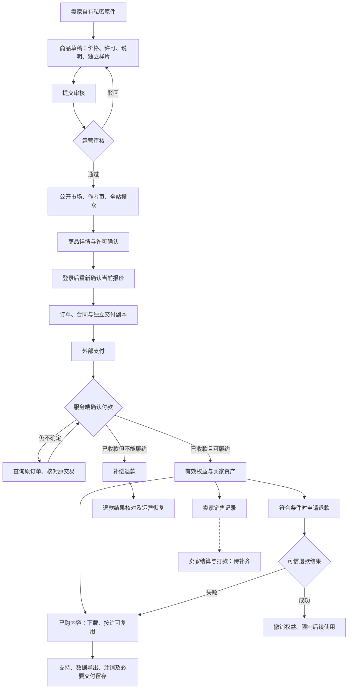
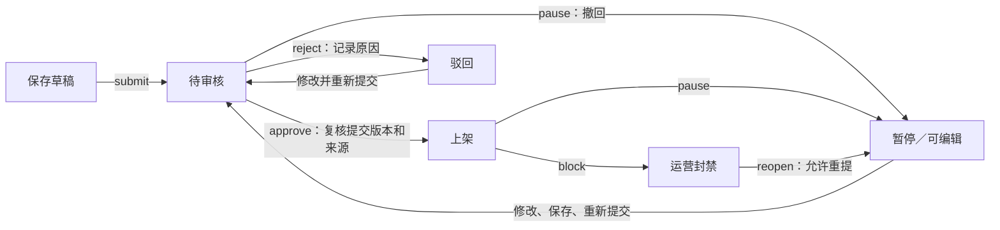
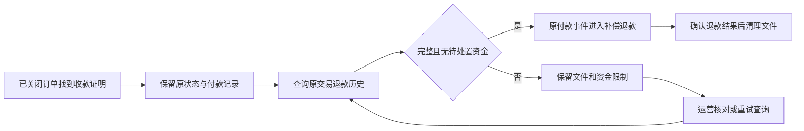

# 资源市场全链路总览

> 当前统一入口：[资源市场完整链路](resource-marketplace-complete-flow.md)。当前银行执行、财务操作入口、卖家结果与通知见该文第 7.12–7.14、11、12 节；0166 后端基线全包已通过，后续增量另有专项记录，真实联合验收待完成。本文保留原阶段细节，旧的待办和测试结论须按对应版本阅读。

**最新开户与任务付款基线（0147–0150）：** 首次 Stripe 开户先持久登记原商户／环境、原邮箱、请求版本和固定幂等键；响应丢失或本地保存失败后，只允许在预留起算的 23 小时内使用同一身份和原请求恢复。0148 进一步为新建 `payment_destinations` 保存原商户、可选店铺、正式／测试模式、端点、API 版本和请求版本，并在开户链接、`account.updated` 回调和商品结算时复核。0149 为新建任务付款保存同样的不可变身份快照，任务转账和任务退款在调用 Provider 前复核付款快照与收款目标绑定。0150 将 Waffo 商品 Checkout 查询回执、无 URL 已付款会话、候选／冲突／派发视图和 `checkout.observed` 事件约束接入数据库；错配、缺失或历史未知记录进入人工核对，不从当前配置自动回填。

**当前增量：** 工作区已有 0145 Stripe 转账认证查询、持久化检查记录及周期恢复代码，0146 以复合外键固定结算的订单／支付配对；0151–0153 已加入独立卖家资金账本、追偿冻结、幂等提现预留、模式切换、单笔分配释放和资金证据保护。定向卖家资金集成测试已通过，但申请仍只停留在 `under_review`，不会被误报为银行到账。Waffo 商品 Checkout 的只读查询边界已接入，但真实 merchant schema、分页／金额／时间语义和端到端验收仍待完成。流程及限制见 [卖家资金账本](resource-marketplace-all-flows.md#43-独立卖家资金账本与提现申请0151)、[提现模式与分配保护](resource-marketplace-all-flows.md#44-提现模式与分配保护01520153)，详细证据见 [当前基线](resource-marketplace-current-flow.md)。

前一阶段修复：[商品卖家结算凭证与一次性派发（0144）](resource-marketplace-flows.md#11157-商品卖家结算凭证与一次性派发0144)。结算冻结历史经济快照，按到期时间派发，使用持久化 reservation 防止重复外发，保留转账证据并校验退款追偿；相关隔离专项通过。已有 [计费 Waffo 原商户回调绑定（0141）](resource-marketplace-flows.md#11156-充值与套餐-waffo-原商户回调绑定0141) 和 0140 套餐版本验证保留历史范围。新增未知转账恢复代码的验证边界见上段；逐笔只读查询专项已通过，自动追偿、提现和真实联合验收仍未完成。

更新日期：2026-09-22。基线：当前工作区源码，包含尚未提交的修改；不代表运行中的开发库或生产环境已经部署这些能力。

首次阅读可先看 [资源市场完整链路](resource-marketplace-complete-flow.md)，再看 [资源市场全部链路交接文档](resource-marketplace-all-flows.md) 和 [资源市场业务与交接文档](resource-marketplace-journeys.md)：完整链路按实际操作顺序提供快速入口，全部链路保留详细规则，业务文档按买家、卖家、运营列出页面与接口，并集中标注当前未闭环项。本文继续保留展开说明与各阶段验证索引。

**本次交接校准：** 11.153 保留充值配置和客户端重试的阶段验证；0137 原计费请求快照及派发保护见 [专项证据](resource-marketplace-journeys.md#93-计费派发的源码与专项证据0137)，0138 套餐权益快照见 [合同专项](resource-marketplace-journeys.md#94-本次交付的源码差异与验证限制0138)。0141 已补 Waffo 原回调绑定，工作区另含 0142 Stripe 计费回调绑定代码；实现与验证边界见 [当前增量说明](resource-marketplace-journeys.md#1-资源市场负责什么)。未知结果恢复仍有未闭环范围，不能把历史阶段的待办直接当作当前代码缺失。历史结果见 [9.89](#989-充值配置与待确认支付重试0136)。

本文按买家、卖家和运营的操作顺序整理资源市场。接口字段、并发保护、迁移依赖及历史测试证据见 [资源市场全链路说明与审查记录](resource-marketplace-flows.md)。两份文档配合使用：本文用于理解业务，详细记录用于开发排查和验收。

本文覆盖公开浏览、注册登录交接、商品发布与审核、报价与许可确认、支付、交付下载、参考创作、退款售后、卖家销售、运营恢复，以及通知、导出和注销。已对照市场页面、前端路由及市场 HTTP 入口核对主要操作路径，并提供开发／测试交接索引。各阶段测试结果分别列明，不将历史结果视为当前全量验收。已付款会话定位及商户身份恢复后的交接问题已取得隔离反例并修复，参见 [定位证据复用](#959-已付款会话定位与后续核对0129)、[商户恢复证据复用](#960-核对原商户后已经确认收款的订单0130)；并发冲突保护见 [9.61](#961-同一订单出现相互矛盾的付款证明0131)及详细记录 11.125；关闭历史订单的恢复见 [9.62](#962-订单已经关闭但找到了收款证据0132)／11.126；原退款已发生时的历史确认见 [9.63](#963-历史订单已经退款但状态仍显示关闭0133)／11.127；原退款仍处理中时的自动跟进见 [9.64](#964-历史退款仍处理中时的自动跟进0134)／11.128。

**当前源码与验证基线：** 数据库源码包含 0143–0153；0151–0153 已加入独立卖家资金账本、追偿负债冻结、提现模式、分配释放和资金证据保护，卖家资金定向集成测试已通过。提现 provider 派发、撤回、自动追偿和人工核对仍待完成。历史测试不覆盖后续全部改动，本次未核验运行环境的迁移状态；代码存在、专项通过和生产部署是三个不同状态。

阅读导航：[交易交接总表](#12-一次完整交易的角色交接) · [完整流程图](#2-全链路图) · [页面与角色](#3-页面入口与角色) · [买家流程](#4-买家链路) · [卖家流程](#5-卖家链路) · [异常处理](#6-异常分支与运营处理) · [通知与数据留存](#7-通知账户数据与留存) · [接口交接](#8-接口与数据交接) · [剩余范围](#9-剩余范围与验收要求)。

最新人工退款核对权限修复见 [9.74](#974-人工退款核对入队期间撤权)：事务内锁定有效财务权限，拒绝撤权后的入队并保证旧证据回滚。前端错误提示补齐后 137 项单元测试通过，后端扩大验证以对应审查记录为准；运行环境尚未更新。

交接时建议先按第 2–7 节理解业务，再使用 [按角色验收清单](#91-按角色验收清单)逐项记录结果。开发排查使用 [详细规则与审查记录](resource-marketplace-flows.md)，多文件商品另外参照 [ZIP 交付专题](resource-marketplace-bundles.md)。

| 你需要了解什么 | 建议阅读顺序 |
| --- | --- |
| 买家如何完成一次交易 | [浏览与购买](#4-买家链路) → [交易完成的判断](#46-如何判断一笔交易真正完成) → [退款与售后](#45-退款与售后) |
| 卖家如何发布并管理商品 | [卖家链路](#5-卖家链路) → [发布与再次编辑](#51-发布审核和再次编辑) → [结算等剩余范围](#9-剩余范围与验收要求) |
| 运营如何处理交易和文件异常 | [异常分支](#6-异常分支与运营处理) → [通知与数据留存](#7-通知账户数据与留存) → [接口交接](#8-接口与数据交接) |
| 开发与测试如何接手 | [页面与角色](#3-页面入口与角色) → [模块交接](#81-与站内其他模块的交接) → [角色验收清单](#91-按角色验收清单) → [详细审查证据](resource-marketplace-flows.md#11-本次验证与后续验收) |

定位实现和测试文件时使用 [开发与测试交接索引](#82-开发与测试交接索引)。表中列出的是源码入口，是否已通过验收仍以具体审查记录的执行环境、时间和范围为准。

近期与交易入口、交付相关的基础设施变化另见 [私密下载](#944-已购文件下载与慢速连接)、[登录代理链](#945-注册登录的代理链与网络证据)、[验证码并发](#946-注册与登录验证码的并发重发)、[验证码摘要](#947-不同用户收到相同验证码时)和 [跨来源写保护](#948-其他网页不能代替用户发起写操作)。这些修复不改变下文列出的卖家结算和真实通道验收边界。

**最新验证摘要（2026-09-21）：** 下表仅概括已取得的结果；详细记录保留原始失败、修正和每次运行的范围，不能将不同阶段的通过结果合并为一次全量通过。

| 检查范围 | 当前证据与边界 |
| --- | --- |
| 市场账号、样片和审核交接 | 账号变化清除购买上下文，旧支付窗口／冲突反馈不跨访问，样片编辑独立失效；卖家草稿加载失败与同账号撤权均清除旧内容。新增 23 项纳入模拟 UI 共 74 项通过，单元 184 项、类型检查、构建及 lint 通过，见 [9.83](#983-市场和卖家页面的账号与权限交接)／11.147；未部署 |
| 退款证据访问与身份交接 | 五层访问拒绝统一清理；账号／权限变化关闭原检查，不在卸载前继续读取旧付款。新增 22 项纳入模拟 UI 共 96 项通过，单元 184 项、类型检查、构建及 lint 通过，见 [9.84](#984-退款证据的访问失效与重新检查)／11.148；后台父目录及其他财务表单仍待审查 |
| 后台父视图与共享目录交接 | 独立视图清空旧表单、目录和操作，父工作区 API 阻断旧结果的后续请求，共享目录保护并发刷新／续页。新增 12 项纳入模拟 UI 共 108 项通过，单元 194 项、类型检查、构建及 lint 通过，见 [9.85](#985-后台父页面与目录的身份交接)／11.149；独立子组件及同视图操作仍待核对 |
| 后台独立组件 | 分类／恢复／证据组件补齐旧请求及访问拒绝处理，已接受操作的暂时刷新失败保留确认结果。阶段验证见 [9.86](#986-分类恢复与证据组件的访问失效)／11.150；后续父页面处理见下一项 |
| 财务模型目录与父页面拒绝访问 | 财务专属账号使用最小模型目录；父页面 401／403 清理旧数据和表单，重新核对会话后只读取、不重放命令。最终模拟 UI 152 项、单元 196 项及后端定向 Race 3 主测试／9 含子测试通过，见 [9.87](#987-财务专属权限与拒绝访问后的恢复)／11.151；同视图并发与同账号重新认证仍待核对 |
| 同视图编辑与确认后刷新 | 旧结果不关闭新草稿，父表单拦截重复提交，已确认命令的失败刷新仅重读，旧聚合读取不覆盖新结果。最新模拟 UI 172 项、单元 196 项及构建／lint 通过，见 [9.88](#988-财务编辑与已确认操作的刷新)／11.152；其余独立表单及支付本地配置问题仍需处理 |
| 工作台账号与计费／生成交接 | 确认账号变化后清除原私密数据与草稿，旧账单／生成／任务分页及操作反馈不进入新视图；迟到 Checkout 关闭原等待窗口。模拟 API 浏览器 51 项、单元 184 项、类型检查、构建和 lint 通过，见 [9.81](#981-切换账号和工作台筛选后的私密数据)／11.145；未部署 |
| 资产切换与旧反馈 | 旧使用记录不覆盖当前详情，分页忙碌状态互不干扰，迟到上传不跳回旧资产，扫描与退款反馈限于原页面。模拟 API 浏览器 30 项、单元 184 项、类型检查和构建通过，见 [9.80](#980-切换资产或离开订单后的请求结果)／11.144；未部署 |
| 迟到响应与待确认操作键 | 旧会话成功／失败响应均须复核身份，不能清掉当前重试键或返回旧私密结果。最终前端单元 184 项、模拟 API 浏览器 20 项、类型检查、构建及定向 lint 通过，见 [9.79](#979-重新登录后到达的旧交易响应)／11.143；未部署 |
| 存储对象只读盘点 | 新增本地／S3 枚举、数据库快照对照和私密报告；定向 Race 45 主测试／155 含子测试通过，静态检查及编译通过。见 [9.82](#982-从存储侧发现未知对象)；不自动删除，不代表备份恢复或完整留存验收 |
| 先前固定后端源码完整回归 | 新增盘点代码之前的 811 文件快照：独立完整运行 34 包通过、17 包无测试，831 个主测试／含子测试 2321 项通过，无失败。崩溃子进程辅助入口按设计跳过，父测试通过。见 [11.143](resource-marketplace-flows.md#11143-迟到命令响应与固定源码完整回归)；非全量 Race，也不是新增代码后的当前全量结果，不代表真实服务或生产验收 |
| 身份切换与失败退出 | 登录／退出期间拦截业务写入，认证结果不明时核对实际会话；失败提示跨页面重挂载保留。单元 178 项、模拟 API 浏览器 20 项、类型检查、构建与定向 lint 通过，见 [9.78](#978-切换账号时暂停交易写入并核对失败退出)／11.142；未部署 |
| 商品提交与重试快照 | 摘要及请求正文使用同一份提交内容，避免计算期间的表单编辑改变原命令；保留旧待重试键。最终单元 163 项、模拟 API 浏览器 17 项、类型检查、构建及定向 lint 通过，见 [9.77](#977-商品提交内容与重试保持一致)／11.141；未部署 |
| 市场登录交接竞态 | 旧会话／资料响应不覆盖新账号，登录退出请求按顺序发送，切换期间不发送旧账号资料表单；最终前端单元 153 项、模拟 API 浏览器 17 项、类型检查、构建及定向 lint 通过。见 [9.76](#976-切换账号时的市场登录交接)／11.140；未部署 |
| 订单与交付双向入口 | 普通订单和付款返回卡片共用交付按钮，已购资产可定位首屏外原订单；最终隔离 UI 14 项、单元 137 项、类型检查和构建通过。定向 lint 无错误、2 条模板换行警告；API 全部模拟，无新迁移、未部署。见 [9.75](#975-从订单打开交付并返回原订单)／11.139 |
| 商品审核与私密原件 | 审核权限锁、旧快照拒绝、精确文件上下文及 HEAD／GET 中途撤权修复；市场整包和 HTTP／资产分组 Race 共 32 个主测试／含子测试 131 项通过，静态检查、API／worker 及前端构建通过。见 [9.73](#973-商品审核与文件下载期间撤权)／11.137；无新迁移，未部署 |
| 交付修复动态权限 | 单文件／ZIP 的耗时校验后撤权、写入和提交权限锁、HTTP 私密结果及既有修复回归，最终分组 Race 23 个主测试／含子测试 87 项通过，静态检查和 API／worker 本地构建通过。见 [9.72](#972-交付检查和修复期间撤权)／11.136；无新迁移，0135 基线，未部署 |
| 手工额度调整幂等 | 后端分组 Race 43 项、迁移补充复测、前端单元 82 项及最终浏览器 6 项通过；构建与静态检查通过。见 [9.71](#971-手工额度调整的重复提交0135)／11.135。0135 未部署；不是卖家结算或外部充值 |
| 财务设置与配置并发 | 四条路径的撤权、审计回滚、权限锁及配置并发验证通过；最终 admin／HTTP Race 13 个主测试／含子测试 47 项无失败或跳过，静态检查与本地构建通过。见 [9.70](#970-财务配置收款目标和额度调整)／11.134；该阶段无新迁移，未部署，后续调整幂等见 9.71，交付修复动态权限见 9.72 |
| 财务恢复与事件重放撤权 | 七条路径在入队事务内复核并锁定财务权限，事件重放增加操作者审计；最终三组 Race 共 12 个主测试／含子测试 44 项通过，无失败或跳过，静态检查与构建通过。反例及范围见 [9.69](#969-财务恢复与事件重放期间撤权)／11.133；未部署，后续财务管理与交付修复专项见 9.70–9.72 |
| 财务复核撤权与并发接纳 | 修复权限快照失效及回调／复核锁顺序死锁；最终支付与 HTTP Race 共 42 个主测试／含子测试 117 项通过，无失败或跳过，静态检查和 API／worker 构建通过。原失败及确定性对照保留于 [9.68](#968-财务复核期间撤销权限)／11.132；无新增迁移，未部署，不代表其他财务恢复权限或全系统验收完成 |
| 恢复操作撤权 | 账户／商品清理、导出和注销恢复在入队语句内校验当前权限，相关分组 Race 共 71 项通过。11.131 阶段的支付清单 319 个主测试已分阶段取得通过证据，原整包超时及迁移夹具失败仍保留；不代表一次当前源码全量通过。见 [9.67](#967-运营权限撤销后的恢复请求)／11.131，未部署 |
| 清理并发与查询编译 | 已减少重复权限投影，并将清理查询的 JIT 调整限定在事务内；连接复用、恢复响应、权限、留存和并发专项 Race 共 26 项通过。支付整包原运行超时，全部 114 项的续测及旧迁移夹具修正已完成，分阶段结果见 9.67／11.131。见 [9.66](#966-多人同时重试清理任务)／11.130，未部署 |
| 运行镜像与指标 | API／worker／migrate 的 ARM64、AMD64 镜像构建及实际 ELF 架构检查通过；Nginx 1.30.5 镜像通过 12 项代理检查。指标修正后 HTTP 整包 Race 150 项通过；支付整包仍有清理并发超时记录，单独复测通过不足以宣称全量通过。见 [9.65](#965-运行镜像和监控可靠性)／11.129，未部署 |
| 历史未决退款自动跟进 | 有原收款恢复依据的关闭订单，原退款仍处理中时按既有退避再次核对。支付 Race 58 项、HTTP 6 项通过，范围见 [9.64](#964-历史退款仍处理中时的自动跟进0134)／11.128，0134 未部署 |
| 原退款已发生的历史订单 | 完整查询和原操作证明唯一全额退款后确认已退款，不再次发送退款命令。扩大 Race 188 项通过、2 处旧迁移夹具失败修正后分别复测通过；HTTP 10 项通过。见 [9.63](#963-历史订单已经退款但状态仍显示关闭0133)／11.127，0133 未部署 |
| 已关闭历史订单收款 | 保存原付款后先核对退款历史，通过后走补偿退款；未决历史资金继续限制重复购买和文件清理。扩大 Race 160 项、最终补充 Race 25 项、HTTP 7 项、告警 105 项分别通过；范围见 [9.62](#962-订单已经关闭但找到了收款证据0132)／11.126，0132 未部署 |
| 并发付款证据冲突 | 一致结果合并来源继续履约；冲突持久保留并接入财务、退款、清理和告警。HTTP 9 项、告警 101 项通过；支付主回归的旧迁移夹具失败已修正并单项复测，详见 [9.61](#961-同一订单出现相互矛盾的付款证明0131)／11.125，不表述为一次全量通过 |
| 商户恢复收款与运营核对 | 完整已付款 Checkout 可供原／替代／缺失任务离线恢复，财务可在到期前核对；最终支付相关 Race 99 项、HTTP 7 项及浏览器 7 项通过，范围见 [9.60](#960-核对原商户后已经确认收款的订单0130)／11.124。历史退款核对仍独立保留，0130 未部署 |
| 已付款定位与共享核对 | 保存的认证付款证据可供原／替代任务正常履约；0129 保留迟到定位到共享任务的关联。支付相关 Race 229 项、HTTP 6 项通过，范围见 [9.59](#959-已付款会话定位与后续核对0129)／11.123；不是整包或生产验收，运行环境未升级 |
| 支付只读证据的写入失败恢复 | 支付查询、会话定位及商户恢复复用退款读取的有界事务重试，保留原响应；定位及商户恢复增加取消后的保存。Checkout／退款证据 204 项、商户恢复 19 项及 HTTP 6 项分组通过，范围见 [9.58](#958-已验证的支付结果遇到数据库事务中止)／11.122；无新增迁移，未部署，不是整包或生产验收 |
| 支付查询停止及迟到过期结果 | 已验证收款结果使用独立五秒保存预算；查询或签名回调已确认收款、履约仍排队时，迟到过期结果不能取消原订单。最终 Checkout 相关 Race 168 项、HTTP 2 项通过，详见 [9.57](#957-支付查询结束时停止进程与待履约收款)／11.121；不是整包或生产验收，未部署 |
| 查询进程中断恢复 | 0128 登记／后续完整核对、资金和交付保留、运营提示、本人导出及告警已接通。最终支付选择集按最新终态计 96 项通过，HTTP 6 项、告警 97 项、数据权利 2 项及浏览器 7 项通过；原始失败和分阶段范围见 [9.56](#956-查询进程退出后的交易保护与恢复)／11.120，不代表生产验收 |
| 退款证据写入冲突 | 最终支付专项 Race 86 项、HTTP 专项 5 项通过，修复真实并发事务中止导致原响应丢失；约束错误、提交不明和持续故障边界见 [9.55](#955-已取得退款结果后的数据库写入冲突)；不是全量支付或生产验收 |
| 迟到退款回执 | 迁移 0127、独立回执、共享资金／文件保护、财务分页和本人导出已接通；支付专项 Race 72 项、数据权利专项 2 项及浏览器 6 项通过。补充 HTTP／导出隔离结果见 [9.54](#954-查询被接手后返回的退款记录) 和详细记录 11.118；不代表完整资金异常处置或生产部署完成 |
| 退款查询旧执行与恢复 | 最新退款／查询 Race 62 项、任务队列整包 19 项、HTTP 专项 2 项通过；旧执行失败不会覆盖接手查询，终态重复投递保持幂等，见 [9.53](#953-旧查询执行不能把接手执行标记为失败)；不代表全支付包或生产验收通过 |
| 退款分页失败与证据保留 | 领域与读取边界 Race 57 项、HTTP 2 项通过；主回归升级为完整 Stripe runtime 后另有 1 项通过，含原商户校验、失败分页及空查询后的拦截，见 [9.52](#952-退款核对分页中断后仍保留已知结果)；未做真实支付验收 |
| Waffo 连接器响应与取消 | 固定 SDK 的本地连接器测试 34 项通过；新增商品 Checkout 只读查询契约，失败 HTTP 响应不再被解析成成功结果，请求结束会取消未完成的并行读取。Go 未决派发、回调及限流另有隔离专项记录，见 [9.51](#951-waffo-错误响应与并行请求结束)；不代表真实通道查询恢复已完成 |
| 目录身份保护后的 HTTP 整包 | 11.114 最终代码 85 个主测试／含子测试 146 项通过，无跳过；媒体、交付、注销及写入日志另有 167 项分组 Race 验证，不代表真实存储或生产部署验收 |
| 存储不可用与清理恢复 | 媒体／交付、交易清理、注销原件、HTTP 及写入日志的分组 Race 验证通过；无真实存储调用，范围与初轮失败记录见 11.113 |
| 来源保护阶段 HTTP 整包 | 11.112 阶段的 85 个主测试、含子测试 141 项通过，无跳过；此后存储变更的专项验证见 11.113，不将此前整包结果视为本轮全量通过 |
| 最终支付浏览器链路 | Chromium 9 项通过，使用隔离应用与模拟支付；没有真实扣款／退款验收 |
| 生产代理配置 | 12 组通过，覆盖启动、上传、日志隐私、私密下载、转发地址链及浏览器来源头；使用已有本地 Nginx 镜像，不是新镜像构建验收 |
| 注册登录代理链修复 | 相关 Race 选择集 14 个主测试、含子测试 30 项通过；修复伪造转发前缀导致网络证据和账户关联信号错误，详见 11.109 |
| 依赖升级后的 Go 全量回归 | 原运行 32 包通过、2 包失败；旧夹具与导出断言修正后，payments 794 项、httpapi 120 项整包复测通过，详见 11.104；原全量失败记录保留 |
| 上线前仍需完成 | 卖家提现与追偿处置、Waffo 查询契约补齐及真实恢复验收、剩余资金异常处置、历史交付迁移、真实支付／存储／扫描验收及生产构建部署 |

## 1. 业务范围

资源市场销售附带许可的数字商品，支持提示词、工作流、素材及作品授权四类商品。当前代码支持 **USD、独立单文件或 2–20 个真实来源组成的 ZIP 商品**；多文件提交、批准、公开购买及交付已接通，依赖配套迁移 0115 和新版 API／worker，运行环境尚未升级。商品类型为工作流不代表系统已实现工作流运行器。

公开作品、社区讨论、委托任务和市场商品分别使用不同业务对象。发布到灵感库不会自动上架市场；购买商品也不会自动解锁某个公开作品的历史付费提示词。商品买家的购买权益与任务交付授权分别管理。

**完成边界：** 买家交易、独立交付、退款、卖家发布审核和销售查询已有实现；卖家结算、部分历史交付与资金异常、真实支付及生产存储验收尚未完整闭环。Waffo 创建会话已有一次性派发保护，0150 已接入商品 Checkout 查询恢复的持久化证据和处理链路；真实商户查询配置与完整资金验收仍待完成，当前限制见[查询恢复边界](resource-marketplace-all-flows.md#701-waffo-商品-checkout-查询恢复边界)。[9.25](#925-waffo-创建收银台的不确定结果)保留早期阶段记录。不能将“已付款”理解为“卖家已到账”。

### 1.1 链路覆盖地图

以下按实际业务交接定位章节。“已有实现”只表示源码具备相应能力，具体回归范围以审查记录为准，不表示运行环境已经部署或完成生产验收。

| 链路 | 起点 → 结果 | 当前边界／阅读入口 |
| --- | --- | --- |
| 发现商品 | 市场／作者主页／搜索 → 商品详情 | [买家链路](#4-买家链路)：跨入口执行同一公开资格 |
| 发布商品 | 自有私密原件 → 草稿 → 审核 → 上架 | [卖家链路](#5-卖家链路)：独立单文件／真实多文件 ZIP、USD |
| 购买与确认 | 登录并确认报价／许可 → 订单及合同 → 外部支付 → 服务端履约 | [买家链路](#4-买家链路)：浏览器返回成功不授予权益 |
| 下载与复用 | 有效购买权益 → 独立交付副本 → 下载／许可允许的创作 | [买家链路](#4-买家链路)：文件读取及生成派发均需复核权限 |
| 退款与补偿 | 本人申请／付款后无法履约 → 持久化退款 → 可信结果 | [退款与售后](#45-退款与售后)：申请成功与退款到账分开 |
| 销售与结算 | 本人销售记录 → 成交条款和事件 → 实际结算 | [卖家链路](#5-卖家链路)：销售查询已有实现，结算尚未闭环 |
| 异常与恢复 | 待确认资金／损坏文件／失败任务 → 核对 → 受控恢复 | [异常处理](#6-异常分支与运营处理)：保留原失败证据，不以重试代替结果证明 |
| 通知与支持 | 业务事件 → 通知入口／关联工单 → 跟进 | [通知与留存](#7-通知账户数据与留存)：通知或工单关闭不改变资金结果 |
| 导出与注销 | 本人请求 → 导出／撤权 → 必要留存 → 到期清理 | [通知与留存](#7-通知账户数据与留存)：有效买家的交付不随卖家注销丢失 |
| 历史交付 | 证据缺口目录 → 核对原合同／文件 → 后续迁移 | [历史证据核对](#913-历史交付证据核对)：已有只读目录，迁移尚未完成 |
| 多文件商品 | 多个真实来源 → 草稿／核验 → 固定 ZIP → 整包／成员下载 | [多文件进展](#914-多文件商品当前进展)：发布至退款清理已通过隔离服务链路验证，真实支付与生产验收仍待完成 |

### 1.2 一次完整交易的角色交接

下面按实际业务顺序串联各角色。正常成交走第 1–8 步；退款、支持和数据清理属于后续分支。卖家结算单独列出，避免将买家获得内容误认为整笔交易的资金链路已经闭环。

| 环节 | 谁在哪里操作 | 交给下一环节的结果 | 中断或异常时的去向 |
| --- | --- | --- | --- |
| 1. 准备商品 | 卖家在资产工作台准备合格原件，在商品管理中创建草稿 | 商品 ID、真实文件清单、价格、许可、说明和独立样片 | 来源不合格或扫描未通过时先处理资产，草稿不能直接公开；见 [卖家流程](#5-卖家链路) |
| 2. 提交与审核 | 卖家提交，内容运营在商品审核页核对当前版本 | 当前内容获得审核批准，符合公开条件的商品进入市场 | 驳回后修改重提；封禁需运营允许重提；旧审核不能覆盖新内容；见 [发布状态](#51-发布审核和再次编辑) |
| 3. 发现与了解 | 访客从市场、作者主页或搜索进入详情 | 明确出售内容、价格、许可及兼容要求 | 商品失去公开资格时停止展示；公开样片不能替代私密原件；见 [发现与筛选](#41-发现与筛选) |
| 4. 登录与确认 | 买家登录后回到商品详情，接受当前报价和许可 | 当前会话身份、许可接受记录及报价版本 | 登录返回不自动购买；报价变化需重新确认，自购或已有有效权益被拒绝；见 [交易确认](#42-详情与交易确认) |
| 5. 创建交易 | 买家发起购买，服务端冻结合同并准备独立副本 | 原订单、付款标识、成交合同、就绪交付和外部支付会话 | 准备失败或会话结果不确定时查看原订单；仅满足关闭资格才可关闭；见 [下单与支付](#43-下单与支付) |
| 6. 确认收款 | 买家在外部付款，支付处理与后台任务核实原交易 | 可信付款证据进入履约流程 | 返回页不确认收款；超时、重复或矛盾结果转原交易核对；见 [异常处理](#6-异常分支与运营处理) |
| 7. 发放权益 | 后台在收款及履约条件成立后完成订单 | 本人有效购买权益和交付资产，买家可从订单进入已购内容 | 已收款但无法履约进入补偿退款；不提前发放权益；见 [交易完成判断](#46-如何判断一笔交易真正完成) |
| 8. 下载与创作 | 买家在已购内容打开交付，按许可下载或复用 | 经当前权限及完整性检查的交付；允许时进入创作 | 权益撤销、文件损坏或扫描限制会阻断操作；ZIP 不提供在线参考创作；见 [交付与复用](#44-交付下载与复用) |
| 9. 销售与结算 | 卖家在销售页查看历史成交及逐笔结算 | 成交合同、费用与等待期快照、结算事件和转账记录 | 已有自动转账与未知结果查询代码；提现、人工冲突处置及自动追偿未闭环，成交金额不是可提现余额；见[结算与提现边界](resource-marketplace-all-flows.md#4-卖家销售与结算) |
| 10. 退款与售后 | 买家从本人订单申请退款，或关联支持工单 | 持久化退款申请、通道结果、订单和权益变化 | 普通退款处理中保留有效权益；可信退款成功后撤权；未知、部分或重复资金结果仍需核查；见 [退款与售后](#45-退款与售后) |
| 11. 故障恢复 | 对应权限的运营核查资金、交付或失败作业 | 关联原交易的核对、修复或续作证据 | 原失败记录保留，入队不等于成功；交付修复必须符合原冻结字节；见 [异常处理](#6-异常分支与运营处理) |
| 12. 导出与留存 | 账户本人请求导出／注销，后台按保留规则推进 | 本人交易证据、撤权结果及符合条件的清理证明 | 有效买家权益、未决资金或法律保留继续保护必要文件；外部支付数据不随本地注销删除；见 [数据与留存](#7-通知账户数据与留存) |

通知贯穿审核、履约和退款等节点，只负责告知结果并提供关联入口。通知已读、邮件送达或工单关闭均不能代替交易完成证据。

### 1.3 排查时如何串起同一笔交易

| 标识或证据 | 用来回答的问题 | 使用边界 |
| --- | --- | --- |
| `productId` 和商品内容版本 | 买家看到、卖家提交、运营审核的是哪个商品版本？ | 当前商品内容不能覆盖历史成交内容 |
| `offerVersion` 和成交合同 | 买家确认的价格、币种、许可和交付依据是什么？ | 报价变化后不能沿用旧确认；已成交条款以冻结合同为依据 |
| `orderId` | 这次购买的订单、事件、退款和交付属于哪笔交易？ | 同一商品可以有不同买家的订单；读取仍需归属授权 |
| `paymentId` 和原通道证据 | 收款、支付会话及退款是否确实属于原交易？ | 浏览器返回参数仅用于定位；签名或认证结果仍需验证身份、金额和绑定关系 |
| 买家交付 `assetId` 和权益 | 当前用户是否能取得并使用这份交付？ | 卖家原件、公开样片、买家副本分别管理；知道资产 ID 不代表拥有权益 |
| 作业、核对及修复记录 | 谁在何时执行过什么，失败后接手的是哪一次操作？ | 保留原失败和后续关联，不能用新的成功记录抹去未解决的资金或文件问题 |

实际验收应同时记录场景、角色、环境、原交易标识、预期结果、实际结果及证据位置。已有场景清单见 [9.1](#91-按角色验收清单)。本次补充核对了前端路由、市场与发布 HTTP 入口、下单及权益处理源码，仅更新文档；未重新执行交易测试或确认运行环境已部署。

## 2. 全链路图

## 3. 页面入口与角色

| 角色／入口 | 用途与后续路径 |
| --- | --- |
| 访客：`/market` | 搜索、分类、排序、加载更多、列表／网格切换，进入商品详情 |
| 访客：`/market/assets/:productId` | 查看价格、许可、兼容说明、公开样片；这里的 ID 是商品 ID |
| 访客：`/creators/:handle`、`/search?types=product&q=...` | 作者商品目录及全站商品搜索，进入同一详情页 |
| 登录：`/auth?auth=login&returnTo=...` | 登录或注册后返回原页面，用户再次确认购买 |
| 买家：`/workspace/orders` | 本人订单、支付状态、成交条款、事件、关闭资格和退款 |
| 买家：`/workspace/purchases` | 具有有效购买权益的已购内容 |
| 买家：`/workspace/assets/:assetId` | 查看交付、下载、检查来源与复用许可 |
| 买家：`/create/:mode?sourceAssetId=...` | 许可允许时将已购资产作为创作来源 |
| 卖家：`/workspace/products`、`/workspace/products/new`、`/workspace/products/:id` | 私有商品目录、新建草稿、编辑、提交及暂停 |
| 卖家：`/workspace/sales`、`/workspace/sales/:id` | 销售目录、历史成交许可、交易状态与事件 |
| 运营：`/admin/products`、`/admin/products/:id` | 商品审核、原件核验、驳回、封禁及允许重提，需要 `admin:content` |
| 运营：`/admin/deliveries`、`/admin/deliveries/:id` | 交付副本检查、备份恢复及续作，需要 `admin:media` |
| 运营：`/admin`、`/admin?tab=dataRights` | 支付核对及受控任务恢复；每类操作独立检查权限 |
| 售后：`/support`、`/notifications` | 工单沟通与结果通知，回到关联订单或内容 |
| 数据权利：`/settings?section=privacy` | 本人数据导出、账户注销等请求 |

真实登录会话决定操作身份。登录不授予运营权限，知道订单或资产 ID 也不授予读取、下载或恢复权限。

## 4. 买家链路

### 4.1 发现与筛选

市场页通过 URL 保存关键词、分类和排序，默认按最新发布排序，也支持价格排序。列表支持加载更多；布局切换是页面本地状态，刷新不保留此前加载的全部页面。作者商品目录和全站搜索各自分页，不共享市场列表游标。

列表、详情、作者页和搜索都受公开资格约束。已下架、受治理限制、卖家状态异常或不满足媒体条件的商品，不能仅凭直接链接继续公开展示。公开样片与收费交付原件分离；没有样片不应使用私有原件代替。

界面复用 `PageHeader`、`UiFilterBar`、`UiFilterSearch`、`UiSelect`、`CategoryBrowser`、`UiLayoutSwitcher`、`UiCatalog`、`UiContentCard`、`UiCardContent`、`UiCardTag`、`UiCardActions`、`UiEmptyState` 和 `UiActionBanner`。

### 4.2 详情与交易确认

购买前展示当前价格、币种、许可、包含内容、兼容说明、AI 披露和作者信息。用户需明确接受许可；服务端将接受行为与当前 `offerVersion` 绑定。若价格、许可或相关报价内容改变，旧确认失效，重新读取并确认后才能继续。

未登录用户先登录；已有有效权益、自购、商品不可售或支付服务不可用等情况由服务端阻止。客户端按钮状态仅作引导，不能替代服务端判断。

### 4.3 下单与支付

1. 用幂等命令创建订单、支付意图和成交合同，绑定当前买家、商品及报价。
2. 准备并校验该订单的独立交付副本，再记录支付派发证据并创建外部收银台会话。
3. 浏览器打开外部付款页。成功返回带 `orderId`、`paymentId`，进入本人订单核对；取消返回也只引导查询原单。
4. 服务端根据可信签名事件或已认证的通道查询判断资金结果，经持久化任务执行履约。
5. 付款确认且可履约后生成有效权益与买家资产；无法履约则进入补偿退款，不授予未完成的交付权益。

**浏览器跳转成功不等于收款成功；关闭支付页不等于订单取消。** 会话或响应丢失时优先核对原交易，不能通过不断创建新单来解决。

### 4.4 交付、下载与复用

买家从订单进入已购内容，再打开自己的交付资产。新订单使用独立副本及冻结内容校验，后续卖家修改商品不能悄悄替换原成交交付。历史无副本订单存在兼容边界，不能视为已经完成迁移。

下载校验当前用户、原订单／权益／资产身份关系、活跃账户和交付状态；实际打开文件前后再次检查。参考创作另外检查许可、媒体与模型能力；提交生成及 worker 真正派发时分别复核，避免排队期间权益被撤销后继续使用。购买许可不自动授予转售或所有形式的复用权。

内部已接受的多文件订单现在按 ZIP 文件包交付：买家可查看每个文件的名称、类型、大小和摘要，下载整包或指定成员。读取单个成员仍校验整包，并复核全部来源扫描和当前权益。ZIP 不提供在线参考创作入口；多文件发布与公开购买已在 0115 接通，但不表示运行环境已部署，详见 [9.14](#914-多文件商品当前进展)。

### 4.5 退款与售后

普通退款从本人订单发起，服务端检查成交时许可中的退款窗口、订单及付款状态、既有退款和用户原因。原因要求 10–500 个 Unicode 码点；退款窗口按订单创建时间及冻结天数计算，到期时不再开放。

申请受理后持久化派发外部退款。普通退款未确认前保留有效权益；失败后不虚构资金退回。确认成功后撤销后续下载和复用权限，但不能追回用户已经下载到站外的文件。

履约失败的补偿退款另有持久化恢复链路。迟到回调、结果冲突或异常多次成功需要核对原退款证据；不依赖用户重复提交来补救。支持工单可记录问题、沟通和关联订单，关闭工单本身不执行退款。

已记录的 Stripe 未决退款现可自动只读核对：退款派发作业结束后，最早在原申请 15 分钟后查询，后续逐步退避至每天一次。查询核实结果后复用原退款处理；失败或取消时由运营恢复，保留此前证据。共享退款记录区分自动与运营发起。Waffo 和完整财务对账仍待完成，详细规则见审查记录 7.6。

### 4.6 如何判断一笔交易真正完成

下表区分不同业务对象的状态；它们不能合并成一个“成功”标志。字段示例用于定位当前实现，并非穷举所有历史状态。

| 检查对象 | 状态或依据 | 对用户的实际意义 |
| --- | --- | --- |
| 支付意图 | `checkout_pending`／`checkout_open` | 正在准备或已打开支付会话；尚不能领取商品 |
| 收款与履约 | 可信付款结果、订单 `fulfilled`、本人权益 `active` | 收款被核实且完成权益发放，才能继续按当前权限访问交付 |
| 独立交付副本 | `prepared` → `ready`，冻结大小和 SHA-256 校验通过 | 准备记录不等于文件已写完；文件就绪也不单独授予购买权限 |
| 普通退款申请 | 订单 `refund_requested`、付款 `refund_pending` | 申请正在处理；原有效权益在退款确认前保留 |
| 普通退款失败 | 原失败记录保留，当前订单恢复 `fulfilled` | 本次退款未成功，用户仍可按有效权益使用；后续操作需重新核对资格 |
| 退款成功 | 可信退款结果、订单／权益 `refunded` | 后续下载和受限复用被撤权，已下载到站外的文件无法追回 |
| 文件清理 | 副本 `removed` 与主存储缺失证明 | 清理是独立后续流程，还受法律保留和其他履约义务约束；退款成功不等于立即删文件 |
| 卖家收入 | 销售记录及历史成交金额 | 能查到销售不代表已结算或已打款，结算链路仍待完成 |

若页面状态与付款平台不一致，应沿原 `orderId`、`paymentId` 查询事件和核对记录。不要通过改数据库状态、重新创建订单或重复申请退款推定原交易已经结束。实现入口：[履约与退款](../internal/payments/workflow.go)、[独立副本状态](../internal/productdelivery/snapshot.go)、[副本清理](../internal/productdelivery/cleanup.go)。

## 5. 卖家链路

| 步骤 | 当前行为与限制 |
| --- | --- |
| 准备原件 | 选择符合发布条件的自有私密原件；购买或任务来源资产不能直接作为新商品原件转售 |
| 创建草稿 | 填写标题、说明、类型／分类、USD 价格、许可、AI 披露、兼容信息及单文件说明；可设置独立公开样片。多文件可选择 2–20 个真实来源、命名和排序，再提交完整清单审核 |
| 提交审核 | 再次验证来源与当前内容版本，进入待审核状态；不因保存草稿而公开上架 |
| 审核通过 | 运营检查当前提交版本和媒体资格，批准后进入公开目录 |
| 驳回与修改 | 卖家按原因修改后重新提交；上架中或待审核时不能直接编辑，先暂停或撤回 |
| 暂停／封禁 | 暂停影响后续销售；卖家不能自行解除运营封禁，需运营允许重提 |
| 查看销售 | 按成交合同归属展示订单、金额、历史许可及事件，支持交易环境筛选，不暴露买家私密资料 |
| 收入结算 | 销售记录已存在，但手续费、结算周期、打款和退款追偿尚未形成完整闭环 |

商品下架与历史买家交付分别处理。不能以卖家暂停销售或注销为由，直接删除仍承担履约义务的文件。

### 5.1 发布、审核和再次编辑

商品销售状态与审核状态分别保存。单文件与多文件商品共用以下流程；多文件的全部成员参与资格、提交及批准版本核验。

图中展示常用操作路径；运营封禁也可发生在其他允许处理的商品状态。`reopen` 只允许重新准备和提交，不会直接恢复上架。每次命令核验归属、权限和预期版本；审核员不能审核自己出售的商品。内容变更后旧提交版本不能继续批准。具体规则见 [发布服务](../internal/marketplace/publication.go)及审查记录第 8.1 节。

## 6. 异常分支与运营处理

| 场景 | 用户下一步 | 服务端／运营处理 |
| --- | --- | --- |
| 报价改变 | 重新查看详情并接受许可 | 拒绝旧 `offerVersion`，不沿用旧确认 |
| 浏览器拦截支付窗口 | 允许窗口后重试并检查订单 | 不把窗口打开失败当作付款成功 |
| 副本准备失败 | 查看原订单是否允许关闭 | 仅有证据证明从未派发的新协议订单可本地关闭；不确定时核对通道 |
| 支付取消返回、超时、状态延迟 | 查询原订单或联系支持 | Stripe 已有到期核对及部分历史会话定位；Waffo 查询和完整异常对账仍待补齐 |
| 已收款但不可履约 | 查看退款进度 | 建立补偿退款义务和任务，不虚发权益 |
| 交付文件丢失或损坏 | 提交订单问题 | 按冻结字节恢复独立副本并保留证据；不以其他版本替代成交内容 |
| 退款失败或结果矛盾 | 查看退款历史 | 按原商户和原交易核对，受控恢复并保留原失败记录 |
| 导出、注销或文件清理失败 | 查询原请求或由运营处理 | 共享恢复队列创建关联续作，复核权限与保留条件；入队不代表完成 |

交付修复支持原冻结来源、合格私有备份及专用原始备份上传。普通资产上传上限为 10 MiB，专用修复上传上限为 100 MiB；没有独立快照的历史订单不在该修复能力范围内。

## 7. 通知、账户数据与留存

履约、退款和审核结果通过相应通知或开发者 webhook 衔接业务入口。投递状态与交易状态分别记录，通知成功不能作为收款或交付证明，也不能据此推断已发送交易邮件。

个人导出包含本人范围内的市场合同、权益、支付／退款及恢复证据，并按卖家归属补入销售记录。交付文件正文、私密存储定位、支付链接及运营私密备注不属于导出内容。导出使用分块存储，下载为完整 JSON，正文下载期为七天；生成和下载仍受资源限制。

注销分为撤权／匿名化准备与物理清理。文件能否删除需考虑有效购买权益、待完成交易、法律保留及共享引用。原件、独立副本、修复副本和交易证据是不同留存对象；账户注销不会自动删除外部支付方的数据。

已实现的到期扫描、遗漏任务补发和受控恢复，范围见详细记录第 8 节。**这些能力不等于完整存量留存对账已经完成。** 跨账户旧原件误删已有复现和修复：清理按文件关联账户检查保留，只修改被注销账户自己的元数据，保留结束后重新调度原件所有者。并发及验证范围见详细记录 8.16、11.51。0105 进一步为有原始完成依据的已知原件补发遗漏清理，并在确认主存储位置缺失后保存逐文件证明，见 8.17、11.52；仍不能将专项修复视为完整生产验收。

## 8. 接口与数据交接

以下接口统一以 `/api/v1` 为前缀；完整参数、运营接口及持久化对象索引见详细记录第 9 节和 [OpenAPI](../internal/transport/httpapi/openapi.yaml)。

| 环节 | 主要接口 | 关键对象 |
| --- | --- | --- |
| 商品发现 | `GET /products`、`GET /products/{productID}` | 商品、分类、许可、公开样片 |
| 确认并下单 | `POST /products/{productID}/checkout` | 报价版本、幂等键、订单、付款、成交合同、交付快照 |
| 订单查询 | `GET /orders`、`GET /orders/{orderID}` | 本人订单、事件、退款及操作资格 |
| 安全关闭 | `POST /orders/{orderID}/close-checkout` | 原支付派发证据、关闭资格和幂等操作 |
| 退款 | `POST /orders/{orderID}/refund` | 冻结许可、退款请求、持久化作业及结果 |
| 退款核对历史 | `GET /admin/payments/{paymentID}/refund-checks`、对应 `GET /{checkID}` | 财务权限、分页摘要、原始查询证据和当前待核查关联；只读历史不触发支付平台请求 |
| 迟到核对回执 | `GET /admin/payments/{paymentID}/refund-checks/{checkID}/receipts` | 财务权限、固定每页一份、同一付款与查询内游标；独立保留完整／不完整的已验证响应，不直接改变资金状态 |
| 异常签名回调核查 | `GET /admin/payments/webhook-quarantines`、`POST /admin/payments/webhook-quarantines/{quarantineID}/recheck` | 财务权限、不可变最小化证据、版本及核查原因；重新接纳进入正常处理，不直接退款或授予权益 |
| 已购内容 | `GET /assets?source=purchase`、`GET /assets/{assetID}` | 买家资产、购买来源、有效权益 |
| 原件上传与重试 | `POST /assets/uploads`、`POST /assets/{assetID}/versions`，必需 `Idempotency-Key` | 本人上传命令、不可变请求指纹、独立尝试与原资产结果；首次 201、重放 200、内容冲突 409 |
| 媒体读取 | `GET /assets/{assetID}/content`；已购 ZIP 可加 `?fileIndex=0` | 本人有效权益、冻结交付及完整性校验；成员索引从 0 开始，仅接受清单内成员，不接受原件 ID 或存储位置 |
| 商品管理 | `GET/POST /seller/products`、`GET/PUT /seller/products/{productID}` | 私有草稿、归属与版本 |
| 许可选择 | `GET /seller/licenses` | 当前可选许可及使用、署名、退款等条款；成交后使用冻结版本 |
| 发布动作 | `POST /seller/products/{productID}/{action}` | 提交、暂停、审核状态和审计 |
| 样片管理 | `PUT /products/{productID}/preview` | 独立样片资格及报价版本 |
| 商品审核 | `GET /admin/products`、`POST /admin/products/{productID}/{action}` | 审核权限、提交版本、审核原因 |
| 审核原件 | `GET /admin/products/{productID}/content` | 原件／样片及版本校验；多文件草稿按 `fileIndex` 逐一核验，不是买家下载入口 |
| 销售查询 | `GET /seller/sales`、`GET /seller/sales/{orderID}`、对应 `/events` | 合同卖家归属、成交条款与事件 |
| 历史证据核对 | `GET /admin/product-deliveries/evidence-gaps` | 有界只读目录、证据缺口、续查游标 |
| 交付检查与修复 | `GET /admin/product-deliveries/{orderID}`、对应 `POST /repair`、`POST /repair-upload` | 原始大小与摘要、修复记录、独立新位置 |
| 上传与续作 | `PUT /admin/product-deliveries/{orderID}/repairs/{repairID}/content`、对应 `POST /resume` | 原字节备份、授权及留存复核、可追溯恢复 |

`productId` 标识出售对象，`orderId` 标识一次交易，`paymentId` 标识资金流程，`assetId` 标识原件或买家交付资产。授权由权益和合同决定，不能仅凭某个 ID 存在推断。

### 8.1 与站内其他模块的交接

| 相邻模块 | 如何进入／交接 | 必须保留的边界 |
| --- | --- | --- |
| 注册登录 | 未登录购买先进入认证，再返回商品详情 | 会话决定买家身份；返回后再次确认当前报价，不自动扣款 |
| 社区与灵感库 | 展示讨论或公开作品；市场出售独立商品对象 | 点赞、收藏或公开作品的提示词权限不等于商品购买权益；收费原件不得作为公开媒体泄露 |
| 作者主页与搜索 | 商品结果进入同一市场详情页 | 与市场列表执行一致的公开资格和媒体限制 |
| 资产工作台 | 合格自有私密原件进入卖家草稿；成交生成买家交付资产 | 原件、公开样片、买家副本分别处理；拥有买家副本不自动取得转售资格 |
| AI 创作 | 从已购资产进入参考创作 | 复核许可、媒体类型和模型能力；提交与实际派发都检查当前权益 |
| 已购内容与订单 | 订单展示交易证据，已购内容提供有效权益对应资产 | 订单存在不等于交付可用；下载仍需服务端鉴权与完整性验证 |
| 通知与支持 | 结果通知／私密工单回到关联业务 | 通知投递和工单关闭不能代替付款、退款或交付状态变更 |
| 运营与账户数据 | 审核、支付核对、交付恢复、导出和注销 | 各操作独立授权；导出本人证据，清理前检查权益、资金和法律保留 |

上述交接覆盖业务入口和数据边界，不意味着每个模块之间都存在直接跳转按钮。相邻模块自身完整流程分别见 [社区](community-flows.md)、[灵感库](inspiration-library-flows.md)和 [任务广场](task-marketplace-flows.md)。

### 8.2 开发与测试交接索引

前端入口以 [路由表](../web/src/router/index.ts) 为准，HTTP 注册以 [服务路由](../internal/transport/httpapi/server.go) 为准，字段契约以 [OpenAPI](../internal/transport/httpapi/openapi.yaml) 为准。下表将业务链路对应到主要实现和现有回归入口，便于接手后按同一流程核对；不是全部测试文件清单。

| 链路 | 主要实现 | 现有回归入口 |
| --- | --- | --- |
| 公开浏览、筛选与详情 | [市场页面](../web/src/pages/MarketplacePage.vue)、[公开目录](../internal/marketplace/catalog.go) | [公开资格](../web/e2e/public-marketplace.spec.ts)、[列表分页](../web/e2e/marketplace-pagination.spec.ts) |
| 公开样片与私密原件 | [样片服务](../internal/marketplace/preview.go)、市场页面 | [样片浏览器验证](../web/e2e/product-preview.spec.ts)、[媒体交易链路](../web/e2e/product-media.payment.spec.ts) |
| 草稿、提交、审核和暂停 | [共享卖家／审核页面](../web/src/pages/SellerProductsPage.vue)、[发布服务](../internal/marketplace/publication.go) | [发布浏览器验证](../web/e2e/product-publication.spec.ts)、[来源及版本验证](../internal/marketplace/publication_test.go) |
| 确认报价、下单和支付返回 | 市场页面、[支付履约](../internal/payments/workflow.go) | [购买异常交互](../web/e2e/product-purchase.spec.ts)、[支付返回](../web/e2e/product-payment-return.spec.ts)、媒体交易链路 |
| 原订单关闭与普通退款 | [工作台](../web/src/pages/WorkspacePage.vue)、[关闭服务](../internal/payments/product_checkout_closure.go)、支付履约 | [关闭验证](../web/e2e/product-checkout-closure.spec.ts)、[退款验证](../web/e2e/product-refund.spec.ts) |
| 单文件与 ZIP 交付 | [交付快照](../internal/productdelivery/snapshot.go)、[文件包快照](../internal/productdelivery/bundle_snapshot.go) | [完整文件包模拟交易](../web/e2e/product-bundle.payment.spec.ts)、[文件包下载边界](../web/e2e/product-bundle-delivery.spec.ts) |
| 卖家销售查询 | [销售页面](../web/src/pages/SellerSalesPage.vue)、[销售服务](../internal/marketplace/sales.go) | [销售浏览器验证](../web/e2e/seller-sales.spec.ts)、[合同归属验证](../internal/marketplace/sales_test.go) |
| 退款核对、迟到结果及进程中断 | [退款查询](../internal/payments/product_refund_checks.go)、[执行登记和恢复](../internal/payments/product_refund_read_executions.go)、[共享查询历史](../web/src/components/domain/RefundCheckHistory.vue) | [登记及丢失响应恢复](../internal/payments/product_refund_read_executions_test.go)、[历史展示](../web/e2e/refund-history.spec.ts) |
| 交付损坏与历史证据缺口 | [修复页面](../web/src/pages/DeliveryRepairPage.vue)、[修复服务](../internal/productdelivery/repair.go)、[历史目录](../internal/productdelivery/inventory.go) | [修复浏览器验证](../web/e2e/delivery-repair.spec.ts)、[历史证据展示](../web/e2e/delivery-evidence.spec.ts) |
| 本人导出、注销与交付保留 | [市场证据导出](../internal/datarights/marketplace_export.go)、[账户媒体留存](../internal/datarights/media_retention.go)、[交付清理](../internal/productdelivery/cleanup.go) | [数据权利浏览器验证](../web/e2e/data-rights.spec.ts)、[交易导出验证](../internal/payments/product_export_test.go)、登记及丢失响应恢复测试中的清理场景 |

测试证据需按层级理解：部分浏览器测试拦截业务接口，只验证界面和请求行为；`product-media.payment.spec.ts`、`product-bundle.payment.spec.ts` 使用真实应用接口与 worker、隔离数据及模拟外部支付；领域集成测试验证数据库和并发规则。以上都不能证明真实支付商户、生产存储或部署环境已经验收。

交接时每条验收结果至少保留：代码版本／工作区基线、数据库迁移版本、测试环境、执行命令、实际结果和日志位置。生产验收另记录真实通道与存储结果；如只有历史测试依据，应标为“历史专项通过，当前环境待验收”。

## 9. 剩余范围与验收要求

| 待完成范围 | 需要确认的最终结果 |
| --- | --- |
| 已付款定位证据与历史恢复 | 定位证据复用及共享核对已修复，见 [9.59](#959-已付款会话定位与后续核对0129)；仍需配套部署，并另行核对旧逻辑已取消／清理的历史订单，不能直接重置状态 |
| 卖家结算与退款追偿 | 明确费用及结算政策，验证从销售到实际到账、退款后的账务处理 |
| 历史交付与多文件商品 | 迁移旧交付而不丢失许可和来源；基于已接入的真实清单、校验及授权，完整浏览器模拟交易及已成交后的卖家注销／买家保留专项已通过；继续完成真实通道、其他跨账户并发组合和生产存储联合验收；0115 已接入审核／公开购买及旧 worker 拦截 |
| 已读取退款的持久化恢复 | 0128 在读取前登记，结果未保存时保留限制；后续完整原交易查询按时间、租约和身份条件核对恢复，已知退款观察独立保留。旧版本未登记读取和真实通道验收仍待处理，见 [9.56](#956-查询进程退出后的交易保护与恢复) |
| 完整支付异常对账 | Waffo 创建会话的一次性派发已接入 0120；仍需补齐主动查询，覆盖重复扣款、原商户证据缺失、通道结果冲突及真实回调 |
| 缺失支付核对任务补建 | 0124 已接入具备原始依据的 Stripe 订单补建、不可变派发记录及独立告警；需与 API／worker／告警脚本配套部署并完成真实通道验收，不能代替失败任务恢复或完整财务对账，见 [9.34](#934-原订单缺少支付核对任务0124) |
| 跨账户留存与原件清理 | 已知原件补发及逐文件主存储证明已接入；未知存储对象、外部恢复、备份清除与完整存量对账仍待验收 |
| 容量、留存策略和告警 | 验证多实例资源约束、超大账户、积压任务、留存期和生产存储恢复 |
| 原件上传持久化与清理 | 提交响应丢失误删及非活跃账户写入已有专项修复；0122 已接入上传日志、清理、账户交接和业务告警，并补充隔离专项验证；0123 已接入同键恢复原结果和前端重试，真实存储及容量验收仍待补齐，见 [9.30](#930-上传原件与提交失败的处理)、[9.31](#931-上传日志与失败清理0122) |
| 来源扫描中断恢复 | 0121 已接入原作业绑定、迟到结果拦截及有依据的失败转待审核；无依据历史任务和真实扫描效果仍待处理，见 [9.27](#927-扫描进程中断与人工审核交接) |
| 配套部署与生产验收 | 当前源码迁移基线为 0151；0124–0135 的支付核对、退款证据、未决资金留存、恢复和手工额度调整记录仍保留在历史章节，0141–0150 覆盖计费回调、商品结算、订单／支付绑定、收款开户、收款目标、任务付款身份和 Waffo 商品查询证据，0151 增加卖家资金账本与提现预留。部署还需满足此前多文件、上传、扫描和支付派发的依赖。按 [部署说明](../deploy/README.md)协调数据库、API、worker、前端、连接器及代理，停止不兼容的旧实例；运行环境未升级，真实通道、存储、多实例容量、提现派发和完整对账验收仍待完成 |
| 被拒绝的签名支付回调 | 0118 已接入最小化留存、财务复核、关联资金／文件保护与本人导出；完整通道对账、长期留存政策及生产验收仍待完成，见 [9.22](#922-异常支付回调的留存与复核) |

建议按三条旅程验收：买家从公开浏览到支付、下载、复用及退款；卖家从草稿到审核、上架、销售和暂停；运营从异常定位到恢复结果及审计核对。每条旅程都应覆盖未登录、越权、重复提交、处理中断、状态变化和失败恢复。

详细记录第 10 节维护 M01–M14 问题进度，第 11 节保留各阶段测试证据。总览整理核对源码和文档引用；跨账户留存、原件补发及清理证明的隔离集成验证见 8.16–8.17、11.51–11.52。完整包测试与最终修改后的定向回归分别记录，不将历史测试视为当前代码的全量验收。没有据此迁移或重启运行环境，亦未执行真实交易验收。

### 9.1 按角色验收清单

以下是后续验收的操作清单，不表示本次已经执行或通过。每条记录应包含商品／订单／付款编号、执行环境、预期与实际结果，以及对应事件或审计依据；不要记录密钥或完整支付链接。

| 编号／角色 | 操作链路 | 验收结果 |
| --- | --- | --- |
| R01 访客 | 市场筛选、排序、加载更多 → 商品详情 → 返回列表 | 筛选条件正确保留，无重复或遗漏；空结果、加载失败有明确出口 |
| R02 访客 | 作者主页／全站搜索 → 同一商品；访问已下架商品 | 入口一致执行公开资格，不能通过详情地址绕过下架或媒体限制 |
| R03 买家 | 未登录点击购买 → 登录／注册 → 返回详情 | 不自动购买；当前真实用户重新接受当前报价与许可 |
| R04 买家 | 接受许可 → 报价变更 → 下单；重复点击或重试 | 旧确认被拒绝；同一购买命令不会创建重复交易 |
| R05 买家 | 下单 → 独立副本准备 → 外部支付 → 返回订单 | 合同和交付依据可追溯；只有可信付款确认才履约，成功页不授予权益 |
| R06 买家／运营 | 取消返回、超时、响应丢失、迟到付款 | 查询原交易；有未决资金时不盲目重开订单；无法履约时跟进补偿退款 |
| R07 买家 | 已购内容 → 交付详情 → 下载 → 许可允许的参考创作 | 下载及生成派发都检查当前权益，交付内容符合成交快照 |
| R08 买家 | 窗口内申请退款 → 处理中／失败／成功；重复和乱序结果 | 状态不倒退、不重复撤权；普通退款确认前保留权益，确认后拒绝后续受限使用 |
| R09 卖家 | 合格私有原件 → 草稿 → 样片／许可 → 提交 | 原件与公开样片分离；保存草稿不公开，非法来源及未确认权利不能发布 |
| R10 卖家／审核员 | 驳回 → 修改重提 → 批准 → 暂停／封禁 | 审核绑定当前提交版本；卖家不能解除封禁，历史成交合同不被修改 |
| R11 卖家 | 销售目录 → 成交详情及事件 | 只显示本人合同销售；销售额与实际结算区分，不能宣称尚未实现的打款完成 |
| R12 运营 | 交付损坏 → 原字节备份修复 → 买家重新下载 | 复核权限与当前保留条件；新定位可追溯，不替换成其他内容版本 |
| R13 买家／运营 | 工单、站内通知、失败作业 → 关联业务 → 受控恢复 | 入口回到正确对象；恢复入队与资金／交付最终完成分开显示 |
| R14 账户本人／运营 | 数据导出／注销 → 必要留存 → 到期清理及失败恢复 | 仅导出本人证据；有效买家交付不随卖家注销丢失，物理清理有结果依据 |
| R15 多文件卖家／买家／运营 | 多文件草稿 → 审核上架 → 购买 → 整包／成员下载 → 退款、保留与清理 | 任一成员变化均参与资格／版本检查；服务链路及真实应用浏览器已覆盖草稿至签名模拟付款、下载和退款；已成交后的注销／保留／清理另有集成回归。真实通道和生产存储仍待验收 |
| R16 部署运营 | 配套迁移与应用升级 → 排除旧进程 → 真实通道及存储核验 | 新格式不被旧 API／worker 截断为首文件；升级、恢复、容量及告警均保留实际验收证据 |
| R17 财务运营 | 签名有效但交易校验失败 → 隔离证据 → 核对原交易 → 按版本复核 → 正常处理或继续待核查 | 原交易有关联疑点时阻止新的退款派发，包括履约失败补偿；保留交付文件和原始接收时间。无效签名不能形成可重放证据，其他用户声明不能冻结无关交易；复核不调用支付通道 |
| R18 卖家／账户本人 | 原件或版本上传 → 服务端保存后响应中断 → 同标签页刷新并重选相同文件／信息 → 重试 → 扫描 → 商品草稿 | 同一上传键返回原资产，不重复创建版本和扫描；同键更改内容被拒绝，其他账户不能恢复该结果。未完成写入保留独立清理证据；跨标签页或清空存储不保证恢复原命令，见 9.31–9.32 |
| R19 财务运营／后台执行 | 登记退款列表读取 → 响应未保存／进程退出 → 作业被接手 → 后续完整原交易核对 → 恢复及文件清理复核 | 登记失败不派发读取；接手执行的空结果不能直接消除原缺口。达到原读取及保存期限且原执行不再持有有效租约后，后续完整查询才可记录恢复；原正面证据及迟到回执仍独立复核。核对未决时阻止不符合资格的退款并保留所需交付，依据解决后仍由正常清理流程判断，见 [9.54–9.56](#954-查询被接手后返回的退款记录) |
| R20 买家／后台执行 | 支付查询已验证收款 → worker 停止 → 证据保存 → 重启履约；收款事件入库 → 履约排队 → 迟到过期查询 | 保存仅有五秒独立预算，读取错误和无效结果不入库；保存成功后原任务重放不重复查询或发放权益。查询／签名回调已经入库的收款阻止迟到过期结果取消订单及开放重购名额，见 [9.57](#957-支付查询结束时停止进程与待履约收款) |
| R21 买家／财务运营／后台执行 | 定位已付款会话 → 通道不可用或迟到过期查询 → 原／替代核对任务 → 正常履约 → 本人导出 | 原付款证据保护订单，正常履约只发放一次权益；定位和查询共享任务时继续安排履约，保留两次观察及来源；身份变更或矛盾证据继续待核对，见 [9.59](#959-已付款会话定位与后续核对0129)。相关隔离场景已通过，真实通道与历史异常仍待验收 |
| R22 买家／财务运营／后台执行 | 核对原商户取得付款证明 → 原／替代／缺失核对任务 → 履约 → 历史退款核对 | 保存的完整 Checkout 付款证据可供离线恢复，财务可提前安排核对；来源冲突或绑定变化拒绝履约，不补造原请求，不以收款证明代替退款历史。规则及验证见 [9.60](#960-核对原商户后已经确认收款的订单0130) |
| R23 买家／财务运营／后台执行 | 付款查询与恢复交错 → 一致结果合并／冲突记录保留 → 履约、退款、清理与告警 | 一致证据继续推进；冲突不能被重试忘记，已排队履约仍需复核，权益撤销后保留实际副本；运营须核对资金，见 [9.61](#961-同一订单出现相互矛盾的付款证明0131) |

跨角色还需覆盖越权访问、重复命令、执行中断和并发状态变化。真实支付、退款和生产存储验收应单独记录环境及结果，不能用模拟 Provider 测试替代。 本轮连接器取消／容量保护、实际查询契约准备和完整领域／HTTP 回归见详细记录 [11.83](resource-marketplace-flows.md#1183-waffo-连接器取消传播与响应容量边界)；随后补齐的跨平台文件名限制及最终专项见 [11.84](resource-marketplace-flows.md#1184-文件包的-windows-控制台设备名限制)。

### 9.2 Waffo 回调与退款的恢复边界

连接器现按入站请求传播取消，避免调用方断开后继续启动下一步远端操作；共享传输限制解压后的远端响应为 1 MiB，并将 20 秒截止时间覆盖到响应体读取。已发出的资金操作仍按未知结果核对，不因取消或超限认定失败。验证及只读 Schema 采集准备见详细记录 [11.83](resource-marketplace-flows.md#1183-waffo-连接器取消传播与响应容量边界)和 [连接器说明](../services/waffo-connector/README.md#capture-the-authenticated-query-schema)。

Waffo 退款现增加一次性派发依据（0107）：调用前先持久化预留，连接器核验上游票据的原付款、操作、金额和币种。响应丢失、错配或进程中断后不盲目重发，运营队列和共享退款记录显示待核对；迟到的可信资金结果仍可完成原操作。

0108 另补入商品回调的原门店、买家及订单核验：停用新销售或切换门店不再阻断有原始依据的旧订单结果。核验记录与事件同时保存，worker 再复核；缺依据的历史事件需要重新验证原始报文，详见 [5.13](resource-marketplace-flows.md#513-waffo-原交易回调与配置切换0108)。

这没有补齐 Waffo 查询及财务闭环。发送前中断但已预留的操作同样需要核对，不能靠删除凭据或重置作业恢复。API、worker、连接器与迁移需要协调升级；不能混跑旧 worker。实现及验收边界见详细记录 [7.7](resource-marketplace-flows.md#77-waffo-退款响应绑定与一次性派发0107)。

### 9.3 支付通道能力差异

下表仅说明资源市场商品交易的当前实现；充值、订阅和任务支付不能直接套用这些结论。

| 能力 | Stripe | Waffo |
| --- | --- | --- |
| 付款结果确认 | 已接入签名回调及已认证查询 | 已接入签名回调；主动查询恢复仍待补齐 |
| 新销售配置改变后的旧回调 | 已知商品事件独立于新销售开关；保留原验签密钥、版本及环境，接收和 worker 均核对原付款 | 0108 按原交易核验；须保留全局支付处理及原环境验签能力 |
| 退款派发结果不确定 | 依原商户及操作证据核对；已记录未决退款支持自动只读查询 | 0107 一次性派发后保留不确定状态，等待可信结果或核对；不得盲目重发 |
| 历史证据缺失 | 部分商户／会话身份已有受控恢复，无法恢复的交易仍待处理 | 原始请求缺失不能从当前配置推断；旧事件需符合原始正文重验条件 |
| 真实商户验收与完整资金对账 | 尚未完成 | 尚未完成 |

0108 的定向领域与 HTTP 回归、连接器验签测试和构建结果见详细记录 [11.55](resource-marketplace-flows.md#1155-waffo-原交易回调绑定与旧订单接收0108)。Stripe 配置切换及旧队列复核另见 [5.14](resource-marketplace-flows.md#514-stripe-新销售开关与既有商品回调分离)、[11.56](resource-marketplace-flows.md#1156-stripe-商品回调与新销售配置分离)。这些是隔离验证证据，不代表当前浏览器对应服务已部署或真实收付款验收通过。

### 9.4 服务端请求跳转与查询验收

Stripe 服务端请求与 Waffo 连接器现均拒绝自动重定向，避免金融请求转发或跳转目标提供不属于原端点的查询证据。Stripe 退款遇到跳转后保留未决资金状态和原有效权益，先核对原交易；不能把错误提示当作确定未退款，也不能据此另开退款操作。这不影响用户打开已校验的收银台链接。

Stripe 上一阶段回调修正的 payments 整包复测已通过；新跳转保护另通过定向 Race 和退款作业集成验证，两者范围分别记录于 [11.56](resource-marketplace-flows.md#1156-stripe-商品回调与新销售配置分离)、[11.57](resource-marketplace-flows.md#1157-stripe-请求跳转保护与-waffo-查询依赖核对)。Waffo 查询仍需真实已认证 schema 与测试商户验证，SDK 示例和匿名接口响应不能证明该链路完成。

### 9.5 样片与交付存储边界

S3 请求现拒绝自动跟随跳转；分段下载必须返回匹配的 206、范围和长度，完整下载不能被部分响应替代。资产 HTTP 在输出前还会核对文件大小和已知 ETag，避免检查后对象被替换时仍发送旧响应头与新内容。已购副本继续按冻结的 SHA-256 完整验证后交付。

本地协议及市场样片 HTTP 回归已验证正常、错配、跳转与恢复分支；这不能替代真实私有桶、缓存、备份及历史交付迁移验收。部署需使用正确桶区域和端点，详见 [6.10](resource-marketplace-flows.md#610-s3-请求边界分段读取与对象变化保护)、[11.58](resource-marketplace-flows.md#1158-s3-请求与媒体响应完整性)。

### 9.6 本地历史媒体与文件别名

本地媒体现只开放单硬链接的普通文件，拒绝符号链接、硬链接别名和特殊文件，避免不同 key 指向同一份收费原件而绕过公开样片隔离。读写和清理固定单次操作的目录，文件替换通过更明确的 ETag 识别；异常清理保留失败记录，不生成成功回执。

已有异常链接、进程中断遗留的 staging 链接需要核对后处置；不会自动删除未知文件。部署仍需保护根目录及其父目录，大小写、跨配置／挂载别名和历史迁移仍未闭环。实现与证据见 [6.11](resource-marketplace-flows.md#611-本地媒体的文件链接与目录边界)、[11.59](resource-marketplace-flows.md#1159-本地对象别名叶子替换与清理回执)。

### 9.7 退款与注销后的文件清理确认

订单副本和账户原件现共用删除后的缺失核验。存储服务仅返回“删除成功”不够；同一主存储位置还必须明确报告文件不存在。文件仍在、查询失败或只有部分修复位置清完时，任务保留待处理状态，买家注销也不会提前生成完成回执。恢复后沿原任务重新核验并收尾，不恢复已退款权益。

这不证明历史版本、备份、缓存或旧存储配置已经清除；此前 removed 的历史记录仍需专门对账。规则和验证见 [6.12](resource-marketplace-flows.md#612-副本清理必须核验主存储定位已不存在)、[11.60](resource-marketplace-flows.md#1160-副本删除确认与部分清理恢复)。

### 9.8 清理与账户恢复告警

交付副本、账户原件、导出、导出到期清理及注销现增加持续失败统计，不再只依赖最近 24 小时的失败尝试。已有明确重试关联的旧失败记录不重复计数，替代作业再次失败会重新触发；已关闭申请或已清除副本按运营队列规则排除。主体缺失或法律保留等不能立即重试的异常仍需人工核查。

`make metrics-check` 默认在上述任一失败存在时返回非零；缺少指标或监控查询失败也会报错。运营应沿共享队列核查和恢复，不能为了消除告警删除失败证据。零失败不代表资金、清理或交付已经全部完成。支付／退款积压监测另见 9.9；取消／缺失任务及实际告警推送仍需补齐。规则见 [8.18](resource-marketplace-flows.md#818-清理导出与注销的持续失败监测)，部署见 [监控说明](../deploy/OBSERVABILITY.md)。

### 9.9 支付与退款积压监测

资源市场现增加待创建支付、已过期会话、未决退款和到期未执行核对的数量与最久等待时间。退款按每次原始申请计算，父付款已经显示“已退款”也不会隐藏其他未决操作。更新交易或安排新核对不会重置这个等待时间。

监控另计入关联事件失败、最新退款核对失败／取消及关键证据异常；运营支付队列优先展示仍失败的事件，避免被后来的成功事件遮住恢复入口。金融检查默认只针对 live，也能显式检查 test／全部。阈值用于提醒运营调查，不会自动付款、退款、删除证据或推断资金结果。

历史未知资金、未关联事件、Waffo 主动查询、实际告警推送与生产容量仍未闭环。规则与验证见 [8.19](resource-marketplace-flows.md#819-资源市场支付与退款积压监测)、[11.62](resource-marketplace-flows.md#1162-支付积压计时与历史失败事件恢复)，参数见 [监控部署说明](../deploy/OBSERVABILITY.md#product-payments-refunds-and-settlements)。

### 9.10 后台周期扫描是否仍在运行

退款核对、法律保留到期及四类相关清理／注销扫描现持久化运行状态。监控会报告从未成功、最近一次失败或超过五分钟未成功的扫描，避免业务积压尚未形成显眼失败任务时，后台停止运行却不被发现。失败不会刷新“最近成功”时间，并发写入也不能用旧成功覆盖新失败。

上线需要配套迁移 0109 与新版 API／worker；当前工作区测试没有升级运行库。扫描完成不等于订单退款或账户清理完成，仍需查看相应业务结果。这是所有 worker 合计的扫描健康状态，不证明每个副本或整套生产监控已验收。规则见 [8.20](resource-marketplace-flows.md#820-后台周期扫描的持久化健康监测0109)，部署见 [维护扫描监控](../deploy/OBSERVABILITY.md#periodic-maintenance-health-0109)。

### 9.11 后台任务租约与中断恢复

商品履约、退款、交付清理等异步处理依赖共享作业系统。当前代码将过期租约回收放到执行槽位检查之前，避免 worker 满负荷时无法回收其他进程遗留的任务。每批最多回收 100 条，保留原执行尝试；达到尝试上限转为失败，否则重新排队。缺少匹配执行记录或租约信息异常的任务不会被自动重置，需要调查。

续租和成功／失败收尾在取得任务锁后重新检查租约时间；真正调用业务处理前再次续租，心跳超时则取消处理上下文。成功／失败状态写入也有期限，避免处理完成后仍被数据库锁永久占住执行槽。这些机制防止失效 worker 更新任务状态，但不能保证外部付款、退款或文件操作只执行一次，也不能强制终止忽略取消信号的处理函数。

当前代码另增加过期租约数量、最久过期时长和异常租约数量指标；脚本默认对超过 60 秒的过期租约、任意异常租约报警。这是全局作业指标，不按商品或交易环境拆分。延迟领取、心跳超时、收尾锁等待和实际指标联动已通过隔离回归；未升级运行环境或完成生产验收。实现、测试范围与运维处理见详细记录 [8.21](resource-marketplace-flows.md#821-共享作业租约与中断恢复0110)、[11.65](resource-marketplace-flows.md#1165-租约恢复收尾阻塞与告警联动)及 [租约监控说明](../deploy/OBSERVABILITY.md#running-job-leases-0110)。

### 9.12 交付校验容量与暂时失败

下载已购文件、准备订单副本和修复文件共用进程内暂存预算，默认最多预留 512 MiB、16 个文件，并保留 64 MiB 文件系统剩余空间。下载响应关闭后才释放额度；满额或暂存目录不可用返回可重试错误，不把临时容量不足判为交付文件永久丢失。

下单事务提交前失败不会派发支付；已有订单继续引导处理原单。已收款的履约遇到容量不足时沿原作业重试，不提前授权或仅因此触发退款。以上恢复分支已通过隔离测试。

生产模板为 API、worker 各增加独立 768 MiB tmpfs，消耗实际内存，且预算不跨实例共享。部署需要同时计算导出、交付和应用内存，不能直接把代码默认值视为生产容量验收。配置、错误和验证范围见详细记录 [6.13](resource-marketplace-flows.md#613-交付校验的共享暂存预算)、[11.66](resource-marketplace-flows.md#1166-交付校验暂存容量与交易恢复)及 [部署说明](../deploy/README.md#verified-product-media-staging)。

### 9.13 历史交付证据核对

媒体运营现在可在 `/admin/deliveries` 按证据缺口、交易环境和有效权益／待支付筛选旧订单，查看缺合同、未冻结交付、必需副本缺失及副本未绑定记录。仅显示原订单信息和处理提示；有快照记录时可进入原文件检查入口。

列表按最多 500 笔订单逐批核对。当前批次没有匹配项时仍可能有下一批，页面显示“继续核对”；已核对数量不是全站订单总数。目录只查询数据库证据，不读取原件、不补造旧合同，也不自动迁移或授权。

查询依赖配套索引迁移 0111 的容量支持，目前仅在隔离环境验证。完整历史交付迁移仍待收集可信原始文件／成交依据并实施。分类、分页和验收见详细记录 [6.14](resource-marketplace-flows.md#614-历史交付证据核对入口0111)、[11.67](resource-marketplace-flows.md#1167-历史交付核对目录与有界分页)。

### 9.14 多文件商品当前进展

底层已具备真实文件清单、固定 ZIP 封装及完整校验后的逐文件读取，整包与每个文件均有摘要。现有单文件交易回归通过。

0112 已将真实来源清单接入私有草稿：可添加、移除、排序并保存 2–20 个文件，刷新后恢复；全部成员参与版本和原件公开隔离，审核员有逐文件核验入口，个人导出保留安全清单。旧客户端不能漏传清单而静默截断，多文件草稿也不能被旧代码直接标记为在售。

0113 已把全部来源纳入报价／合同投影，接入内部独立 ZIP 准备、校验、中断恢复和本人导出。当前来源或商品修改不改变原订单文件，任一成员字节与成交依据不符时拒绝写入。

0114 进一步将每个原件、冻结位置及关联账户接入注销／法律保留和结束保留后的清理调度；运营可按全部原件重建，或使用完整 ZIP 备份／上传恢复，保持原交付摘要。等待锁后会再次核验运营权限。

下单路径现已按固定顺序锁定全部来源，等待完成后重新读取资格和报价；重试已有付款使用原合同。内部已接受订单的履约会检查全部来源，生成 ZIP 文档资产。买家可通过有效权益下载整包或稳定索引对应的文件，校验前后都会复核权限；第二个文件被隔离同样阻止整包读取。共享媒体组件按文件包显示，不将 ZIP 自动读成文本或送入生成模型。

0115 已将多文件接入与单文件相同的提交／批准流程，公开目录逐个检查所有成员。隔离集成测试从真实草稿和审核出发，走通下单、签名模拟付款、整包／成员下载、签名退款和物理副本清理；浏览器覆盖多文件发布／暂停。新增数据库约束拒绝首文件冒充整包，旧 worker 不能领取／续租作业。升级必须先停止旧 API、排空 worker；数据库协议标识不能替代流量切换，也不能停止已经发出的外部请求。运行环境未升级；完整浏览器模拟交易新增验收见 9.15，真实通道及生产容量仍待验收，详见 [6.20／11.73](resource-marketplace-flows.md#620-多文件发布公开购买与协议保护0115)。完整接入要求见 [多文件交付实现说明](resource-marketplace-bundles.md)，草稿回归见 [11.69](resource-marketplace-flows.md#1169-真实多文件草稿原件隔离与逐文件核验)，合同／快照回归见 [11.70](resource-marketplace-flows.md#1170-多文件合同与独立-zip-快照0113)，留存／修复回归见 [11.71](resource-marketplace-flows.md#1171-多文件全部来源留存与整包修复0114)。

### 9.15 完整浏览器交易与已成交后的保留验证

独立支付浏览器套件通过真实应用 API、worker 和三名独立登录用户，完成卖家上传两份文本原件、填写多文件草稿、逐文件审核批准、买家接受许可、创建订单、签名付款、整包／单文件下载与签名退款。外部收银台及支付服务使用本地模拟；返回成功页在付款证据到达前不能授予权益，重复回调只产生一次业务结果。下载核对原始字节及摘要，中文下载名保留；退款申请时可下载，可信退款成功后撤权。390／1308 宽度检查没有横向溢出。

这条链路发现并修复了 UTF-8 文本上传与打包校验不兼容：上传记录的 `text/plain; charset=utf-8` 现按原值保存在合同／文件清单中，其他任意 MIME 参数仍拒绝。不会通过删除 charset 或修改已接受合同来掩盖问题。

另一项服务集成从真实已成交多文件订单开始，验证卖家注销不影响买家的独立交付；买家法律保留期间不会清除相关原件和交付包。退款撤权后，实际入队的清理作业在保留解除后完成整包、两份原件清理及逐原件回执。

运行 `make e2e-payments`，与 `make e2e` 顺序执行，二者使用相同隔离 schema。CI 独立任务已加入这项验收；本地通过不等于远端 CI 已执行。测试范围及终态见 [11.74](resource-marketplace-flows.md#1174-完整浏览器交易utf-8-原件兼容与已成交保留)。真实商户、生产存储、卖家结算与历史数据迁移仍需后续完成。

### 9.16 单文件媒体与文本预览

PNG、JPEG、H.264 MP4、WAV、MP3 和 UTF-8 文本现有代表性文件的完整浏览器验收：真实上传与审核、独立公开样片、购买、实际解码／播放、完整下载、Range 与退款撤权。样片和收费原件使用不同内容，访客不能读取原件；退款不影响独立样片的公开资格。

共享文本预览限制为前 64 KiB，并在截断时明确提示；完整下载不截断。请求超时会退出加载状态，服务端忽略 Range 时客户端也会停止读取。这一规则同时用于市场、已购内容及其他复用共享媒体组件的页面。

本地模拟支付浏览器与共享组件回归已通过，范围和命令见 [11.75](resource-marketplace-flows.md#1175-多媒体实际购买验收与有界文本预览)。这不等于真实商户、其他浏览器／任意编码和生产存储验收通过；卖家结算规则及实现、历史迁移和资金对账仍待完成。

### 9.17 历史订单读取与当前权限

旧订单与新版交付现在共用购买权限检查。退款、账户停用、原始来源扫描拒绝或订单归属不一致后，先前取得的文件读取对象不能继续打开文件；准备期间失去权限会关闭文件流。详情页按钮与创作引用使用同一规则，退款申请期间仍有效的权益继续可用，卖家下架或注销不自动剥夺买家权益。

历史外部订单缺少合同、合同缺少存储定位、必需副本不可用或有未绑定副本时，不回退读取当前商品文件。历史内部权益仍保留既有来源读取兼容，但不因此认定其付款证据完整或授予退款能力。订单和运营核对记录保留，需按原始证据恢复；系统不会用今天的商品重写历史合同。

这项保护不等于完成历史文件迁移，也无法追回已经下载或开始传输的字节。无旧摘要的历史文件仍有原定位被覆盖的风险。规则与验证记录见 [6.21](resource-marketplace-flows.md#621-新旧购买文件统一鉴权与历史缺证据边界)、[11.76](resource-marketplace-flows.md#1176-新旧交付读取鉴权统一与历史外部订单保护)。

### 9.18 样片和普通媒体的即时权限

市场样片现在与普通资产共用实际读取前后的权限复核。商品下架、样片取消、扫描拒绝或卖家停用导致公开授权失效时，正在准备的文件流也会关闭。文件换址后旧读取对象失效，新请求按当前资格解析位置；仍有效的独立公开作品、站点图标或所有者权限继续生效。

自有参考资产在提交、重试和 worker 派发时也检查活跃账户。账户停用后相关排队任务不再外发引用，并释放预留额度。无参考资产任务及外部生成已开始后的本地结果保存现另补入账户生命周期保护，范围与限制见 9.19。详情与实际测试范围见 [6.22](resource-marketplace-flows.md#622-样片普通资产与任务媒体的读取复核)、[11.77](resource-marketplace-flows.md#1177-公开样片在途读取普通媒体权限与自有引用账户)。

### 9.19 生成任务与账户注销

使用购买内容作为参考，或不带参考直接创作，都要求账户活跃。提交、重试和结果保存会核对账户；停用后在途任务不再保存新结果、扣取预留额度或创建通知。实际执行注销会取消未完成生成、释放其积分及旧币值预留，清空生成输出文本和参数，迟到结果不恢复这些内容。

结果写入和注销现在共用账户锁：若结果已经进入保存事务，注销会等待提交，再通过资产清理处理它；已经完成的合法计费记录继续保留。法律保留和注销失败回滚不会误取消正常生成。

这不代表外部模型收到的内容可以追回。存储写入后进程崩溃、数据库提交响应丢失的后续保护见 9.20；历史孤立文件、远端版本／备份及生产容量仍需验收。规则与本轮验证见 [6.23](resource-marketplace-flows.md#623-生成结果与账户注销的串行化)、[11.78](resource-marketplace-flows.md#1178-无引用生成账户注销与结果保存并发)。

### 9.20 生成文件异常后的安全清理

生成媒体现在先记录唯一写入位置和摘要，再保存文件。文件与资产、扣费、通知的归属一起提交；数据库提交成功但响应丢失时，不再直接删除已经交付的结果。进程崩溃或存储返回异常留下的文件仍有记录，可由后台恢复清理。

清理尊重法律保留和交付引用；无法确认文件归属或字节不一致时停止删除并告警。已清理位置每小时复查，处理超时后才落盘的写入。账户注销也必须处理这些未归属文件，失败时不提前宣告删除完成。

该能力依赖 0116 和新版 API／worker，运行环境尚未升级。它不覆盖旧未知文件，也不保证模型只调用一次；长期留存、容量及生产存储验收仍未完成。规则及验证见 [6.24](resource-marketplace-flows.md#624-生成媒体写入记录不确定提交与清理恢复0116)、[11.79](resource-marketplace-flows.md#1179-生成媒体写入记录崩溃恢复与提交响应丢失)。

### 9.21 生成执行中断后的任务与额度恢复

生成结果用于商品来源或购买后的创作时，最后一次执行中断可能导致队列已失败、页面却仍显示运行中。现在每个生成任务固定关联实际作业：旧执行租约到期或被替换后，迟到结果不能保存、扣费或改写新尝试。

后台根据明确的作业和尝试失败证据，自动结束仍未完成的生成，释放积分及旧币值预留，并加入失败通知／审计任务。有剩余自动重试时继续保留额度；人工重试产生新任务，保留原失败记录。余额不一致会整笔回滚并告警，避免表面显示“已释放”却没有实际释放。

依赖 0117 与新版 API／worker，运行环境尚未升级。缺少或冲突的历史执行证据会进入待核查指标，系统不会凭时间推断失败；外部模型请求也不保证只执行一次。规则和验证见 [6.25](resource-marketplace-flows.md#625-生成作业终止后的额度收尾与租约复核0117)、[11.80](resource-marketplace-flows.md#1180-生成最后一次执行中断后的业务收尾)。

### 9.22 异常支付回调的留存与复核

签名正确仍不代表回调属于当前交易。金额、原交易身份或事件内容冲突时，应拒绝履约，并留下可核查依据。工作区 0118 为已验签且完整解析、随后被交易校验拒绝的商品事件增加独立隔离记录；无效签名、解析失败及不兼容报文不属于该可复核记录范围。

财务运营可在管理页查看记录，用当前版本和原因重新核验同一份证据。`pending` 表示仍待核查；`admitted` 只表示进入正常事件处理，**不表示付款、退款或交付已经完成**。复核不会修改原回调、直接发起支付或退款，也没有“忽略冲突并放行”的操作。

关联保护要求本地付款、通道、环境及原远端交易编号匹配；不能仅凭回调声称的本地订单编号冻结其他交易。当前代码将符合关联条件的待核查记录纳入再次购买、退款派发、普通副本清理及账户删除的资金复核。页面显示当前保护状态，不把历史匹配或证据接纳误报为仍冻结。

**状态：已接入，完整财务对账与生产验收仍未完成。** 本阶段验证独立记录于详细文档 11.82，不沿用此前支付模块或 0117 的通过记录。本人导出仅包含由原交易匹配或正式接纳证明归属的最小化记录，排除无关声明和运营私密原因。永久冲突的可信解决方式、长期留存策略、真实通道及生产验收仍待补齐。详细交接见 [5.16](resource-marketplace-flows.md#516-被拒绝的签名商品回调留存与复核0118)。

### 9.23 Stripe 验收工具与真实交易验收的区别

现有 Stripe 工具仅创建并清理测试 Checkout、Connect 账户及入驻链接，不确认付款。已修正交错运行清理错账户、失败清理超过预算以及底层透明重试导致计数失真的问题；失败会输出待清理对象或创建结果不确定的原幂等键，供核对原测试记录。最新版本先通过 Balance 认证测试环境，明确预算为 6 次应用请求，旧的 5 次配置会拒绝启动；新增的只读核验计入预算，且核验失败不会创建对象。命令见[部署说明](../deploy/README.md#stripe-test-object-acceptance)，最新本地验证见[11.167](resource-marketplace-flows.md#11167-stripe-开户环境与账户证据契约修正)。

本地 HTTP／HTTPS 专项通过，未调用真实 Stripe。工具通过也不代表付款、退款、商品交付及卖家到账全部通过。操作要求见 [部署说明](../deploy/README.md#stripe-test-object-acceptance)，复现、字段和测试证据见 [11.85](resource-marketplace-flows.md#1185-stripe-测试验收的请求预算与清理证据)。卖家抽成、结算周期及已结算后退款的追偿政策仍需确定，不能用默认比例代替业务决策。

### 9.24 原退款任务超过安全重试时间

Stripe 未确认退款现在按原退款操作时间限制派发：达到 23 小时、时间异常或缺失时，不再直接重发，转入原交易核对。后台使用已有“需要退款核对”状态与查询入口；订单时间刷新、任务重建不能延长该窗口。这是退款命令的重试保护，不缩短商品合同允许的退款申请期。

原商户查询确认成功后完成退款和撤权；确认失败后保留权益，并按原有政策允许新的申请；未查到或证据冲突则继续核对。新增数据库迁移 0119 和新版 API／worker 需配套部署，当前只在隔离环境验证。规则与测试见 [7.8](resource-marketplace-flows.md#78-stripe-未确认退款的派发时限0119)、[11.86](resource-marketplace-flows.md#1186-stripe-退款派发窗口与原交易查询恢复)。

### 9.25 Waffo 创建收银台的不确定结果

Waffo SDK 创建收银台的幂等键按 60 秒时间桶变化，相同本地订单和参数不能单独保证重试安全。现在首次外发前提交持久化预留；只有取得本次许可且重新核对付款版本和证据的调用能够派发。响应丢失、服务重启、并发重试或历史证据不足时，保留原订单并停止再次创建。已保存的有效链接可直接复用。

本人订单的动作区和支付返回卡片显示“付款结果需要核对”，可刷新或联系支持；卖家销售及运营队列也提示待核对。不能本地关闭不确定订单；可信迟到结果仍可完成原单履约或补偿。短暂等待首次响应时也可能出现该提示，不能据此判断是否已经扣款。

**状态：0120 与配套代码已接入，隔离验证通过；运行环境未升级。** Waffo 主动查询、历史重复会话及真实商户验收仍未完成；这是防止再次派发的保护，不等于资金已经核清。规则和证据见 [5.17](resource-marketplace-flows.md#517-waffo-创建会话的一次性派发0120)、详细记录 11.87。

### 9.26 扫描异常不能放行市场原件

扫描器现在只接受配置端点的完整结果，不跟随重定向，也不会将超限后被截断的响应当作“安全”。响应体超时保留重试；不可重试的错误在处理函数完成失败收尾后让资产进入待审核。进程中断及租约回收不属于这一收尾保证，见下一节。

待审核或仍在扫描中的文件不能读取，也不能作为新商品原件。有效扫描恢复后才允许继续发布，发布审核与许可验证仍需完成。本项不新增迁移；真实扫描引擎效果、私有存储和部署验收仍待完成。规则与测试见详细记录 [6.26](resource-marketplace-flows.md#626-扫描服务的请求响应与失败收尾)、11.88。

### 9.27 扫描进程中断与人工审核交接

上传现在固定关联原扫描作业。开始扫描、读取完成及结果提交时核验当前执行；提交前取得锁后再次核验租约，旧执行或错误资产标识不能写入有效扫描结果，传入的伪造重试次数也不能提前结束任务。

最后一次执行中断，或原作业已有明确失败尝试但资产仍待扫描时，后台按原始证据自动转入待审核，写入通知和审计。正常重试继续进行；管理员已提交的审核结果不会被覆盖。恢复失败时整体回滚并退避，已删除账户不重新收到扫描通知。

该能力依赖迁移 0121、新版 API／worker 及维护告警配置；运行环境未升级。历史无作业或重复作业不会自动猜测归属，仍由媒体审核处理或调查。真实扫描检测效果与生产验收仍待完成。规则、源码和验证见详细记录 [6.27](resource-marketplace-flows.md#627-扫描执行绑定租约复核与中断恢复0121)、11.89。

### 9.28 后台正常运行但资产仍未完成扫描

现在分别监控扫描积压与周期任务心跳。上传长时间停留在待扫描、恢复失败、没有原作业绑定或执行记录不一致，都会独立告警；不能仅因最近一次后台检查成功就判断业务已恢复。

默认超过 15 分钟仍待扫描、超过 5 分钟未执行到期恢复会告警；缺失执行证据及恢复失败立即告警。正常排队／运行／重试不会被误归为缺失证据，人工审核或扫描结束后退出 pending 统计。指标读取失败也会报警，指标中不包含用户或文件内容。

这只增加监测，不自动补造扫描依据或改变发布权限。需配套更新 API 与告警检查器，运行环境未部署；规则及验证见详细记录 [6.28](resource-marketplace-flows.md#628-扫描业务积压与证据缺口告警)、11.90。

### 9.29 一项恢复被锁住时，其他用户仍能继续

扫描和生成恢复现在会跳过被占用的绑定记录，并让锁忙项短暂延后。前面的资产正在审核、账户正在注销或作业正在被处理时，后面的可恢复资产／生成任务可以继续处理，避免待扫描状态或预留额度长期滞留。

延期保留原失败记录和告警，不算业务完成，也不会重发扫描或模型请求。锁解除后仍按原证据恢复；扫描进入待审核，生成确认失败后释放预留额度。规则与并发回归见详细记录 [6.29](resource-marketplace-flows.md#629-扫描与生成恢复的锁冲突和队列推进)、11.91。运行环境未升级。

### 9.30 上传原件与提交失败的处理

数据库已经保存原件但成功响应丢失时，现在先核对原资产，再恢复返回结果，不再直接删除文件。若数据库暂时无法核对，保留文件并返回错误。非活跃账户或等待期间被注销／停用的请求，在写入前会被拒绝；版本上传也先检查归属和类型。

此前专项仅覆盖提交响应丢失与账户状态复核，见详细记录 [6.30](resource-marketplace-flows.md#630-商品来源上传的提交响应丢失与账户状态复核)、11.92。进程崩溃、存储响应丢失及清理失败需要独立上传日志，不能算作已被生成输出日志覆盖。当前这部分已接入并补充专项验证，状态如下；后续 0123 的客户端不确定结果恢复见 [9.32](#932-网络中断后的上传恢复0123)。

### 9.31 上传日志与失败清理（0122）

上传原件现在先登记所有者、预定资产和文件校验信息，再写入文件；成功时在资产事务内绑定日志。上传进程直接退出或存储响应丢失后，后台仍能找到这次写入的位置。已绑定文件继续遵循资产及交易留存，失败请求不盲目删原件。

未绑定文件清理先检查法律保留、其他引用和实际字节。删除后再次确认文件缺失；失败会保留记录并重试，清理后的记录也每小时重查晚到写入。注销时若这部分文件未能清除，不生成完成回执。本人导出包含最小化的上传日志，不暴露私密存储位置。

已增加清理失败、到期积压和等待年龄告警，避免“后台仍在运行”掩盖文件一直未处理。专项覆盖真实子进程崩溃、写入／提交响应丢失、删除假成功、并发清理、法律保留、注销／导出、迁移及 HTTP 指标。规则和证据见 [6.31](resource-marketplace-flows.md#631-上传写入日志与未绑定原件清理0122)、[11.94](resource-marketplace-flows.md#1194-上传日志崩溃清理与账户交接验证)。

**仍未完成：** 未知历史对象及备份／外部恢复清理、真实存储和多实例容量验收。客户端上传幂等恢复已在后续 0123 接通，见 [9.32](#932-网络中断后的上传恢复0123)。0122 及配套 API／worker／监控尚未部署到运行环境；不能将该专项视为资源市场生产就绪。

### 9.32 网络中断后的上传恢复（0123）

同一账户的同一次上传现在可以恢复原结果：网络失败后重试、或在同一标签页刷新后重新选择相同文件并填写相同信息，会继续使用原上传键。服务端返回原资产，避免重复创建资产、版本、扫描任务和审计记录。已被扫描拒绝的资产不会因重试重新变成待扫描。

标题、文件名、实际文件内容、版本目标和变更说明都参与校验。同一个键不能改作另一份上传；修改文件或表单会按新的操作处理。不同账户互相隔离，登出会清除浏览器中的待重试键；跨标签页或清空浏览器存储后，不能仅凭内容相同保证恢复原操作。前端只保存摘要和随机标识，不保存文件或表单正文。

上传进程崩溃或旧文件已清理时，重试会登记独立的文件写入尝试，保留此前失败记录，最终仍只产生一个命令结果。数据库约束、HTTP 状态、账户导出和前端重试均已接入，真实浏览器已覆盖“服务端保存成功 → 响应中断 → 刷新 → 重试返回同一资产”。规则和证据见 [6.32](resource-marketplace-flows.md#632-上传命令幂等恢复与客户端重试0123)、[11.95](resource-marketplace-flows.md#1195-上传命令响应丢失与浏览器重试验证)。

0123 与新版 API／worker／前端需一起部署；旧客户端没有上传键会收到明确错误，不会被当成无保护的新请求。运行环境尚未升级，卖家结算、完整对账、历史媒体和生产验收等剩余范围继续按第 9 节追踪。

### 9.33 支付会话恢复后的告警判断

已完成或过期的 Stripe 会话没有再次付款的链接，这是正常的恢复状态。监控现在核对同一付款和会话的不可变查询记录，避免把这种情况误报成证据缺失；没有记录、记录属于其他会话或仍开放的会话缺链接，继续告警。

同时增加“支付核对任务已停止”的独立监控：已查到付款但后续核对失败或取消时，不必等支付会话到期才发现问题。受控恢复重新入队后停止告警消失，仍需跟进最终付款与履约结果。此变化不执行扣款、退款或重试，也不补造历史证据；API 与告警脚本需配套更新，运行环境未部署。详细规则与验证见 [8.19](resource-marketplace-flows.md#819-资源市场支付与退款积压监测)、[11.96](resource-marketplace-flows.md#1196-支付会话恢复的告警误报与停止核对监测)。

### 9.34 原订单缺少支付核对任务（0124）

历史 Stripe 订单具备原商户和会话依据、已到核对时间，但完全没有核对任务时，现在由后台补建只读查询。补建不会重新创建支付会话；查询取得可信结果后，原订单继续履约或确认过期关闭。任务、不可变派发记录、付款版本和审计一起保存，避免补到一半或多实例重复补建。

已失败／取消／已执行的任务、缺商户依据、Waffo、订单状态不一致及未处理的通道事件不自动重置，保留原有运营处理边界。新监控区分“任务缺失”和“任务已停止”，个人导出可查看自己的补建记录。0124 与 API／worker／告警脚本需配套部署；运行环境未升级，真实通道及生产容量验收仍未完成。详见 [8.22](resource-marketplace-flows.md#822-缺失支付会话核对任务的补建0124)。

### 9.35 文件清理推进与长期积压

某个账户、生成记录或文件日志被锁住时，后台生成文件清理现在跳过繁忙项，让其他文件继续处理；原项解锁并到期后恢复检查。并发清理器不更改对方正在执行的检查时间，内容核验和法律保留仍有效。

生成文件与上传原件另外按首次登记时间监控未完成写入，避免反复延期后显示“没有积压”。默认超过 30 分钟告警；有效法律保留暂不计入，保留释放或到期后按原登记时间重新判断。已绑定资产和已确认清理的记录不算 pending，后者仍定期检查迟到写入。

这不代表每次健康心跳都已清理完全部文件，也不证明生产存储或历史备份已清除。API、worker、告警脚本需一起更新；运行环境未升级。详细规则与专项结果见 [6.33](resource-marketplace-flows.md#633-生成文件清理锁冲突与写入原始年龄告警)、[11.98](resource-marketplace-flows.md#1198-生成文件清理推进与原始年龄监控验证)。

### 9.36 先前查到的退款不会因后续查询失败而消失（0125）

如果支付平台曾返回一笔无法关联本站退款操作的记录，后续查询失败或漏掉该记录，系统仍保留待核查状态，阻止新的退款派发并保护关联交付文件。新的核对历史会保留未解决数量，独立财务告警也持续显示。

只有原付款、退款 ID、金额、币种和操作关联一致，且已观察到的成功结果被核实，才能解除相应限制。查询本身可以继续执行；不会因为查询失败而擅自重试资金操作，也不会为解除限制补造本地退款记录。

这项修复依赖 0125、新版 API／worker／告警脚本，尚未部署。未知人工退款、部分退款和永久资金矛盾的完整处置仍未完成。规则与验证见 [7.9](resource-marketplace-flows.md#79-历史退款查询证据不能被后续失败或遗漏覆盖0125)、[11.99](resource-marketplace-flows.md#1199-历史退款观察保留与共享资金限制验证)。

### 9.37 运营如何查看历史退款核对证据

运营从付款的退款记录抽屉进入「查询历史」，可查看全部查询或仅查看当前仍需核查的记录。列表分页加载摘要，展开单次查询才读取原始证据；即使没有本地退款申请，较早的外部退款观察仍有独立查看入口。最新查询失败或返回空列表不应遮蔽此前记录。

这里有两个不同的含义：**当时未解决数量**保存该次查询完成时的结果；**当前待核查**根据目前的付款／退款关联判断。后续关联被核实后，记录可以从当前待核查列表退出，但原始观察与当时数量仍保留。尚未收到平台结果与已收到空结果也分别展示。

读取要求 `admin:finance`，记录必须属于指定付款，返回禁止缓存。查看历史不会调用支付平台、创建退款或解除资金限制；需要重新向平台核实时，使用单独的查询命令。未知人工退款、部分退款及资金冲突的最终处置仍属于待完善范围。

源码已接入列表、详情、共享抽屉、重试和切换时的迟到响应隔离；依赖 0125 的历史观察视图，无额外迁移。后续隔离回归已验证权限、原始证据、当前筛选、解决后的游标续查、详情重试、迟到响应隔离和窄屏读取；具体结果见 [11.100](resource-marketplace-flows.md#11100-退款历史查询目录与证据查看验证)，不等于生产验收。详细参数与实现入口见 [7.10](resource-marketplace-flows.md#710-历史退款核对目录与单次证据读取)。

### 9.38 退款处理中注销账户的文件保留（0126）

买家注销会撤销访问，但不能把“账户已注销”当作“退款已结束”。已知退款仍在处理、补偿退款失败或资金核查未解决时，普通清理、注销清理和遗漏清理现在使用同一资金保留依据，保留仍需核查的交付文件。无独立副本的历史合同保留所需原件；缺少合同但保有已购来源关联的旧外部订单，也保留该关联中的已知原件。

可信结果解除资金义务与核查后，现有清理流程才能继续删除不再需要的文件；有效权益及法律保留仍适用。保留文件不恢复已注销用户的使用权限，也不会修复此前已经删除的历史文件。0126、新版 API／worker 需一起部署，并停止旧清理实例。详见 [6.34](resource-marketplace-flows.md#634-退款未决时各清理入口统一保留交付0126)；真实生产验收与完整财务处置仍未完成。

### 9.39 定位仍有资金事项的历史交付缺口

在 `/admin/deliveries` 的「交付证据待核对」区域，将筛选范围切换为「资金未决或待核查」。目录会列出仍需资金留存、同时缺少完整交付证据的订单；即使买家已注销且不再有访问权限，待退款、补偿失败或仍待财务核查的记录也能找到。卡片明确提示保留交付证据，不把退款处理中误写成待付款。

它与文件清理共用资金保留规则，但不是全部未决付款的财务目录，也不执行退款、恢复用户权限或补造历史合同。媒体运营只能看到保留提示；完整资金证据由财务权限人员查看。切换范围会重新查询，资金问题处理后需刷新。需要 0126 及配套 API／前端，运行环境未部署；规则和专项验证见 [6.14](resource-marketplace-flows.md#614-历史交付证据核对入口0111)、[11.102](resource-marketplace-flows.md#11102-未决资金的历史交付证据筛选)。

### 9.40 扫描与生成恢复的多进程推进

扫描或生成进程中断后，后台需要将有原始失败依据的任务转入待审核或失败状态，并释放生成预留额度。本轮修复了两个恢复进程互相推迟同一记录的问题：正在恢复的执行记录先被锁定，其他进程跳过它，仍能处理后续可恢复记录。锁冲突不会清除原失败证据，也不会把未扫描文件认定为安全。需要部署新版 API／worker，无新增数据库迁移；固定并发时序和相关验证见 [11.103](resource-marketplace-flows.md#11103-扫描与生成恢复不能互相推迟在途执行)。

### 9.41 运行依赖与安全检查

Go 编译基线已升至 1.26.8，数据库驱动、路由及密码／Unicode／系统依赖升级到已知漏洞的修复版本。CI 新增 `make security`，检查已导入 Go 包与前端、支付连接器的生产依赖，阻止已知漏洞进入后续构建；数据库测试也明确禁用结果缓存。当前运行服务尚未重新构建部署。

依赖检查通过不等于应用没有业务漏洞，也不替代真实支付和存储验收。当前仍有一项未导入的 OpenPGP 包报告，已单独记录，不将它隐去或误称为当前服务正在使用的组件。版本、扫描范围及后续完整回归进度见 [11.104](resource-marketplace-flows.md#11104-生产依赖漏洞修复与-ci-检查)。

### 9.42 生产代理启动与原件上传

只读 Web 容器的缓存临时挂载现明确使用 nginx 用户的权限，避免启动时无法创建缓存目录。普通资产上传及版本上传的代理限制也已对齐 API：10 MiB 文件加 256 KiB multipart 余量，按流转发；其他接口及 100 MiB 交付修复入口分别保留原限制。

新增 `make proxy-test` 用实际 Nginx、当前 Compose 挂载及独立的字节回显服务验证传输，覆盖满额上传、分块传输和超限拒绝，CI 已接入。它不连接真实应用或支付服务，也不证明新镜像已部署。当前本地验证、发现的旧配置失败及镜像构建网络限制见 [11.106](resource-marketplace-flows.md#11106-生产代理启动权限与上传大小边界)。

### 9.43 登录交接与代理日志隐私

市场购买会经过登录、邮箱验证或密码重置。生产代理原来的默认日志可能记录这些链接中的临时 token，以及带 token 的 Referer。当前配置改用不含查询参数／私密请求头的结构化结果日志，记录状态和耗时；不能脱敏的原生请求错误日志不再输出，启动诊断继续保留。代理生成请求 ID 并传给 API，便于定位失败；前端页面还增加 `no-referrer`。

实际 Nginx 测试已覆盖成功、413、502 时的日志脱敏和请求关联；这不代表外部入口代理或历史日志已经完成治理。实现、复现与验收范围见 [11.107](resource-marketplace-flows.md#11107-代理日志中的临时凭证与请求关联)，上线时按 [日志说明](../deploy/OBSERVABILITY.md#http-proxy-logs-and-temporary-credentials)调整采集器。

### 9.44 已购文件下载与慢速连接

已购 ZIP、包内文件及审核原件现通过代理直接流式传输。用户暂停读取时，上游也会受到限制，代理不会继续把整份私密文件保存到自己的临时文件；取消下载会关闭上游。服务端在权限检查后，为文件核验和传输提供最多 7 分钟的独立预算，普通 JSON 接口不延长。

代理还保留 30 秒的下游写入空闲限制。整包／成员下载、Range 和私密缓存策略保持原规则；新代理需与新 API 配套发布，避免旧 API 的普通 30 秒写入超时截断大文件。验证范围、客户端暂停／取消测试及剩余容量验收见 [11.108](resource-marketplace-flows.md#11108-私密下载的代理背压与媒体响应时限)。

### 9.45 注册登录的代理链与网络证据

购买前的注册登录共用网络证据解析。原实现信任可信代理传来的最左侧地址，而 Nginx 会保留用户传入的前缀；隔离测试确认，同一客户端更换前缀即可避开三账户关联审查。现改为从直接连接的代理向前逐跳核验，只越过明确配置的可信代理，在首个不可信地址停止。重复头、多级代理、IPv6 及格式错误均有相应处理，继续只保存哈希后的网络证据。

修复后的注册／登录、账户关联及相关 Race 回归通过，Nginx 传输检查也验证了真实转发链。部署需更新 API，并按实际网络配置 `TRUSTED_PROXY_CIDRS`；不能把普通客户端网段设为可信代理。历史会话和风险记录没有被改写，此项也不是支付权限绕过或整套风控已验收的结论。详见 [11.109](resource-marketplace-flows.md#11109-登录交接中的代理链与账户关联证据)。

### 9.46 注册与登录验证码的并发重发

同一邮箱、同一用途同时申请验证码时，现通过数据库事务协调，只受理一笔，其余请求返回等待提示；不同邮箱不受该请求阻塞。冷却期结束可以再次申请，旧验证码随之失效。接口返回 429 和 30 秒重试时间，中英文提示已区分“请求过于频繁”和“验证码输入尝试过多”。

注册／登录两种用途的并发反例、修复后 Race 回归、HTTP 提示和前端构建均已验证。无需新迁移，但所有旧 API 实例必须替换，才能保证跨实例保护。验证码申请成功只说明已排队，不保证邮件已到达；本轮没有实际发信，也不表示整体防滥用和生产验收完成。详见 [11.110](resource-marketplace-flows.md#11110-验证码申请的跨实例并发与重发提示)。

### 9.47 不同用户收到相同验证码时

原验证码摘要要求六位数字在全站唯一，数字碰撞会使另一个用户申请失败。新摘要已绑定申请 ID、用途和服务端密钥，相同数字可以分别用于各自申请，仍须匹配对应邮箱，且只允许一次成功使用。

已有未过期验证码继续按原期限和错误次数限制校验；投递格式和六位数字不变。需要替换全部旧 API 实例，并保留原有邮件动作密钥。隔离的同码多用户、注册登录、过期及重复使用测试已通过；详见 [11.111](resource-marketplace-flows.md#11111-验证码摘要的申请绑定与旧格式兼容)。历史摘要不自动重写，真实邮件和生产环境仍需验收。

### 9.48 其他网页不能代替用户发起写操作

市场交易、账户会话和其他写接口已加入共享来源保护。来自同站其他页面来源或外部站点的非受信请求，在进入业务处理前返回 403；本站及明确配置的前端来源可继续操作。支付回调只对 Stripe、Waffo 的精确 POST 路径采用独立签名认证。

浏览器验证确认其他来源无法退出用户或把会话替换成另一个账户；交易接口验证确认拒绝的购买／退款请求不改变订单或调用支付通道。Nginx 透传、正常身份流程及相关回归也通过。部署时必须保留 Origin／Fetch Metadata，不能只依赖 CORS 或 SameSite Cookie；范围及完整 HTTP 复测进度见 [11.112](resource-marketplace-flows.md#11112-浏览器写操作的跨来源保护)。

### 9.49 存储不可用与文件确实不存在

清理不能把“无法访问存储”解释为“文件已删除”。已复现并修复本地根目录消失时交付清理及账户注销误报完成的问题；S3 的对象 404 也改为先用同一凭据确认桶可访问，桶不存在或无权检查时保留失败结果。读取接口同样区分存储故障与文件缺失。

存储恢复后沿原任务继续核验和清理，不能通过新建空目录或清空失败记录来完成注销。部署需更新 API／worker，并允许对指定私有桶执行 `HeadBucket`；不新增迁移。隔离反例、恢复与 HTTP 验证见 [11.113](resource-marketplace-flows.md#11113-存储位置不可用不能作为文件删除证明)。这些检查不证明备份已擦除，也不解决存储配置被替换、挂载身份变化或未知历史对象的完整对账。

### 9.50 本地目录被替换或后续上传试图重建

继续复现发现，仅阻止缺失目录还不够：后续上传可能重建空目录，或其他进程提前放入替代目录，旧清理任务便会把原文件视为不存在。本地存储实例现会记录目录身份；目录替换后拒绝读、写及删除，已使用过的目录消失后也不再由上传自动创建。原目录恢复后可继续原任务，首次开发初始化仍支持并发写入。

此保护覆盖同一实例生命周期，并非跨重启的永久存储身份登记。历史目录需在服务构造前核实；不能以重启服务或构造新实例来绕过替换告警。专项与完整 HTTP 回归记录见 [11.114](resource-marketplace-flows.md#11114-本地目录替换与写入自动重建的保护)。不新增迁移，生产 S3 要求及剩余的历史存储对账范围继续保留。

### 9.51 Waffo 错误响应与并行请求结束

连接器已补上两项保护：上游 HTTP 失败时，即使响应包含看似有效的会话数据，也先拒绝而不交给 SDK 当作成功；创建会话的并行步骤有一个失败后，请求结束会取消另一条仍未完成的读取。取消仅影响该请求，不影响共享客户端中的其他请求。

HTTP 429 保留为限流结果；它和超时、断连一样，不能证明此前的金融操作未被受理。原订单和退款的一次性派发记录继续保留，不能据此自动再次创建会话或退款。源码、修复前反例及隔离验证见 [11.115](resource-marketplace-flows.md#11115-waffo-失败响应与请求结束后的并行取消)。没有新增迁移，也没有部署；Waffo 已认证的主动交易查询及真实商户验收仍待完成。

### 9.52 退款核对分页中断后仍保留已知结果

若第一批查询已发现退款、后续分页失败，系统现在保留前面已验证的记录，并把本次核对显示为失败。该结果不直接改变权益或认定退款完成；运营重新发起核对时创建新历史，不能用后来的空列表覆盖已知退款。

这些记录继续参与退款拦截、财务告警和交付文件保留；后续完整查询确认原操作后才恢复对应处理。已补充分页失败、调用取消、错误证据拒绝、保留及恢复验证，见 [11.116](resource-marketplace-flows.md#11116-stripe-退款分页中断的已验证证据保留)。该修复不新增迁移，也不代表不明／部分金额退款的最终财务处置已经完成。

### 9.53 旧查询执行不能把接手执行标记为失败

当处理进程暂停、任务租约过期并被另一进程接手时，旧执行返回的错误现在只能作用于自己的执行批次和原查询阶段。新执行已经保存的观察或正在进行的查询不会因此变成失败，仍能继续原退款处理。

失败写入在取得数据库锁后再次检查租约；数据库暂时无法保存状态时，任务保留重试机会。此前的租约过期历史继续显示，不用新错误覆盖。反例及隔离回归见 [11.117](resource-marketplace-flows.md#11117-退款查询迟到失败与任务租约保护)。此改动需要替换旧 worker，不新增迁移，也不代表完整生产验收已完成。

### 9.54 查询被接手后返回的退款记录

原查询进程暂停后，其他进程可能接手并完成查询。原进程随后返回的已验证退款现在作为独立“迟到查询回执”保存，关联原查询并标明响应是否完整；原查询结果不被覆盖。完整响应只表示这次读取完成，不等于退款已到账。

运营在“退款记录与核对”展开原查询后可逐份查看回执。此前发现的未匹配退款仍阻止再次退款和过早清理交付文件，后来的空查询不能消除这些记录。新完整查询取得与原操作一致的证据后，沿现有流程完成核对并解除对应限制，历史回执仍保留。本人导出包含自己交易的回执摘要及观察，不泄露执行租约等内部信息。

依赖迁移 0127 和配套 API／worker／前端；有回执时拒绝删除式回退。隔离验证及初始失败记录见 [11.118](resource-marketplace-flows.md#11118-迟到退款观察的独立回执与全链路验证)，规则见 [7.11](resource-marketplace-flows.md#711-被接手查询的迟到回执0127)。运行数据库未升级，仍不代表不明退款的最终财务处置或生产验收完成。

### 9.55 已取得退款结果后的数据库写入冲突

查询拿到已验证退款后，如果另一个事务同时更新付款，数据库可能中止本次保存。系统现在保留这份原响应，在最多五秒内重新尝试明确已回滚的事务；不会重新查支付平台，也不会多发一次退款。原任务已被另一进程接手时，同样可以完成独立回执的保存。

约束错误和提交结果不明不会自动按同样方式重放；取消、持续失败或进程退出也不能被解释为“已保存”。真实锁竞争反例及重试／导出／保留验证见 [11.119](resource-marketplace-flows.md#11119-退款证据写入冲突的原响应保留)。此改动不新增迁移，仍需配套当前 API／worker，未升级运行环境。

### 9.56 查询进程退出后的交易保护与恢复

退款查询发出前，系统现在先保存独立的执行记录。进程退出、数据库不可写或响应提交情况不明时，未保存的读取会继续限制资金操作并保留交付文件；另一进程接手原任务，不会直接覆盖这份不确定性。

在原读取及保存期限结束、旧执行已失去有效租约之后，后续完整且通过原交易认证的查询可留下恢复关联。自动核对支持没有本地退款操作但存在这类缺口的付款；最后任务失败／取消时仍由运营发起新的核对。恢复关联说明后来核对了原交易，不代表复原了丢失响应，也不覆盖先前保存的正面退款记录。

财务历史会提示未保存和已恢复的执行数量；本人导出包含安全执行摘要，逾期缺口进入独立问题告警。依赖迁移 0128 和配套 API／worker／前端／告警脚本，运行库未升级。业务边界见 [7.12](resource-marketplace-flows.md#712-退款查询执行登记与中断恢复0128)，验证和失败记录见 [11.120](resource-marketplace-flows.md#11120-退款查询进程中断的持久登记与恢复验证)。

### 9.57 支付查询结束时停止进程与待履约收款

后台查到并验证已付款结果后，即使同时收到停止信号，也会用最多五秒保存该结果及履约任务。数据库持续不可写时仍返回失败，由原任务恢复；不会把保存失败显示成付款完成。

如果原收款事件已经入库、履约还在排队，迟到的“未付款且已过期”查询现在只保留查询记录，不会抢先取消订单、允许重新购买或引发不必要的补偿退款。此保护同时适用于另一个查询执行和签名支付回调已经保存的收款证据；权益仍须由正常履约流程发放。

认证读取、停止后保存、租约接手、重复履约、无效响应拒绝及真实锁等待期限已有隔离回归。无新增迁移，未升级运行程序；强制结束进程、长期数据库故障与真实通道验收仍待处理。规则和测试范围见 [5.18](resource-marketplace-flows.md#518-支付查询停止后的保存与待履约收款保护)、[11.121](resource-marketplace-flows.md#11121-支付查询取消与待履约收款的并发保护)。

### 9.58 已验证的支付结果遇到数据库事务中止

查到支付结果、找回原支付会话或验证历史商户身份后，如果数据库因序列化冲突或死锁明确回滚，系统现在保留原结果，用同一五秒预算重新保存。支付查询、会话定位、商户身份恢复和退款读取共用这一规则；期间不会重新查通道或再次创建支付会话。每次保存仍重新核对当前交易绑定，结果和后续任务一起提交。

会话定位或商户身份验证完成后收到停止信号，也会保留已验证的结果。未找到会话仍表示需要核对，不会变成确认未付款；恢复商户身份不代表资金核对完成。数据库持续故障、约束错误或提交结果不明不会被当作保存成功，亦不会无限重试。

新增回归覆盖事务中途／提交时中止、停止后的保存、五秒总期限、回滚后无半成品，以及不确定提交不重放。源码基线仍为迁移 0128；修复未部署。范围及验证见 [5.19](resource-marketplace-flows.md#519-支付只读证据的写入重试)、[11.122](resource-marketplace-flows.md#11122-支付只读证据的共享重试与取消保护)。强制进程退出和完整生产验收仍待处理。

### 9.59 已付款会话定位与后续核对（0129）

上一轮列为待验证的分支已在隔离数据库复现：定位保存已付款结果后，后续过期查询会取消订单；通道不可用时原任务和替代任务均无法继续。现已改为消费已认证、不可变保存的原付款观察，复查交易绑定后进入正常履约，不再要求再次联网证明已经观察到的收款。

并发验证另发现，两份定位结果可能需要关联同一核对任务。0129 允许保留这种关联；当前任务发现迟到的收款定位后会同时安排履约，避免只阻止取消却留下无人处理的订单。无效证据、交易身份变化或矛盾扣款记录继续待核对，不自动授予权益。本人导出保留定位与原／替代核对任务的关联。

需要配套升级迁移、API 和 worker，并排空旧支付执行；运行数据库和服务尚未升级。共享关联存在时迁移回退拒绝丢弃记录。9.59 阶段未覆盖的商户恢复 Checkout 观察复用已在 [9.60](#960-核对原商户后已经确认收款的订单0130)接通；旧逻辑已经取消的订单、未落库响应及完整资金异常处置仍需另行处理。规则及测试证据见 [5.20](resource-marketplace-flows.md#520-已付款定位证据的履约交接0129)、[11.123](resource-marketplace-flows.md#11123-已付款会话定位的证据复用与共享核对)，不代表真实通道或全市场生产验收通过。

### 9.60 核对原商户后已经确认收款的订单（0130）

旧交易在核对原商户时，可能已经取得完整的付款成功结果。此前后续核对仍再次联网，遇到过期返回会错误取消订单，遇到通道不可用则无法继续；已有核对任务也可能仍等待将来的会话到期时间。四个隔离反例已复现并修复。

现在，原任务、运营安排的替代任务和自动补建任务可以复用保存的已付款会话证明，重新核验交易后进入正常履约。仅在任务缺失且已有完整付款证明时，自动补建不再依赖通道可用；失败任务仍需运营处理。已有排队任务可提前执行，财务人员也可以在会话到期前点击“核对支付”。未付款的恢复记录仍需查询支付服务，不能用旧的过期观察直接取消订单。

0130 统一两种会话恢复记录的调度与展示依据，接通财务资格、缺失任务指标及缺失支付链接的判断；完整付款证明仍由 worker 单独核验。本人导出保留恢复任务与核对任务的关联。测试覆盖新服务实例在模拟支付端点关闭后继续履约、迁移往返不丢证据、两种来源冲突、交易绑定变化、权限与版本限制，以及手机和桌面的财务入口。

历史退款核对仍是独立步骤；不能因曾经收款就认定没有旧退款。仅有 PaymentIntent 的恢复、已经被旧逻辑取消的历史订单及未落库响应不在本次闭环内。迁移、API、worker 和前端需配套部署，运行环境未升级。详细规则及实际验证结果见 [5.21](resource-marketplace-flows.md#521-商户恢复收款证据的履约交接0130)、[11.124](resource-marketplace-flows.md#11124-商户恢复收款证据与运营核对闭环)。

### 9.61 同一订单出现相互矛盾的付款证明（0131）

支付查询与会话定位可能同时执行。此前，一次查询返回“已付款”后可能忽略刚保存的另一份付款证明，即使两份记录的扣款编号不同也会安排履约；反过来，新增证据与原结果一致时，也可能因来源列表变化而停在待核对。

现在，一致的证据会保留来源并继续推进；矛盾的证据会全部留存，阻止新履约或补偿。已排队的履约任务执行前也会重新检查。订单已经完成交付时不自动撤销结果，但普通退款受到限制；即使权益之后撤销，资金待核对期间也保留交付原副本。

财务页面会提示原支付待核对，取消无助于解决冲突的普通核对按钮；自动补建也跳过冲突订单。独立的付款证据冲突指标能在作业尚未失败、订单尚未到期或已完成交付时提醒运营。解决此类异常需要核对原资金和原始记录，目前不自动推断哪份证明正确，也未实现完整人工资金裁决。

0131 与 API、worker 和告警脚本需配套部署；存在冲突时拒绝回退保护，不能靠删除记录回退。仅在隔离环境验证，运行库未升级。具体场景、反例和回归结果见 [5.22](resource-marketplace-flows.md#522-并发付款证据的一致性与持久冲突保护0131)、[11.125](resource-marketplace-flows.md#11125-付款查询并发交接与共享冲突保护)。

### 9.62 订单已经关闭，但找到了收款证据（0132）

有些历史订单已经显示取消或支付失败，但后续会话定位／商户核对找到完整收款证明。现在会阻止同一买家针对该商品重复支付，并保留交付文件。财务人员可对符合条件的原订单安排“核对支付”，原有任务和完全缺失任务的补建也能接手。

核对首先保存原付款与原订单状态，随后查询这笔付款过去的退款历史。订单此时继续关闭，不授予内容权限，也不立即再次退款。只有恢复后完整查询通过、没有待处置的旧退款或权益及其他资金疑点，才进入现有自动退款流程；退款结果仍须由支付服务确认。确认退款后可按既有规则清理文件。

查询失败可从财务退款历史入口重试；未知／手工退款、部分查询、已有旧退款义务会继续留在待核对，后来的空列表不能抹去已知退款。保存的恢复记录进入买家本人导出，卖家不能读取。独立指标提醒运营仍需处理的关闭收款，补偿接手后由退款指标继续跟踪。

这只覆盖保存完整 Checkout 证明的历史恢复，不等于所有历史资金异常都已自动解决。0132 与 API、worker、指标检查脚本需要配套部署，当前运行环境尚未升级。详细规则、失败反例和实际回归结果见 [5.23](resource-marketplace-flows.md#523-已关闭历史订单的收款恢复与退款前核对0132)、[11.126](resource-marketplace-flows.md#11126-关闭历史订单的收款恢复与退款前核对)。

### 9.63 历史订单已经退款，但状态仍显示关闭（0133）

历史订单可能仍显示取消或支付失败，但支付服务已经完成原退款。此前这类查询会停在订单状态不匹配。现在，系统先记录原退款操作的真实结果，再检查完整退款历史；只有能证明唯一一笔全额退款、其他操作均已结束且没有未知资金，才把原订单确认成已退款。

这一步不会再发起退款，也不会重开订单或补发购买权益。仍存在的购买权限会按退款规则撤销，买家和财务端可查看已退款状态。原付款事件完成交接后，系统继续清理不再需要的交付文件；如果清理先运行过，会再次安排清理。

未知手工退款、部分退款、多个成功退款、未解释的退款编号和未完成查询会继续保留限制。仅有保存的 JSON 不能代替一次真实完整读取，仍在执行的旧退款作业也不能被忽略。服务在查询结果保存后退出，可以使用原证据继续处理；合格的新查询也可用于恢复失败流程。本人导出保留原操作、查询和事件的确认关联。

0133、API 和 worker 尚未更新到运行环境。具体规则、反例、HTTP 和回归范围见 [5.24](resource-marketplace-flows.md#524-已关闭历史订单的原退款确认0133)、[11.127](resource-marketplace-flows.md#11127-历史关闭订单的已发生退款确认)。其余资金裁决、卖家结算及真实通道验收仍待完成。

### 9.64 历史退款仍处理中时的自动跟进（0134）

历史订单虽然显示取消或支付失败，原退款仍可能在支付服务处理中。现在，有原收款恢复依据的此类订单，在首次退款查询结束后会继续进入自动核对，不再因为订单已经关闭而失去后续跟进。

查询沿用原有退避与去重，首次自动查询后等待 30 分钟，后续间隔逐步增加至一天。后台只查询原交易；原退款最终成功时，仍需满足完整历史与唯一全额退款证明，才确认已退款并继续清理。重复调度不会发起另一笔退款。

没有收款恢复标记、订单归属不匹配、退款派发尚在执行或查询失败时，不会自动绕过保护。失败查询继续通过现有财务入口处理，原始记录保留。未决退款、到期查询和关闭收款沿用已有监控；有未决历史义务时不允许回退迁移以免停止跟进。

0134 尚未部署。规则与验证范围见 [7.13](resource-marketplace-flows.md#713-历史关闭订单的未决退款自动跟进0134)、[11.128](resource-marketplace-flows.md#11128-历史未决退款自动跟进与最终确认)。未知手工退款、部分／重复资金裁决及真实通道验收仍待完成。

### 9.65 运行镜像和监控可靠性

运行镜像曾出现“标注 ARM64、程序实际为 x86-64”的问题，已改为使用构建工具提供的目标平台。发布构建现在包含 API、worker 和迁移工具，并检查镜像架构与实际程序是否一致；CI 增加 AMD64／ARM64 两组构建。检查只读取未启动容器里的程序，不执行迁移或启动业务服务。

Web 镜像升级为 Nginx 1.30.5，代理测试会核对实际运行版本，防止旧本地镜像让版本升级检查误通过。监控失败计数改为直接读取失败任务、续作关联和实际副本移除状态，不再展开完整重试权限规则；法律保留、有效权益或资金未决仍保留失败告警。HTTP 最终整包 Race 回归 86 个主测试／含子测试 150 项通过，原两秒指标期限保持不变。

这些是本地构建和隔离回归证据，未更新运行服务。支付整包中的清理并发超时及后续验证单独记录，不能据此宣称全量测试或生产验收完成。详细结果、版本依据和剩余范围见 [11.129](resource-marketplace-flows.md#11129-运行镜像架构代理版本与指标查询)。

### 9.66 多人同时重试清理任务

多个运营请求重试同一账户或订单的失败清理时，只允许一个续作。此前，已经确定重复的请求仍串行展开完整权限查询，放大等待时间；现在先在共享锁内检查是否已有续作或活动任务，再决定是否需要完整核验。首次恢复仍检查资金、权益、法律保留及原失败次数；新排队任务只返回实际元数据，不提前执行删除。

小型并发诊断中完整权限查询由五次减为一次。扩大支付回归达到原三十分钟运行上限，已按完整清单续测全部 114 个未取得主测试通过结果的场景；原超时与单项失败均保留。最终验证范围见 [11.130](resource-marketplace-flows.md#11130-清理重试并发查询与完整回归续测)，不能将分阶段结果理解为生产容量或全部资金链路已验收。

进一步的执行计划显示，首次查询主要耗时在即时编译。现仅在清理查询事务内关闭 JIT，保持相同权限规则，提交或回滚后恢复连接原设置。新增回归验证连接复用和恢复响应；相关调整不改变数据库全局配置，也不提前执行文件删除。

### 9.67 运营权限撤销后的恢复请求

运营人员发起失败任务恢复后，请求可能在等待数据库锁。现在，如果角色权限已撤销或账户已停用，账户媒体、商品交付、导出和注销恢复都必须在实际入队时重新满足权限条件；入口曾经通过授权不能继续创建任务。拒绝后原任务、失败次数、请求状态和交付文件继续保留。

这是对新恢复命令的控制，不撤回此前已合法排入的任务；worker 仍复核业务资格、权益和法律保留。清理的九种撤权交错以及导出／注销的六种交错已取得旧代码反例，修正和分阶段验证见 [11.131](resource-marketplace-flows.md#11131-恢复入队时的运营权限与支付回归闭合)。

支付剩余 114 项已完成续测：113 项主测试通过，1 项旧迁移夹具因依赖顺序失败，修正后单项及联合回归通过。原整包超时与后续失败记录均保留，跨阶段覆盖不等于一次最新代码全量通过或生产验收。

### 9.68 财务复核期间撤销权限

对被隔离的付款回调进行财务复核时，系统会在处理前锁定有效账号和财务权限。等待付款或隔离记录期间已经提交的撤权会使本次复核回滚，页面返回需要刷新的冲突；撤权后的新请求会被拒绝。若复核已经锁定有效权限，后续撤权等待该事务完成，避免同一操作中途使用互相矛盾的权限状态。

被拒绝的复核不会接纳付款事件、创建处理任务或授予购买权益，原隔离记录继续保留。该调整保留原有资金一致性、签名与交易核验；反例、事务顺序及 HTTP 验证见 [11.132](resource-marketplace-flows.md#11132-财务回调复核的权限快照与事务保护)。其他财务恢复及交付修复需分别核验，不能据此视为全部运营链路已验收。

支付平台重投回调与人工复核同一事件时，两条路径使用共享互斥，避免相反的记录锁顺序产生死锁。争用时平台收到可重试的 503，重投原报文；运营收到 409 后刷新再复核。系统不会因忙碌把回调记为付款成功，也不会重复创建处理任务或购买权益。这里的“重试”是重新递交原事件，不是重新扣款或退款。

最终支付／HTTP Race 回归含子测试共 117 项通过，包括 Stripe、Waffo、退款回调先于响应、任务支付及商品购买退款契约。源码静态检查与本地构建通过；没有重启服务、部署或调用真实支付通道。多实例切换还需更新所有相关 API 入口，旧运行镜像不能作为本次源码的构建证据。

### 9.69 财务恢复与事件重放期间撤权

财务人员请求重试退款、转账、核对支付、核验商户、定位会话或重放事件时，入口授权之外还会在实际入队的事务内锁定有效权限。等待期间已经完成的角色降级、停用或权限撤销，会使本次操作整体回滚；即使退款状态已在事务内开始修改，也不会留下一半的订单变化或新任务。页面收到冲突后应刷新，撤权后的新请求会被禁止。

如果操作已锁定有效权限，后来的撤权等待该事务结束。它不撤回此前合法排队的任务；后台仍按原资金和权益规则执行。事件重放还记录实际操作者、原事件、付款、请求编号和预期版本，方便追溯，不表示可以跳过付款证据或直接确认退款。

旧代码的真实登录 HTTP 反例、七条路径的权限对照和最终隔离测试范围见 [11.133](resource-marketplace-flows.md#11133-财务恢复事件重放的撤权与操作者审计)。无新增迁移，未部署；其他财务管理入口和交付修复仍需分别核验。

最终权限与财务回归共 44 项通过，静态检查和 API／worker 本地构建通过。测试包含原商品退款／补偿、Waffo 不确定派发和 Stripe 退款过期保护，没有因此放宽资金条件。它们仍不代替生产部署、真实支付验收和其余结算／对账功能。

### 9.70 财务配置、收款目标和额度调整

财务人员修改支付配置、创建或更新收款目标、调整站内额度时，服务端在事务开始和提交前分别核验权限。等待期间已经生效的撤权使本次修改回滚；若本次操作已锁定合法权限，后续撤权等待提交。被拒绝的操作不会留下半笔余额变化、目标修改或配置切换。

支付配置的并发部分更新现在按顺序读取并合并最新记录，保留双方修改的字段。切换启用通道也在同一事务中完成，首次创建的审计指向实际配置记录。收款目标和额度调整增加了与业务变化同时提交的操作者审计；审计失败时业务变化全部撤销。

隔离反例、测试同步点和断言修正、最终验证范围见 [11.134](resource-marketplace-flows.md#11134-财务设置撤权审计原子性与配置并发)。该阶段无新增迁移，未部署；后续手工调整幂等见 9.71。站内额度不是卖家实际到账，不能把权限与并发修复视为完整结算闭环。

### 9.71 手工额度调整的重复提交（0135）

财务调整在网络超时、响应丢失后使用原操作键重试，只确认原结果，不再重复加减额度。同一键不能换成其他金额或目标账户；首次和重放均要求当前财务权限。响应提供稳定操作编号和是否重放，账号余额则反映本次查询时的状态。

同一标签页在响应未确认时保留操作键，刷新或同一账号重新登录后继续使用。失败或被拒绝的重试不会清除此前未确认的键；成功确认后才允许下一次明确操作使用新键。跨标签页／设备或清除浏览器存储不保证找回原键，需先核对账目。调整成功后目录刷新失败，也不会重新打开已完成的表单。

0135 将命令、账目和审计绑定为一个事务，拒绝缺少命令证据的旧版本写入；有命令记录时拒绝破坏性回退。本人导出提供最小调整摘要，历史账目不补造操作键。配套升级涉及 API、前端及数据导出 worker，运行环境尚未升级。反例、最终验证与限制见 [11.135](resource-marketplace-flows.md#11135-手工额度调整幂等与重试链路0135)。

### 9.72 交付检查和修复期间撤权

运营打开交付检查、准备修复、上传备份或继续中断修复时，系统会在耗时文件校验之后重新检查权限。若撤权已完成，本次操作不能新增修复记录、写入目标文件或返回私密交付状态。单文件与多文件 ZIP 都遵守这一规则。

若修复已经锁定有效权限，后来的撤权会等待该事务完成。提交后的结果检查可能返回无权限，因此不能把错误响应直接理解为“修复没有执行”；应由仍有权限的运营核对原修复编号，避免另建操作。恢复仍只允许成交时冻结的原字节，不改变购买授权或退款条件。

反例、权限与存储边界及最终验证范围见 [11.136](resource-marketplace-flows.md#11136-交付修复期间撤权与文件写入权限)。该阶段无新增迁移，仍为 0135；更新 API 实例后才会生效，运行环境尚未部署，不代表历史交付迁移或生产存储验收完成。

### 9.73 商品审核与文件下载期间撤权

商品批准、驳回、封禁、允许重提和原命令重放，会锁定审核账号及其角色权限，直至本次事务和审计完成。撤权先完成时操作被拒绝；审核先取得有效权限锁时，后续撤权等待它结束。目录、详情和文件授权也不能沿用已经失效的旧权限快照。

审核原件或样片时，下载仍绑定实际审核者、所见商品版本和具体文件。存储读取耗时期间若审核者被撤权或商品版本改变，返回文件前会拒绝；原来的卖家状态、扫描和存储定位检查继续有效。HEAD 结束后也复核，不向已失效授权返回文件长度或 Range 信息。已发送的字节无法收回，审核审计不能用作下载完成证明。

反例和最终验证范围见 [11.137](resource-marketplace-flows.md#11137-商品审核权限与私密文件下载交接)。无新增迁移；运行 API 尚未更新，仍需配套发布及实际环境验收。

### 9.74 人工退款核对入队期间撤权

财务人员请求核对原交易退款时，服务端在事务开始时检查权限，并在实际修改旧核对记录和创建新任务前锁定有效账号与角色权限。等待付款锁期间已经生效的撤权会使整个命令回滚，旧记录、付款版本、作业和审计均不改变。新请求无权限返回 403；旧权限快照失效返回 409，需刷新后再判断操作资格。

如果命令先取得有效权限锁，后来的撤权等待其提交。已经合法排队的查询不因此撤销；自动核对不依赖人工权限。核对本身仍不发起新退款。普通买家不能通过服务命令创建人工财务查询。

反例、HTTP 状态、回滚证据和验证进度见 [11.138](resource-marketplace-flows.md#11138-退款核对入队的财务权限与回滚)。最终分组 Race 回归 71 个主测试／含子测试 177 项通过。另补齐 `payment_event_busy` 中英文错误提示，前端 137 项单元测试通过。该阶段固定源码副本上的完整后端回归尚在运行，最终结果见 [11.143](resource-marketplace-flows.md#11143-迟到命令响应与固定源码完整回归)；无新增迁移，仍为 0135，API 和前端尚未部署。

### 9.75 从订单打开交付并返回原订单

普通订单和付款返回卡片现在提供相同的“查看已购内容”入口。已履约或普通退款待确认时，只要订单返回有效的交付资产编号，就能直接进入对应资产；退款确认后隐藏。页面链接不授予下载或创作权限，服务端仍检查当前权益。

资产详情的“查看订单证据”返回原订单，较早订单即使不在第一页也会单独获取并置顶。后续加载更多保留游标且不重复展示。无法访问、编号非法或响应编号不匹配时显示错误，不拿其他订单代替。支付返回卡片在永久访问错误或交易编号不匹配时清除自身缓存的交付入口。

使用现有全局按钮样式，并修正移动端状态标签被拉长的问题。隔离浏览器 14 项、前端单元 137 项、类型检查和构建通过；定向 lint 无错误，仍有 2 条模板换行警告。执行入口为 `npm --prefix web run test:ui`，所有 API 都由测试模拟，不调用真实支付、邮件或运行数据库。详细范围及原失败记录见 [11.139](resource-marketplace-flows.md#11139-订单与已购资产的双向交接)。无新增迁移，前端未部署；完整后端回归最终结果见 [11.143](resource-marketplace-flows.md#11143-迟到命令响应与固定源码完整回归)。

### 9.76 切换账号时的市场登录交接

市场购买、订单和卖家页面共用的登录状态现在会忽略过期响应。退出后，旧会话查询不能把原账号重新显示出来；新账号登录后，旧 401、资料更新及网络错误也不能覆盖新状态。

同一页面实例的登录、注册、退出和资料写请求按顺序发送，未发送且已被新操作取代的请求取消。等待身份变化时不会向页面返回旧账号；也不会将旧账号资料表单排在新账号登录后发送。服务端已接收的写入不会因前端丢弃响应而回滚，本地清理状态也不等于撤销服务器会话。

修复前 10 项竞态反例均失败，最终新增 16 项竞态测试与全体前端单元共 153 项通过。密码登录、验证码登录、注册返回订单及原有交付入口的模拟 API 浏览器共 17 项通过，类型检查、构建与定向 lint 通过。证据见 [11.140](resource-marketplace-flows.md#11140-市场登录交接的会话竞态)。这是同一 store 的响应和请求顺序保护，不是跨标签页身份同步或真实邮件／支付验收；未部署。

### 9.77 商品提交内容与重试保持一致

保存商品、提交审核或确认运营决定时，系统在准备幂等键之前固定此次内容。随后对标题、价格、许可版本、审核原因或文件列表的编辑不会悄然改变已提交请求；响应丢失后，用原内容重试仍对应原操作。

共享实现也用于市场购买／退款／关闭、任务及社区的 JSON 幂等命令。既有待重试键保持兼容，浏览器仍只保存摘要和操作键，不保存表单正文。前端无法改写已经被旧版本服务器接受的历史命令；历史冲突需核对原记录。

修复前 6 项反例失败，最终新增 10 项回归纳入全体前端单元共 163 项通过，17 项模拟 API 浏览器、类型检查、构建及定向 lint 通过。实现和原失败记录见 [11.141](resource-marketplace-flows.md#11141-商品提交快照与幂等重试内容一致性)。无数据库变更、未部署，不替代真实交易及跨设备恢复验收。

### 9.78 切换账号时暂停交易写入并核对失败退出

开始登录或退出时，尚未发送的商品发布、购买、退款、上传等业务写请求暂停派发，并提示会话已变化。系统不会把旧账号页面上的命令排队后自动发送给新账号，用户需要在身份确认后重新操作。已经发送的请求仍需查询原结果，不能视为取消成功。

登录或退出请求失败时，浏览器可能已经接收了新 Cookie。系统因此重新查询实际会话，再决定显示哪个账号；无法确认时清除本地身份并保留错误。退出失败不直接当作成功跳转，错误也不会在账户页重新挂载后消失。重新登录同一账号、重叠登录和本地清理都不能让旧准备中的写请求绕过检查。

最终前端单元 178 项、模拟 API 浏览器 20 项、类型检查、构建和定向 lint 通过。原 11 项反例、浏览器发现的错误提示丢失及修正见 [11.142](resource-marketplace-flows.md#11142-身份切换期间的写请求与退出失败恢复)。这是当前客户端的请求边界保护，不替代服务器权限检查，不提供跨标签页全局锁，也不证明真实认证或支付验收完成。无新迁移、未部署。

### 9.79 重新登录后到达的旧交易响应

同一账号重新登录后，前一次请求仍可能在重试之后返回。共享命令工具现在在处理成功和失败响应时重新确认会话，拒绝旧响应，并防止它删除当前尚未确认的操作键。财务调整即使已经提交、重试又丢失响应，仍使用原键核对，不因迟到回执新建一笔调整；不同账号也不会收到旧账号的私密命令结果。

最终前端单元 184 项、模拟 API 浏览器 20 项、类型检查、构建和定向 lint 通过。此前固定源码后端完整回归也已结束：34 包通过、17 包无测试，831 个主测试／含子测试 2321 项通过，无失败；811 文件清单与当前后端一致。反例、子进程辅助入口跳过的说明及原始日志见 [11.143](resource-marketplace-flows.md#11143-迟到命令响应与固定源码完整回归)。后端本轮未开启全量 Race；前后端验证分别执行，不代表真实支付、邮件、存储或整站生产验收。

此保护不会撤回已经发出的操作，也不改变普通命令退出时的清理策略；跨标签页、丢失浏览器存储或历史重复操作仍需独立处理。无新迁移，仍为 0135，未部署。卖家结算、资金异常、历史交付及生产联合验收继续按第 9 节跟进。

### 9.80 切换资产或离开订单后的请求结果

打开另一资产、切换已购／收藏目录或离开订单时，前一页面的请求仍可能返回。现在资产使用记录、目录分页、上传和退款反馈都会核对发起时的页面版本：旧成功或失败不能覆盖当前详情，也不能解除新请求的忙碌状态。版本上传迟到不会强行跳回原资产，离开上传视图后不再继续扫描轮询或显示旧扫描反馈。

服务端已经接受的上传或退款仍正常执行；用户重新进入原资产或订单查看最终结果，页面离开不表示操作取消。留在原订单页时，正常退款结果仍显示并更新订单状态。

新增 10 项模拟 API 浏览器场景，全体浏览器 30 项、前端单元 184 项、类型检查、构建及最终定向 lint 通过。修复前反例、夹具校准及验证边界见 [11.144](resource-marketplace-flows.md#11144-资产页面切换分页与退款反馈)。本节没有后端或数据库变更，0135 未部署；不把页面交接验证视为真实交易验收或所有工作台异步操作都已完成审查。

### 9.81 切换账号和工作台筛选后的私密数据

工作台确认当前登录账号变化后，先清理原账号的订单、资产、账单、生成记录、分页位置、上传表单和退款草稿，再读取新账号的数据。原请求随后返回时不能把旧内容重新放入页面；切回先前账号也不会恢复另一会话中未提交的退款草稿。

计费与生成记录的分页、初始查询、焦点详情、计费轮询、任务分页，以及生成收藏／批量／取消／重试的反馈，现在都按发起时的页面版本处理。切换筛选或离开再返回后，旧结果不覆盖新列表、不解除新请求的忙碌状态。生成变更期间统一禁用同类操作，避免并行点击覆盖正在处理的状态。

充值或套餐下单响应迟到时，只关闭它自己的等待窗口；留在原页面时仍正常打开收银台。关闭本地窗口不等于服务端取消，也不能推定资金结果。具体业务仍以原交易记录为准。

修复前 12 个浏览器反例均失败；最终新增 21 项场景纳入全体模拟 API 浏览器共 51 项通过，前端单元 184 项、类型检查、构建及定向 lint 通过。证据见 [11.145](resource-marketplace-flows.md#11145-工作台身份变更账单与生成记录的请求交接)。此保护依赖当前 store 已确认身份变化，不提供跨标签页同步或真实支付验收。无后端或数据库变更，0135 未部署，生产剩余范围仍按第 9 节执行。

### 9.82 从存储侧发现未知对象

新增独立只读命令 `cmd/mediainventory`，枚举指定本地媒体目录或 S3 桶／前缀的当前对象，按批次对照同一个数据库快照中的资产、冻结单文件／ZIP 来源、交付副本、修复和写入日志。报告将有引用、未找到引用、已有清理证据但仍存在、不支持的目录项分开记录；不会自动删除或安排清理。

报告为私密 JSONL，包含范围和完成标记，只在完整枚举成功后发布，不覆盖已有文件。超限、取消、目录身份变化、S3 异常分页或数据库缺表均失败；空目录也核对数据库查询结构。报告路径必须在本地媒体根目录之外。使用方法、分类含义和运营边界见 [媒体存储只读盘点](media-storage-inventory.md)。

最终媒体整包／盘点／命令 Race 回归 45 个主测试、含子测试 155 项通过，无跳过，静态检查与编译通过；使用隔离 schema、临时文件和回环 S3，未调用真实存储。详细证据见 [11.146](resource-marketplace-flows.md#11146-存储对象只读盘点与报告发布)。数据库仍为 0135，未部署。新增后端代码不在 11.143 的旧固定源码完整回归清单内；旧结果保留原范围，本次没有重跑当前后端全量。

未找到引用不表示可删除；数据库和存储并非原子快照。未知对象后续裁决、备份／恢复、对象历史版本及分片、跨账户保留和真实配置验收仍未闭环。

### 9.83 市场和卖家页面的账号与权限交接

市场列表和商品详情现在会在确认登录账号变化后重新读取，并清空原购买权益投影、许可勾选、目录游标及样片选择。旧读取不能把原账号的已购入口带回来。离开商品页、打开另一商品或重新访问后，迟到 Checkout 关闭自己的等待窗口，不能释放新购买的忙碌状态；报价冲突刷新产生的提示也只能留在原访问。

旧版样片编辑器每次关闭或重开都会使原候选请求失效。受发布管理的商品只保留卖家管理入口，不再错误显示旧版样片表单。卖家创建页面在新账号加载失败时不呈现上一账号草稿，基础数据未就绪时不能提交。同一个审核账号失去 `admin:content` 时关闭决策、清除旧详情并使请求失效；重新授权重新读取，不能恢复旧审核内容。

修复前 14 个反例失败、3 个正常对照通过；最终新增浏览器场景共 23 项，包含创建、保存样片和审核的正常／旧上下文对照。完整隔离 UI 74 项、前端单元 184 项、类型检查、构建及定向 lint 通过，证据见 [11.147](resource-marketplace-flows.md#11147-市场页面身份样片编辑与审核权限交接)。全部 API 模拟，不代表真实交易验收；没有部署或新迁移。

页面保护只在 session 确认新身份／权限后生效，不提供跨标签页实时同步。已经发送的购买、保存和审核仍需读取原对象确认结果，不能以页面忽略响应认定服务器已取消。

### 9.84 退款证据的访问失效与重新检查

后台查看退款历史时，账号或财务权限变化会关闭当前检查，清除旧退款、通道查询和迟到回执；重新授权需要重新选择付款，不会自动打开上一次检查。子组件也不会在卸载前继续读取上一账号选中的付款。

历史、查询列表、详情、回执或查询命令任一接口返回 401／403／404 后，整个抽屉清除旧证据，并禁用通道查询。操作员需要显式刷新，成功获得最新历史和付款版本后再查询。暂时服务故障保留已有证据和重试入口。迟到的旧查询不能覆盖重开后的内容，也不能解除新查询的忙碌状态或触发旧上下文刷新。

新增 22 项浏览器场景纳入完整模拟 UI 共 96 项通过；前端单元 184 项、类型检查、构建及定向 lint 通过。测试证据与夹具文案校准见 [11.148](resource-marketplace-flows.md#11148-退款证据访问失效与抽屉上下文)。全部 API 模拟，前端关闭和忽略响应不取消已经发送的服务端操作，不表示资金结果已经改变。

后台父目录、其他财务表单和操作链的身份／权限交接仍需继续审查；本轮仅修复退款证据链，不代表整个后台的旧状态问题已解决。无后端和数据库变更，未部署或调用真实支付服务。

### 9.85 后台父页面与目录的身份交接

后台现在按当前账号、权限和页面查询建立独立工作区。切换账号、撤权、重新授权或切换筛选后，会重新读取目录并清除原操作窗口和草稿；旧付款恢复结果不能在新视图中显示成功、触发后续刷新或解除新操作的忙碌状态。单纯跳转页内锚点会保留当前草稿。

父工作区的 API 请求在发起和返回时核对所属视图，所有共享目录的刷新、续页和销毁也有独立版本保护。续页限制为一次在途请求；当前续页失败仍可用原游标重试。原后台内容移至 [AdminWorkspace.vue](../web/src/pages/AdminWorkspace.vue)，入口负责创建独立视图，视觉布局和业务权限仍使用既有规则。

新增 12 项后台浏览器场景纳入完整模拟 UI 共 108 项通过；前端单元 194 项、类型检查、构建及定向 lint 通过。反例、构建修正和最终验证见 [11.149](resource-marketplace-flows.md#11149-后台视图隔离与共享目录并发)。已经派发的付款恢复或其他命令不因页面离开而取消，应从原对象重新确认结果。后台独立子组件的直接 API 调用、同视图并发操作和未确认撤权时的错误清理仍需继续处理；本轮未部署，不代表整个后台及生产验收已完成。

### 9.86 分类、恢复与证据组件的访问失效

分类管理、支付回调证据和媒体／导出／注销恢复队列已接入后台请求边界。离开页面或切换账号后，旧操作不能继续读取原目录。分类搜索会清除上一内容选择，分配提交使用已确认的内容和分类快照，读取未完成时不允许操作。

这些组件以及交付证据盘点在收到 401／403／404 时，会清除旧记录、游标和操作草稿，恢复队列同时关闭原确认抽屉。重新读取成功后才提供新的操作入口。暂时服务故障与访问拒绝分别处理：恢复任务已经接受时，后续刷新 503 保留排队结果和替代任务编号，不重新开放重复恢复；支付复核已确认时也保留复核结果，并更新父付款目录。

新增 34 项浏览器场景纳入完整模拟 UI 共 142 项通过；前端单元 194 项、类型检查、构建及定向 lint 通过。执行证据及中间夹具校准见 [11.150](resource-marketplace-flows.md#11150-后台独立组件的访问拒绝与后续请求)。父工作区的统一权限错误处理、同视图并发与同账号重新认证仍需继续核对。页面清理不撤回已经派发的操作，实际结果仍以原分类、付款或任务记录为准；本轮未部署。

### 9.87 财务专属权限与拒绝访问后的恢复

财务页配置套餐模型现在读取专属的最小模型目录，只需要财务权限；无需额外取得模型服务管理权限，也不向财务账号公开服务商端点、凭据提示或运行配置。套餐创建和修改保留已有流程。

父工作区接口返回 401／403 时，即使本地 session 尚未更新，旧付款、目录和操作草稿也会被清除。页面提供“重新检查权限”，确认当前会话后重新读取记录，不重放原操作；确认退出、撤权或核对暂时失败时不会重新呈现旧数据。资源不存在、状态冲突及暂时服务错误仍按各自流程处理。

本轮新增 10 项浏览器场景，纳入完整模拟 UI 共 152 项通过；前端单元 196 项、类型检查、构建与最终 lint 通过。独立 HTTP 最小权限及原套餐／计量定向 Race 共 3 个主测试、含子测试 9 项通过，静态检查通过。详细范围与执行证据见 [11.151](resource-marketplace-flows.md#11151-财务模型目录与父工作区访问拒绝)。无新增迁移，未部署。页面清理不能取消已发送命令；同视图并发和同账号重新认证仍需继续审查，生产验收缺口保持单独列明。

### 9.88 财务编辑与已确认操作的刷新

在套餐、支付配置或受控操作提交后关闭并重开抽屉，旧结果现在只更新原记录，保留新草稿，不会关闭新的编辑界面。继续修改正在保存的字段也不会被旧响应抹掉。父工作区已有忙碌状态增加函数入口检查，另一个表单必须等待原操作结束后才能发送。

付款恢复等共享受控命令确认成功后，先关闭确认窗口，再读取目录。如果读取暂时失败，保留成功提示，“重新加载记录”只重试读取，避免将目录失败误判成命令未成功。同一页面多次整体刷新也核对加载版本，旧结果和错误不覆盖较新的内容。

新增 20 项浏览器场景纳入全体模拟 UI 共 172 项通过；单元 196 项、类型检查、构建及定向 lint 通过。反例、范围和本轮测试见 [11.152](resource-marketplace-flows.md#11152-同视图编辑交接确认后刷新与并发加载)。此次无后端变更、未部署，也未宣称所有后台表单和并发都已完成审查。另已确认支付网关的通用、金额、折扣和 JSON 显示配置仍含未接入后端的局部状态，后续须补齐真实持久化与计价使用链路，不能将“保存”反馈当成已生效的财务规则。

### 9.89 充值配置与待确认支付重试（0136）

充值规则已由页面局部状态改为财务权限控制的版本化配置，包含 USD 最低金额和最多 12 个不重复的推荐档位。初始最低为 USD 0.50，推荐 USD 10／20／50／100／200；付款与入账仍为 USD 等额，不引入折扣或换汇。更新需带当前版本并保存审计；数据库约束同时保护旧程序发起的新充值。提高最低金额不改写先前已经接受的充值意图和原金额。

买家读取当前限额，金额超出新范围时刷新规则，不自动重新下单。Checkout 失败显示在原表单旁，规则刷新失败可以只重试读取。充值和套餐的待确认命令在同标签页刷新、同账号重新认证后保留原幂等键，成功确认后清除；并发点击合并，不同账号／请求隔离。这个范围不包含存储丢失、跨设备或已确认支付会话的恢复。

最终前端单元 211 项、完整模拟 UI 187 项通过，充值相关后端 Race 8 主测试／14 含子测试、构建和定向 lint 通过；原 5 项浏览器失败已复测通过。桌面与移动的 4 个自动布局断言通过，未作截图人工视觉验收。完整分组证据及历史失败见 [11.153](resource-marketplace-flows.md#11153-充值规则持久化与计费重试验证0136)。

**本阶段遗留：** 0136 时服务端充值／套餐先请求远端创建收银台，之后保存会话信息，同一个本地幂等键不足以证明不会重复派发。0137 后续已补原请求和派发记录，当前状态见 [交接文档 9.3](resource-marketplace-journeys.md#93-计费派发的源码与专项证据0137)；未知结果恢复仍需完成，不能用 Waffo 外部订单编号推定通道幂等能力。

0136 已变更或有审计的配置拒绝降级，恢复默认值也不能抹去变更历史；发布须协调迁移、API、前端及同版本 worker，见 [部署说明](../deploy/README.md)。未升级运行数据库或服务，未调用真实支付等外部服务。商品购买不要求先充值，卖家结算、优惠和换汇政策不由本阶段实现或确定。旧支付展示相关的闲置 CSS／文案仍可能存在，不宣称全库清理完成。

### 9.90 充值与套餐 Waffo 回调的原请求绑定（0141）

Waffo 充值和套餐回调现在按 checkout 时冻结的原商户、店铺、环境、买家、资源、用途、金额、币种和外部订单号核对。收款配置切换只影响新下单，旧交易仍可在验签成功后入账；身份不匹配、派发摘要缺失或历史事件没有绑定时，系统拒绝入账并返回待核对错误。worker 处理时再次校验绑定，重复回调按完整事件元组幂等处理。

发布需要先升级 0141，再协调 API 与 worker 切换；不能让旧 worker 绕过新校验。迁移不会从历史最小化事件猜测绑定，回退脚本保护未处理事件和已有绑定。隔离专项已验证配置切换、错误身份、重复载荷、worker 缺证据及不可变证据。Waffo 主动查询、未知结果恢复、卖家结算规则及真实商户验收仍需完成，详见 [11.156](resource-marketplace-flows.md#11156-充值与套餐-waffo-原商户回调绑定0141)。

### 9.91 收款开户中断后的恢复（0147）

卖家从 `/settings?section=payouts` 进入收款设置，读取 `GET /api/v1/account/payouts`，通过 `POST /api/v1/account/payouts/onboarding` 获取 Stripe 托管入驻链接。返回本站后重新读取服务端资格；完成页面跳转不代表已经取得收款资格。

开户先在 `payout_account_commands` 保存原始身份、邮箱、命令版本、幂等键和预留时间。创建响应丢失或保存失败时，命令保留；23 小时内重新认证同一身份后复用原邮箱和原幂等键。收款目标与命令完成状态原子保存，随后独立生成托管链接。账户已创建时只重新生成链接，不重复开户。

状态接口可返回 `creation_pending` 或 `recovery_required`；实际重试还会核对原商户、环境、端点、API 版本和请求版本，失败返回 409 `payment_reconciliation_required`。超期不能换键重新开户。历史未知账户、收款目标身份持久绑定、多实例恢复和真实 Stripe 验收仍待完成。

部署前排空旧开户写入进程，按顺序应用 0147 并协调 API／worker；存在命令证据时 down migration 拒绝删除。隔离测试结果沿用 [11.169](resource-marketplace-flows.md#11169-收款开户命令持久恢复与原请求冻结0147)，本次文档整理没有重跑业务测试或迁移运行数据库。

## 10. 关联文档与源码

- [完整接口、规则、问题和历史验证记录](resource-marketplace-flows.md)
- [任务广场](task-marketplace-flows.md)、[社区](community-flows.md)、[灵感库](inspiration-library-flows.md)
- [前端路由](../web/src/router/index.ts)、[市场页面](../web/src/pages/MarketplacePage.vue)、[买家工作台](../web/src/pages/WorkspacePage.vue)
- [卖家发布／审核页面](../web/src/pages/SellerProductsPage.vue)、[销售页面](../web/src/pages/SellerSalesPage.vue)、[发布服务](../internal/marketplace/publication.go)
- [HTTP 路由](../internal/transport/httpapi/server.go)、[市场 HTTP 处理](../internal/transport/httpapi/marketplace.go)、[退款规则](../internal/productpolicy/refund.go)
- [独立副本准备](../internal/productdelivery/snapshot.go)、[副本清理](../internal/productdelivery/cleanup.go)、[账户媒体留存](../internal/datarights/media_retention.go)
