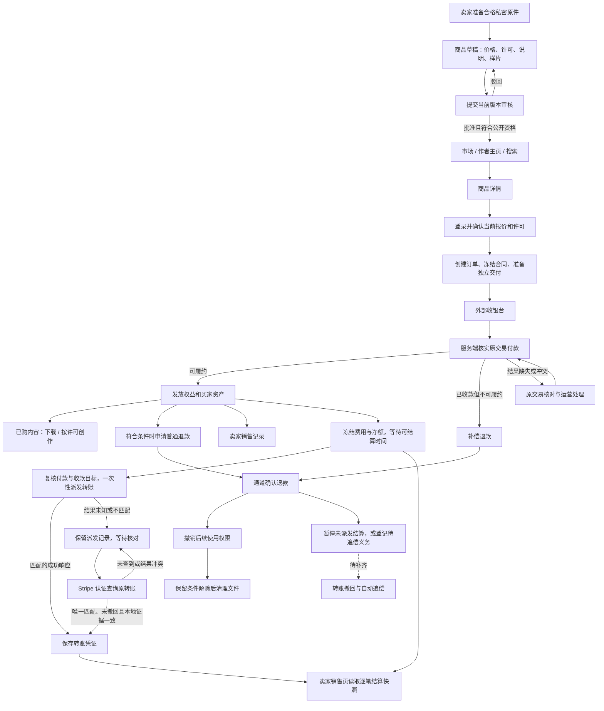

# 资源市场全链路文档：业务与交接

> 当前业务与验收状态统一以[资源市场完整链路](resource-marketplace-complete-flow.md)为准。源码已包含 0166 银行执行／通知、0167 银行任务受控恢复、0168 来源／自动结算停止保护及 0169 执行锁与续租分离；0166 支付全包已通过，但不覆盖这些后续增量。当前源码测试与待办见统一文档第 11–12 节。本页保留分阶段规则，旧的“未接通／尚未实现”和测试结果仅适用于对应历史版本。

更新日期：2026-09-22。依据：当前工作区源码、前端与 HTTP 路由、现有分阶段审查记录。包含未提交代码；不代表运行环境已升级或生产验收已完成。

最新统一入口：[资源市场完整链路](resource-marketplace-complete-flow.md)。该文档汇总买家、卖家、运营全流程，当前银行执行、财务操作入口及验证边界见第 7.12–7.13、11、12 节：银行 HTTP／领域、客户端和模拟 API 页面专项通过，真实联合验收待完成。本文保留历史旅程与阶段记录，旧结论须按对应版本阅读。

本文作为业务阅读入口，按实际操作串联所有主要链路。单页交接索引见[资源市场全部链路交接文档](resource-marketplace-all-flows.md)；具体接口字段、并发规则和测试证据分别见 [全链路总览](resource-marketplace-guide.md)、[详细说明与审查记录](resource-marketplace-flows.md)；多文件规则见 [ZIP 交付专题](resource-marketplace-bundles.md)。0151 的资金账本和提现预留边界见[单页交接第 4.3 节](resource-marketplace-all-flows.md#43-独立卖家资金账本与提现申请0151)；0152–0153 的模式、分配释放和证据保护见[第 4.4 节](resource-marketplace-all-flows.md#44-提现模式与分配保护01520153)。

**本次交付阅读顺序：** 第 2 节看总流程，第 3–7 节按角色和操作查链路，第 8 节查接口，第 9–11 节查剩余工作与验收。技术基线见 [当前基线](resource-marketplace-current-flow.md)。第 9 节保留历史专项记录，不能将其中通过数字视为当前源码的全量结果；本次核对范围见 [第 12 节](#12-本次交付核对范围)。

阅读导航：[业务边界](#1-资源市场负责什么) · [流程图](#2-完整链路图) · [页面入口](#3-页面与角色) · [买家](#4-买家链路) · [卖家与审核](#5-卖家与审核链路) · [运营恢复](#6-运营异常与恢复链路) · [模块交接](#7-与其他模块的交接) · [接口](#8-开发交接接口与对象) · [剩余工作](#9-当前未闭环项与验收) · [完成判定](#10-交易各阶段如何判定完成) · [验收顺序](#11-如何执行一次完整验收)。

## 0. 全链路速览

资源市场的一次完整业务交接如下。每行同时列出正常结果和中断出口；“已有实现”以当前源码为依据，历史测试结果仍按各自审查阶段查阅。

| 链路 | 用户入口与主要步骤 | 结果／中断出口 | 详细位置 |
| --- | --- | --- | --- |
| 发现资源 | `/market` → 搜索、分类、排序、分页 → 商品详情；也可从作者主页或全站搜索进入 | 只展示符合当前公开资格的商品；空结果与加载失败分别处理 | 第 3、4.1 节 |
| 了解与确认 | `/market/assets/:id` → 查看样片、内容和许可 → 登录 → 重新确认报价 | 登录不自动购买；报价变更需重新确认，已购或自购被拦截 | B02–B04、第 4.3 节 |
| 下单与支付 | 接受许可 → 创建原订单、冻结合同、准备交付 → 外部收银台 → 返回订单 | 服务端核验原支付；中断后查原订单，不凭返回参数判定成功 | B05–B06、第 8.2 节 |
| 获取与使用 | `/workspace/orders` 或 `/workspace/purchases` → 交付资产 → 下载／许可内创作 | 每次访问核对当前权益；单文件和 ZIP 按不同能力交付 | B07–B08、第 4.2 节、ZIP 专题 |
| 发布与维护 | 自有资产 → `/workspace/products` → 草稿、价格、许可、样片 → 提交审核 | 驳回后修改重提；批准且符合资格才公开；暂停销售不改写历史成交合同 | S01–S05 |
| 审核与治理 | `/admin/products` → 阅读当前提交版本及原件 → 批准、驳回、封禁或允许重提 | 操作受独立权限、版本和审计约束；不能用旧审核覆盖新版本 | 第 5 节 |
| 销售与结算 | `/workspace/sales` → 销售、成交条款及逐笔结算快照；后台冻结费用、等待期并处理转账 | 只读查询的领域、HTTP 和模拟 UI 专项已通过；提现、冲突处置、追偿及生产验收仍未闭环 | S06–S07、第 5.1–5.4 节 |
| 关闭、退款与售后 | 原订单 → 合资格关闭／退款；争议或问题关联 `/support` | 查询原通道结果；退款确认后撤权，工单关闭不等于资金处理完成 | B09、第 4.3、6 节 |
| 异常恢复 | 财务或媒体运营定位原订单 → 核查资金／冻结文件 → 受控恢复 → 复核最终结果 | 保留原失败证据；任务入队、扫描成功不代表未决义务已消除 | 第 6、8.1 节 |
| 通知与数据生命周期 | 业务事件 → 通知；用户请求导出／注销 → 授权与保留检查 → 到期清理 | 通知不证明到账；有效买家交付和未决资金继续受保留规则保护 | 第 7 节 |

**当前交付边界：** 可以从本文追踪页面、接口、数据、权限、异步任务和异常出口。卖家逐笔结算只读 API 与页面已有源码；新增 `GET /api/v1/seller/funds` 和 `POST /api/v1/seller/payout-requests` 提供服务端余额与待核对提现预留。Waffo 商品 Checkout 已有只读查询接口骨架，但真实商户 schema、分页／金额／时间语义、授权和端到端验收仍待完成，provider 提现派发、退款主动查询、资金处置、历史交付迁移，以及真实支付和存储验收也仍待完成。第 9 节保留完整清单，第 11 节提供验收顺序；不能据此认定资源市场已经通过生产验收。

**本轮复核范围：** 对照前端路由、市场页筛选与购买、HTTP 注册、卖家销售响应及结算指标源码，并新增卖家资金 HTTP 入口和私有会话回归。没有操作运行数据库或调用外部支付服务。最新验证状态以第 12.3 节为准，前面的阶段记录保留当时范围。

## 1. 资源市场负责什么

资源市场出售附带许可的数字商品，包含提示词、工作流、素材和作品授权。当前实现支持 USD、独立单文件及由 2–20 个真实来源文件组成的 ZIP 商品。

商品、公开作品、社区帖子和委托任务是不同对象。发布作品不会自动上架商品，收藏作品不会取得购买权益，购买工作流也不表示站点提供工作流执行器。

**当前完成边界：** 浏览、卖家发布审核、买家下单、可信付款后的交付、退款和销售查询已有实现；0151–0153 已加入独立卖家资金账本、追偿冻结、提现申请预留、分配释放和并发保护，但 provider 派发、完整资金异常处置、历史交付迁移和真实通道联合验收尚未闭环。不能把销售记录、账本 reservation 或买家付款视为卖家已到账。

本文作为统一阅读入口：买家按 B01–B09，卖家按 S01–S07，运营按第 6 节查阅。2026-09-22 重新核对了页面、接口、卖家销售投影、0143/0144 结算实现、0145 转账核对代码和 0146 订单／支付复合绑定保护；本次文档整理没有执行运行库迁移或真实交易。第 9 节的计费专项是相邻模块的历史记录。

**验证边界：** 历史测试分别保留在第 9 节及详细审查记录。当前源码包含 0142–0153；0151–0153 的资金余额、幂等提现预留、无会话拒绝、空余额拒绝、并发互斥、分配释放和 OpenAPI 契约已有隔离回归。自动追偿、provider 提现派发、任务提现、人工资金处置、Waffo 真实查询和生产验收仍待完成，见第 12.3 节。

文档按用途分工如下：

| 文档 | 用途 |
| --- | --- |
| 本文 | 产品、运营和交接阅读入口：角色、操作、异常出口、完成判定与验收顺序 |
| [当前基线](resource-marketplace-current-flow.md) | 当前页面、接口、状态、异步任务和部署验收边界 |
| [全链路总览](resource-marketplace-guide.md) | 展开业务规则、通道能力差异及开发／测试交接索引 |
| [详细说明与审查记录](resource-marketplace-flows.md) | 接口、数据、权限、并发、恢复规则和各阶段测试证据 |
| [多文件 ZIP 交付专题](resource-marketplace-bundles.md) | 多来源发布、冻结合同、整包与成员下载、修复及部署约束 |

### 1.1 阅读前先明确的业务边界

| 容易混淆的对象 | 当前规则 |
| --- | --- |
| 商品与作品 | 商品出售许可和交付内容；公开作品用于展示。发布作品、发帖、收藏均不会自动上架商品或取得购买权益 |
| 商品购买与充值 | 当前商品从详情页逐件发起外部 Checkout。钱包充值、套餐购买是独立的计费链路，充值成功不产生商品权益，也不是购买前的必经步骤 |
| 样片与交付原件 | 公开样片、卖家私密原件、冻结成交内容和买家独立副本分别处理，不能以原件地址替代样片 |
| 页面状态与业务完成 | 页面跳转、成功提示和任务入队只说明对应步骤的结果；资金、交付、退款各自需要服务端证据 |
| 销售与结算 | 卖家可以查看本人销售与成交条款，但完整抽成、结算、打款及退款追偿尚未闭环 |
| 代码与线上能力 | 已实现、隔离测试通过、运行环境已部署是不同状态；本文不把待验证代码作为上线承诺 |

产品与运营阅读第 1–7 节及第 9–10 节即可掌握业务；开发查第 8 节和详细审查记录，测试按 [第 11 节](#11-如何执行一次完整验收)组织验收。

### 1.2 按操作查找完整链路

| 你要了解的操作 | 起点 → 过程 → 结果 | 文档位置 |
| --- | --- | --- |
| 找资源与查看详情 | 市场／搜索／作者页 → 筛选、分页、样片、报价和许可 → 确认是否购买 | [买家链路 B01–B04](#4-买家链路) |
| 购买与支付返回 | 登录 → 确认报价 → 幂等下单与合同冻结 → 外部付款 → 服务端确认 → 后台履约 | [买家链路 B03–B06](#4-买家链路)、[完成判定](#10-交易各阶段如何判定完成) |
| 获取与使用商品 | 订单／已购内容 → 本人交付资产 → 下载或许可内参考创作 → 返回原订单 | [订单与交付往返](#42-订单与交付之间往返)、[ZIP 交付专题](resource-marketplace-bundles.md) |
| 发布与维护商品 | 自有原件 → 扫描 → 草稿与独立样片 → 提交审核 → 批准上架／驳回修改 → 暂停或重提 | [卖家与审核 S01–S05](#5-卖家与审核链路) |
| 查看销售与收入 | 本人销售目录 → 冻结成交条款、事件及逐笔结算快照；缺失或矛盾记录提示待核查 | [卖家 S06–S07](#5-卖家与审核链路)、[结算查询](#54-卖家逐笔结算查询) |
| 取消、退款与售后 | 原订单 → 核验关闭或退款资格 → 跟进原支付／退款结果 → 撤权或关联支持工单 | [买家 B09](#4-买家链路)、[异常恢复](#6-运营异常与恢复链路) |
| 运营处理异常 | 原交易证据 → 权限与资格复核 → 核对／恢复作业 → 最终资金或文件结果 | [运营链路](#6-运营异常与恢复链路) |
| 通知、导出与注销 | 业务事件／本人请求 → 通知、授权导出或保留审查 → 投递、下载或到期清理 | [跨模块交接](#7-与其他模块的交接) |
| 开发与测试交接 | 页面入口 → API → 数据对象与源码 → 正常及异常验收 → 证据归档 | [接口索引](#8-开发交接接口与对象)、[验收顺序](#11-如何执行一次完整验收) |

本文覆盖已有操作与尚未闭环的业务出口；表中提及某条链路不表示该链路已全部实现。最新在研变更、专项结果及验证限制见 [9.6](#96-当前在研接线与交付边界0140)，历史计费专项仍见 [9.4](#94-本次交付的源码差异与验证限制0138) 和 [9.5](#95-同一笔续费重复通知的后续修复0139)。

## 2. 完整链路图

图中的实线表示已有业务处理，虚线表示尚未闭环或新增待验证的交接，不表示每个交接都有单独按钮。查询找到转账后仍须复核本地订单、资金和退款；存在追偿或冲突时保存凭证但继续待处理。转账仅在原通道支持且全部资格通过时派发；保存通道转账凭证不等于银行账户已到账。浏览器返回成功页、任务入队、通知投递均不是资金结果证明。

## 3. 页面与角色

| 使用者 | 页面入口 | 作用 |
| --- | --- | --- |
| 访客 | `/market`、`/market/assets/:id` | 筛选商品、阅读详情、了解许可和样片 |
| 访客 | `/creators/:handle`、`/search?types=product&q=...` | 从作者或搜索进入同一商品 |
| 买家 | `/auth` → 原商品详情 | 登录／注册后重新确认购买 |
| 买家 | `/workspace/orders`、`/workspace/orders?orderId=...` | 付款状态、成交合同、关闭资格、退款与事件；按编号定位原订单，并进入对应交付资产 |
| 买家 | `/workspace/purchases` → `/workspace/assets/:assetId` | 查看有效购买权益对应的交付与下载 |
| 买家 | `/create/:mode?sourceAssetId=...` | 许可及媒体能力允许时参考创作 |
| 卖家 | `/workspace/products`、`/workspace/products/new`、`/workspace/products/:id` | 草稿、编辑、提交审核与暂停销售 |
| 卖家 | `/workspace/sales`、`/workspace/sales/:id` | 本人销售与历史成交条款 |
| 内容运营 | `/admin/products/:id?` | 审核、驳回、封禁及允许重提；需 `admin:content` |
| 媒体运营 | `/admin/deliveries/:id?` | 检查交付与原字节恢复；需 `admin:media` |
| 财务／数据运营 | `/admin`、`/admin?tab=dataRights` | 按独立权限处理付款、恢复和数据权利 |
| 账户本人 | `/support`、`/notifications`、`/settings?section=privacy` | 售后、结果通知、导出和注销 |

身份以真实登录会话为准；页面入口不授予对象读取或操作权限。路由来源：[前端路由](../web/src/router/index.ts)。

## 4. 买家链路

| 编号 | 操作过程 | 完成结果及异常出口 |
| --- | --- | --- |
| B01 发现 | 搜索／分类／排序 → 加载更多 → 商品详情 | 市场、作者页、搜索执行一致公开资格；下架或不合格商品不能靠直链继续公开 |
| B02 了解 | 读取价格、币种、包含内容、兼容说明、许可、AI 披露和公开样片 | 样片独立于收费原件；没有样片不能泄露原件充当预览 |
| B03 登录 | 未登录购买 → 登录或注册 → 返回详情 | 不自动购买；由当前用户确认当前报价和许可。旧会话／资料响应不能覆盖新身份，同一 store 的登录退出按顺序发送，见 [11.140](resource-marketplace-flows.md#11140-市场登录交接的会话竞态) |
| B04 确认 | 接受许可 → 携带当前 `offerVersion` 发起购买 | 报价变更需重新确认；自购、已有有效权益、不可售或支付不可用被拒绝 |
| B05 下单 | 幂等命令 → 原订单和支付意图 → 冻结合同 → 独立交付准备 | 重试应跟进原交易；副本准备与收银台响应不确定时不能盲目创建新单 |
| B06 支付 | 打开外部收银台 → 返回原订单 → 服务端核验付款 → 后台履约 | 只有可信资金证据及履约条件成立后才发权益；收款后不可履约转补偿退款 |
| B07 交付 | 普通订单／支付返回卡片 → 对应交付资产；或从已购内容进入 → 下载 | 已履约及普通退款待确认订单提供同一入口；资产可返回原订单，即使订单不在列表第一页。读取仍校验本人、权益及冻结文件，卖家修改不能替换历史副本 |
| B08 复用 | 已购资产 → 许可允许的参考创作 → 生成任务 | 提交和实际派发均检查当前权益与能力；ZIP 不提供在线参考创作入口 |
| B09 售后 | 本人订单 → 合资格退款申请／关联工单 → 查询原结果 | 普通退款待确认时保留原有效权益；成功后撤销后续受限使用，工单关闭不执行退款 |

退款原因要求 10–500 个 Unicode 码点；退款窗口按订单创建时间与冻结许可的天数判断。退款成功无法收回用户已下载到站外的文件。取消付款页或返回站点不等于订单已取消；只有服务端确认关闭资格后才可执行关闭。

登录或退出期间，客户端拒绝尚未发送的业务写入，身份确认后需由用户重新操作；已经发送的请求仍需查询原结果。迟到的旧会话响应不能作为新会话的成功确认，也不能清掉当前尚未确认的重试键。具体保护与限制见 [会话写入边界](resource-marketplace-guide.md#978-切换账号时暂停交易写入并核对失败退出)和 [迟到响应](resource-marketplace-guide.md#979-重新登录后到达的旧交易响应)。

工作台确认账号变化后，会清理上一账号的私密数据、分页和未提交草稿；账单、生成记录及任务分页也不会接受上一视图的迟到结果。该处理与跨标签页身份同步不同，范围见 [工作台身份交接](resource-marketplace-guide.md#981-切换账号和工作台筛选后的私密数据)。

市场页确认账号变化后，也会重新读取商品和购买状态、清空许可勾选与游标。旧支付响应及报价刷新不能影响新的访问；卖家草稿加载失败、同账号审核权限撤销和样片编辑重开均使旧上下文失效。正常与异常对照见 [市场与卖家交接](resource-marketplace-guide.md#983-市场和卖家页面的账号与权限交接)。

详见 [买家流程及交易完成判定](resource-marketplace-guide.md#4-买家链路)。

### 4.1 浏览、筛选与返回

- 市场页面通过 URL 保存关键词 `q`、分类 `category` 和排序 `sort`；支持最新、价格升序、价格降序。返回列表后应恢复对应筛选。
- 后端目录另外支持商品类型和许可筛选；这不表示市场页面已经提供每一种接口筛选控件。
- 价格仅支持升序／降序排序，当前接口没有最低价／最高价筛选；文档中的“筛选”不包含未实现的价格区间能力。
- 列表返回 `total`、`categoryCounts` 和 `nextCursor`。分类计数保留其他筛选条件、忽略当前分类选择；总数按完整筛选条件计算，不能用当前已加载条数代替。
- 改变筛选、排序或登录身份后，旧游标不能用于新查询。加载更多应沿用当前筛选，而不是重新拼接另一组条件。
- 无匹配结果时返回清除筛选／浏览入口；请求失败时保留重试路径。两者不能显示成同一种“没有商品”。

依据：[市场页面](../web/src/pages/MarketplacePage.vue)、[目录查询与游标](../internal/marketplace/catalog.go)。

### 4.2 订单与交付之间往返

订单处于 `fulfilled` 或 `refund_requested` 且返回有效资产编号时，普通订单和支付返回卡片使用同一个“查看已购内容”按钮，进入 `/workspace/assets/:assetId`。普通退款尚未确认时，原有效权益仍可使用；退款确认后不再展示交付入口。按钮本身不授予下载或创作权限，资产服务仍按当前权益和许可检查。

已购资产的“查看订单证据”携带原 `orderId` 返回订单页。页面单独查询原订单，将它置于列表顶部，并保留分页、按编号去重；不能访问、编号非法或响应编号不一致时显示错误，不以其他订单替代目标订单。该入口不依赖商品仍然公开上架。

支付返回卡片收到 401／403／404／422 或不匹配的订单／付款编号时，清除该卡片缓存的交付上下文。这个处理不等于清除整个应用的所有订单缓存，也不能替代后端授权。验证范围见 [11.139](resource-marketplace-flows.md#11139-订单与已购资产的双向交接)。

切换资产、分页目录或离开订单后，旧使用记录、上传及退款响应不再覆盖当前页面；上传完成不会强行导航回旧资产，扫描跟进也会停止更新已离开的视图。已派发的服务端操作仍需从原资产或订单核对结果，见 [9.80](resource-marketplace-guide.md#980-切换资产或离开订单后的请求结果)。

### 4.3 购买中断后去哪里处理

下表按当前 [市场 HTTP 错误映射](../internal/transport/httpapi/marketplace.go)整理。响应中的业务错误码用于区分下一步，不能只按 HTTP 409 统一自动重试。

| 反馈／错误码 | 用户或运营下一步 |
| --- | --- |
| `product_offer_changed` | 重新读取商品，核对当前价格和许可，由用户重新确认购买 |
| `product_already_owned` | 前往已购内容或原订单，检查已有权益，不重复下单 |
| `payment_checkout_preparation_failed` | 前往订单检查交付准备状态；只有服务端允许关闭时才确认关闭 |
| `payment_reconciliation_required` | 跟进原订单，必要时关联支持工单；由运营核对原交易，不能通过新建订单绕过 |
| `payment_checkout_conflict` | 检查原请求与原订单；不把同一请求键用于另一商品或另一笔交易 |
| `payment_checkout_closed`／`payment_checkout_expired` | 确认原单已关闭或通道证实未付款过期，再重新查看商品并发起新的购买 |
| `payment_provider_unavailable`／`feature_disabled` | 当前支付配置或平台开关不允许购买；保留浏览能力，等待恢复后重新确认 |
| 网络中断、页面关闭、付款取消返回 | 查询原订单；这些现象本身不证明未付款或订单已关闭 |
| `refund_window_expired`／`refund_unavailable` | 核对冻结许可、退款时限和订单状态；有争议时从支持工单跟进，不自动重发退款 |

成功返回入口为 `/workspace/orders?payment=success`，取消返回入口为原商品详情的 `?payment=cancelled`。这些查询参数只承担页面交接，收款与退款仍由服务端核验。

## 5. 卖家与审核链路

| 编号 | 操作过程 | 完成结果及限制 |
| --- | --- | --- |
| S01 原件 | 准备自有私密资产 → 上传／生成 → 扫描及来源核验 | 购买或任务来源资产不能直接作为新商品原件转售；扫描未通过不能绕过发布条件 |
| S02 草稿 | 选择来源 → 标题说明、类型、USD 价格、许可、兼容信息 → 独立样片 | 保存草稿不公开；单文件及多文件都保留实际来源。请求正文与幂等键绑定同一提交快照，计算期间的表单变化不改写此次保存 |
| S03 提交 | 当前版本提交 → 内容运营核验来源和全部成员 | 审核绑定提交版本；内容改变后不能批准旧版本，审核员不能审核自己的商品；审核事务锁定权限，私密文件读取前后复核实际审核者及所选成员 |
| S04 上架 | 批准 → 满足公开资格 → 市场可见可售 | 审核通过仍需满足当前账户、媒体和治理条件 |
| S05 修改 | 驳回后修改重提；上架或待审商品先暂停／撤回，再编辑提交 | 卖家不能自行解除运营封禁；运营允许重提不等于直接重新上架 |
| S06 销售 | 本人销售目录 → 订单详情、成交许可、事件及结算快照 | 按冻结成交归属展示，不暴露买家私密资料；结算读取专项已通过，销售额不等于可提现余额 |
| S07 结算 | 收款资格核对 → 冻结费用与净额 → 等待期 → 转账 → 查询核对；退款后记录追偿义务 | **部分实现、尚未闭环**：已有 0143–0146 结算快照、一次性派发、原批次及订单／支付绑定保护，0145 查询未知转账结果，0148 对新建商品收款目标增加原商户／环境绑定，0149 对任务付款转账／退款增加原始 Provider 身份复核。任务提现、人工资金处置、撤回及自动追偿仍待完成 |
| S08 收款开户 | 收款设置 → 登记原请求 → Stripe 托管入驻 → 回站查询资格 | 0147 允许同一身份和原请求在 23 小时内恢复；0148 将新目标绑定到原商户、环境、端点和协议版本，开户链接及账户回调会复核绑定；历史未知目标和超期人工恢复仍需运营处理，见第 5.5 节 |

暂停或封禁影响后续销售，历史买家交付仍按原合同、当前权益和保留规则处理。详见 [卖家状态与审核流程](resource-marketplace-guide.md#5-卖家链路)。

#### 发布状态转换速查

商品销售状态与审核状态是两条独立记录；审核通过也要再次满足当前账户、媒体和治理公开资格。以下转换来自 [发布服务](../internal/marketplace/publication.go) 与卖家页面，便于产品、运营和测试使用同一套判断：

| 动作 | 商品状态 | 审核状态 | 关键限制 |
| --- | --- | --- | --- |
| 新建／编辑草稿 | `draft` | `draft` | 编辑会重置旧提交与批准版本；上架或待审商品不能直接编辑 |
| 提交审核 | 保持当前商品状态 | `pending` | 绑定当前内容版本；重复提交或已上架提交被拒绝 |
| 审核批准 | `active` | `approved` | 只批准当前提交版本；通过后仍需公开资格检查 |
| 审核驳回 | 保持原商品状态 | `rejected` | 卖家修改后重新提交，旧批准版本清除 |
| 卖家暂停 | `paused` | `draft` | 同时撤回待审；历史买家权益按原合同处理 |
| 运营封禁 | `paused` | `blocked` | 卖家不能自行解除；仅运营可重开 |
| 运营重开 | 保持 `paused` | `draft` | 只清除封禁并允许重新提交，不会自动上架 |

状态检查不能只看 `products.status`；审核版本、来源文件、账号状态和治理条件必须在公开查询、购买及下载边界分别复核。

### 5.1 卖家结算的实际实现边界

当前工作区已存在 [结算服务](../internal/payments/product_settlement.go) 和 [0143 迁移](../internal/platform/database/migrations/0143_product_seller_settlements.up.sql)。[付款工作流](../internal/payments/workflow.go)在商品履约时创建结算记录，在确认退款时更新结算状态；[worker](../cmd/worker/main.go)已注册 `payment.settle_product`。因此不能再描述为“完全没有结算代码”，但也不能向卖家承诺已能完整结算或提现。

| 阶段 | 当前源码行为 | 尚需完成的边界 |
| --- | --- | --- |
| 形成应付 | 保存订单、付款、卖家、费率、总额、费用、净额和可结算时间，并绑定后台任务；重复请求逐字段核对冻结绑定和经济快照 | 费率、等待期和平台是否启用仍需产品确认，不能从源码默认值推断商业政策 |
| 等待期 | 首次任务按冻结的 `available_at` 到期后执行，配置变化不会重算历史成交 | 迁移默认费率为 0 bps、等待期 7 天只是默认值；设置表没有独立启用开关 |
| 发起转账 | 在事务内锁定订单／付款，核对原商户、付款身份、资金视图和已验证收款目标；提交持久化 reservation 后再调用通道，外发前复核并锁定原批次及批次项 | 未知结果不能再次派发；0145 原 Stripe 转账查询已通过隔离专项，见第 5.3 节 |
| 转账完成 | 校验金额、币种、目标和 transfer group；通知类型、目标路径和本地化正文已纳入白名单，通知失败不会触发再次转账 | 外部已成功但本地结果缺失时，可按合资格凭证恢复；隔离专项结果见第 5.3 节，卖家只读展示见第 5.4 节，真实通道仍待验收 |
| 退款与追偿 | 发起转账要求付款为 `paid` 且订单为 `fulfilled`；退款待确认时暂缓新转账。确认退款时，未派发记录进入 `refund_hold`；已转账、派发中或待核对记录进入 `recovery_required`，保留已有凭证并记录净额追偿义务 | 没有自动追偿、转账撤回或实际债务收集；派发中的追偿金额表示待核对义务，不能据此推定卖家已经收款 |
| 卖家及运营查询 | 现有销售列表与详情可附带匹配的逐笔结算快照，另有资金余额和提现预留 API | 资金余额仅由服务端账本证据计算；提现申请当前停留 `under_review`，销售额不等于可提现余额 |

0144 迁移为结算经济快照、转账凭证、reservation 和事件去重增加数据库保护，并为历史批次补齐 reservation；降级在存在财务证据时拒绝删除。结算 worker 的隔离集成测试覆盖重复派发、并发、取消上下文、通知写入失败、退款竞态、商户变更和不可变证据；`go test -race` 定向选择集通过。上述证据不包含真实通道或生产数据库。

### 5.2 待确认的结算业务规则

以下是后续实现需要的业务决策，不是当前已上线能力：

| 决策 | 当前依据 | 需要明确的结果 |
| --- | --- | --- |
| 平台收费 | 0143 默认费率 0 bps，代码向上取整计算分为单位的费用 | 正式费率、生效范围和版本；历史成交不可因新费率静默重算 |
| 可结算时间 | 付款时间加配置等待期与冻结退款窗口的较大值 | 正式等待期、争议或未决退款时的延后条件 |
| 到账与提现 | 已有向验证收款目标发起通道转账的部分实现 | 自动结算或申请提现、支持通道，以及通道账户到账与银行到账的区分 |
| 转账后退款 | 已保留转账凭证并记录 `recovery_required` 与净额追偿义务 | 追偿方式、责任归属、失败处理、通道查询和可核对凭证 |
| 未知资金结果 | reservation 会阻止盲目再次派发并进入核对状态 | 原通道查询、运营权限、冲突裁决和最终恢复规则 |

在这些规则与实现完成前，销售页可以展示真实订单和成交金额，但不应把它们标为“可提现余额”或“已到账”。

### 5.3 Stripe 未知转账核对（0145）

该分支处理已经持久化派发记录、但缺少本地转账结果的销售。它不是重新打款，也不覆盖已有转账凭证之后的全部银行到账、撤回或债务核销过程。

| 步骤 | 当前源码行为 | 结果边界 |
| --- | --- | --- |
| 发现待核对项 | worker 每分钟扫描一次；首次须距 reservation 至少 30 秒，后续根据最近检查／任务时间延后 5 分钟；已排队或运行中的检查不重复入队 | 实际执行时间受队列和通道可用性影响，不是到账时限承诺 |
| 固定检查对象 | 保存 `product_settlement_checks`，绑定原结算和唯一 job；在原付款锁内重新检查资格 | 完成的检查不重写，后续检查保留历史证据 |
| 查询原通道 | 先核对原商户身份，再按 transfer group 认证查询 Stripe；检查金额、币种、目标、charge、付款 metadata 和模式，最多扫描 10 页 | 仅查询现有转账，不发起转账或退款；目前仅 Stripe 有此适配器 |
| 保存唯一结果 | 唯一匹配且未撤回时，锁定并校验原批次与批次项、通道、模式、派发记录和已有转账 ID，再保存凭证及 `transfer.recovered` 事件 | 缺失或矛盾的批次证据使事务回滚；没有资金冲突或追偿且本地状态合资格时，才记为 `transferred` 并通知 |
| 保存退款责任 | 原订单已确认退款，或已有追偿／资金核查时，保留真实转账凭证并继续 `recovery_required` | 查到转账不撤销买家退款，不清除债务，不等于自动追偿 |
| 结果仍不确定 | `not_found`、`ambiguous`、`incomplete`、`error` 或 `reversed` 保留核对记录；资格改变时记为 `skipped` | 空列表、重复结果、部分／全部撤回都不授权新打款；未关闭项等待后续核对或处置 |

普通退款待确认时，**禁止新发转账**与**如实记录之前已经发生的转账**是两个独立判断。后者可恢复历史凭证；确认退款后的净额追偿义务继续保留。

源码：[查询适配器](../internal/payments/provider_stripe_transfers.go)、[核对服务](../internal/payments/product_settlement_checks.go)、[0145 迁移](../internal/platform/database/migrations/0145_product_settlement_checks.up.sql)、[worker](../cmd/worker/main.go)。首轮失败保留在 [11.159](resource-marketplace-flows.md#11159-转账核对首轮业务验证与未修复问题)；共享批次校验及修正后的专项结果见 [11.160](resource-marketplace-flows.md#11160-原打款批次一致性修复与专项结果)。本地批次冲突会阻止恢复提交，仍需要后续核对或人工处置，不能通过重发转账解决。人工恢复入口、转账撤回、自动追偿和生产告警验收仍未闭环；没有真实通道验收结论。

### 5.4 卖家逐笔结算查询

此链路复用 `/workspace/sales` 和 `/workspace/sales/:id`，没有新增独立结算入口。卖家登录后查看本人销售，进入详情读取成交合同及可选的 `settlement` 对象；销售列表展示结算状态标签，详情展示冻结金额与时间。页面仍为只读，不提供提现、重发转账或核销债务的操作。

| 内容 | 当前源码规则 | 用户应如何理解 |
| --- | --- | --- |
| 可读范围 | 按 `product_sale_owners` 的原成交卖家授权；当前商品归属不能覆盖历史成交归属 | 只能看本人销售，不因接手商品而获得另一卖家的历史收入记录 |
| 金额与费率 | 返回总额、费率 bps、手续费、净额、币种及测试／正式模式；使用原结算快照 | 后台修改费率不会重算历史显示，净额不是可提现余额 |
| 时间与结果 | 返回可结算时间和合资格的转账记录时间；过滤非有限时间及未来转账时间 | 可结算时间不是到账承诺，通道转账记录不是银行到账证明 |
| 退款责任 | 展示 `recoveryAmountCents` 及 `recovery_required` 状态 | 找回转账凭证不代表待追偿金额已经收回 |
| 缺失或冲突 | 核对卖家、付款、买家、商品、通道、模式、金额和币种；绑定不符时不返回结算。符合应有结算条件但缺记录时标记 `needsReview` | 不以零金额或估算费用补齐缺失数据，需后续核查 |
| 隐私 | 不返回收款目标、通道转账编号、内部挂起原因、查询原始证据及私密存储定位 | 结算显示不扩大卖家对买家或运营证据的访问范围 |

接口复用 `GET /seller/sales` 与 `GET /seller/sales/{orderID}`；新增 `GET /seller/funds` 和 `POST /seller/payout-requests`。`/events` 仍是订单事件历史，不是完整结算账本。源码：[销售投影](../internal/marketplace/sales.go)、[资金服务](../internal/payments/seller_funds.go)、[销售页面](../web/src/pages/SellerSalesPage.vue)、[接口契约](../internal/transport/httpapi/openapi.yaml)。提现 provider 派发、撤回和人工核对仍未接通。

### 5.5 收款开户与有限窗口恢复（0147）

入口为 `/settings?section=payouts`。状态读取和开户动作分别使用 `GET /api/v1/account/payouts`、`POST /api/v1/account/payouts/onboarding`。托管入驻返回只触发重新查询，不直接把账户标为可收款。

首次外部创建前，`payout_account_commands` 冻结原身份、原邮箱、请求版本、固定幂等键和预留时间。响应丢失、进程退出或本地保存失败后，23 小时内只可使用同一身份和原请求恢复；命令完成与收款目标一起保存，入驻链接独立生成。状态投影包含 `creation_pending`／`recovery_required`，实际动作再次认证完整身份；不匹配返回 409 `payment_reconciliation_required`。

超期、历史身份缺失及既有收款目标的商户／环境绑定仍需后续处理，不能重置时间或换键绕过核对。0147 保护命令证据不被改写或删除，有记录时禁止删除式回退；0148 对新目标写入不可缺失的身份绑定，未知历史目标拒绝自动推断；0149 对迁移后新建任务付款保存身份快照，历史无快照付款仍拒绝自动转账或退款。专项证据见 [11.169](resource-marketplace-flows.md#11169-收款开户命令持久恢复与原请求冻结0147) 和 [11.170](resource-marketplace-flows.md#11170-收款目标身份绑定与任务转账边界0148)；真实 Stripe、并发多实例、历史任务付款人工核对与超期恢复未由专项验收。

## 6. 运营、异常与恢复链路

| 场景 | 处理顺序 | 完成判定 |
| --- | --- | --- |
| 支付状态不明 | 定位原订单／付款 → 核验原商户与原交易证据 → 恢复符合资格的处理 | 可信证据得到处理；不能以新建订单、浏览器返回或人工改状态替代 |
| 签名有效但业务校验失败 | 保存隔离证据 → 财务核查 → 按版本复核 → 接入正常处理或保留待核查 | 复核本身不直接授予权益或退款；无效签名不成为可重放证据 |
| 退款未决／结果矛盾 | 保存原申请、尝试和查询结果 → 核对原交易 → 按资格继续处理 | 资金结果有依据；重复、部分或矛盾退款仍存在待补齐处置范围 |
| Stripe 未决退款 | 持久化原请求 → 作业结束后到期核对 → 逐步退避 → 应用可信结果 | 自动核对不等于新发退款；Waffo 退款主动查询仍未实现 |
| Stripe 未知转账 | 原派发记录 → 周期入队 → 原商户认证查询 → 复核原批次 → 保存核对与转账凭证 | 隔离专项通过，真实通道待验收；结果不确定不重发，退款后的追偿责任不因找回凭证而消失，见第 5.3 节 |
| 文件损坏或丢失 | 检查冻结大小／摘要 → 合格原字节来源或备份 → 受控修复 → 下载复核 | 原内容恢复且新位置可追溯；不能拿不同版本替换成交内容；慢速校验后重新鉴权，写入前锁定权限 |
| 后台任务失败 | 查看失败及当前资格 → 按预期版本申请恢复 → 新作业执行 → 查询最终状态 | 入队只是开始，原失败和续作关联保留；财务操作还需事务内动态权限保护 |
| 历史缺少交付证据 | 证据缺口目录 → 核验原合同和真实文件 → 制定迁移 | 无独立快照的旧订单不属于现有原字节修复覆盖范围；完整迁移待完成 |
| 存储中出现未知对象 | 指定后端只读盘点 → 对照同一数据库快照 → 核对引用和清理证据 → 调查来源 | 完整报告只证明约定范围盘点完成，不授权删除；使用方法见 [存储盘点](media-storage-inventory.md) |

普通原件上传上限为 10 MiB；专用交付修复备份上传上限为 100 MiB。修复不改变购买权益。处理细则见 [异常分支](resource-marketplace-guide.md#6-异常分支与运营处理)、[详细审查记录](resource-marketplace-flows.md)。

### 6.1 结算监控的当前接线与限制

工作区的 [结算指标查询](../internal/payments/operational_metrics.go)和 [告警脚本](../scripts/metrics-alert-check.sh)已有以下接线。此前测试夹具中的补偿付款状态、历史事件序号和购买资产存储字段已修正；指标与补偿流程 Race 选择集、告警脚本测试随后通过。HTTP 指标到实际告警脚本的隔离联合测试也已通过，见第 12.3 节；生产部署验收尚未完成。

| 指标种类 | 当前源码统计口径 | 业务含义 |
| --- | --- | --- |
| `settlement_due` | 净额大于零、无转账凭证且未保留派发，付款为 `paid`、订单为 `fulfilled`，处于指定待结算状态并已到期 | 到期未派发；正常未来等待期和普通退款暂停不计入 |
| `settlement_unresolved` | 待追偿状态、有追偿金额，或已保留派发／正在派发却没有转账凭证 | 外部结果或退款责任仍未解决；补回转账凭证不自动清除追偿义务 |
| `settlement_missing` | 缺少匹配付款与订单的结算记录，且订单当前已履约、处于非补偿退款申请，或保留履约事件／权益记录 | 未履约且无履约证据的补偿退款不应要求卖家结算；曾经履约的订单即使已退款仍检查历史缺口。该口径已有隔离测试，指标本身不补建结算或证明漏款 |
| `settlement_check_stopped` | 未决且无转账凭证，最近核对任务失败／取消，且不存在排队或运行中的替代核对 | 核对执行停止；补建核对不代表底层资金义务已经解决 |

结算积压按原结算快照的 `live`／`test` 分组；到期年龄取 `available_at`，未决年龄取原派发保留时间、缺少时取结算创建时间，不因重试而归零。缺少结算记录时，缺口指标只能使用原付款的模式。周期扫描成功仅说明扫描执行过，仍须检查这些业务结果。

已有专项覆盖指标查询、异常时间戳、告警阈值、模式隔离、缺失指标及 HTTP 联合验证；后续仍需完成 API／脚本配套发布及真实环境验收。当前不提供通过重发转账、改状态或删除证据来消除告警的处置流程。部署口径见 [监控与告警](../deploy/OBSERVABILITY.md)。

## 7. 与其他模块的交接

| 模块 | 交接内容 | 需要保留的边界 |
| --- | --- | --- |
| 社区／灵感库 | 讨论、作品和创作参考，与市场商品分别关联 | 点赞、收藏、作品提示词权限不等于商品购买授权 |
| 资产／AI 创作 | 卖家原件进入草稿；买家独立资产进入下载或参考创作 | 私密原件、公开样片、买家副本分离；使用与转售权限分别判断 |
| 通知／开发者 webhook | 业务结果 → 投递记录 → 关联订单或内容 | 异步投递失败不等于交易失败；结算通知白名单已补齐，本地保存失败仍须核对原转账，不能再次派发。通知成功不证明付款，也不推定已发送交易邮件 |
| 支持工单 | 用户问题 → 关联交易 → 沟通和处理记录 | 关闭工单不等于退款到账或交付修复 |
| 数据导出 | 本人请求 → 授权范围内合同、权益和交易证据 → JSON 下载 | 不导出私密存储地址、支付链接、运营私密备注或交付文件正文；正文下载期七天 |
| 账户注销 | 撤权／匿名化准备 → 履约、资金及法律保留判断 → 到期清理 → 缺失证明 | 卖家注销不能删除仍服务有效买家权益的文件；外部支付平台数据另行处理 |

相邻模块文档：[任务广场](task-marketplace-flows.md)、[社区](community-flows.md)、[灵感库](inspiration-library-flows.md)。

## 8. 开发交接：接口与对象

下列接口统一加 `/api/v1` 前缀。完整路由以 [HTTP 注册](../internal/transport/httpapi/server.go) 为准，字段见 [OpenAPI](../internal/transport/httpapi/openapi.yaml)。

| 链路 | 主要接口 |
| --- | --- |
| 公开浏览 | `GET /products`、`GET /products/{productID}` |
| 下单及订单 | `POST /products/{productID}/checkout`、`GET /orders`、`GET /orders/{orderID}` |
| 关闭／退款 | `POST /orders/{orderID}/close-checkout`、`POST /orders/{orderID}/refund` |
| 已购及下载 | `GET /assets?source=purchase`、`GET /assets/{assetID}`、`GET /assets/{assetID}/content`；ZIP 成员使用 `fileIndex` |
| 卖家商品 | `GET/POST /seller/products`、`GET/PUT /seller/products/{productID}`；`POST /seller/products/{productID}/{action}` 的卖家动作是 `submit`、`pause` |
| 许可／样片 | `GET /seller/licenses`、`PUT /products/{productID}/preview` |
| 审核 | `GET /admin/products`、`GET /admin/products/{productID}`、对应 `/content`；`POST /admin/products/{productID}/{action}` 使用 `approve`、`reject`、`block`、`reopen` |
| 销售与逐笔结算 | `GET /seller/sales`、`GET /seller/sales/{orderID}` 可含 `settlement`；对应 `/events` 为订单事件 |
| 交付恢复 | `GET /admin/product-deliveries/{orderID}`，以及原订单下的 `repair`、`repair-upload`、上传和续作接口 |
| 财务恢复 | `GET /admin/payments`、`GET /admin/payments/{paymentID}/refund-history`、`GET/POST /admin/payments/{paymentID}/refund-checks`、`POST /admin/payments/{paymentID}/recover` |
| 支付回调 | `POST /payments/webhooks/stripe`、`POST /payments/webhooks/waffo`；用于通道通知，须验签并核对交易，不是浏览器支付返回入口 |
| 异常回调复核 | `GET /admin/payments/webhook-quarantines`、`POST /admin/payments/webhook-quarantines/{quarantineID}/recheck`；已接入事件的重放使用 `POST /admin/payments/events/{eventID}/replay` |

排查时依次关联 **商品 ID → 订单 ID → 付款 ID → 成交合同／交付快照 → 权益／买家资产 → 退款、任务与审计记录**。商品 ID 与资产 ID 不能互换；前端的 `/market/assets/:id` 实际接收商品 ID。

实现与测试入口集中在 [开发与测试交接索引](resource-marketplace-guide.md#82-开发与测试交接索引)，避免在本文重复维护测试文件清单。

### 8.1 数据与后台任务交接

| 业务对象 | 保存的事实 | 后续消费方 |
| --- | --- | --- |
| 商品、发布记录与文件清单 | 当前商品内容、审核版本、独立样片及来源成员 | 公开目录、审核、Checkout 资格检查 |
| `orders`、`product_order_contracts` | 买家、成交金额、冻结许可、商品及文件版本 | 履约、订单展示、退款、历史下载与修复 |
| `payment_intents`、Checkout 请求及支付事件 | 原通道、原商户、外部交易身份与可信付款证据 | 支付事件 worker、Checkout 查询与身份恢复 |
| `product_delivery_snapshots`、买家资产、`entitlements` | 冻结文件及摘要、独立交付位置、当前使用权 | 私密下载、许可内创作、修复与撤权 |
| 退款操作、尝试、查询与回执 | 原退款命令、外发结果、迟到或冲突证据 | 退款派发、认证查询、财务复核与保留判断 |
| `product_sale_owners`、`order_events` | 成交时卖家归属与订单变化 | 卖家销售列表、成交许可和订单事件；不包含结算余额 |
| `product_settlements` 及派发、批次、事件 | 费用和净额、等待期、一次性派发、转账凭证与追偿义务 | `payment.settle_product`；尚无完整卖家查询和恢复入口 |
| `product_settlement_checks`（0145） | 原结算、唯一任务、认证查询结果、错误及完成时间 | `payment.check_product_settlement` 和周期核对；隔离专项通过，配套部署及生产验收待完成 |

[worker 注册](../cmd/worker/main.go)连接支付事件处理、商品退款、退款核对、Checkout 核对、原商户恢复、会话定位、商品结算及交付清理。HTTP 接纳命令、任务执行成功和业务最终完成需要分别记录。通知、扫描和数据权利使用各自任务；不能仅启动前端就认为异步链路可用。

### 8.2 交易状态速查

| 用户所处阶段 | 订单／付款的典型状态 | 权益与操作 |
| --- | --- | --- |
| 等待支付 | `payment_pending` / `checkout_pending` 或 `checkout_open` | 尚无本单权益；查询原订单，按服务端资格继续或关闭 Checkout |
| 已完成交付 | `fulfilled` / `paid` | 有效权益允许对应下载及许可内使用；结算按独立等待期执行 |
| 普通退款处理中 | `refund_requested` / `refund_pending` 或 `refund_failed` | 原有效权益保留；暂缓新结算，核对原退款 |
| 未交付补偿退款 | `refund_requested` / `refund_pending` 或 `refund_failed` | 本单未发权益；同样的订单标签不能推定买家已有内容 |
| 已退款 | `refunded` / `refunded` | 后续权益撤销；物理清理还要满足资金与法律保留条件 |
| 关闭或失败 | `cancelled` 或 `payment_failed` | 按实际支付证据判断；历史关闭订单如发现收款，进入恢复／补偿而非直接重购 |

状态表是正常分支速查，不替代服务端资格判断。卖家列表兼容的 `test_*` 历史状态不是演示账号或新订单的创建入口。结算 `transfer_pending` 与 `recovery_required` 也不是“打款失败可重试”：原派发可能已在通道生效，必须先核对。

## 9. 当前未闭环项与验收

| 待完成范围 | 交付标准 |
| --- | --- |
| 原打款批次异常处置 | 发送前、正常完成和恢复路径的共享原批次校验已通过专项，见 [11.160](resource-marketplace-flows.md#11160-原打款批次一致性修复与专项结果)。剩余工作是矛盾证据的运营处置、未决义务监控与生产验收；拒绝错误结果不代表异常已经处理完毕 |
| 卖家结算 | 经济快照、通知白名单、派发 reservation、事件去重及退款凭证保护已有实现；0145 认证查询与周期恢复已通过隔离专项。逐笔读取的领域、HTTP 和模拟 UI 专项通过；人工恢复、撤回、自动追偿和费率／等待期政策仍待完成 |
| Waffo 查询恢复 | 商品 Checkout 已接入只读 `/checkout/lookup` 边界；保存无 URL 会话、后续付款核对和查询事件消费仍受 Stripe 专用约束，尚未走通 | 补齐数据库及应用接线、不完整观察留存和历史查询窗口，再验收真实 schema、授权及资金语义；退款主动查询仍未实现，详见[全部链路 7.0.1](resource-marketplace-all-flows.md#701-waffo-商品-checkout-查询恢复边界) |
| 资金异常裁决 | 覆盖部分退款、重复收款、矛盾证据及历史原商户信息缺失 |
| 历史交付迁移 | 有真实合同和字节证据，不伪造来源或覆盖旧成交内容 |
| 留存与存储 | 已补只读对象盘点入口；未知对象后续裁决、备份、外部恢复、保留期及跨账户引用的完整对账仍待完成 |
| 财务管理后续闭环 | 收款目标、支付配置、额度调整的撤权与审计专项，以及 0135 手工调整幂等链路已通过隔离验证；配套部署、其他财务链路及实际运行验收另行完成 |
| 后台页面的身份交接 | 父页面拒绝访问、独立证据组件、财务编辑版本、共享受控命令和整页加载已补保护；其他独立表单、历史分页交错、聚合失败就绪状态及同账号重新认证仍需处理，见 [11.152](resource-marketplace-flows.md#11152-同视图编辑交接确认后刷新与并发加载) |
| 支付网关通用配置 | 最低充值及推荐金额已有持久化、API 和页面实现，隔离专项及前端回归通过；优惠／换汇规则未实现或确认，运行环境未升级，见 [9.2](#92-当前工作区与已验证版本的差异) |
| 充值／套餐支付派发 | 0137 保存原商户／原请求及发送前登记；0141 将 Waffo 回调绑定到原请求并由 worker 二次核对，配置切换不会阻断旧交易，错误身份不会入账。Waffo 主动查询、未知结果恢复、卖家结算及完整验收仍未完成，见 [11.156](resource-marketplace-flows.md#11156-充值与套餐-waffo-原商户回调绑定0141) |
| 交付修复上线 | 慢速检查、准备、续作和上传的撤权保护见 [11.136](resource-marketplace-flows.md#11136-交付修复期间撤权与文件写入权限)；还需更新运行 API 并完成真实存储验收 |
| 生产联合验收 | 真实支付、退款、存储、扫描、多实例容量、进程中断与告警；配套迁移和部署验证 |

当前数据库源码包含 0141 计费 Waffo 原商户回调绑定迁移；服务、管理表单和接口契约已接通，专项验证见 [9.6](#96-当前在研接线与交付边界0140)及 [11.156](resource-marketplace-flows.md#11156-充值与套餐-waffo-原商户回调绑定0141)。0136 充值配置、0137 派发保护、0138 套餐合同和 0139 重复续费保留各自历史验证范围，见 [9.3](#93-计费派发的源码与专项证据0137)至 [9.5](#95-同一笔续费重复通知的后续修复0139)。本次没有升级运行环境，不能作为已验收部署版本。财务权限与配置并发见 [11.134](resource-marketplace-flows.md#11134-财务设置撤权审计原子性与配置并发)，手工调整幂等见 [11.135](resource-marketplace-flows.md#11135-手工额度调整幂等与重试链路0135)。这些专项不等于当前源码全量或生产验收通过。

验收按三条主线执行：买家 B01–B09，卖家 S01–S07，以及第 6–7 节运营／数据链路；同时覆盖未登录、越权、重复提交、并发变更、中断和恢复。详细操作清单见 [按角色验收清单](resource-marketplace-guide.md#91-按角色验收清单)。

最新交付修复权限专项完成 23 个主测试／含子测试 87 项分组 Race 回归，静态检查与本地构建通过，见 [11.136](resource-marketplace-flows.md#11136-交付修复期间撤权与文件写入权限)。没有新增迁移；运行 API 尚未更新，仍需完成实际环境验收。

随后商品审核及私密文件交接补齐角色权限锁与下载前后复核；市场整包和 HTTP／资产分组 Race 共 32 个主测试／含子测试 131 项通过，构建与静态检查通过，见 [11.137](resource-marketplace-flows.md#11137-商品审核权限与私密文件下载交接)。卖家抽成、结算时点和打款后退款追偿政策仍待确认，不能以现有销售记录代替实际结算。

本文的首次整理为文档与源码／引用核对；随后财务与交付修复专项使用隔离测试库、临时本地文件和回环 HTTP 服务执行，未改变运行数据库、重启或部署服务，未调用真实支付、邮件、存储及扫描服务。

### 9.1 本次交接核对发现

本节记录 2026-09-21 整理文档时的状态，不覆盖此前专项测试的结论，也不把尚未结束的测试写成通过。

| 检查 | 当前证据 | 后续要求 |
| --- | --- | --- |
| 页面与接口入口 | 已核对市场、卖家商品／销售、审核、订单、已购内容和下载路由 | 运行环境仍需按角色实际验收 |
| Waffo 连接器本地测试 | 当前复核 38 项通过、无跳过；覆盖商品 Checkout 查询契约选择集 | 不等于真实商户 schema、授权或支付验收 |
| 最近完成阶段的前端回归 | 11.153 阶段最终单元 27 个文件、211 项通过，模拟 API 浏览器 187 项、类型检查、构建及定向 lint 通过；此前失败和分阶段结果保留于审查记录 | 包含充值配置、错误恢复及客户端计费重试；模拟浏览器不证明服务端派发或真实交易，见 [11.153](resource-marketplace-flows.md#11153-充值规则持久化与计费重试验证0136) |
| 先前固定后端全量回归 | 固定源码独立完整运行退出码 0：34 包通过、17 包无测试，831 个主测试／含子测试 2321 项通过。811 文件清单对应新增盘点代码之前的快照；崩溃辅助入口按设计跳过且父测试通过 | 非全量 Race，未部署；不能作为新增后端代码后的当前全量结果。较早中间态编译失败保留，不与通过结果拼接。范围见 [11.143](resource-marketplace-flows.md#11143-迟到命令响应与固定源码完整回归) |
| 财务退款核对入队 | 已补齐事务内权限检查、锁定和错误映射；扩大 Race 回归 71 个主测试／含子测试 177 项通过 | 证据与剩余范围见 [11.138](resource-marketplace-flows.md#11138-退款核对入队的财务权限与回滚)，运行 API 尚未升级 |
| 订单与交付双向入口 | 最终隔离浏览器 14 项、前端单元 137 项通过；类型检查及构建通过，定向 lint 无错误、2 条模板换行警告 | 覆盖中英文、移动端、分页定位、退款及失败状态；API 全部模拟，不代表真实交易验收，见 [11.139](resource-marketplace-flows.md#11139-订单与已购资产的双向交接) |
| 登录交接竞态 | 原 10 项反例失败；最终 16 项竞态测试纳入前端全量 153 项通过，浏览器 17 项、类型检查、构建及定向 lint 通过 | 保护同一 store 的账号切换、资料响应及登录退出顺序；浏览器 API 全部模拟，不等于跨标签页同步或真实认证验收，见 [11.140](resource-marketplace-flows.md#11140-市场登录交接的会话竞态) |
| 商品提交与幂等快照 | 原 6 项反例失败；最终 10 项新回归纳入前端全量 163 项通过，浏览器 17 项、类型检查、构建及定向 lint 通过 | 商品发布／审核等 JSON 命令的摘要与正文一致，旧待重试键兼容；历史冲突与真实交易仍需核对，见 [11.141](resource-marketplace-flows.md#11141-商品提交快照与幂等重试内容一致性) |
| 身份切换中的交易写入 | 原 11 项反例失败，最终 15 项请求边界回归纳入单元全量 178 项通过；最终浏览器 20 项、类型检查、构建和定向 lint 通过 | 未发送业务命令不跨过登录／退出过渡；失败认证核对实际身份，退出失败提示保留。既有在途请求及跨标签页仍由服务器判断，见 [11.142](resource-marketplace-flows.md#11142-身份切换期间的写请求与退出失败恢复) |
| 迟到响应与重试键 | 旧成功／失败响应不能删除当前未确认键，财务两种响应顺序都保持原操作只生效一次；不同账号或过渡中的旧结果被拒绝 | 不能撤回已发送命令，不改变各类命令既有退出清理策略；反例及最终证据见 [11.143](resource-marketplace-flows.md#11143-迟到命令响应与固定源码完整回归) |
| 资产／订单页面交接 | 使用记录、已购及收藏分页、上传、版本跳转、扫描跟进和退款反馈按原页面版本处理；新增 10 项浏览器验证通过 | 忽略旧响应不等于取消服务器操作，其他工作台链路仍需独立审查；见 [11.144](resource-marketplace-flows.md#11144-资产页面切换分页与退款反馈) |
| 工作台身份／计费／生成交接 | 原账号私密数据和未提交草稿及时清除，账单／生成／任务请求及操作结果绑定原页面；新增 21 项浏览器验证通过 | 已确认身份变化后的页面保护，不表示跨标签页同步或服务端命令取消；见 [11.145](resource-marketplace-flows.md#11145-工作台身份变更账单与生成记录的请求交接) |
| 存储对象盘点 | 新增只读 CLI、私密完整报告及引用／清理证据分类；媒体整包与盘点／命令定向 Race 45 主测试／155 含子测试通过，静态检查及编译通过 | 仅隔离库、临时目录和回环 S3；不自动删除，不证明备份／恢复或完整留存闭环，见 [11.146](resource-marketplace-flows.md#11146-存储对象只读盘点与报告发布) |
| 市场与审核页面交接 | 账号变化重新读取购买上下文，旧 Checkout／报价提示不跨访问，样片候选独立失效；卖家草稿与审核撤权清除旧状态，新增 23 项 UI 验证通过 | 依赖已确认 session，不取消已发送服务器命令；反例和最终证据见 [11.147](resource-marketplace-flows.md#11147-市场页面身份样片编辑与审核权限交接) |
| 退款证据交接 | 访问拒绝清空整条证据链并禁用查询；身份变化关闭旧付款，重新授权不自动恢复，迟到结果不影响重开的检查；新增 22 项 UI 验证通过 | 仅覆盖退款证据及父选择，后台目录和其他财务表单仍需独立处理；见 [11.148](resource-marketplace-flows.md#11148-退款证据访问失效与抽屉上下文) |
| 后台父视图与目录 | 视图交接重建目录／草稿，旧操作结果不能继续父工作区 API 请求，共享分页只接纳最新版本；新增 12 项 UI 和 10 项单元验证通过 | 独立子组件及同视图操作未声明全部闭环；见 [11.149](resource-marketplace-flows.md#11149-后台视图隔离与共享目录并发) |
| 后台分类／恢复／证据组件 | 旧操作不跨视图读取，访问拒绝清除记录与草稿，确认后的暂时刷新失败保留操作结果；新增 34 项 UI 验证通过 | 本阶段范围见 [11.150](resource-marketplace-flows.md#11150-后台独立组件的访问拒绝与后续请求)；父页面后续处理见下一项 |
| 财务模型目录与父页面拒绝访问 | 财务账号无需模型服务管理权限即可配置套餐；父页面拒绝清除旧状态，重新核对会话后不重放命令；新增 10 项 UI、2 项单元及 HTTP 专项通过 | 无新迁移、未部署；同视图并发与同账号重新认证仍待审查，见 [11.151](resource-marketplace-flows.md#11151-财务模型目录与父工作区访问拒绝) |
| 财务编辑与并发刷新 | 旧提交不关闭新草稿、重复提交被拦截、确认后的读取失败不重放命令，旧聚合结果不覆盖新加载；新增 20 项模拟 UI 通过 | 其余独立表单、聚合失败的区域就绪仍待补齐；见 [11.152](resource-marketplace-flows.md#11152-同视图编辑交接确认后刷新与并发加载)，充值配置后续见 11.153 |
| 充值配置与计费重试 | 0136 最低金额、档位、版本及审计接通；原意图不受提高限额影响，错误不再隐藏表单，客户端保留待确认键；后端专项 8 主测试／14 含子测试通过 | 仍需服务端一次性派发与原通道恢复、配套部署和真实验收；见 [11.153](resource-marketplace-flows.md#11153-充值规则持久化与计费重试验证0136) |

问题定位：[语言目录契约测试](../web/src/i18n/messages.test.ts)、[退款核对 HTTP 入口](../internal/transport/httpapi/admin_refund_checks.go)、[退款核对服务](../internal/payments/product_refund_checks.go)。后续实现和测试证据按对应审查章节持续更新。

### 9.2 当前工作区与已验证版本的差异

本节保留 0136 阶段的计费依赖结果；其中服务端派发缺口已有后续改动，当前状态以第 9.3 节为准。商品购买、交付和卖家结算的业务定义不变；本次文档整理没有重新执行交易测试或变更运行环境。

| 内容 | 已实现与已验证范围 | 尚需完成 |
| --- | --- | --- |
| 充值规则持久化 | [0136 迁移](../internal/platform/database/migrations/0136_wallet_topup_settings.up.sql)新增最低金额、推荐档位、版本及新充值写入约束；[财务服务](../internal/admin/topup_settings.go)包含权限、版本冲突和审计事务；撤权、约束和回退保护专项通过 | 配套部署、真实运行验收及当前源码的完整回归 |
| 读取与保存接口 | [HTTP 入口](../internal/transport/httpapi/topup_settings.go)提供本人读取 `/billing/topup-settings`、财务读取及更新 `/admin/wallet-topup-settings`；权限、版本冲突、无效配置和原单履约专项通过，浏览器提示及恢复复测通过 | 真实运行环境验收，不将模拟 UI 通过等同于真实接口联合验收 |
| 充值下单 | [支付流程](../internal/payments/workflow.go)的新意图读取最低金额，原幂等意图保留原金额；提高最低金额后的原单重试、履约及配置并发拦截专项通过，保持 USD 等额充值；客户端响应丢失、刷新、重新认证及并发重试验证通过 | 服务端一次性派发及结果不明恢复尚未闭环，原通道身份与请求需持久绑定；真实通道验收待完成 |
| 财务与买家页面 | [财务页面](../web/src/pages/AdminWorkspace.vue)接入保存接口，[计费页面](../web/src/pages/WorkspacePage.vue)读取档位与限额，金额按十进制字符串校验；操作错误独立显示，不隐藏表单，规则读取失败可只重试读取 | 1440／390 宽度共 4 个自动布局用例通过；未取得截图人工视觉验收结论，配套部署待完成 |

已结束的后端运行包括充值配置相关 9 个主测试、含子测试 15 项分组 Race 通过；扩展最低金额契约后，原计费 Checkout HTTP 测试单独复测通过；相邻套餐、账单及模型目录回归另有 4 个主测试、含子测试 10 项通过。后两组有重复覆盖，不相加作为全量数量。源码入口：[财务配置测试](../internal/admin/topup_settings_test.go)、[充值交易测试](../internal/payments/topup_settings_test.go)、[配置 HTTP 测试](../internal/transport/httpapi/topup_settings_test.go)、[原计费契约](../internal/transport/httpapi/billing_checkout_test.go)。

历史浏览器运行曾有 181 项中的 176 项通过、以下 5 项失败。最终 187 项完整模拟 UI 运行已覆盖并通过这些场景，原始观察保留如下：

| 用例 | 原失败及最终处理 | 跟进入口 |
| --- | --- | --- |
| 恢复成功后读取失败，只重试读取 | 原按钮命中两个元素；限定提示区域定位后通过，继续验证不重放写入 | [后台并发测试](../web/e2e/admin-concurrency.ui.spec.ts) |
| 无效最低金额与重复推荐档位 | 原未找到提示；财务错误显式使用 alert 后通过 | [充值配置 UI 测试](../web/e2e/topup-settings.ui.spec.ts) |
| 旧配置版本保留草稿 | 原未找到版本冲突提示；提示角色及后端错误码夹具校准后通过 | 同上 |
| 最低金额改变后刷新成功 | 原未找到禁用的提交按钮；操作错误与整页错误分离，只读恢复后通过 | 同上 |
| 买家规则读取失败 | 原未找到错误提示；区分初次加载和操作错误，重试读取后通过 | 同上 |

最终记录：前端单元 27 文件／211 项通过（`/tmp/hcai-billing-retry-unit-0136.log`）；完整模拟 UI 187 项通过，包含类型检查与构建（`/tmp/hcai-billing-retry-ui-0136.log`）；充值专项 Race 8 主测试／含子测试 14 项通过且无跳过（`/tmp/hcai-billing-retry-backend-0136.log`）；Go 构建与前端定向 lint 通过。这是分组验证，不将前述重复执行数量相加，也不宣称当前后端全量通过。详细范围见 [11.153](resource-marketplace-flows.md#11153-充值规则持久化与计费重试验证0136)。

[客户端](../web/src/api/client.ts)的充值和套餐 Checkout 经 `billingCheckout` 调用 [共享财务命令](../web/src/lib/taskCommands.ts)，默认按账号和请求内容保留待确认幂等键；显式传入键时仍直接使用该键。同标签页刷新及同账号重新认证、不同账号隔离、并发合并、会话过渡和旧响应顺序已由 [11 项请求层回归](../web/src/api/billing-checkout.test.ts)验证，两个浏览器用例验证丢失响应后刷新及显式重试。成功确认后清除键，不保证标签页存储丢失、跨设备或已确认 Checkout 的恢复。

**0136 阶段发现的服务端缺口：** 当时 `createBillingProviderCheckout` 在远端创建 Checkout 之后才写入会话信息，同一原意图尚无已保存链接时可能再次派发；客户端及配置测试未覆盖该故障。第 9.3 节记录后续保护及仍需完成的恢复工作。Waffo 外部订单编号本身不证明通道幂等；充值也不是商品购买的前置条件。

### 9.3 计费派发的源码与专项证据（0137）

本节是本次交接对已有源码和已结束日志的核对，不新增真实交易或部署结论。充值和套餐属于市场共用计费基础设施，其结果不自动成为商品购买的验收证据。

| 环节 | 当前实现 | 剩余边界 |
| --- | --- | --- |
| 创建意图 | 同事务冻结认证后的通道身份与完整 Checkout 请求，包括原买家、金额、币种及返回地址 | 原请求快照不等于已接受套餐权益快照，套餐变更后的履约仍需核对 |
| 原单重试 | 先定位原幂等意图；检查状态、有效期及原请求，不能因当前配置变化改用另一通道 | 旧意图缺少原始快照时转待核对，不自动推断历史请求 |
| 发送与故障 | 先提交不可变派发记录，再锁定付款复核并外发；Waffo 仅本次首次取得登记的调用可发送 | 即使登记后实际尚未发出，也不能据缺少响应自动重发；主动查询恢复尚未闭环 |
| Stripe 重试 | 原认证身份及请求必须一致；无已保存链接时仅允许数据库记录的 23 小时窗口内重试 | 超期、未来时间或身份变化拒绝派发；真实线路请求一致性及通道验收仍需补充 |
| 已保存会话 | 只返回当前有效的开放会话；终态和过期会话拒绝重放 | 原商户回调绑定、账户状态并发变化及资金异常恢复不能仅由创建会话测试证明 |
| 迁移交接 | 0137 增加不可变请求／派发表，不回填历史猜测；已有请求时拒绝降级 | 发布前需排空旧 API 写入并协调迁移和新版服务；本次未升级运行数据库 |

源码：[计费流程](../internal/payments/workflow.go)、[快照与派发](../internal/payments/billing_checkout_dispatch.go)、[0137 迁移](../internal/platform/database/migrations/0137_billing_checkout_dispatch.up.sql)、[降级保护](../internal/platform/database/migrations/0137_billing_checkout_dispatch.down.sql)。

已结束运行 `go test -race -count=1 -v ./internal/payments -run '^TestBillingCheckout'` 的日志 `/tmp/hcai-billing-dispatch-0137-race.log` 显示退出成功：7 个主测试、40 个子测试，共 47 项，无失败或跳过。使用隔离数据库 schema 与模拟 runtime；覆盖两个计费用途的原请求重试、Waffo 未知结果不重发、终态／过期拦截、身份及时间变更、并发登记、中断、远端成功而本地保存失败、证据不可变和旧记录拒绝推断。测试入口：[派发专项](../internal/payments/billing_checkout_dispatch_test.go)。日志位于临时目录，长期交接应另行归档。

本节仅复核上述已结束结果，没有重新运行后端全量、HTTP 整包或浏览器测试，未调用真实支付、邮件、存储或扫描服务。原通道回调与未知结果恢复、真实联合验收继续列为待完成；套餐权益冻结的后续源码和专项证据见第 9.4 节。

### 9.4 本次交付的源码差异与验证限制（0138）

2026-09-21 本次文档整理核对了工作区的套餐合同冻结改动及已结束的专项日志。它属于市场相邻计费链路，不能与商品成交合同或商品交付验收混为一谈。以下更新替代早先“最新选择集失败”的状态；历史失败保留以便追溯。

| 核对项 | 当前观察 | 交接结论 |
| --- | --- | --- |
| 合同记录 | [0138 迁移](../internal/platform/database/migrations/0138_subscription_checkout_contracts.up.sql)新增不可变套餐合同、支付绑定保护及新订阅支付的延迟约束；幂等键上限对齐到 128，不回填历史合同 | 合同不可变、拒绝无合同新写入及有合同拒绝降级已有专项；完整迁移升降级兼容仍需验收 |
| 条款使用 | [合同服务](../internal/payments/subscription_contract.go)、[计费流程](../internal/payments/workflow.go)及[额度授权](../internal/billing/points.go)加入下单快照、首次履约、续期、展示和模型范围读取 | 套餐价格、权益、停用变化，模型范围、缺少具体模型、历史缺失合同、并发修改及 121／128 字节键已有专项；不表示所有恢复分支已覆盖 |
| 最新支付专项 | `/tmp/hcai-subscription-contract-final-race.log`：17 主测试、51 子测试，共 68 项通过，54.231 秒 | 覆盖套餐合同、计费派发、充值和 Waffo 激活／续期；非支付包全量 |
| 最新计费回归 | `/tmp/hcai-subscription-billing-race.log`：3 主测试通过，6.105 秒 | 覆盖套餐原子购买、模型计量和账单分页；非全系统回归 |
| 最新 HTTP 专项 | `/tmp/hcai-subscription-http-race.log`：4 主测试、6 子测试，共 10 项通过，17.246 秒 | 覆盖外部计费 Checkout、账单、财务套餐模型目录及充值设置；不代表真实通道联合验收 |

以上三个进程均已成功结束，合计 24 主测试／含子测试 81 项，无失败或跳过，使用隔离 schema 与模拟支付通道。测试入口：[套餐合同](../internal/payments/subscription_contract_test.go)、[计费派发](../internal/payments/billing_checkout_dispatch_test.go)、[HTTP 计费](../internal/transport/httpapi/billing_checkout_test.go)。临时日志不是长期归档，交接时应保留到验收记录中。

**历史失败与修正：** `/tmp/hcai-subscription-contract-race.log` 曾因历史夹具触发新增合同约束、六个套餐变更场景使用不符合约束的事件 API 版本而失败。夹具修正后上述场景已进入通过的最终选择集；早先夹具失败不作为业务反例，也不继续作为最新运行状态。

**尚待验证：** 0138 完整升降级、续期在不同事件编号下的去重、原通道回调与未知结果恢复，以及最新源码完整后端／前端／浏览器回归。此前 0137 的结果不与本节重复相加。本次文档收尾仅核对已完成结果，没有继续修改业务实现、重跑交易测试、升级运行数据库或部署服务，未调用真实支付、邮件、存储或扫描服务。

### 9.5 同一笔续费重复通知的后续修复（0139）

已复现并修复：同一 Waffo 续费付款以不同事件编号通知时，原代码重复发额度和延长周期。现在按原付款及通道付款编号核对历史账目和续期事件，配合两个唯一索引；部分历史证据不完整时转待核对，不再次发放。历史重复账目阻止升级，已记录续费阻止降级移除保护。

支付、计费、迁移及 HTTP 最终分组 Race 共 27 主测试／含子测试 84 项通过；中间发现的数据库序列化冲突误报也已修正，两项续费回归连续五轮通过。Go 构建、相关包 vet、前端类型检查与构建通过。具体反例、源码及日志见 [11.154](resource-marketplace-flows.md#11154-同一笔续费的不同事件通知0139)。当前数据库源码推进至 0139，运行环境未升级；第 9.4 节所列续期重复通知缺口以本节更新为准。

下一项审查发现：套餐编辑在事务外读取旧值后全字段写回，可能覆盖另一并发编辑。该问题及 0140 的接线边界见下一节。原商户回调绑定、未知结果恢复、卖家结算、完整回归和真实服务联合验收依然未完成。

### 9.6 当前在研接线与交付边界（0140）

0140 属于资源市场相邻计费基础设施，不改变商品购买、交付或退款的业务边界。服务、客户端与接口契约已完成接线并取得专项结果；部署与生产联合验收仍待完成。保留本节编号和标题，便于已有交接链接继续定位。

| 检查项 | 当前源码观察 | 交付结论 |
| --- | --- | --- |
| 套餐版本与审计 | 新增 `0140_subscription_plan_versions` 迁移；套餐创建／更新在事务内锁定版本并记录审计，模型替换会校验已归档模型及其提供方 | 代码已存在，运行数据库和服务未升级，不能作为已部署能力 |
| 请求身份与版本 | 创建／更新必填 `requestID`，更新强制 `ExpectedVersion >= 1`，事务内检查权限和版本 | 专项覆盖请求上下文缺失、旧版本冲突、撤权、权限锁保持至审计、审计失败回滚 |
| 管理端表单 | 编辑读取 `plan.version`；仅更新分支追加必填 `expectedVersion`，创建分支不携带它 | 原 TS2345 已修正；冲突保留草稿，重新读取版本后才能按新版本提交。当前文档整理再次执行类型检查通过 |
| OpenAPI 契约 | 更新版本字段必填，PATCH 补充 409 冲突响应；生成类型已同步 | 契约变更需与客户端、API 及数据库配套发布 |
| HTTP 测试调用 | 更新携带当前版本；缺失版本返回 422，旧版本返回 409／`admin_state_conflict` | 专项验证成功更新推进版本，拒绝的更新不额外产生成功审计 |
| 最新后端证据 | 强制集成测试的分组 Race：30 主测试／含子测试 99 项通过，无失败或跳过 | 覆盖计费、支付与 HTTP 的所选测试，包含 0140 升降级保护；不是这三个包的全量回归 |
| 最新前端证据 | 此前该阶段管理端并发模拟浏览器 21 项、前端单元 211 项、构建及定向 lint 通过 | 浏览器使用模拟 API，不证明真实后端、通道和生产部署已经联合验收 |

**证据追溯：** 本次重新读取 `/tmp/hcai-plan-0140-backend.jsonl`，确认 billing、payments、httpapi 三个包的专项进程均成功结束；记录于 [11.155](resource-marketplace-flows.md#11155-套餐编辑版本权限与审计0140)。原先前端 TS2345 和 HTTP 未传版本属于已修正的历史状态，不应继续列为当前阻断。临时日志不是长期归档，发布验收应保留对应源码和结果。

0140 应标为 **接线与专项验证完成，待配套部署及完整验收**。这不关闭本节前列出的卖家结算、Waffo 查询恢复、资金异常、历史交付及真实服务验收等缺口。

本次文档交付核对了前端路由、HTTP 注册、套餐命令、表单和 OpenAPI，更新上述观察；未修改业务代码、运行数据库或真实支付配置。正文中的历史专项结果保留各自基线，不作为本次新增验收结果。

## 10. 交易各阶段如何判定完成

同一笔交易同时存在商品发布、付款、交付、权益与退款状态。排查时分别读取对应证据，避免用单一页面标签推定整条链路完成。

| 阶段 | 可以认定完成的证据 | 仍需区分的状态 |
| --- | --- | --- |
| 商品发布 | 当前提交版本审核通过，并符合当前公开资格 | 草稿保存、提交成功、历史版本批准均不代表当前可售 |
| 下单 | 原订单、支付意图与冻结成交合同已保存 | 收银台链接生成不代表已付款；重复点击需定位原命令 |
| 付款 | 服务端校验原商户、原交易、金额、币种及业务关联后处理可信证据 | 浏览器成功回跳、通知文本或支付页面关闭均不能证明到账 |
| 交付 | 本人订单具有有效权益，独立交付资产能通过授权与完整性检查 | 已收款但无法履约需要补偿；已有资产记录但文件缺失需要恢复 |
| 普通退款申请 | 合资格申请与原退款操作已持久化 | 待处理、失败、结果不明都不能显示成已退款；核对不会另发一笔退款 |
| 退款完成 | 可信退款结果关联原交易，订单／付款处理完毕，后续受限权益撤销 | 不会回收站外文件；文件物理清理仍受保留条件限制 |
| 文件修复 | 原冻结字节校验通过，新存储位置及修复证据保存，下载复核成功 | 上传完成或修复任务入队不等于恢复完成 |
| 卖家到账 | 需要可逐笔核对的结算与打款凭证 | 当前销售记录不构成到账证明；已有部分结算代码，完整链路仍未闭环 |

交接验收建议按一次完整交易记录商品、订单、付款、交付资产及退款操作的 ID，并分别记录预期结果、实际结果和证据。正常链路至少完成“发布审核 → 登录购买 → 付款确认 → 已购下载 → 许可内复用 → 退款撤权”，异常链路按第 6 节分别验证，不以单次正常购买覆盖。

## 11. 如何执行一次完整验收

以下为后续操作顺序，不表示本次已执行。完整用例见 [按角色验收清单](resource-marketplace-guide.md#91-按角色验收清单)。

1. 固定待验收源码与环境，记录数据库迁移版本、API／worker／前端版本和支付模式。准备独立的卖家、买家、内容审核与财务账号。
2. 卖家上传合格原件并建立草稿，审核员分别执行一次驳回和重提批准；核对未批准内容不可公开访问。
3. 买家从市场发现商品，登录后重新确认报价和许可，下单并跟进原付款。核对重复点击、响应丢失及返回页面均不会产生额外购买。
4. 确认付款证据后，分别从订单和已购内容进入同一交付资产。核对下载字节与冻结合同；适用时验证许可内创作，ZIP 则验证文件清单及成员。
5. 暂停或修改卖家商品，检查历史买家仍按原合同获取内容；再申请合资格退款，验证确认前后的权益变化与资金结果。
6. 用独立用例覆盖越权、报价变化、原件不可用、未决付款／退款、任务中断、文件修复、通知失败和账户注销。需要人为故障的验证在隔离环境进行。
7. 将每项结果归档；缺少真实通道、存储或卖家到账证据的环节标为待验收，不以其他环节通过替代。

结算补齐后，还需增加独立验收，不能用买家支付成功替代：

| 场景 | 必须核对的结果 |
| --- | --- |
| 等待期到期、重复执行 | 费用与净额使用原快照；同一销售只发生一次应付转账，批次、事件和通知可关联 |
| 付款后变更商户或收款配置 | 原交易身份得到复核；配置改变不能把旧款通过另一商户静默转出 |
| 转账请求或响应中断 | 保留原派发和原通道凭证；查询原结果，不新建转账绕过未知结果 |
| 退款与转账并发 | 原资金结果、退款结果和追偿责任一致；不能因状态约束丢失转账证明或阻断退款保存 |
| 通道成功、本地记录失败 | 通过可信原交易证据恢复本地结果；通知校验失败不得造成重复转账 |
| 查看结算和处理追偿 | 卖家只能读本人记录；运营操作有独立权限、审计和最终结果，销售金额与可结算金额分别展示 |

建议每条验收记录至少包含：

| 字段 | 填写内容 |
| --- | --- |
| 用例与环境 | B／S 链路编号或验收用例编号、执行时间、源码及迁移版本、模拟或真实通道 |
| 角色与对象 | 操作角色，以及商品、订单、付款、交付资产、退款操作的关联编号 |
| 操作与结果 | 前置状态、执行动作、预期结果、实际状态及是否通过 |
| 证据与后续 | 接口状态、业务事件／审计编号或测试日志位置，遗留问题及处理入口 |

本轮交付包含 0144 结算完整性修复、0146 订单／支付复合绑定保护、通知白名单修复及文档状态校准；没有新增真实交易验收结论。后续修复应回写对应审查阶段，再更新本文的完成边界。

## 12. 本次交付核对范围

2026-09-21 收尾核对了页面路由、HTTP 注册、工作台已购入口、商品履约与结算调用、结算迁移、退款核对及通知类型校验，并同步修正 [当前基线](resource-marketplace-current-flow.md)中的相关表述。本次文档覆盖买家、卖家、审核、支付与退款、交付与修复、销售与结算、通知、数据权利和验收入口。

- 源码存在、隔离测试通过、运行环境部署、真实外部服务验收是四种不同证据，不能相互替代。
- 此前执行 `go test ./internal/payments ./cmd/worker`，支付包约 10 分钟后超时，末尾涉及 `TestProductCleanupRecoveryRetentionGuards`；期间出现 PostgreSQL `too many clients already (SQLSTATE 53300)`。该次运行未通过，受数据库资源压力影响，不能据此认定所有业务断言失败或结算已验证。
- 同次输出的 `cmd/worker` 为缓存通过，不构成当前结算链路的新专项证据。本次文档收尾没有重跑后端、浏览器或真实支付测试。
- 本次收尾更新了资源市场相关文档，结算代码和测试已在此前修复并完成定向验证；没有执行迁移、重启服务或发起真实交易。第 11 节仍包含生产前验收步骤。

本轮续整理重新核对了目录筛选参数、可选样片及历史公开资格分支、前后端路由、结算 worker、0143/0144 约束与通知白名单。结算 Race 选择集、相关 payments／notifications 选择集已通过；这些结果使用隔离 schema 与模拟 provider，不代表全量或生产通过。补齐第 5.2 节的待确认规则和第 11 节的结算验收，并修正当前基线中的价格筛选、样片必填和接口分类表述。

此前文档校准补充第 8.1–8.2 节的数据、worker 和交易状态速查，并修正三处过时描述：退款待确认时暂缓新结算；0144 已有的经济快照和派发保护不再列为待实现；发布许可选项与卖家销售事件分别说明。销售 API 仍未返回结算字段；此前“Provider 尚无认证转账查询”的结论已由新增的 0145 代码更新，具体范围见第 5.3 节。Waffo 不因此获得转账查询能力。

本次校准仅修改文档并核对本地引用，没有重跑业务测试、应用迁移、启动或重启服务，也没有调用真实支付、SMTP 或存储。运行库是否已经应用 0143/0144 未重新查询；上线前仍需按第 11 节记录实际环境证据。

本次继续整理核对了新增的 0145 SQL、Stripe 认证查询、核对服务及周期任务注册，更新总流程图、S07、异常路径和剩余工作。确认先前启动的 `go test ./internal/payments ./cmd/worker ./internal/observability -run '^$' -count=1` 已结束，三个包均成功且显示 `[no tests to run]`：这是编译检查，不是业务测试通过。0145 未在本次执行，升降级、并发、退款冲突、响应丢失和告警测试均未验证；没有修改业务代码。

文档检查：使用仓库已有 Markdown 解析器检查本文、当前基线、总览、详细记录及迁移矩阵，共 1,256 处本地文件引用均存在；修改文件的 `git diff --check` 通过。该检查验证文件引用与补丁格式，不代替流程图渲染或业务验收。

### 12.1 本次资源市场文档交付复核

本次按“整理资源市场全部链路”的范围复核现有文档，继续以本文作为统一入口：

| 交接范围 | 已核对的源码入口 | 阅读位置 |
| --- | --- | --- |
| 市场列表、商品详情与购买 | `MarketplacePage.vue` 的 URL 筛选、报价版本、许可确认、Checkout 和异常返回 | 第 3–4 节 |
| 卖家、审核和交付修复页面 | `router/index.ts` 的商品管理、销售、审核、修复和工作台路由 | 第 3、5–6 节 |
| 商品、订单及售后接口 | `httpapi/server.go` 的商品、订单、退款、关闭 Checkout、卖家及交付修复注册 | 第 8 节 |
| 销售与结算的区分 | `marketplace/sales.go` 的销售响应已有可选结算字段；Stripe 查询适配器及 worker 已存在 | 第 5.1–5.4 节 |
| 后续验收与未完成工作 | 既有阶段记录与本次源码对照；没有把历史通过数字合并为当前全量结论 | 第 9–11 节 |

上述文档核对阶段没有继续实现支付功能或执行业务测试。后续测试结果以下节为准，未操作运行数据库、支付通道或开发服务。

### 12.2 本次交付的最新验证状态

本节保留上一轮文档整理时的结果，后续 HTTP 联合测试及卖家结算读取增量以第 12.3 节为准。资源市场链路以本文为统一入口；以下测试结果来自此前执行，本轮文档整理没有重跑。

- 业务覆盖：发现与筛选、详情与许可、注册登录交接、下单支付、交付下载、退款售后、卖家发布审核、销售结算，以及通知、支持、数据权利和运营恢复。
- 既有专项记录：结算及 Stripe 查询 Race 选择集通过，135.369 秒；覆盖原批次异常拒绝、发送期间锁定、正常完成与恢复路径。首轮失败见 [11.159](resource-marketplace-flows.md#11159-转账核对首轮业务验证与未修复问题)，修复与结果见 [11.160](resource-marketplace-flows.md#11160-原打款批次一致性修复与专项结果)。本轮未重新执行该选择集，此结果也不覆盖新增结算指标。
- 指标历史失败及修正：首轮 27.861 秒失败于补偿付款状态和 `order_events.sequence` 约束；随后 29.647 秒的重跑发现购买资产不应持有存储定位。测试夹具已分别修正，保留数据库约束。源码入口：[指标测试](../internal/payments/operational_settlement_metrics_test.go)。
- 修正后的指标与补偿专项：`HCAI_REQUIRE_INTEGRATION_TESTS=1 go test -race ./internal/payments -run '^Test(ProductOperationalMetrics|ProductPaymentCompensation)' -count=1 -timeout=240s` 通过，41.837 秒。覆盖测试／正式模式分组、历史履约和权益证据、无履约补偿、未决责任、恢复过程及异常时间戳；使用隔离数据库及测试通道。
- 告警专项：`go test ./internal/observability -run '^TestMetricsAlertScript$' -count=1 -timeout=240s` 通过，64.372 秒；`bash -n scripts/metrics-alert-check.sh` 通过。新增 [HTTP 联合测试](../internal/transport/httpapi/settlement_metrics_test.go)已存在，但未取得运行结果，不能将脚本专项通过等同于端到端监控验收。
- 仍待完成：卖家逐笔结算后端与 HTTP 验证、人工资金处置、转账撤回与自动追偿，以及配套部署和真实外部服务验收；结算监控 HTTP 联合验证已有后续通过记录，见第 12.3 节；完整清单见第 9 节。
- 本轮仅更新文档，没有修改业务实现、重跑完整回归或执行真实支付、邮件、运行库迁移及部署操作。历史阶段记录保留原上下文；转账核对专项见 11.160，结算监控最新记录以本节为准。

### 12.3 最新源码与文档交付状态

2026-09-22 最新静态核对：当前工作区已有 Waffo 查询的 provider 绑定、观察校验、不完整分页及超期阻断改动，并新增独立查询证据消费和按原 provider 补建核对任务的代码；数据库会话、查询证据和候选约束仍未配套，新增代码尚未验证。不能将此前测试通过记录用于证明这批在研改动。完整链路及当前缺口统一见[主文档 7.0.1](resource-marketplace-all-flows.md#701-waffo-商品-checkout-查询恢复边界)，最新源码差异见[11.178](resource-marketplace-flows.md#11178-资源市场全链路文档与当前源码同步)。本次仅整理文档，没有重跑支付测试或执行真实交易。

本次文档收尾补入 0147 开户命令持久恢复，业务入口见第 5.5 节。以下销售、监控和绑定结果继续保留原执行范围；开户专项引用 [11.169](resource-marketplace-flows.md#11169-收款开户命令持久恢复与原请求冻结0147)，没有在本次文档整理中重新执行。当前未闭环项以[主文档清单](resource-marketplace-all-flows.md#75-待闭环事项与交接要求)为统一交接入口。

2026-09-22 再次按资源市场全部链路的文档需求核对市场筛选、购买、卖家销售、前后端路由和结算契约，并补入 0146 订单／支付复合绑定保护。本文第 0–8 节描述当前源码；第 9、12 节中的旧阶段记录须结合本节阅读，不能把旧的“未实现”或测试通过数量作为当前结论。

| 项目 | 当前证据 | 仍需完成 |
| --- | --- | --- |
| HTTP 结算监控 | 接续记录：`HCAI_REQUIRE_INTEGRATION_TESTS=1 go test -race ./internal/transport/httpapi -run '^TestMetrics' -count=1 -timeout=240s` 通过，19.190 秒。覆盖指标接口到实际告警脚本、缺少快照、到期与未决义务、债务保留、缺表不可用及隐私字段检查 | API 与脚本协调部署、真实环境告警验收；此结果不覆盖后续销售响应改动 |
| 卖家结算页面 | 最终 `npm run test:ui -- seller-settlement.ui.spec.ts` 8 项通过，16.3 秒，覆盖中英文、390／1308 像素、金额费率、缺失记录、详情或事件拒绝、分页 continuation 拒绝清空旧卡片及换账号后迟到响应 | 模拟响应不证明真实支付或运行数据库；真实 HTTP 授权与投影由下一行专项覆盖 |
| 卖家后端读取 | 初次运行因多个场景复用同一买家／商品并激活付款，正确触发 `payment_intents_active_product_idx`；未放宽约束。改为每个场景使用独立合法买家，修正子测试错误归属及事件 `reason` 后，`HCAI_REQUIRE_INTEGRATION_TESTS=1 go test -race ./internal/marketplace -run '^TestSellerSales' -count=1 -timeout=240s` 通过，13.392 秒；0146 复合外键及结算派发／恢复交叉绑定 Race 另行通过 | 使用隔离数据库；尚不代表生产数据规模和真实支付结果 |
| 销售 HTTP 契约 | `seller_sales_test.go` 增加结算字段与私密值断言，OpenAPI 和生成类型包含可选 `SellerSettlement`。`HCAI_REQUIRE_INTEGRATION_TESTS=1 go test -race ./internal/transport/httpapi -run '^TestSellerSales' -count=1 -timeout=240s` 通过，5.182 秒 | 未与真实支付通道及运行数据库联合验收 |
| 部署与真实业务 | 本轮补充 0146 复合外键及应用交叉绑定校验；未应用运行库迁移、重启服务或调用支付、SMTP、存储服务 | 按第 9–11 节完成剩余实现及真实业务验收 |

对应测试：[监控联合测试](../internal/transport/httpapi/settlement_metrics_test.go)、[卖家结算投影](../internal/marketplace/sales_settlement_test.go)、[结算绑定回归](../internal/payments/product_settlement_test.go)、[0146 迁移](../internal/platform/database/migrations/0146_product_settlement_order_binding.up.sql)、[销售 HTTP](../internal/transport/httpapi/seller_sales_test.go)、[页面测试](../web/e2e/seller-settlement.ui.spec.ts)。完整交易主干和异常出口已经在本文串联；这份文档交付不构成“全部功能已完成”或“没有漏洞和 bug”的证明。
