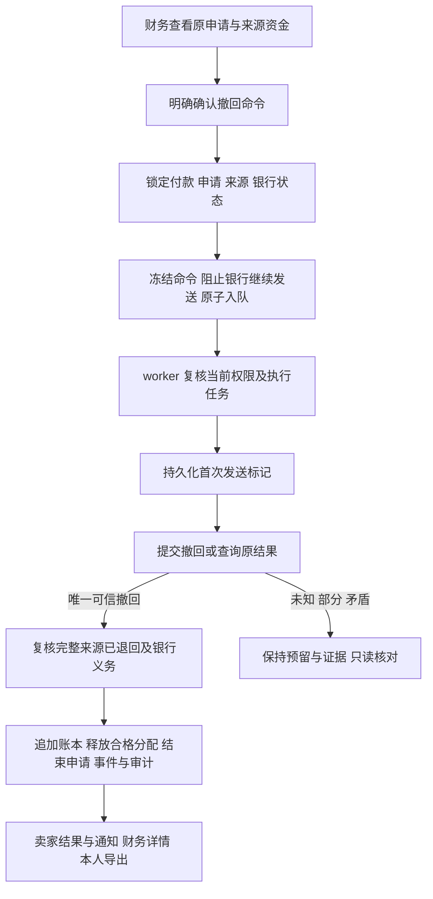

# 资源市场来源资金撤回

更新时间：2026-09-23。本文补充[完整链路](resource-marketplace-complete-flow.md)中来源撤回、过期银行命令处置与资金释放的交接。**Stripe 适配、0170 内部持久命令、0171 worker／执行日志／只读恢复和 0172 账本收尾均已有隔离专项；财务 HTTP GET/POST、独立收尾入口和卖家状态投影已在当前源码接线，并有定向 HTTP 回归。真实 Stripe、银行、生产数据库和完整财务流程仍未联合验收。** 当前边界见第 7 节，不得据此启用真实撤回或修改本地余额。

## 1. 为什么需要独立撤回链路

卖家提现包含两个不同的外部动作：平台向 Connect 账户划转来源资金，Connect 账户再向银行出款。来源转账成功后，即使银行命令过期或停止，资金也可能仍在 Connect 账户。本地取消申请并释放预留不会把这笔钱退回平台，可能导致重复分配。

来源撤回必须取得原通道的可信证据，再决定申请和账本如何结束。`tr_` 标识原来源转账，`trr_` 标识该转账的撤回，`po_` 标识银行出款；三者不能互相替代。银行失败、原命令过期、队列停止、查询无结果均不是来源资金已退回的证明。

## 2. 官方协议依据

2026-09-23 读取 Stripe 官方 [OpenAPI spec3.json](https://raw.githubusercontent.com/stripe/openapi/master/openapi/spec3.json)，文件声明版本为 `2026-08-26.dahlia`，下载字节 SHA-256 为 `f0e0fc8fffbffda45bf5f3df59846443c1d47a3cfcbfae232eedf4743124ebee`。本地临时副本为 `hcai-stripe-openapi-bts1fmny.json`，不作为仓库长期存档。实际调用仍使用原付款身份冻结的 API 版本；本次未修改配置版本，也未验证真实商户。

| 官方接口或对象 | 已核对的含义 |
| --- | --- |
| `POST /v1/transfers/{id}/reversals` | 反向划转全部或指定部分金额；不能超过未撤回余额；支持 metadata 和 `refund_application_fee` |
| `GET /v1/transfers/{id}/reversals` | 列出原转账的撤回，按 `limit` 和 `starting_after` 分页；只读 |
| `GET /v1/transfers/{transfer}` | 读取原转账、目标账户、来源 charge、金额、币种、模式、metadata 与累计撤回金额 |
| `transfer_reversal` | 含 ID、原转账 ID、金额、币种、时间、metadata；没有独立的 `livemode` 字段 |
| 余额条件 | 撤回增加平台余额、减少目标账户余额；普通 transfer_group 转账需目标账户有足够余额 |

参考：[创建撤回](https://docs.stripe.com/api/transfer_reversals/create)、[查询撤回](https://docs.stripe.com/api/transfer_reversals/list)、[独立收款与转账](https://docs.stripe.com/connect/separate-charges-and-transfers#reverse-transfers)。

## 3. 已实现的适配契约

源码：[provider_stripe_reversals.go](../internal/payments/provider_stripe_reversals.go)。`TransferReversalProvider` 是独立的可选接口，没有加入普通 `ProviderRuntime` 必选能力。当前调用方由来源撤回命令、worker 和只读恢复组成；HTTP 入口只创建受审计命令，不在请求线程调用 Provider，见第 7 节。

### 输入绑定

调用方必须从持久、不可变的业务证据组装输入，不能将这些金融字段直接交给网页填写：

- 本次撤回命令、申请、来源记录、原付款的内部 ID；
- 原 `tr_`、来源 `ch_`、Connect 目标、完整原金额、币种和正式／测试模式；
- 本命令拟撤回金额、明确认可的既有累计撤回金额；两者之和不能超过原转账；
- 原平台 merchant、端点、API 与请求版本，持久化幂等键和预留时间。

当前金额仅接受 USD 最小货币单位，单笔原金额上限与已有转账适配一致。内部审核理由、账户持有人信息和完整银行账号不发送至 metadata。

### 首次提交

1. 校验全部输入和原账户配置，原预留时间后的首次发送窗口为 23 小时；超窗不 POST。
2. 通过平台 `/account` 与 `/balance` 认证原商户及环境；不使用 `Stripe-Account` 将请求切换到卖家账户。
3. 读取指定原转账，检查其 ID、来源 charge、目标、付款 metadata、transfer group、金额、币种、模式与创建时间。
4. 累计已撤回金额必须等于命令冻结的先前值；若已变化，进入核对，不在当前调用中重新计算金额并提交。
5. 以原幂等键 POST 明确金额和四个内部关联 ID；`refund_application_fee=false`，不顺带退款应用费。
6. 校验返回的 `trr_`、类型、原转账、金额、币种、创建时间和全部命令关联，再读取原转账累计金额。
7. 仅累计金额等于冻结先前金额加本次金额时返回 `found`。最终读取失败或累计不一致时，保留已校验的撤回观察结果并返回错误，由未来业务处理器持久化不确定性。

整体适配调用限时 20 秒，并受原首次发送窗口约束；身份读取另有 10 秒限制。共享 POST 实现禁止网络栈自动重放；共享客户端不跟随重定向。适配本身不保存数据库记录、不决定当前操作者权限、不释放预留，也不提供“响应丢失后重新 POST”的业务授权。

### 只读核对

`LookupTransferReversal` 在首次发送窗口结束后仍可读取。它认证原商户、读取原转账、逐页列出撤回并核对命令关联；最多 10 页，每页 100 条。重复 ID、错误归属、无效金额或时间、畸形列表均拒绝。

只有完整分页结束后才核对所有撤回金额之和与再次读取的原转账累计金额。匹配本命令时，还要求累计金额与冻结先前值加本次金额一致。非本命令的有效撤回参与总额核验，但不会被认领成本命令。

| 结果 | 业务含义 |
| --- | --- |
| `found` | 唯一匹配本命令的撤回及父转账累计一致；仍须业务事务复核银行、申请与账本 |
| `not_found` | 完整列表没有本命令；不是新 POST 或释放预留的许可 |
| `ambiguous` | 多个撤回声称属于同一命令；保留待核对，不选择其中一个冒充成功 |
| `incomplete` 或错误 | 分页达到上限、超时、响应不可信或累计矛盾；不改变资金完成状态 |

## 4. 必须继续实现的业务链路

以下是完整链路及当前交接边界。财务入口、持久命令、执行恢复、完整返还收尾和卖家安全投影已有源码；部分返还、矛盾证据裁决、过期或未启动命令处置、外部对账及真实通道验收仍未完成。



1. **独立授权与持久命令：** 当前独立财务身份、明确确认、当前对象版本和原因；服务端读取原金额及身份。操作者同键重放原命令，冲突不生成新命令；命令、唯一任务、事件和审计原子保存。
2. **与银行出款互斥：** 先复核是否未发送、结果未知、已到账、失败或已退回。尤其不能将“银行任务停止”当作未发送。授权撤回后，银行命令创建、恢复和首次发送必须共同拒绝竞争；已有外部银行义务不能被本地状态覆盖。
3. **有据可查的派发与恢复：** 首次标记先提交，再检查同一任务与当前权限并最多发送一次；任务控制锁沿用 0169 的续租兼容方案。首次尝试后的重试只查询，停止任务恢复保留原尝试、期限和请求键。
4. **资金与账本闭环：** 只有完整来源返还、银行义务和退款／债务状态均核对一致，才能按事务追加分录并释放分配。保留原成功来源、原银行扣账／退回和全部失败记录；不得删除历史或单独改父申请为 cancelled。
5. **覆盖异常出口：** 目标余额不足、外部先前部分撤回、权限撤销、退款竞争、银行未知结果、源命令过期、响应丢失及进程中断；这些情况不能自动改用新幂等键。
6. **页面与数据交接：** 财务只读详情、共享明确确认交互、卖家安全结果和站内通知、本人导出字段白名单、操作指标及告警。
7. **验收：** 隔离数据库与模拟 provider 的完整流程、真实 API／worker／页面联合验证、Stripe 沙箱及生产配置验收，分别保留证据。

## 5. 当前验证范围

模拟 HTTP 覆盖首次提交、完整／部分金额、原商户和模式变化、原转账错绑、命令 metadata、失效时间、外发响应丢失、读取失败、完整／不完整分页、重复和矛盾证据、重定向、取消及超时，以及共享 POST 禁止重放。

适配阶段的准确选择集、结果和源码范围见[审查记录 11.212](resource-marketplace-flows.md#11212-来源转账撤回适配与官方协议核对)。**该段是适配阶段的历史边界**：当时没有数据库迁移或资金操作接口。当前工作区已追加 0170–0172、财务 HTTP 和共享页面；当前定向 HTTP/内部账本验证见[审查记录 11.218](resource-marketplace-flows.md#11218-目标1源码基线与文档状态复核)。这仍不证明运行数据库已升级或真实 Stripe/银行已联合验收。

## 6. 持久命令与银行互斥（0170）

源码：[命令服务](../internal/payments/seller_source_reversal_command.go)、[迁移](../internal/platform/database/migrations/0170_seller_source_reversal_commands.up.sql)、[隔离回归](../internal/payments/seller_source_reversal_command_test.go)。`SubmitSellerSourceReversal` 在 0170 历史阶段仅为内部服务方法；当前管理 HTTP 调用方见统一文档 7.18 和 [来源撤回 HTTP](../internal/transport/httpapi/seller_source_reversal.go)。

### 命令输入与保存

当前独立财务操作者明确确认原来源记录、申请的 `expectedUpdatedAt`、当前银行命令／终态结果 ID 和 10–1000 字原因，并提供原幂等键。服务端读取原商户身份、模式、来源 charge、transfer、目标账户、金额和币种；客户端不能指定替换资金目标或金额。

同一事务创建不可变命令、唯一 `payment.reverse_seller_source` 作业、申请事件和审计。事件或审计失败则整笔回滚。作业种类已纳入执行控制锁；0170 阶段尚未注册执行器，不能将入队解释为可执行的产品功能。命令本身不会调用 provider，不改变来源成功状态、申请资金状态或预留余额。

相同操作者和键只重放完全一致的原命令；修改申请、来源、版本、银行证据或原因产生冲突。原任务停止或命令过期不重置、不换键；新的资金写入关闭后仍允许有当前权限的原操作者取回原命令。等待资源锁后再次核验财务权限，卖家不能自行授权。

### 银行义务的判定

| 冻结状态 | 所需证据 | 不允许的推断 |
| --- | --- | --- |
| `not_reserved` | 没有银行命令，也没有银行扣账／退回分录 | 不能只查看队列是否存在 |
| `not_started` | 银行命令未登记首次发送，且没有任何银行读取、结果或扣账／退回 | 任务失败、取消或过期本身不表示未发送 |
| `failed` | 已发送但取得可信失败／取消终态，没有银行扣账，最新完整读取仍匹配该终态 | 历史失败之后的新未决查询不能忽略 |
| `returned` | 可信失败／取消终态，原扣账与退回分录均保留，最新完整读取一致 | 原 paid 或通知不是退回凭证 |

开放的读取、矛盾证据、待处理／在途／已到账、响应丢失、最新未找到或不完整结果均拒绝新撤回命令。外部先前部分撤回也不能通过自行填写金额绕过；当前内部命令冻结完整来源金额，未来执行器必须核验远端累计金额，部分或矛盾情况进入核对。

银行命令、恢复及首次发送共同检查撤回命令；一旦持久化撤回决定，便不能新建或继续发送银行出款。原支付／订单、卖家和申请锁之外，共用的处置控制行每次变更都会递增版本；银行读写证据也更新该行，防止旧 Repeatable Read／Serializable 快照绕过新决定。银行只读核对继续保留。

### 迁移与剩余工作

部署前必须排空旧资金写入方，当前二进制声明 `app.seller_reversal_protocol=command-v1`。控制行可重建，撤回命令是金融证据；存在任何命令时 down 拒绝回退，不能删除命令强行降级。

首轮 SQL 参数类型推断错误已修正；修正后的初版专项 5 个主测试／22 项通过，随后扩大最新银行观察保护与权限、并发场景。最终扩大专项 50 个主测试／164 项通过，695.989 秒，零失败／跳过，975 个后台源码文件完成时无漂移；银行 HTTP 与空库迁移往返各 1 项通过。结果记录于[11.213](resource-marketplace-flows.md#11213-来源撤回持久命令与银行互斥0170)。隔离测试不使用运行站点数据库或真实 Stripe。

0170 后续所需的首次发送标记、执行时重新核验、一次 POST 与只读恢复、原始观察持久化、完整返还后的账本及分配处理、财务入口、本人结果／通知／导出和监控，已经由 0171／0172 及后续 HTTP／前端接线补充。上文“尚未注册执行器/没有财务入口”的描述仅代表 0170 阶段。当前仍缺部分或矛盾证据、过期或未启动命令处置、外部对账、真实通道和生产流程验收。

账本收尾还需同步检查现有约束：0153／0164 的分配释放、取消与新分配规则，以及 `seller_funds.go` 的申请资格，目前都会拒绝存在来源转账的申请或结算；退款处理也会把成功来源视为追偿风险。后续应以不可变、已消费的完整撤回凭证区分仍在途的资金和已返还资金，再调整新分配及债务计算。不能删除原转账、重复记结算入账，或仅修改申请状态让余额看起来恢复。

## 7. 执行日志与只读恢复（0171）

源码：[执行器](../internal/payments/seller_source_reversal_execution.go)、[恢复调度](../internal/payments/seller_source_reversal_recovery.go)、[迁移](../internal/platform/database/migrations/0171_seller_source_reversal_execution.up.sql)、[回退](../internal/platform/database/migrations/0171_seller_source_reversal_execution.down.sql)。以下行为已有隔离专项验证，不能代替真实通道验收或尚未实现的账本闭环。

- `seller_source_reversal_dispatches` 保存首次发送标记；`reads` 保存事前登记的读取和原始观察；`results` 保存接受的唯一撤回凭证；`checks` 绑定追加的只读恢复任务。
- 首次外发前检查原任务、当前授权和命令期限；标记提交后再外发。后续执行仅调用查询，保持原金额、身份与键。
- 读取期限为 20 秒；晚到结果不能直接记为有效成功。部分、未知或矛盾证据留待核对。
- 保存可信返还观察后，申请仍为 `reconciliation_required`，以 `source_reversal_observed` 表示已观察到返还。当前代码不追加资金释放分录、不删除原来源、不改写原银行历史。
- `cmd/worker` 已注册首次执行和只读恢复两个处理器，并增加每分钟运行、单次 10 秒预算的恢复扫描；候选规则包含 5 分钟冷却。专项覆盖停止任务、冷却、忙付款跳过、并发调度及审计回滚，没有在运行站点升级或执行。
- 新增运行协议 `app.seller_reversal_execution_protocol=journal-v1`；任何首次派发证据都会阻止 0171 down。迁移往返、协议及证据保护已通过隔离专项。

前次文档核对的失败记录（后续已修复）：

```text
go test ./internal/payments -run '^$' -count=1
seller_source_reversal_command_test.go:298:3: undefined: applySourceReversalExecutionMigration
seller_source_reversal_command_test.go:308:3: undefined: applySourceReversalExecutionMigration
FAIL [build failed]
```

前次命令只尝试编译，没有运行数据库用例。后续已补齐辅助函数并通过隔离数据库回归；新增测试复现并修复了原生超时／调用取消被误判为永久冲突的问题。传输不确定性保留首次标记及观察，允许新查询确认；实际金额、身份和凭证冲突仍不能被后续成功响应擦除。

0171 主专项 18 个主测试／74 项通过（366.574 秒）；补充边界／控制／迁移 8 个主测试／31 项通过（78.931 秒）；空资金迁移 1 项、旧来源准入迁移 1 个主测试／3 项通过，均零失败／跳过。告警脚本、worker、构建和定向 vet 通过。覆盖首次发送互斥、审计回滚、响应丢失、权限与身份变化、停止／过期／不支持通道、真实 worker 续租、20 秒晚到响应、只读恢复及迁移证据保留。详见[11.215](resource-marketplace-flows.md#11215-来源撤回执行恢复与超时分类修复0171)。0172 固定源码支付全包 595 个主测试／2084 项结果是历史快照证据，不代表当前工作树全包通过；当前状态见[完整链路 0.1](resource-marketplace-complete-flow.md#01-目标-1-当前基线拒付来源撤回与验证边界2026-09-23)。真实联合验收仍待完成。

当前源码已经补充消费完整返还凭证的账本与分配事务、银行义务及完整退款债务核对、财务确认入口、本人结果／通知／导出和业务指标。完整闭环仍需部分或矛盾证据裁决、未执行或过期命令处置、外部对账及真实通道联合验收。0172 新增代码与当前验证边界见下一节；不能沿用 0171 专项结论作为账本收尾的验收结果。

## 8. 返还凭证消费与账本收尾（0172，内部服务）

[内部收尾服务](../internal/payments/seller_source_reversal_closure.go)与[0172 迁移](../internal/platform/database/migrations/0172_seller_source_reversal_closure.up.sql)要求当前独立财务身份确认已接受的完整返还证据、申请版本和原因。有效履约分支释放原预留；已退款分支清偿匹配的完整债务并取消结算，不能增加可提现收入。原来源、银行扣账／退回、观察和审计全部保留。

同一事务必须消费账本、分配、事件和审计；任一步失败全部回滚。旧操作者撤权时，另一当前合格财务可以收尾；等待锁后重新复核权限。新写开关关闭不阻止本地收尾。未完成读取、迟到或矛盾结果、部分债务、银行未决和退款处理中仍拒绝释放。

再次提现使用新申请的持久来源键；切换自动结算则使用已持久化批次键。初始和历史请求保留原键，查询仍绑定原付款与 transfer group。仅已收尾且原通道完整快照一致的全额返还转账可在查询中排除；原派发、结果和所有失败记录不可删除。0172 将原付款派发唯一约束替换为受锁和返还证据约束的准入，避免既阻塞合法重提，又误允许未决来源重复外发。

旧银行／撤回任务对已收尾申请不再外发或重开。回退在存在任何收尾凭证时拒绝执行；不能清空证据来降级。

前次测试辅助函数缺失已修复。分组隔离 Race 覆盖余额释放、退款前后及并发、债务回滚、权限等待与替代财务、幂等、银行已退回、历史查询、再次提现至银行成功和自动结算。撤回／续租扩大选择集 37 个主测试／173 个通过，来源／资金／迁移扩大选择集 62 个主测试／124 个通过；最终组合 5 个主测试／14 个通过。0172 固定源码支付全包随后取得终态：595 个主测试／2084 项结果通过，零失败／跳过，源码快照无漂移。准确范围、源码清单、原失败及新请求键修复见[11.217](resource-marketplace-flows.md#11217-来源返还账本收尾与再次划转0172)。

财务 HTTP／共享页面、本人结果／通知／导出和业务指标已经接线；部分与矛盾资金处置、未执行或过期命令处置、外部对账及真实通道验收仍需继续完成。本轮没有升级运行库或执行真实资金操作。业务说明见[统一文档 7.21](resource-marketplace-complete-flow.md#721-来源返还后的账本收尾0172内部服务)；当前源码、专项测试、部署和真实通道状态见[审查记录 11.218](resource-marketplace-flows.md#11218-目标1源码基线与文档状态复核)。
