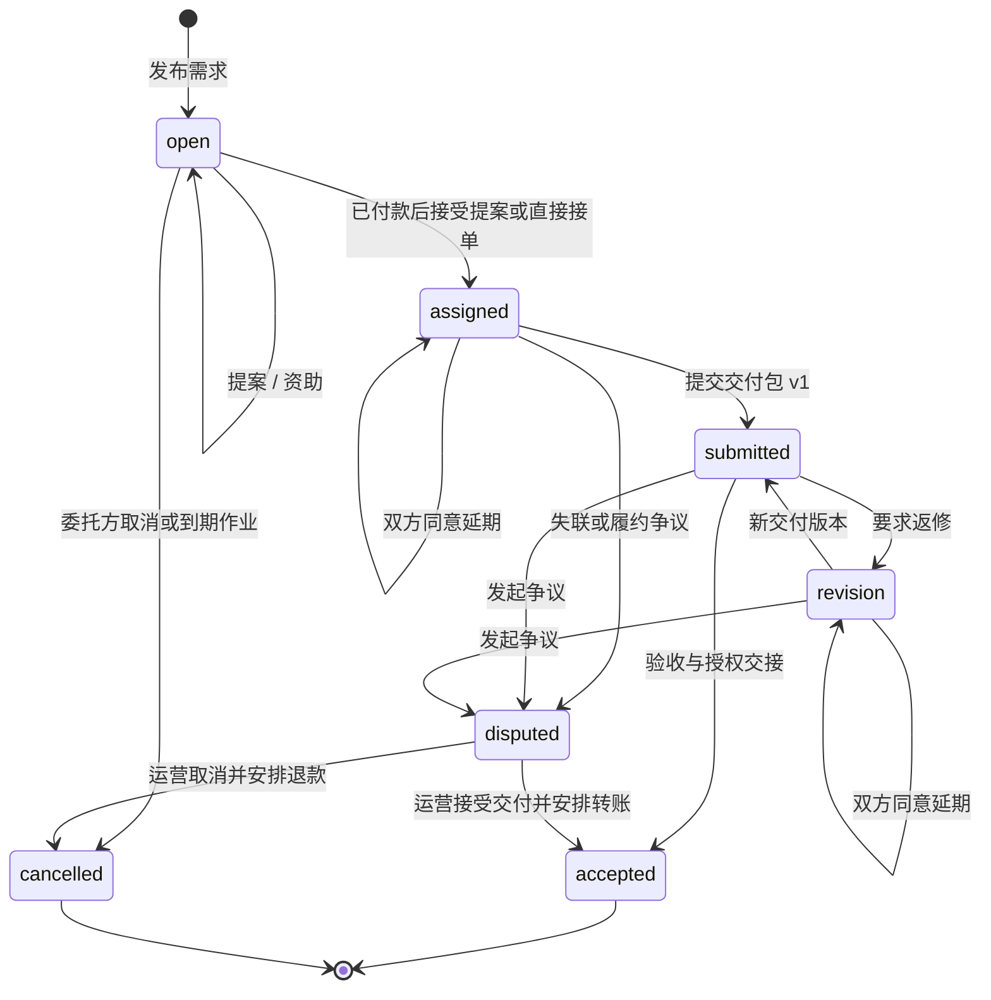
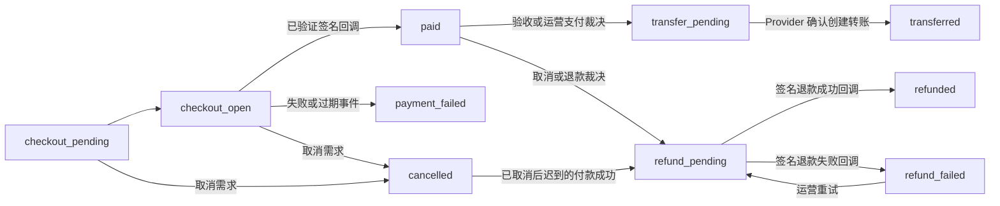

# 任务广场全链路与验收记录

更新日期：2026-09-18。基线：当前工作区代码，包含尚未提交的修改。本文件替代此前同名文档中 G01–G14 的待补齐描述。

本文说明实际用户入口、权限、任务和资金状态、交付授权、异常恢复及验证边界。实现存在、自动化测试通过、外部支付平台验收是不同层次；本文不将模拟 Provider 测试描述为真实收款或银行到账。

## 1. 当前边界与产品规则

- 用户使用真实注册、邮箱验证及会话体系，不提供演示身份切换。
- **所有有效登录用户都可发布需求**，包括新注册的 `member`；`task_creation` 平台开关仍由服务端执行。
- 发布不扣款，付款不自动选人，验收不等于到账。
- HTTP 任务服务固定启用 Provider 资金校验，关闭支付不会回退到本地账本。
- 本地开发支付配置仍为 Stripe、`enabled=false`、`liveMode=false`。此次未启用真实支付，也未发送新的认证邮件。
- 当前可用于任务的支付路径为 Stripe Checkout、Connect、退款和转账。其他 Provider 的商品支付能力不能替代任务所需的四项能力；收款开户明确受 Stripe 任务能力门槛控制。
- 截止时间作为报名截止与约定交付目标。未分配任务到期自动取消；已分配任务不自动扣款、验收或赔付，允许双方延期或提交争议请求运营裁决。
- 每次交付为最多 20 个自有资产组成的版本包。验收授予委托方独立资产记录、下载入口及不可变的授权快照；是否允许本站衍生创作由发布时明确勾选，默认关闭。交付文件不能直接转售或再次发布为公共作品。

## 2. 页面与角色

| 入口 | 用途 |
| --- | --- |
| `/market/demands` | 搜索、类型/状态/排序、真实分类计数、列表/网格及游标加载更多 |
| `/market/demands?view=mine` | 本人发布、承接或提交过提案的任务 |
| `/market/demands/:id` | 需求、角色相关操作、资金、私密履约、版本及历史 |
| `/workspace/tasks` | 我的任务汇总和加载更多 |
| `/create/:mode?taskId=:id` | 已分配创作者带任务上下文创作 |
| `/market/demands/:id?assetId=:assetId#task-participation` | 从创作结果进入手动交付表单 |
| `/workspace/assets/:id` | 验收后委托方资产、授权快照、下载及允许时的衍生创作 |
| `/settings?section=payouts` | 创作者收款开户及验证 |
| `/notifications` | 任务提醒及详情深链接 |
| `/admin?tab=tasks` | 争议队列、原因/确认/版本控制的裁决 |
| `/admin` 支付栏目 | 回调证据、退款或转账重试、事件重放 |

账户角色与任务关系是两回事。任务详情中的 `viewerRole` 为 `viewer/client/assignee/operator`。

| 操作/数据 | 权限与约束 |
| --- | --- |
| 浏览公开简介 | 访客可见有效发布者的需求；发布者停用后仅参与者及有 `admin:tasks` 权限的运营保留访问 |
| 发布 | 有效登录用户，发布开关开启 |
| 查看提案 | 委托方和授权运营看全部；其他用户仅看本人提案 |
| 查看履约包、审核说明、事件、结算与延期 | 委托方、承接者、授权运营；普通访客及未中选提案者返回空履约列表 |
| 查看资金 | 双方/运营可见，提案创作者可看本人被资助提案的摘要；公开访客仅能看到不绑定私有提案的直接资助状态，不暴露 Checkout URL |
| 提案 | 非委托方、`open`、未到期、尚无本人提案 |
| 直接接单 | 非委托方、`open`、未到期、允许直接接单、准确匹配的已付款资金；已有待处理提案可转换 |
| 资助/选择提案 | 仅委托方，且资金绑定任务、选定提案、金额及币种 |
| 交付 | 仅承接者，`assigned/revision`，自有合规资产、来源说明及确认 |
| 预览交付 | 委托方在提交/返修/争议/验收阶段可访问包内文件；扫描非 clean 时不允许读取 |
| 运营预览素材 | 有 `admin:tasks` 权限且素材确实属于争议任务；不授予任意私有资产访问 |
| 验收/返修 | 仅委托方，`submitted` |
| 延期 | `assigned/revision` 的任一方提出更晚时间，另一方批准；任何一方可拒绝/撤回 |
| 发起争议 | 双方，`assigned/submitted/revision`，支持尚未交付的失联/取消请求 |
| 普通取消 | 委托方，`open`；已分配任务通过争议裁决退出 |
| 运营裁决 | `admin:tasks`、开放争议、精确版本、10–2000 字理由、显式确认 |

## 3. 两套状态机

### 3.1 任务业务状态



数据库保留历史 `draft`，当前创建接口直接发布 `open`。草稿、分阶段里程碑、部分付款/部分验收、自动验收、任务转派仍不是本次定义的功能。未交付的争议可取消，但不能在没有交付物时裁决“接受交付并支付”。

### 3.2 资金状态



`accepted` 为业务完成；`provider_pending` 为结算待转账；`transferred/provider_transferred` 表示 Provider 转账已创建，不是创作者银行提现已到账。退款 Worker 获取退款 ID 后仍为 `refund_pending`，需要回调确认。

## 4. 正常用户链路

### 4.1 发现 → 发布

1. 列表默认看 `open`；“我的进展”不默认限制状态。
2. 支持文字、类型、状态以及 `newest/deadline/budget_desc` 排序，每页默认 40、最多 100。
3. 排序以 ID 作为稳定同值排序键；游标绑定用户和筛选条件。结果 `total` 是完整匹配数量，`typeCounts` 在同一搜索/状态/身份范围内跨类型统计，不再统计前 40 条。
4. 用户填写标题、摘要、正文、预算、清单、时区截止时间、权利条款、AI 披露要求和直接接单/衍生复用选项。
5. 标题至少 5 个 Unicode 字符、摘要 10、正文 30；清单先移除空白再验证非空；时区必须是有效 IANA 时区。
6. 创建与提案金额均为 `50–99,999,999` 美分，固定 USD，与 Checkout 保持一致。
7. 前端按**所选时区**将本地时间转换为 UTC；拒绝夏令时不存在或重复的时刻，不擅自偏移一小时。
8. 创建事务写入需求、幂等命令、事件和按截止时间调度的 `task.expire_open` 作业。

同一用户、操作和请求键的并发创建在插入前串行化。重复请求返回原任务，不生成另一份需求。未来任务量增长时继续使用“加载更多”，不可把工作台当前已加载金额等派生指标理解为全站交易总额。

### 4.2 提案模式

1. 创作者提交制作方案（至少 20 字符）、交付说明（至少 10 字符）、报价和预计天数。
2. 服务端要求任务开放且未到期；每人每任务一份提案。
3. 委托方选定一份提案并资助，金额来自报价，支付意图绑定提案及创作者。
4. 托管付款与签名回调完成后，资金为 `paid`。
5. 委托方再点击接受，服务端核对资金并锁定任务，选中提案接受、其余待处理提案关闭，分别通知相关创作者。

资助 A 提案不能接受 B 提案。当前未提供独立的提案编辑/撤回表单；直接接单转换有明确服务端路径。

### 4.3 直接模式

1. 委托方发布时开启直接接单，并按预算完成不绑定提案的资助。
2. 收到已验证的付款成功回调后，非委托方可接单。
3. 行锁保证只有一个创作者成功分配；服务端绑定收款人。
4. 已有本人 `submitted` 提案则转换为接受，采用已资助任务预算；没有则创建直接接单提案。
5. 其他待处理提案全部拒绝并通知，委托方收到接单通知。

页面在承接前提示设置收款账户。尚未开户不是伪造资金的理由：可以承接，但验收后转账必须等待真实账户能力验证。

### 4.4 制作 → 多文件交付

1. 承接者可选择现有自有资产，或进入 `taskId` 关联的创作台；创作服务要求本人为承接者且任务为 `assigned/revision`。
2. 生成结果返回任务表单；生成成功不会自动提交交付。
3. 选择主资产和附加文件，总计 1–20 个、不可重复。要求全部归本人所有、扫描 clean、非购买资产和非他人授予的任务资产。
4. 至少一个文件匹配任务类型，`mixed` 接受混合类型；允许附加文档。文本任务映射文档类型。
5. 填写交付说明（至少 5 字符）、来源授权说明（至少 10 字符）、AI 模型/素材说明（至少 5 字符），并确认符合原任务权利约定。
6. 同一事务记录交付版本、文件顺序、披露证据、任务迁移、事件及通知。

格式匹配、扫描和声明不是自动版权鉴定。委托方必须人工核对完整交付清单、来源、AI 披露及权利要求；不满足时返修或争议。

### 4.5 返修 → 验收 → 授权交接

- 返修要求至少 10 字符说明。新提交生成新版本，不覆盖旧包。
- 验收再次检查资金以及所有包内资产的当前扫描状态和归属；任一文件已被标记为风险时，整个验收事务回滚，不转账、不发放授权。
- 验收事务中创建委托方独立资产记录，保留源文件关联，并写入 `task_delivery_grants`。
- 授权快照包含任务、交付版本、源资产、双方、权利条款、来源说明、AI 披露及衍生许可，禁止后续修改/删除。
- 委托方在资产详情查看快照、下载自己的资产。仅明确许可时，服务器允许其作为创作参考或蒙版；页面显示对应创作入口。
- 不允许将交付资产直接公开发布、转售或通过上传新版本绕过原授权。
- 创作者注销账户时，对仍有效的其他委托方保留已交接文件及必要合同证据；双方均注销且无其他有效交接时清理共享文件。删除回执说明此保留边界。

普通验收与管理员接受交付使用同一个 `taskdelivery.GrantTx`，避免两条路径授权行为不同。

### 4.6 异步转账

1. 业务状态先到 `accepted`，资金转为 `transfer_pending`，生成结算和 `payment.transfer_task`。
2. 创作者在设置页完成 Stripe Connect 托管开户；以签名账户事件确认账户能力，返回页本身不是验证凭证。
3. Worker 要求有效 charge、正确收款人、`verified` 账户及收款/提现能力，使用 Provider 幂等转账。
4. 成功后保存 Provider 转账证据、更新结算、写入任务事件及通知。
5. 缺少开户、能力受限、Provider 超时等情况保持待转账。作业最多 20 次尝试，耗尽后运营重试。

## 5. 异常与恢复

### 5.1 到期、延期、取消

- 创建任务时调度到期作业；迁移补排现存开放任务。
- 到期后的提案、直接接单、选择提案和新 Checkout 被服务端拒绝，不依赖前端倒计时。
- `open` 到期作业调用同一取消逻辑：无支付则取消，有已付款资金则退款，待付款意图先取消并保留迟到回调补偿。
- 已分配任务到期不自动结算。双方在 `assigned/revision` 可申请更晚截止时间，另一方同意才修改；申请人不能自批。
- 失联、无法继续、取消请求可在 `assigned` 就发起争议。此版本采用运营裁决的退款退出方式，不允许单方撤销已分配交易。

### 5.2 迟到付款与退款失败

取消需求不会同步销毁 Provider 收银台。取消后收到真实匹配付款时，直接进入 `refund_pending` 并退款，不重新开放或分配任务。

退款 Worker 请求外部退款并保存 ID；成功或失败回调分别进入 `refunded/refund_failed`。重试必须通过支付恢复接口和预期版本，不重复创建已在队列/运行中的作业。

### 5.3 争议裁决

| 决策 | 业务结果 | 资金和授权 |
| --- | --- | --- |
| `release_creator` | 已存在的争议交付接受，任务 `accepted` | 匹配资金、交付安全复核、委托方授权交接、异步创作者转账 |
| `cancel_without_settlement` | 任务 `cancelled` | 有已付款资金则退款；历史无资金任务仅取消，不制造结算 |

必须提交 `reason`、`confirm=true`、`decision` 和 `expectedVersion`。裁决事务记录操作员、请求 ID、真实理由、版本前后值、业务状态、资金决策及双方通知。过期版本/终结争议不能重复裁决。未交付争议不允许 `release_creator`。

风险信号审核独立于任务裁决，不自动被标记为已处理。

### 5.4 页面与网络恢复

- 资金处于 Checkout 准备/打开、待转账或待退款时，详情每 5 秒刷新；隐藏标签页暂停请求，重新聚焦恢复。
- 原付款窗口与支付返回窗口都刷新，不要求必须有 `payment=success`，不再五次后停止。
- 提供手动“刷新资金状态”和收款设置入口；请求使用路由/操作版本避免旧响应覆盖新任务或新操作。
- 普通任务写请求用用户、路径和请求体摘要绑定幂等键；网络/服务器结果不明时保留至重试，成功后清理，双击并发合并。
- Session Storage 只保存摘要和随机键，不保存表单内容；按用户隔离，退出时清理。存储不可用时回退内存。
- Checkout 失败后同一资金周期重试也使用稳定请求键。

## 6. 接口与数据

全部路径加 `/api/v1`。普通写请求要求 `Idempotency-Key`（8–200 字符），Checkout 为 8–128；后台使用版本和确认协议。

| 方法与路径 | 核心输入/输出 |
| --- | --- |
| `GET /tasks` | `q,type,status,sort,mine,limit,cursor` → `items,total,typeCounts,nextCursor` |
| `GET /task-types` | 动态分类 |
| `POST /tasks` | 发布表单，含 `allowDerivativeReuse` |
| `GET /tasks/:id` | 按角色过滤的详情、交付包及待确认延期 |
| `POST /tasks/:id/checkout` | 可选 `proposalId`，托管支付地址/意图 |
| `POST /tasks/:id/proposals` | 方案、说明、报价、天数 |
| `POST /tasks/:id/claim` | 接取直接资助任务，可转换本人提案 |
| `POST /tasks/:id/proposals/:proposalID/accept` | 接受匹配已资助提案 |
| `POST /tasks/:id/deliveries` | `assetIds,note,rightsEvidence,aiDisclosure,rightsConfirmed`；保留单 `assetId` 兼容入口，但不豁免披露和确认 |
| `POST /tasks/:id/review` | `accept/request_revision,note` |
| `POST /tasks/:id/deadline` | 提案：`propose,deadline,reason`；回应：`accept/reject,changeId` |
| `POST /tasks/:id/disputes` | `reason`，允许制作中发起 |
| `POST /tasks/:id/cancel` | `reason`，仅开放任务 |
| `GET /account/payouts` | 当前账户能力及可用性 |
| `POST /account/payouts/onboarding` | Stripe 托管验证链接 |
| `GET /admin/tasks` | 搜索、业务/争议状态及游标 |
| `POST /admin/tasks/:id/resolve` | `decision,expectedVersion,reason,confirm` |
| `GET /admin/payments` | 资金/Provider 事件/异步任务证据 |
| `POST /admin/payments/:id/recover` | `retry_transfer/retry_refund,expectedVersion` |
| `POST /admin/payments/events/:id/replay` | 预期版本及重放 |

错误语义：未登录 401、禁止 403、不存在/不可见 404、状态/资金/幂等冲突 409、字段或游标不合规 422、服务关闭 503。冲突时先刷新业务状态，不一律自动重发。

| 数据 | 职责 |
| --- | --- |
| `demands` / `proposals` | 需求及选人，固定权利约定和衍生授权选项 |
| `deliveries` / `delivery_assets` | 交付版本、披露证据及有序文件包 |
| `task_delivery_grants` | 不可变授权、源文件和委托方独立资产映射 |
| `task_deadline_changes` | 待确认和已处理的双方延期 |
| `task_commands` / `task_events` | 写请求去重及不可变历史 |
| `task_disputes` / `task_settlements` | 争议与结算状态 |
| `payment_intents` / `payment_intent_events` | 独立资金状态及证据 |
| `payment_provider_events` / 处理状态表 | 回调事实及重放 |
| `payment_destinations` | 收款账户验证能力 |
| `jobs` / `job_attempts` | 到期、回调、退款、转账等异步执行 |
| `assets` / `generations` | 创作来源、交接文件和后续参考 |
| `notifications` / `risk_signals` / `audit_events` | 提醒、风险和运营审计 |

通知覆盖提案提交/接受/关闭、直接接单、交付、返修、验收、延期、资金确认、转账、取消、退款状态和争议。来源键去重，遵循用户偏好；这是站内通知，不表示任务邮件也已通过 SMTP 发送。

## 7. G01–G14 修复对照

| 编号 | 本次落实的规则与实现 | 主要验证 |
| --- | --- | --- |
| G01 | 所有有效登录用户可发布，前后端一致 | 新会员浏览器发布及现有发布接口测试 |
| G02 | 包内私有素材按委托关系授权，争议运营按权限访问，扫描限制继续生效 | `TestTaskPrivacyAndCommissionerReviewAccess` |
| G03 | 公开简介与私密履约分离，私有提案资金不公开，运营显式角色 | 隐私越权和运营证据测试 |
| G04 | 验收/裁决共用原子授权交接；资产详情快照、下载、衍生授权及注销保留 | `TestDeliveryBundleGrantAndContractSnapshot`、Provider 结算/后台裁决回归 |
| G05 | 未分配到期关闭退款、制作中争议、双方延期、禁止单方延期或自动赔付 | `TestDeadlineExpiryAgreementAndPreDeliveryDispute`、取消退款回归 |
| G06 | 匹配旧命令时核对目标任务；并发创建先锁定逻辑请求再插入 | `TestTaskCommandScopeAndConcurrentCreate` |
| G07 | 裁决理由、确认、版本、请求 ID 和审计同事务保存 | `TestAdminTaskOperationsHTTPContract`、后台浏览器链路 |
| G08 | 本人提案可转换直接接单，统一关闭并通知其他提案 | `TestTaskInputBoundariesAndDirectProposalConversion` |
| G09 | 金额一致、Unicode 字数、清洗后校验清单、有效时区与夏令时校验 | 输入边界、时区单元测试及新会员发布 |
| G10 | 稳定游标、完整结果总数和分类统计，广场/工作台加载更多 | `TestTaskPaginationAndCounts` 覆盖 105 条及三种排序 |
| G11 | 两个支付窗口持续刷新、焦点恢复、手动刷新及收款提示 | 延迟超过旧五次上限的浏览器测试，开户/转账回归 |
| G12 | 多文件包、匹配类型、权利与 AI 披露确认、验收前二次安全检查 | 交付包回归、完整浏览器交付/返修 |
| G13 | 不确定网络结果复用键、用户和任务隔离、并发合并、退出清理 | `taskCommands.test.ts` |
| G14 | 任务资金审计读取实际 Provider；Stripe 专有开户明确能力约束，修正运营资金说明 | 支付/开户回归；无实际外部支付调用 |

## 8. 验证记录与外部边界

本轮新增或扩展的测试覆盖：

- 任务私密数据、交付访问、运营权限、跨任务幂等、并发重复发布、金额/清单/时区输入。
- 多文件交付、错误主类型、缺失权利确认、扫描状态变更、授权快照不可变、明确允许/禁止衍生创作，以及双方注销时共享文件的保留与清理。
- 105 条任务分页/聚合、各排序无重复无遗漏、跨筛选游标拒绝。
- 到期关闭、到期拒绝接单、重复作业、第三方及自批延期拒绝、双方延期、交付前争议。
- 管理员原因/确认必填、版本和审计；原有提案、Provider 分配、交付、返修、转账、取消退款回归。
- 前端时区/DST、网络不确定重试、翻译合约、普通会员发布、长延迟付款状态刷新。

2026-09-18 验证结果：

| 范围 | 结果与边界 |
| --- | --- |
| Go 业务回归 | `tasks/payments/admin/assets/creation/community/notifications/datarights` 包测试通过；最后补充的已付款到期、迟到付款退款和本人提案资金可见性定向测试通过 |
| HTTP 接口回归 | 最终独立执行 `HCAI_REQUIRE_INTEGRATION_TESTS=1 go test ./internal/transport/httpapi -count=1` 全包通过（53.682 秒），覆盖最后修正的提案资金可见性 |
| 前端单元测试 | 时区、稳定请求键及中英文文案合约共 9 项通过 |
| Chromium 浏览器回归 | `task-workflow/admin-tasks/task-hardening` 共 8 项通过，包含新会员发布、交付返修、争议操作及超过旧轮询上限的资金刷新 |
| 构建与静态检查 | 前端 TypeScript/Vite 构建、ESLint、API/Worker 构建及 `git diff --check` 通过 |
| 本地数据库 | 已应用 `0071_task_delivery_contract` 和 `0072_task_deadline_changes`；开发库任务数仍为 0 |
| 本地运行 | API 和 Worker 已用新代码重启；API `/health`、`/ready`、前端及代理任务列表均返回 200；任务列表返回 `items/total/typeCounts` |
| 支付开关 | 运行时 `/meta` 仍报告 Stripe `enabled=false`、`liveMode=false`，没有启用真实交易 |

测试数据库使用隔离 schema，浏览器端使用 `hcai_e2e` 和专用账号，不向本地开发业务库重新注入演示账户。

真实 Provider 沙箱验收仍为独立上线门槛：银行卡支付、签名回调、Connect 账户验证、真实退款和转账需在配置完备的沙箱贯通；本轮没有发起真实付款、退款、转账或收费模型调用。既有浏览器完整制作流程使用隔离夹具准备已分配状态，并验证无资金不能验收，不据此声称真实交易已验收。

回归命令：

```bash
HCAI_REQUIRE_INTEGRATION_TESTS=1 go test ./internal/tasks ./internal/payments ./internal/admin ./internal/assets ./internal/creation ./internal/community ./internal/notifications ./internal/datarights ./internal/transport/httpapi
npm --prefix web run test -- src/lib/taskDateTime.test.ts src/lib/taskCommands.test.ts src/i18n/messages.test.ts
npm --prefix web run test:e2e -- task-workflow.spec.ts admin-tasks.spec.ts task-hardening.spec.ts --project=chromium
npm --prefix web run build
npm --prefix web run lint
go build ./cmd/api ./cmd/worker
```

部署包含迁移 `0071_task_delivery_contract` 和 `0072_task_deadline_changes`，需同时更新 API、Worker 和前端；旧客户端不再可以省略交付来源确认或管理员裁决理由。

## 9. 源码与历史设计

| 位置 | 用途 |
| --- | --- |
| [任务业务服务](/Users/helong/Work/HCAI-Chat/internal/tasks/service.go) | 权限、迁移、交付、幂等及通知 |
| [列表分页](/Users/helong/Work/HCAI-Chat/internal/tasks/list.go) | 游标、真实聚合统计 |
| [到期与延期](/Users/helong/Work/HCAI-Chat/internal/tasks/deadlines.go) | 到期作业和双方协议 |
| [授权交接](/Users/helong/Work/HCAI-Chat/internal/taskdelivery/grants.go) | 普通验收及运营裁决共用事务 |
| [支付工作流](/Users/helong/Work/HCAI-Chat/internal/payments/workflow.go) | Checkout、回调、转账、退款和补偿 |
| [收款开户](/Users/helong/Work/HCAI-Chat/internal/payments/onboarding.go) | Stripe Connect 能力边界 |
| [运营裁决](/Users/helong/Work/HCAI-Chat/internal/admin/task_operations.go) | 原因、确认、版本与审计 |
| [资产服务](/Users/helong/Work/HCAI-Chat/internal/assets/service.go) | 交付内容授权、资产来源快照 |
| [任务页面](/Users/helong/Work/HCAI-Chat/web/src/pages/TaskMarketplacePage.vue) | 所有前台任务动作及资金刷新 |
| [稳定请求键](/Users/helong/Work/HCAI-Chat/web/src/lib/taskCommands.ts) | 网络重试和用户作用域 |
| [时区转换](/Users/helong/Work/HCAI-Chat/web/src/lib/taskDateTime.ts) | 所选时区及 DST 校验 |
| [接口契约](/Users/helong/Work/HCAI-Chat/internal/transport/httpapi/openapi.yaml) | 与生成客户端保持一致的 OpenAPI |

ADR 0002 的本地账本是历史设计；当前 HTTP 强制 Provider 校验。ADR 0016 的裁决审计要求本次已重新落实，但其早期本地结算描述仍须按历史阅读。后续改变角色、截止时间、权利或 Provider 规则时，应同步更新本文、OpenAPI 与测试。
