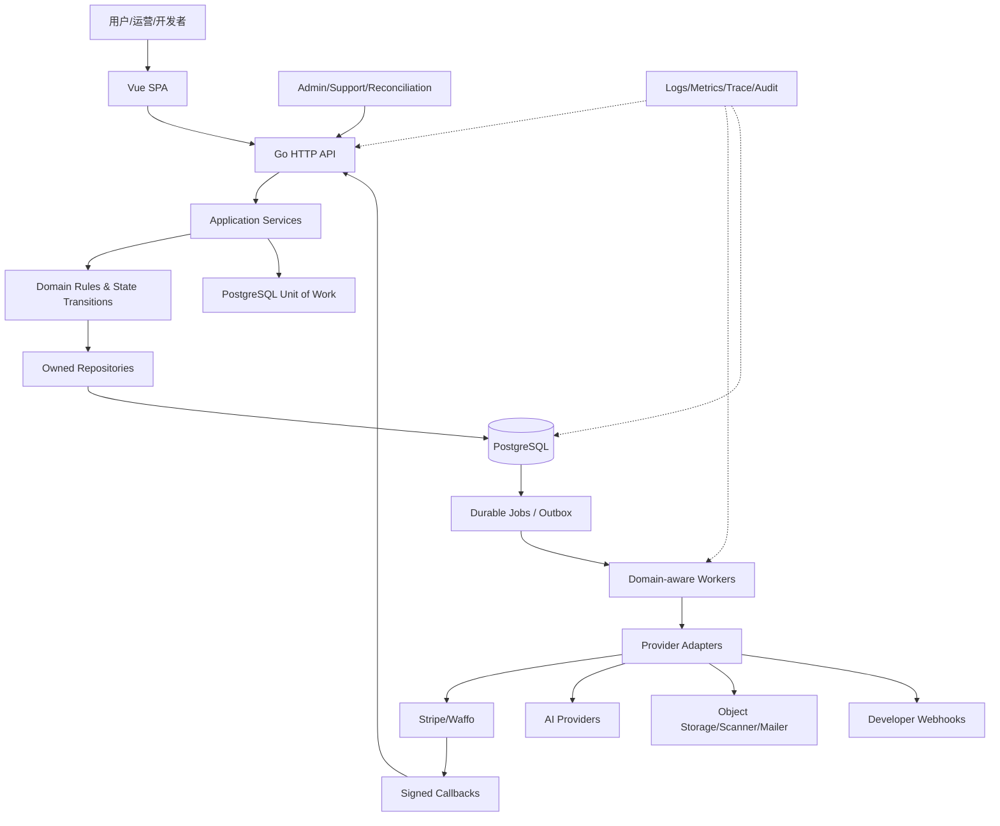
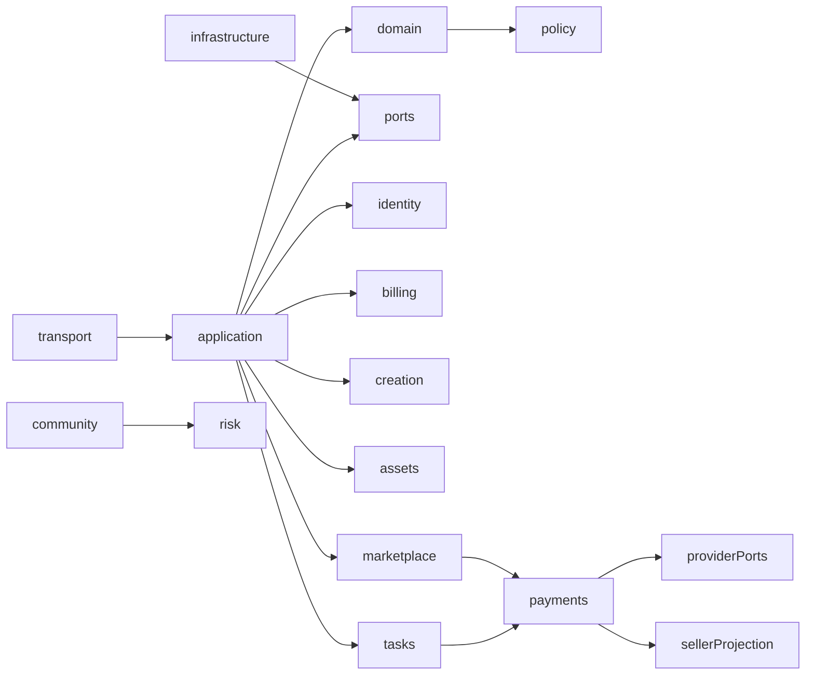
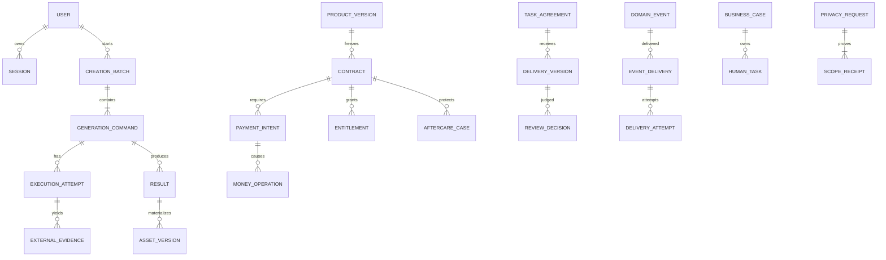
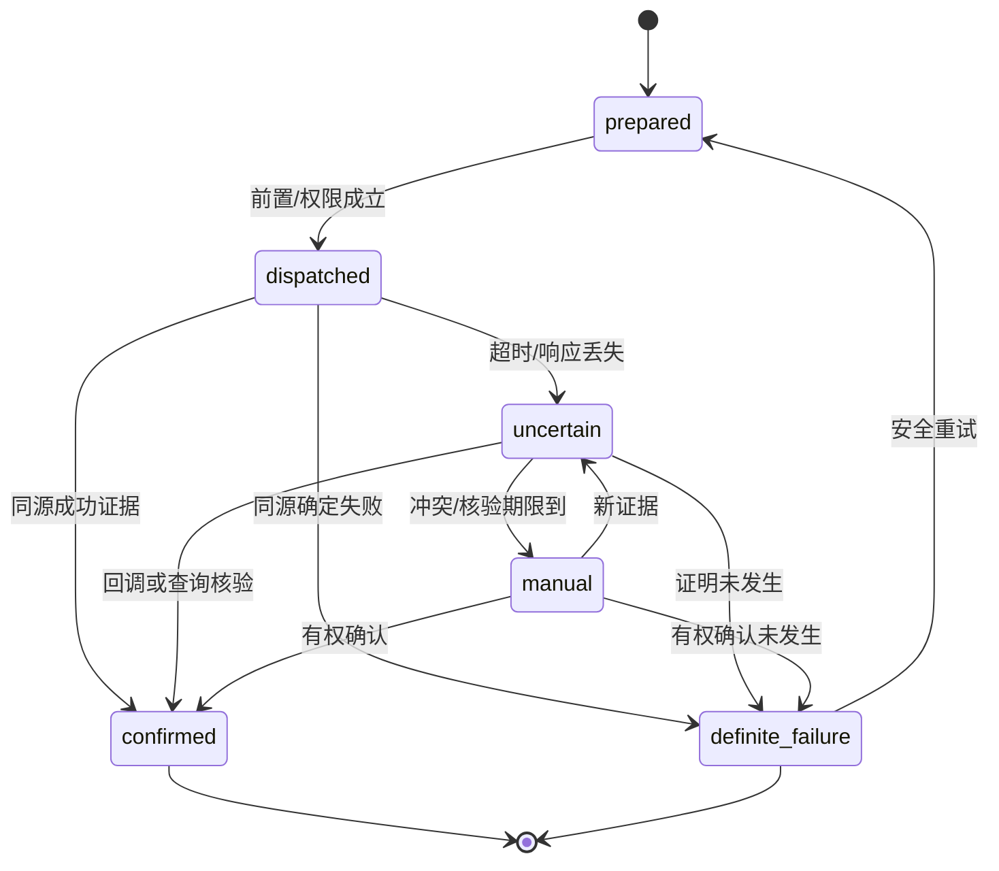
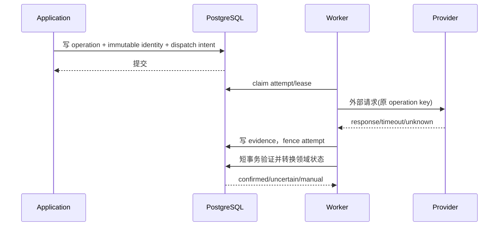
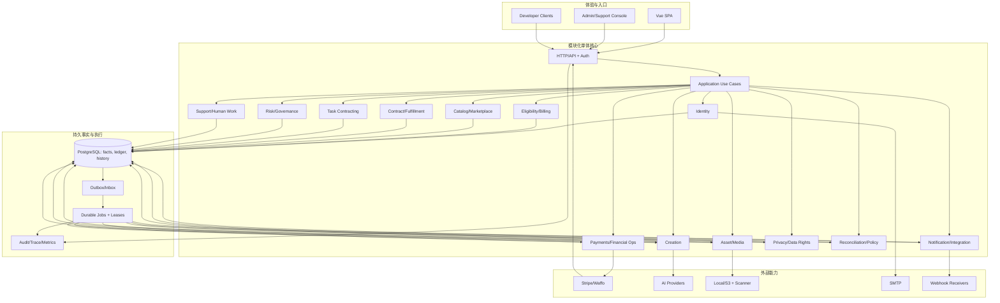

# HCAI-Chat 目标系统架构与技术方案

日期：2026-10-04  
阶段：第四阶段，To-Be System Architecture。  
前置依据：[项目复盘](project-review-20261004.md)、[闭环审计](business-closure-audit-20261004.md)、[目标业务模型](to-be-business-model-20261004.md)。

> 本文是目标系统设计，不是代码改动、上线认证或商业政策批准。文中 `As-Is` 表示前阶段已核查的当前行为，`To-Be Business` 表示第三阶段业务规则，`To-Be System` 表示为落实这些规则而设计的系统。Q01–Q14 未确认的商业规则不被本方案擅自赋值。

## 01. 目标系统总体设计

### 1.1 结论

目标系统应继续采用**模块化单体 + PostgreSQL 持久队列 + 独立 API/Worker 进程**。现有系统已经具备事务、锁、账务、媒体写入日志和恢复扫描能力；没有证据表明引入 Redis、Kafka、微服务或 BFF 能解决当前主要问题。目标重点是把业务所有权、外部操作证据、状态转换、幂等和人工责任显式化。

系统必须满足以下不变量：

1. 每个核心聚合只有一个写入 owner；其他模块只能通过命令、查询或事件访问。
2. 业务状态、外部操作状态、资金状态、权益状态和人工责任状态分开保存，不能由一个 `completed` 代替。
3. 外部调用前持久化不可变 operation/attempt/identity；超时表示未知，不表示失败。
4. 同一逻辑命令重放不产生第二个经济结果；用户明确的新意图必须产生新的命令。
5. 每个未完成责任有 owner、证据、下一次检查时间和最终升级路径。
6. 强一致只覆盖必须原子完成的本地事实；外部副作用通过核验、补偿和对账实现最终一致。

### 1.2 目标整体关系



### 1.3 设计范围与明确不做的事

保留现有商品付款、商品履约、权益、结算创建在一个数据库事务中的保证；不把它拆成一串无条件独立 Job。保留 `sellerfunds` 只读投影，资金命令仍归 `payments`。不把客服关单、Webhook 发送成功、Provider accepted 或文件存在解释为业务完成。不在本阶段编写迁移 SQL、改 API 实现或决定退款天数、自动验收、税费、保留期限等 Qxx 参数。

## 02. 系统架构

### 2.1 分层职责

| 层 | 目标职责 | 不能承担的职责 |
|---|---|---|
| Vue SPA | 展示状态、收集意图、保存批次命令键、轮询/订阅结果 | 认证、价格、余额、订单完成和授权的事实判断 |
| HTTP/API | 身份、参数、权限、幂等入口、错误映射、查询组合 | 直接修改其他领域表、决定业务状态、执行长外部调用 |
| Application Service | 编排一个用例、建立事务边界、调用 domain/ports、发布 outbox | 复制散落的状态规则或绕过 owner |
| Domain | 聚合不变量、状态转换、金额/权限/生命周期规则 | SQL、HTTP、Provider SDK、邮件发送 |
| Repository/Unit of Work | owner 数据读写、锁、唯一约束、短事务提交 | 调用外部网络或代替业务决策 |
| Worker/Scheduler | 抢租约、执行持久 operation、重试、核验、人工升级、领域终态收敛 | 将耗尽重试直接写成成功/责任消失 |
| Adapter/Infrastructure | Stripe/Waffo、AI、媒体、扫描、SMTP、Webhook 等协议转换 | 直接改变领域状态或隐藏未知结果 |
| PostgreSQL | 事实、账本、合同快照、操作证据、队列、outbox、审计 | 代替外部系统的真实到账/收件事实 |

### 2.2 进程与运行环境

`cmd/api` 与 `cmd/worker` 继续独立部署，共享同一数据库和领域包。Worker 按领域隔离并发配额：身份/支付/退款、通知/Webhook、生成/媒体分别配置容量，避免慢 AI 任务阻塞资金恢复。调度仍可由 PostgreSQL due work 驱动；只有当吞吐和运维证据证明数据库队列不足时，才评估外部消息系统。

### 2.3 依赖方向



代码依赖保持 DAG；业务事件可以双向传播，但不能形成写入循环。例如 `tasks` 可请求 `payments` 的资金命令，`payments` 只能通过事件通知任务资金结果，不能直接写任务状态。`sellerfunds` 不得反向调用支付命令。

## 03. 模块划分

### 3.1 目标模块边界

| 模块 | 负责 | 不负责 | 数据 owner/事务边界 | 接口与依赖 |
|---|---|---|---|---|
| Identity & Account | 用户、会话、挑战、安全变更、账户生命周期锁 | 订单、付款、内容许可 | `user/session/challenge/security_event`；身份变更短事务 | Auth API；被所有私有用例依赖 |
| Eligibility & Billing | 套餐、积分预留/capture/release、钱包账目、资格 | 外部退款执行、商品权益 | billing 账户和账本；预留与 capture 原子 | Billing Service；依赖身份、支付事实 |
| Creation | 会话、批次、子命令、执行尝试、结果 | 资产最终授权、支付政策 | generation 聚合；提交/预留在一个本地事务 | Creation API/Worker；依赖 billing、assets ports、provider |
| Asset & Media | 资产版本、扫描、存储引用、使用授权、清理 | 商品合同、资金、社区可见性 | asset/version/scan/media journal；引用变更短事务 | Asset API；被创作、社区、商品、任务调用 |
| Community & Discovery | 作品、帖子、互动、索引、发现策略 | 商业许可和付款 | post/work/version/interaction | Community API；依赖 asset、risk、policy |
| Catalog & Marketplace | 商品、供给版本、审核、发布、预览、订单查询投影 | 远端支付执行、资金命令 | product/version；订单事实由 payments/contract owner | Catalog API；依赖 asset、policy、payments |
| Contract/Fulfillment | 接受合同、交付快照、权益、下载/撤权 | Provider 资金操作 | contract/delivery/entitlement；商品支付履约 UoW | Fulfillment Service；依赖 catalog、assets、payments |
| Payments & Financial Operations | payment intent、refund、settlement、payout、transfer、外部证据、追偿 | 内容扫描、客服沟通 | money operation/ledger/settlement；经济结果强约束 | Payment commands；依赖 provider ports，向 seller projection 发事件 |
| Task Contracting | 委托、报价、指派、交付版本、验收、争议 | 直接改账本/外部转账 | demand/agreement/delivery/review | Task API；以 payments command 处理钱 |
| Risk & Governance | 信号、案件、审核、申诉、策略版本 | 自动替代财务裁决 | risk signal/case/decision | Admin/Governance API；依赖 policy、asset、community |
| Notification & Integration | 站内通知、订阅事件、Webhook delivery/attempt | 领域事实、业务完成 | notification/event/delivery/attempt | Event API；消费 outbox，向外部端点发送 |
| Support & Human Work | 工单、人工任务、分派、SLA、转交、证据索引 | 自行批准退款/验收 | support/human_task/assignment | Admin/Support API；调用各领域 command |
| Privacy & Data Rights | 导出、删除 scope、legal hold、回执、备份责任 | 删除合法财务证据 | privacy_request/scope_receipt/retention | Data Rights API；依赖所有 owner 的 cleanup port |
| Reconciliation & Policy | 成本/资金/媒体盘点、差异、供应商能力、业务开关 | 直接修正原事实 | report/difference/policy version | Ops API/Jobs；读各领域，写差异/政策 |
| Platform/Observability | DB、迁移、jobs、media adapter、日志、指标、trace | 业务状态决定 | 技术元数据和审计索引 | 被全部模块依赖 |

### 3.2 数据所有权规则

| 数据 | 唯一写 owner | 其他模块访问方式 |
|---|---|---|
| 用户/会话/凭证 | Identity | 查询端口或授权命令 |
| 积分/钱包/账本 | Billing/Payments（按账户域） | 只读余额、资金命令 |
| 生成批次/尝试 | Creation | Creation command/query |
| 资产/版本/扫描 | Asset | Asset port；不得直接更新状态 |
| 商品/订单合同 | Catalog/Contract owner | 快照查询、履约命令 |
| 退款/转账/结算 | Payments | Payments command；sellerfunds 只读 |
| 委托/交付/验收 | Tasks | Task command；资金通过 Payments |
| 通知/Webhook | Notification/Integration | 领域发布事件，不能写 delivery 表 |
| 隐私 scope/回执 | Privacy | 各 owner 执行清理并回传证据 |

任何跨模块直写均视为架构违规；紧密耦合的商品付款+权益+结算可在同一 Application UoW 中调用多个 owner 的受控方法，不等于共享表写权限。

## 04. 数据架构

### 4.1 核心实体关系



### 4.2 表/字段设计原则

所有核心表至少有：`id`、业务可读编号（如适用）、`created_at`、`updated_at`、`version`、owner subject、当前状态、状态进入时间、原因码。命令表还需 `command_key`、`payload_hash`、原始请求版本和已返回结果引用；操作表需 `operation_id`、`attempt_id`、provider/account/environment/currency、external ID、派发事实、next_check_at；证据表需来源、摘要、远端时间、接收时间、核验人和可信度。

必须具备的约束：

* 同一 owner + purpose + command key 唯一；同 key 不同 payload 返回冲突。
* 同一外部事件 ID、支付/退款/转账 operation ID 唯一；provider、live_mode、currency、account 必须组成隔离键。
* 同一合同/责任的权益和经济结果有唯一业务键；capture、refund、payout 不可重复产生经济效果。
* 状态历史 append-only；审计事件不可更新覆盖。
* due work 按 `(next_run_at, priority, id)` 索引；队列领取使用行锁/租约；attempt 写入带 fencing token。
* 通知游标按 `(created_at,id)` 复合游标；过滤条件必须纳入游标上下文。
* 外部对象摘要、大小、manifest、媒体引用和清理 journal 有索引；删除只能在引用、保留和 legal hold 均允许时执行。

### 4.3 强一致与最终一致

| 事实 | 一致性 | 方案 |
|---|---|---|
| 接受合同+订单初始状态 | 强一致 | 一个事务、唯一版本 |
| 商品付款确认+订单履约+权益+结算记录 | 强一致 | 保留现有 `fulfillProductPaymentTx` 类 UoW |
| 积分 reserve/capture/release | 强一致 | 账户行锁+幂等经济键 |
| Provider 扣款/退款/银行转账 | 外部最终一致 | operation protocol、回调/查询、人工核验 |
| 领域事实→通知/Webhook | 最终一致 | transactional outbox、inbox/dedup、重试/死信 |
| 媒体对象写入与数据库归属 | 最终一致 | write journal、摘要校验、引用保护清理 |
| 搜索/发现索引 | 最终一致 | 版本化事件、重建/校验，不作为权限事实 |
| 隐私备份/处理商删除 | 外部责任最终一致 | scope receipt、owner、到期复查与再应用删除 |

## 05. 状态架构

### 5.1 唯一可信状态转换

每个 owner 提供 `Transition(command, expectedVersion, evidence)`；转换函数检查前置状态、角色、合同版本、时间规则、并发版本和所需证据，并在同一事务写状态历史、审计和后续 due work。HTTP 不允许通用 `PATCH status`；管理员的“强制完成”必须改为有权限的领域命令。

### 5.2 核心状态机



专有状态沿用第三阶段定义：生成 `accepted→reserved→running→result_pending→deliverable`；购买 `pending_payment→payment_confirmed→delivery_pending→delivered`；任务交付与资金使用双状态；退款 `requested→review→approved→verification→confirmed`；通知/Webhook 的取消状态不可被迟到 attempt 覆盖；删除按 scope 进入 `completed/legally_retained/external_pending`。

### 5.3 状态责任

* 只有 Domain owner 能推进自己的业务状态。
* 外部回调只能写入 evidence/inbox，再由验证服务依据 operation identity 转换状态。
* Worker 租约死亡只改变 attempt/job 执行事实，并触发领域 reconciliation；不能直接把订单、通知或资金写成失败。
* 重试耗尽进入 `human_task` 或明确终止，不丢失原始债务。
* 状态终态不可覆盖；纠错建立新 evidence、decision 或 aftercare case。

## 06. API / Service 架构

### 6.1 通用 API 约定

命令使用 `Idempotency-Key`（服务端绑定 actor、purpose、payload hash），返回 `command_id`、业务对象 ID、当前状态、`request_id`、`next_action`。查询返回完成维度和未决责任，不只返回一个 status。错误统一包含 `code`、`retryable`、`conflict`、`request_id`、`operation_id`（若有）；未知结果返回可查询状态，不返回确定失败。

### 6.2 核心接口契约

| 接口 | 调用者/输入 | 输出与状态效果 | 异常、幂等、权限、同步性 |
|---|---|---|---|
| `POST /creation/batches` | 用户；批次、稳定子命令、参数快照 | 批次及逐项命令，预留记录 | 同 key 返回原批次；资格/许可冲突 4xx；同步落库，执行异步 |
| `POST /creation/commands/{id}/resume` | 用户/客户端恢复 | 原子项结果或仍待核验 | 只复用原命令；不可变新参数；用户本人；同步查询+异步执行 |
| `POST /payments/{operation}/confirm` | Worker/回调/财务 | 原 operation 的 evidence 和领域转换 | provider/account/金额/币种必须匹配；重复返回原结论；受控服务身份 |
| `POST /orders/{id}/refunds` | 买家/客服 | aftercare case 与退款 operation | 合同窗口、权益、累计责任校验；重复 key 不新建退款；同步受理、异步外部执行 |
| `POST /tasks/{id}/recover-funds` | 财务核验者 | 原转账/退款 operation 的核验或人工任务 | 必须原身份、原目标和 evidence；禁止换目标盲转；高风险需复核 |
| `POST /tasks/{id}/decisions` | 验收/仲裁角色 | 交付 review decision，触发权益/资金命令 | expected version、合同版本、权限；执行与确认分开 |
| `POST /webhooks/{id}/replay` | 集成运营 | 原 event 新 delivery | 端点有效、事件 ID 保持；不能重写原发送史；异步 |
| `GET /notifications?after=` | 用户 | 复合游标分页 | 游标绑定过滤条件，`(time,id)` 无漏项；只读 |
| `POST /privacy/requests` | 经过身份验证用户 | scope 明细、hold/cleanup Jobs | 同一请求键重放原请求；删除和导出权限分离；异步 |
| `POST /human-tasks/{id}/decisions` | 授权运营 | versioned decision + command | 角色、证据、双人复核（Q12）校验；不得直接 PATCH 领域表 |

### 6.3 Application/Domain/Repository 示例边界

```text
HTTP Handler
  -> Application.CreateProductPurchase
      -> Contract.LoadAcceptedVersion
      -> Payments.VerifyPaymentEvidence
      -> Fulfillment.FulfillWithin(uow)
          -> Entitlement.Grant
          -> Settlement.CreateReceivable
      -> Outbox.Append
  -> response
```

Application 负责顺序和 UoW；Domain 负责“能否转换”；Repository 负责 owner 数据；Adapter 负责外部协议。Application 不能把 provider response 直接映射成领域成功。

## 07. 事件 / 异步架构

### 7.1 事件与队列

领域事务内写 `outbox_event(event_id, aggregate_id, event_type, payload_version, occurred_at)`。Dispatcher 生成 recipient delivery；消费者用 `inbox(event_id, consumer)` 去重。事件至少一次，不承诺 exactly-once。外部支付、生成、媒体、通知/Webhook 使用持久 operation/job，具备 attempt、lease、retry schedule、dead-letter/manual owner。

关键事件：`PaymentConfirmed`、`EntitlementGranted`、`OrderDelivered`、`RefundConfirmed`、`TaskAccepted`、`PayoutObserved`、`GenerationResultObserved`、`NotificationCreated`、`WebhookDeliveryFailed`、`PrivacyScopeCompleted`、`DifferenceOpened`。事件只描述已成立事实，不携带“请随意改另一模块状态”的命令。

### 7.2 外部 operation protocol



数据库提交与网络发送之间崩溃时，状态是 uncertain；禁止根据“dispatch 已写”推断已发送，也禁止根据没有响应推断未发送。只有 Provider 已验证幂等或查询能力时才可安全重试；能力未知则进入核验/人工。

### 7.3 领域终态收敛

Job 最终失败时，reconciler 根据绑定的 `domain_operation_id` 检查领域状态、孤儿通知、Webhook delivery、资金和人工任务；确保 `notification queued`、`webhook delivering` 等不会没有可见恢复入口。支付/身份队列与 AI/媒体队列保留独立容量和告警。

## 08. 事务与一致性

### 8.1 事务边界

一个事务内：命令去重记录、聚合状态转换、必要账本/权益/交付事实、状态历史、审计索引、outbox 和 due work。事务外：Stripe/Waffo、AI、SMTP、Scanner、对象存储网络操作。外部操作完成后用短事务保存 evidence 并转换。

商品付款的目标事务仍为：`payment verified + order status + delivery snapshot reference + entitlement + seller receivable/settlement + outbox`。若任何本地部分失败全部回滚，外部付款责任由补偿/人工核验继续跟踪。

### 8.2 幂等层次

| 层 | Key/范围 | 存储与并发 |
|---|---|---|
| API 命令 | actor + purpose + idempotency key + payload hash | command 表唯一约束、同 key 行锁 |
| 业务 operation | originating business + operation type | operation 表唯一键、不可改 provider identity |
| attempt | operation + attempt sequence/fencing token | lease、版本比较、迟到写入拒绝 |
| Provider receipt | provider + environment + external event/request ID | webhook/inbox 唯一 |
| 消费者 | event ID + consumer | inbox 事务去重 |
| 经济结果 | contract/responsibility/capture/refund/payout purpose | ledger/entitlement 唯一键 |
| 批次生成 | batch + stable child command ID | 浏览器持久化服务端键，刷新/切账号不新建意图 |

### 8.3 并发与补偿

订单退款、卖家提现、拒付同时发生时，按合同责任和资金 operation 锁序列化，汇总已退/已出金额；撤权、追偿和核销是新事实，不抹除原流水。Task `recovery_required` 只能由原 operation 身份恢复，配置修复本身不触发盲重试。已下载内容不可宣称被召回。

## 09. 异常与恢复

| 异常 | 系统动作 | 最终归宿 |
|---|---|---|
| 参数/权限非法 | 不建副作用，记录拒绝 | 明确失败 |
| 可重试暂时故障 | 原 operation 新 attempt，退避 | confirmed/definite failure/manual |
| 超时/响应丢失 | 标 uncertain，主动 query 或人工 | 同源 evidence 后收敛 |
| Provider 身份/金额不符 | 安全停止，不更换目标 | recovery_required + 财务 owner |
| Job lease 死亡 | 释放租约，fence 迟到写入，领域 reconciler | 重试或人工 |
| 本地提交失败但外部已成功 | 保留外部 evidence，补偿/恢复 | 本地事实补齐或正式待办 |
| 媒体写入成功、归属失败 | journal 保留、引用检查、清理/重挂 | 可追踪对象或清理完成 |
| 通知/Webhook 尝试耗尽 | dead-letter/human task，不伪造送达 | 重放或有据终止 |
| 争议长期无人处理 | SLA 提醒和逐级升级 | 有权决定或持续明确责任 |
| 删除受 legal hold/备份阻塞 | scope 级 retained/external_pending | 到期复查并重新清理 |

恢复命令必须带原业务 ID、expected version、evidence 引用和权限；“重试”不允许改变收款人、商户、金额、币种、合同版本或生成参数。人工关闭条件是执行已核实，或下一责任已被明确接管；不能用关闭工单消除领域债务。

## 10. 权限与安全

认证、授权、数据归属和操作授权分层。普通用户仅访问自己的身份、资产、订单、任务和隐私范围；买家可发起售后但不能确认退款成功；创作者可提交交付但不能改变验收；客服可沟通和关联，不可直接改钱；财务核验者可处理资金 evidence，高影响决定按 Q12 双人复核；隐私角色按 scope 处理；系统 Worker 只能执行已签发 operation。

高风险资源：支付/退款/转账/提现、API key、Webhook secret、私有媒体、身份变更、删除和 legal hold。秘钥只存 hash/受控 secret store；日志脱敏金额凭证、token、媒体正文；Webhook HMAC 校验 event identity；CORS/Origin、CSRF/session、速率限制和账户生命周期锁继续由 API/Identity 负责。撤销凭证只阻止新调用，在途外部影响仍需 operation 核验。

## 11. 可观测性与审计

每次请求生成 `request_id`/`trace_id`，并关联 `actor_id`、`business_id`、`command_id`、`operation_id`、`attempt_id`、`event_id`、`job_id`。状态变更记录前后状态、触发器、版本、actor/role、证据、原因、时间；外部请求记录 provider、environment、account、外部 ID、脱敏摘要、超时和重试；人工决定记录权限依据和复核。

核心指标：uncertain operation、recovery_required、预留未结、退款/转账待核验、领域与 Job 状态不一致、Webhook/通知 dead-letter、媒体孤儿、隐私 external_pending、对账差异年龄、人工任务 SLA 逾期。日志和指标不得把“Job succeeded”当作业务成功；告警链接必须能定位业务和下一责任。

## 12. 当前架构 → 目标架构

| As-Is 模块/行为 | To-Be 职责 | 处理 |
|---|---|---|
| `httpapi` handler 夹带领域编排 | 薄适配层 + Application commands | 修改/逐步抽离 |
| Service 直接 SQL、跨域写表 | owner repository + UoW/ports | 局部重构 |
| `payments` 汇集大量流程 | 保留资金 owner，拆出 Contract/Fulfillment、Reconciliation 端口 | 拆分边界，不复制账务 |
| `sellerfunds` 只读投影 | 保持只读查询 | 保留 |
| `tasks` 调 payments 但异常出口不完整 | 原 operation recovery/verification command | 修改，优先解决 B01/B02 |
| 生成 UI 每次新 UUID + `Promise.all` | 服务端持久 batch/child command，逐项恢复 | 修改，解决 B03 |
| 通用 jobs + 领域状态可能脱节 | domain_operation 绑定、终态 reconciler | 修改，解决 B05 |
| Webhook late attempt 可覆盖 cancelled | fencing/version guard | 直接修复，解决 B04 |
| 通知时间游标 | `(created_at,id)` 复合游标与过滤绑定 | 直接修复，解决 B06 |
| `creation`/`assets`/`productdelivery` 已有日志和恢复 | 统一 operation/evidence 观念，保留机制 | 保留并统一接口 |
| `datarights` 主库完成、备份外部阻塞 | scope receipt/retention owner | 模型扩展，解决 B10 |
| admin 分散命令 | 角色化 human task 入口，命令仍归领域 | 统一入口，不合并数据 owner |
| 无核心 Redis/Kafka | PostgreSQL queue/outbox | 保留，按指标再评估 |

## 13. 迁移策略

### 13.1 阶段门禁

1. **决策冻结**：批准 Q01–Q14 中影响收费、自动验收、留存、SLA 的项；为每个领域指定 owner。
2. **Expand**：增加 operation/evidence/state-history/human-task/outbox 兼容字段和约束；旧 writer 仍可运行。
3. **双读/影子校验**：新 transition evaluator 只读比较旧状态；不双写两个互相竞争的业务事实。
4. **单写切换**：按领域启用新 command owner，旧 API 转发并保留响应格式；数据库协议拒绝旧版本非法写入。
5. **Backfill**：仅从可靠原始事实建立 operation/证据索引；无法证明的历史标 `unknown/manual_required`，禁止猜填成功。
6. **灰度与验收**：先通知/游标/Webhook，再 task recovery/refund，再 generation batch，最后高风险支付/隐私；执行 9.2 场景和故障注入。
7. **收缩**：确认指标、对账和人工队列稳定后移除旧 writer；保留历史迁移证据和回滚开关。

### 13.2 迁移优先级

P1：Task 原身份恢复、Task refund query/reconciliation、生成批次稳定键。  
P2：Webhook fencing、领域终态 reconciler、通知复合游标、人工 SLA。  
P3：全域 operation/evidence 接口、政策版本、隐私 scope/备份闭环、跨域对账。

### 13.3 兼容、回滚与外部副作用

旧客户端继续收到原响应字段，但新增状态和 `operation_id` 可选返回。代码回滚不能撤销已完成的外部付款、退款、转账或模型执行；回滚只能停止新 writer，继续运行 forward recovery、查询和对账。任何 cutover 必须先确认旧/新 writer 不会并发产生第二个经济结果；schema rollback 不得删除已产生的审计、账本和外部证据。

## 14. 架构风险

| 风险 | 影响 | 控制 |
|---|---|---|
| PostgreSQL 队列吞吐不足 | 延迟、租约争用 | 分队列/索引/容量；以指标决定是否引入 broker |
| 领域边界抽离不完整 | 仍有跨域直写 | 代码审查、DB grant/约束、owner API |
| Provider 无查询/幂等能力 | 未知成本和重复执行 | capability registry、风险预算、人工核验、对账 |
| 历史数据缺合同/身份 | 无法安全回填 | unknown/manual_required，不猜填 |
| 人工没有真实排班 | 状态仍长期悬置 | SLA owner、升级告警、运营验收 |
| Qxx 未批准就实现默认值 | 合同/资金风险 | feature gate，决策版本必填 |
| 过度拆分导致事务破坏 | 商品履约回归 | 保留关键 UoW，先做边界接口 |
| 事件重复/乱序 | 重复通知或状态冲突 | event ID、inbox、transition version/fencing |
| 备份/处理商不可控 | 隐私完成口径失真 | scope receipt、外部 owner、定期证据 |

## 15. 最终系统蓝图



最终判断：目标系统不是把现有代码机械拆成微服务，而是把第三阶段的业务责任落实为清晰 owner、受控事务、可核验外部 operation、持久事件、领域终态收敛和人工责任。实施前仍需批准 Qxx；本阶段未修改应用代码、未运行迁移、未宣称生产就绪。
